# Install Requirements


```python
%pip install pandas matplotlib matplotlib-venn
```

    Requirement already satisfied: pandas in /Users/carstenschnober/SlimZoeken/100queries/.venv/lib/python3.11/site-packages (2.2.0)
    Requirement already satisfied: matplotlib in /Users/carstenschnober/SlimZoeken/100queries/.venv/lib/python3.11/site-packages (3.8.3)
    Requirement already satisfied: matplotlib-venn in /Users/carstenschnober/SlimZoeken/100queries/.venv/lib/python3.11/site-packages (0.11.10)
    Requirement already satisfied: numpy<2,>=1.23.2 in /Users/carstenschnober/SlimZoeken/100queries/.venv/lib/python3.11/site-packages (from pandas) (1.26.4)
    Requirement already satisfied: python-dateutil>=2.8.2 in /Users/carstenschnober/SlimZoeken/100queries/.venv/lib/python3.11/site-packages (from pandas) (2.8.2)
    Requirement already satisfied: pytz>=2020.1 in /Users/carstenschnober/SlimZoeken/100queries/.venv/lib/python3.11/site-packages (from pandas) (2024.1)
    Requirement already satisfied: tzdata>=2022.7 in /Users/carstenschnober/SlimZoeken/100queries/.venv/lib/python3.11/site-packages (from pandas) (2023.4)
    Requirement already satisfied: contourpy>=1.0.1 in /Users/carstenschnober/SlimZoeken/100queries/.venv/lib/python3.11/site-packages (from matplotlib) (1.2.0)
    Requirement already satisfied: cycler>=0.10 in /Users/carstenschnober/SlimZoeken/100queries/.venv/lib/python3.11/site-packages (from matplotlib) (0.12.1)
    Requirement already satisfied: fonttools>=4.22.0 in /Users/carstenschnober/SlimZoeken/100queries/.venv/lib/python3.11/site-packages (from matplotlib) (4.49.0)
    Requirement already satisfied: kiwisolver>=1.3.1 in /Users/carstenschnober/SlimZoeken/100queries/.venv/lib/python3.11/site-packages (from matplotlib) (1.4.5)
    Requirement already satisfied: packaging>=20.0 in /Users/carstenschnober/SlimZoeken/100queries/.venv/lib/python3.11/site-packages (from matplotlib) (23.2)
    Requirement already satisfied: pillow>=8 in /Users/carstenschnober/SlimZoeken/100queries/.venv/lib/python3.11/site-packages (from matplotlib) (10.2.0)
    Requirement already satisfied: pyparsing>=2.3.1 in /Users/carstenschnober/SlimZoeken/100queries/.venv/lib/python3.11/site-packages (from matplotlib) (3.1.1)
    Requirement already satisfied: scipy in /Users/carstenschnober/SlimZoeken/100queries/.venv/lib/python3.11/site-packages (from matplotlib-venn) (1.13.0)
    Requirement already satisfied: six>=1.5 in /Users/carstenschnober/SlimZoeken/100queries/.venv/lib/python3.11/site-packages (from python-dateutil>=2.8.2->pandas) (1.16.0)
    
    [notice] A new release of pip is available: 23.3.2 -> 25.0.1
    [notice] To update, run: pip install --upgrade pip
    Note: you may need to restart the kernel to use updated packages.


```python
import pandas as pd
```

    /var/folders/d8/j5_fyf8941j_492zvf8948y40000gn/T/ipykernel_13232/4080736814.py:1: DeprecationWarning: 
    Pyarrow will become a required dependency of pandas in the next major release of pandas (pandas 3.0),
    (to allow more performant data types, such as the Arrow string type, and better interoperability with other libraries)
    but was not found to be installed on your system.
    If this would cause problems for you,
    please provide us feedback at https://github.com/pandas-dev/pandas/issues/54466
            
      import pandas as pd


# Load Data


```python
from pathlib import Path

REPOSITORY_PATH = Path().absolute().parent
DATA_DIR = REPOSITORY_PATH / Path("data")

assert DATA_DIR.is_dir()
```

## Load Sources DB


```python
prefixes = ["https://", "http://", "www.", '"']
suffixes = ["/", '"']


def strip_url(url: str) -> str:
    for prefix in sorted(prefixes):
        if url.startswith(prefix):
            url = url[len(prefix) :]
    for suffix in sorted(suffixes):
        if url.endswith(suffix):
            url = url[: -len(suffix)]
    return url.strip()


urls = [
    "http://muurmooi.nl/",
    "museumpassmusees.be",
    '"wikipedia.org "',
    "http://www.fonq.nl",
]
expecteds = ["muurmooi.nl", "museumpassmusees.be", "wikipedia.org", "fonq.nl"]

for url, expected in zip(urls, expecteds):
    stripped = strip_url(url)
    assert stripped == expected, f"Got: {stripped}\tExpected: {expected}"
```

Export instructions for `Bronnen` DB:
1. Open [Bronnen DB Notion page](https://www.notion.so/slimzoeken/ebb1bca364c64cfebc8109b4fc3951eb?v=0a032b0739b34830b01aa918585a77b7)
2. Click on `Export`
3. Select `Markdown & CSV`
4. Move downloaded archive to DATA_DIR
5. Extract downloaded archive
5. Rename extracted folder to `Bronnen DB`


```python
BRONNEN_DB_DIR = DATA_DIR / Path("Bronnen DB")
assert BRONNEN_DB_DIR.is_dir()

files = list(BRONNEN_DB_DIR.glob("Bronnen DB *_all.csv"))
assert (
    len(files) == 1
), f"Expected exactly one file matchting pattern, but found: {files}"

BRONNEN_FILE = files[0]

assert BRONNEN_FILE.is_file()
```


```python
sources = (
    pd.read_csv(
        BRONNEN_FILE,
        keep_default_na=True,
        dtype={"uBlocked trackers": "Int64"},
        converters={"Name": strip_url},
    )
    .dropna(subset=["Name", "onderzoekNR"])
    .set_index("Name", verify_integrity=True)
)
sources.head()
```


<div>
<style scoped>
    .dataframe tbody tr th:only-of-type {
        vertical-align: middle;
    }

    .dataframe tbody tr th {
        vertical-align: top;
    }

    .dataframe thead th {
        text-align: right;
    }
</style>
<table border="1" class="dataframe">
  <thead>
    <tr style="text-align: right;">
      <th></th>
      <th>URL Domein</th>
      <th>Conclusie over doel vd bron</th>
      <th>Thumbs up 8-14?</th>
      <th>Sector</th>
      <th>Reclame</th>
      <th>Vrije labels bron/onderwerp</th>
      <th>uBlocked trackers</th>
      <th>Commercialiteit</th>
      <th>Onderwerpen</th>
      <th>Div Labels NGO</th>
      <th>...</th>
      <th>Created time</th>
      <th>Created by</th>
      <th>URL Moederbedrijf</th>
      <th>SlimZ Resultaten DB</th>
      <th>Resultaten: toegankelijkheid</th>
      <th>Cookie info page</th>
      <th>More examples</th>
      <th>Related to Resultaten DB 01 (1) (Bronnen DB)</th>
      <th>Res: Ranking</th>
      <th>Res: soort result</th>
    </tr>
    <tr>
      <th>Name</th>
      <th></th>
      <th></th>
      <th></th>
      <th></th>
      <th></th>
      <th></th>
      <th></th>
      <th></th>
      <th></th>
      <th></th>
      <th></th>
      <th></th>
      <th></th>
      <th></th>
      <th></th>
      <th></th>
      <th></th>
      <th></th>
      <th></th>
      <th></th>
      <th></th>
    </tr>
  </thead>
  <tbody>
    <tr>
      <th>24baby.nl</th>
      <td>https://www.24baby.nl/</td>
      <td>informatieproduct div. commercieel</td>
      <td>Just-in-case</td>
      <td>Winkels en bedrijven div</td>
      <td>over_the_top_ads</td>
      <td>link/reclamevehikel, nieuws, promotioneel, web...</td>
      <td>5</td>
      <td>commercieel</td>
      <td>NaN</td>
      <td>NaN</td>
      <td>...</td>
      <td>November 6, 2023 11:09 AM</td>
      <td>Maarten Sprenger</td>
      <td>NaN</td>
      <td>NaN</td>
      <td>NaN</td>
      <td>https://24baby.app/privacybeleid</td>
      <td>NaN</td>
      <td>NaN</td>
      <td>10,7,1,4,2</td>
      <td>informatief,informatief,informatief,informatie...</td>
    </tr>
    <tr>
      <th>24kitchen.nl</th>
      <td>https://www.24kitchen.nl</td>
      <td>entertainment, informatieproduct div. commercieel</td>
      <td>Just-in-case</td>
      <td>Entertainment-industrie</td>
      <td>company_promotion, limited_ads, sluikreclame -...</td>
      <td>entertainment, infotainment, promotioneel</td>
      <td>17</td>
      <td>commercieel</td>
      <td>NaN</td>
      <td>NaN</td>
      <td>...</td>
      <td>December 14, 2023 6:43 PM</td>
      <td>Maarten Sprenger</td>
      <td>https://privacy.thewaltdisneycompany.com/nl/de...</td>
      <td>NaN</td>
      <td>NaN</td>
      <td>https://privacy.thewaltdisneycompany.com/nl/pr...</td>
      <td>NaN</td>
      <td>NaN</td>
      <td>6</td>
      <td>informatief</td>
    </tr>
    <tr>
      <th>333travel.nl</th>
      <td>https://www.333travel.nl/</td>
      <td>webshop/winkel+promotioneel deel</td>
      <td>Just-in-case</td>
      <td>Reisorganisaties</td>
      <td>company_promotion</td>
      <td>(product)informatie ihkv verkoop/bezoek, bedri...</td>
      <td>7</td>
      <td>commercieel</td>
      <td>NaN</td>
      <td>NaN</td>
      <td>...</td>
      <td>February 23, 2024 5:35 PM</td>
      <td>Maarten Sprenger</td>
      <td>NaN</td>
      <td>NaN</td>
      <td>NaN</td>
      <td>https://www.333travel.nl/cookies</td>
      <td>NaN</td>
      <td>NaN</td>
      <td>8</td>
      <td>informatief</td>
    </tr>
    <tr>
      <th>absolutefacts.nl</th>
      <td>https://www.absolutefacts.nl/</td>
      <td>informatieproduct div. commercieel</td>
      <td>Twijfel</td>
      <td>Online-bedrijven</td>
      <td>company_promotion</td>
      <td>abo-print, informatie_primair_doel, webshop</td>
      <td>2</td>
      <td>commercieel</td>
      <td>geschiedenis</td>
      <td>NaN</td>
      <td>...</td>
      <td>December 14, 2023 7:29 PM</td>
      <td>Maarten Sprenger</td>
      <td>https://www.absolutefigures.nl/</td>
      <td>NaN</td>
      <td>NaN</td>
      <td>https://www.absolutefacts.nl/uw-privacy.htm</td>
      <td>NaN</td>
      <td>NaN</td>
      <td>7</td>
      <td>informatief</td>
    </tr>
    <tr>
      <th>accuautoshop.nl</th>
      <td>https://www.accuautoshop.nl/</td>
      <td>webshop/winkel+promotioneel deel</td>
      <td>Nee</td>
      <td>Winkels en bedrijven div</td>
      <td>company_promotion</td>
      <td>webshop</td>
      <td>6</td>
      <td>commercieel</td>
      <td>NaN</td>
      <td>NaN</td>
      <td>...</td>
      <td>February 22, 2024 3:23 PM</td>
      <td>Maarten Sprenger</td>
      <td>NaN</td>
      <td>NaN</td>
      <td>NaN</td>
      <td>NaN</td>
      <td>NaN</td>
      <td>NaN</td>
      <td>10,9</td>
      <td>transactional,transactional</td>
    </tr>
  </tbody>
</table>
<p>5 rows × 31 columns</p>
</div>


```python
sources.columns
```


    Index(['URL Domein', 'Conclusie over doel vd bron', 'Thumbs up 8-14?',
           'Sector', 'Reclame', 'Vrije labels bron/onderwerp', 'uBlocked trackers',
           'Commercialiteit', 'Onderwerpen', 'Div Labels NGO', 'Status',
           'About page', ' Notes', 'Kwaliteit_about', 'Instelling/Bedrijf/Persoon',
           'Resultaten: vrije labels', 'Moederbedrijf DB', 'onderzoekNR',
           'Toegankelijkheidspagina', 'Resultaten DB', 'Extra URL', 'Created time',
           'Created by', 'URL Moederbedrijf', 'SlimZ Resultaten DB',
           'Resultaten: toegankelijkheid', 'Cookie info page', 'More examples',
           'Related to Resultaten DB 01 (1) (Bronnen DB)', 'Res: Ranking',
           'Res: soort result '],
          dtype='object')


```python
len(sources)
```


    542


## Load Query DB

Export instructions for `Query` DB:
1. Open [Query DB Notion page](https://www.notion.so/slimzoeken/Query-DB-01-5a4aec0449af4acc87a45c19be574353)
2. Click on `Export`
3. Select `Markdown & CSV`
4. Move downloaded archive to DATA_DIR
5. Extract downloaded archive
5. Rename extracted folder to `Query DB`


```python
QUERY_DIR = DATA_DIR / "Query DB"
assert QUERY_DIR.is_dir()

files = list(QUERY_DIR.glob("*/Query DB 01*_all.csv"))
assert (
    len(files) == 1
), f"Expected exactly one file matchting pattern, but found: {files}"

QUERY_FILE = files[0]
assert QUERY_FILE.is_file()
```


```python
all_queries = pd.read_csv(QUERY_FILE)
all_queries.head()
```


<div>
<style scoped>
    .dataframe tbody tr th:only-of-type {
        vertical-align: middle;
    }

    .dataframe tbody tr th {
        vertical-align: top;
    }

    .dataframe thead th {
        text-align: right;
    }
</style>
<table border="1" class="dataframe">
  <thead>
    <tr style="text-align: right;">
      <th></th>
      <th>Query</th>
      <th>Add Results</th>
      <th>Google</th>
      <th>Video Facet</th>
      <th>Videos-Schooltv?</th>
      <th>Kennisvenster?</th>
      <th>'Samenvatting'?</th>
      <th>Extra (top-down)</th>
      <th>Opmerkingen</th>
      <th>Soort Query (select)</th>
      <th>...</th>
      <th>Leeftijd</th>
      <th>Resultaten DB</th>
      <th>OK-100</th>
      <th>Ranking Conclusie</th>
      <th>Date</th>
      <th>Bronnen DB</th>
      <th>Created time</th>
      <th>Bronnen DB 1</th>
      <th>Bronnen: Thumbs up?</th>
      <th>Bronnen: Toeg.</th>
    </tr>
  </thead>
  <tbody>
    <tr>
      <th>0</th>
      <td>leven</td>
      <td>Done</td>
      <td>https://www.google.com/search?q=leven&amp;rlz=1C5C...</td>
      <td>https://www.google.com/search?sca_esv=60037616...</td>
      <td>-</td>
      <td>Nee</td>
      <td>Nee</td>
      <td>Gerelateerde zoekopdrachten (na 10), Meer om t...</td>
      <td>Bij Video’s (na 2) staat de Maan-song Leven ge...</td>
      <td>Named entity</td>
      <td>...</td>
      <td>8</td>
      <td>NaN</td>
      <td>Yes</td>
      <td>NaN</td>
      <td>NaN</td>
      <td>NaN</td>
      <td>July 18, 2023 7:47 PM</td>
      <td>NaN</td>
      <td>NaN</td>
      <td>NaN</td>
    </tr>
    <tr>
      <th>1</th>
      <td>wat betekent schotse</td>
      <td>Done</td>
      <td>https://www.google.com/search?q=wat+betekent+s...</td>
      <td>https://www.google.com/search?sca_esv=60037616...</td>
      <td>-</td>
      <td>Nee</td>
      <td>Ja</td>
      <td>Vragen van anderen (top)</td>
      <td>NaN</td>
      <td>Vragen</td>
      <td>...</td>
      <td>10</td>
      <td>Schotse - 2 definities - Encyclo (https://www....</td>
      <td>Yes</td>
      <td>NaN</td>
      <td>NaN</td>
      <td>NaN</td>
      <td>July 18, 2023 7:47 PM</td>
      <td>NaN</td>
      <td>NaN</td>
      <td>NaN</td>
    </tr>
    <tr>
      <th>2</th>
      <td>middellandse zee</td>
      <td>Done</td>
      <td>https://www.google.com/search?q=middellandse+z...</td>
      <td>https://www.google.com/search?sca_esv=60037616...</td>
      <td>-</td>
      <td>Ja uitgebreid</td>
      <td>Nee</td>
      <td>Afbeeldingen carroussel (top), Gerelateerde zo...</td>
      <td>NaN</td>
      <td>Named entity</td>
      <td>...</td>
      <td>11</td>
      <td>NaN</td>
      <td>Yes</td>
      <td>NaN</td>
      <td>NaN</td>
      <td>NaN</td>
      <td>July 18, 2023 7:47 PM</td>
      <td>NaN</td>
      <td>NaN</td>
      <td>NaN</td>
    </tr>
    <tr>
      <th>3</th>
      <td>De smurfen</td>
      <td>Done</td>
      <td>https://www.google.nl/search?q=De+smurfen&amp;sca_...</td>
      <td>https://www.google.nl/search?sca_esv=578451392...</td>
      <td>-</td>
      <td>Ja</td>
      <td>Nee</td>
      <td>Gerelateerde zoekopdrachten (na 10), Meer om t...</td>
      <td>NaN</td>
      <td>Named entity</td>
      <td>...</td>
      <td>10</td>
      <td>NaN</td>
      <td>Yes</td>
      <td>NaN</td>
      <td>NaN</td>
      <td>google.nl/com (https://www.notion.so/google-nl...</td>
      <td>July 18, 2023 7:47 PM</td>
      <td>NaN</td>
      <td>NaN</td>
      <td>NaN</td>
    </tr>
    <tr>
      <th>4</th>
      <td>keurmerk max</td>
      <td>Done</td>
      <td>https://www.google.com/search?q=keurmerk+max&amp;r...</td>
      <td>https://www.google.com/search?sca_esv=60037616...</td>
      <td>-</td>
      <td>Nee</td>
      <td>Nee</td>
      <td>Gerelateerde zoekopdrachten (na 10), Meer om t...</td>
      <td>NaN</td>
      <td>2 of meer woorden</td>
      <td>...</td>
      <td>7</td>
      <td>NaN</td>
      <td>Yes</td>
      <td>NaN</td>
      <td>NaN</td>
      <td>NaN</td>
      <td>July 18, 2023 7:47 PM</td>
      <td>NaN</td>
      <td>NaN</td>
      <td>NaN</td>
    </tr>
  </tbody>
</table>
<p>5 rows × 22 columns</p>
</div>


```python
all_queries.columns
```


    Index(['Query', 'Add Results', 'Google', 'Video Facet', 'Videos-Schooltv?',
           'Kennisvenster?', ''Samenvatting'?', 'Extra (top-down)', 'Opmerkingen',
           'Soort Query (select)', 'Extra (multi)', 'Onderwerp', 'Leeftijd',
           'Resultaten DB', 'OK-100', 'Ranking Conclusie', 'Date', 'Bronnen DB',
           'Created time', 'Bronnen DB 1', 'Bronnen: Thumbs up?',
           'Bronnen: Toeg.'],
          dtype='object')


```python

queries = (
    all_queries[all_queries["OK-100"] == "Yes"]
    .drop(["Created time"], axis=1)
    .astype({"Query": pd.StringDtype()})
)
queries.head()
```


<div>
<style scoped>
    .dataframe tbody tr th:only-of-type {
        vertical-align: middle;
    }

    .dataframe tbody tr th {
        vertical-align: top;
    }

    .dataframe thead th {
        text-align: right;
    }
</style>
<table border="1" class="dataframe">
  <thead>
    <tr style="text-align: right;">
      <th></th>
      <th>Query</th>
      <th>Add Results</th>
      <th>Google</th>
      <th>Video Facet</th>
      <th>Videos-Schooltv?</th>
      <th>Kennisvenster?</th>
      <th>'Samenvatting'?</th>
      <th>Extra (top-down)</th>
      <th>Opmerkingen</th>
      <th>Soort Query (select)</th>
      <th>...</th>
      <th>Onderwerp</th>
      <th>Leeftijd</th>
      <th>Resultaten DB</th>
      <th>OK-100</th>
      <th>Ranking Conclusie</th>
      <th>Date</th>
      <th>Bronnen DB</th>
      <th>Bronnen DB 1</th>
      <th>Bronnen: Thumbs up?</th>
      <th>Bronnen: Toeg.</th>
    </tr>
  </thead>
  <tbody>
    <tr>
      <th>0</th>
      <td>leven</td>
      <td>Done</td>
      <td>https://www.google.com/search?q=leven&amp;rlz=1C5C...</td>
      <td>https://www.google.com/search?sca_esv=60037616...</td>
      <td>-</td>
      <td>Nee</td>
      <td>Nee</td>
      <td>Gerelateerde zoekopdrachten (na 10), Meer om t...</td>
      <td>Bij Video’s (na 2) staat de Maan-song Leven ge...</td>
      <td>Named entity</td>
      <td>...</td>
      <td>Natuur/Biologie</td>
      <td>8</td>
      <td>NaN</td>
      <td>Yes</td>
      <td>NaN</td>
      <td>NaN</td>
      <td>NaN</td>
      <td>NaN</td>
      <td>NaN</td>
      <td>NaN</td>
    </tr>
    <tr>
      <th>1</th>
      <td>wat betekent schotse</td>
      <td>Done</td>
      <td>https://www.google.com/search?q=wat+betekent+s...</td>
      <td>https://www.google.com/search?sca_esv=60037616...</td>
      <td>-</td>
      <td>Nee</td>
      <td>Ja</td>
      <td>Vragen van anderen (top)</td>
      <td>NaN</td>
      <td>Vragen</td>
      <td>...</td>
      <td>Taal/Cultuur</td>
      <td>10</td>
      <td>Schotse - 2 definities - Encyclo (https://www....</td>
      <td>Yes</td>
      <td>NaN</td>
      <td>NaN</td>
      <td>NaN</td>
      <td>NaN</td>
      <td>NaN</td>
      <td>NaN</td>
    </tr>
    <tr>
      <th>2</th>
      <td>middellandse zee</td>
      <td>Done</td>
      <td>https://www.google.com/search?q=middellandse+z...</td>
      <td>https://www.google.com/search?sca_esv=60037616...</td>
      <td>-</td>
      <td>Ja uitgebreid</td>
      <td>Nee</td>
      <td>Afbeeldingen carroussel (top), Gerelateerde zo...</td>
      <td>NaN</td>
      <td>Named entity</td>
      <td>...</td>
      <td>Aardrijkskunde</td>
      <td>11</td>
      <td>NaN</td>
      <td>Yes</td>
      <td>NaN</td>
      <td>NaN</td>
      <td>NaN</td>
      <td>NaN</td>
      <td>NaN</td>
      <td>NaN</td>
    </tr>
    <tr>
      <th>3</th>
      <td>De smurfen</td>
      <td>Done</td>
      <td>https://www.google.nl/search?q=De+smurfen&amp;sca_...</td>
      <td>https://www.google.nl/search?sca_esv=578451392...</td>
      <td>-</td>
      <td>Ja</td>
      <td>Nee</td>
      <td>Gerelateerde zoekopdrachten (na 10), Meer om t...</td>
      <td>NaN</td>
      <td>Named entity</td>
      <td>...</td>
      <td>Taal/Cultuur</td>
      <td>10</td>
      <td>NaN</td>
      <td>Yes</td>
      <td>NaN</td>
      <td>NaN</td>
      <td>google.nl/com (https://www.notion.so/google-nl...</td>
      <td>NaN</td>
      <td>NaN</td>
      <td>NaN</td>
    </tr>
    <tr>
      <th>4</th>
      <td>keurmerk max</td>
      <td>Done</td>
      <td>https://www.google.com/search?q=keurmerk+max&amp;r...</td>
      <td>https://www.google.com/search?sca_esv=60037616...</td>
      <td>-</td>
      <td>Nee</td>
      <td>Nee</td>
      <td>Gerelateerde zoekopdrachten (na 10), Meer om t...</td>
      <td>NaN</td>
      <td>2 of meer woorden</td>
      <td>...</td>
      <td>Maatschappij</td>
      <td>7</td>
      <td>NaN</td>
      <td>Yes</td>
      <td>NaN</td>
      <td>NaN</td>
      <td>NaN</td>
      <td>NaN</td>
      <td>NaN</td>
      <td>NaN</td>
    </tr>
  </tbody>
</table>
<p>5 rows × 21 columns</p>
</div>


```python
len(queries)
```


    100


## Load Results DB

Export instructions for `Results` DB:
1. Open [Results DB Notion page](https://www.notion.so/slimzoeken/a7ef3ccdfad447148261278e6ca29856?v=6db7bb2ab4034dba8d05e91fc5f0cdbb)
2. Click on `Export`
3. Select `Markdown & CSV`
4. Move downloaded archive to DATA_DIR
5. Extract downloaded archive
5. Rename extracted folder to `Resultaten DB`


```python
RESULTS_DIR = DATA_DIR / "Resultaten DB"
assert RESULTS_DIR.is_dir()

files = list(RESULTS_DIR.glob("*/Resultaten DB 01 *_all.csv"))
assert (
    len(files) == 1
), f"Expected exactly one file matchting pattern, but found: {files}"

RESULTS_FILE = files[0]

assert RESULTS_FILE.is_file()
```


```python
query_results = (
    pd.read_csv(
        RESULTS_FILE,
        converters={"Bronnen DB": str.strip},
    )
    .drop(["Created time"], axis=1)
    .rename(columns=lambda x: x.strip())
    .astype({"Query": pd.StringDtype(), "Ranking": "Int64"})
)
query_results.head()
```


<div>
<style scoped>
    .dataframe tbody tr th:only-of-type {
        vertical-align: middle;
    }

    .dataframe tbody tr th {
        vertical-align: top;
    }

    .dataframe thead th {
        text-align: right;
    }
</style>
<table border="1" class="dataframe">
  <thead>
    <tr style="text-align: right;">
      <th></th>
      <th>Bron: Thumbs up?</th>
      <th>Titel resultaat</th>
      <th>Ranking</th>
      <th>Link/resultaat</th>
      <th>Query</th>
      <th>Relevant?</th>
      <th>vrije tags page</th>
      <th>Bronnen DB</th>
      <th>Bron: Inst/Bedrijf</th>
      <th>Toegankelijkheid doelgroep (indruk)</th>
      <th>...</th>
      <th>Q: Ranking vrije labels</th>
      <th>Bron: doel</th>
      <th>Bron: Trackers</th>
      <th>OnderzoekNr</th>
      <th>Related to Bronnen DB test (Resultaten DB)</th>
      <th>Bronnen: URL domein</th>
      <th>Query: Video Schooltv</th>
      <th>Created by</th>
      <th>Bron-Status</th>
      <th>Bron: Onderwerp</th>
    </tr>
  </thead>
  <tbody>
    <tr>
      <th>0</th>
      <td>Just-in-case</td>
      <td>geld - Google Zoeken</td>
      <td>1</td>
      <td>https://www.google.nl/search?sca_esv=598588983...</td>
      <td>geld (https://www.notion.so/geld-03503decdc9c4...</td>
      <td>relevant</td>
      <td>zoekmachine_facet_link</td>
      <td>google.nl/com (https://www.notion.so/google-nl...</td>
      <td>Aphabet</td>
      <td>nvt</td>
      <td>...</td>
      <td>NaN</td>
      <td>informatieproduct div. commercieel</td>
      <td>13</td>
      <td>1</td>
      <td>NaN</td>
      <td>https://www.google.com/</td>
      <td>- (klokhuis 9)</td>
      <td>Maarten Sprenger</td>
      <td>Almost completed</td>
      <td>NaN</td>
    </tr>
    <tr>
      <th>1</th>
      <td>Ja</td>
      <td>Calvariekruis Begraafplaats Rillaar - Rillaar ...</td>
      <td>1</td>
      <td>https://www.tracesofwar.nl/sights/131249/Calva...</td>
      <td>rillaar monumenten (https://www.notion.so/rill...</td>
      <td>relevant</td>
      <td>NaN</td>
      <td>tracesofwar.nl (https://www.notion.so/tracesof...</td>
      <td>TracesOfWar is een project van STIWOT (stichting)</td>
      <td>redelijk_begrijpelijk</td>
      <td>...</td>
      <td>NaN</td>
      <td>kennisbank/centrum +</td>
      <td>3</td>
      <td>1</td>
      <td>NaN</td>
      <td>https://www.tracesofwar.nl/</td>
      <td>-</td>
      <td>Maarten Sprenger</td>
      <td>Needs peer-review</td>
      <td>NaN</td>
    </tr>
    <tr>
      <th>2</th>
      <td>Nee</td>
      <td>Knups - Wist je datjes</td>
      <td>1</td>
      <td>https://www.knups.nl/wist-je-dat</td>
      <td>wist je dat? (https://www.notion.so/wist-je-da...</td>
      <td>relevant</td>
      <td>outdated</td>
      <td>knups.nl (https://www.notion.so/knups-nl-d5e69...</td>
      <td>Knups.nl</td>
      <td>redelijk_begrijpelijk</td>
      <td>...</td>
      <td>NaN</td>
      <td>outdated</td>
      <td>2</td>
      <td>1</td>
      <td>NaN</td>
      <td>https://www.knups.nl/</td>
      <td>-</td>
      <td>Maarten Sprenger</td>
      <td>Almost completed</td>
      <td>NaN</td>
    </tr>
    <tr>
      <th>3</th>
      <td>Nee</td>
      <td>Klok Kopen: 1250+ Unieke Mooie Klokken – Grote...</td>
      <td>1</td>
      <td>https://www.klokkenconcurrent.nl/</td>
      <td>klokken (https://www.notion.so/klokken-ea2491d...</td>
      <td>relevant</td>
      <td>homepage, webshop_result_page</td>
      <td>klokkenconcurrent.nl (https://www.notion.so/kl...</td>
      <td>Even-Tijdcentrum VOF</td>
      <td>nvt</td>
      <td>...</td>
      <td>(Bijna) alleen shops op de query</td>
      <td>alleen webshop</td>
      <td>3</td>
      <td>1</td>
      <td>NaN</td>
      <td>https://www.klokkenconcurrent.nl/</td>
      <td>-</td>
      <td>Maarten Sprenger</td>
      <td>Done</td>
      <td>NaN</td>
    </tr>
    <tr>
      <th>4</th>
      <td>Ja</td>
      <td>Ligboxenstal - Wikipedia</td>
      <td>1</td>
      <td>https://nl.wikipedia.org/wiki/Ligboxenstal</td>
      <td>wat is en ligboxstal (https://www.notion.so/wa...</td>
      <td>relevant</td>
      <td>NaN</td>
      <td>wikipedia.org  (https://www.notion.so/wikipedi...</td>
      <td>Wikimedia Foundation inc</td>
      <td>complex</td>
      <td>...</td>
      <td>NaN</td>
      <td>gebruikersplatform met kwaliteitsinformatie</td>
      <td>1</td>
      <td>1</td>
      <td>NaN</td>
      <td>https://nl.wikipedia.org/</td>
      <td>-</td>
      <td>Maarten Sprenger</td>
      <td>Done</td>
      <td>NaN</td>
    </tr>
  </tbody>
</table>
<p>5 rows × 27 columns</p>
</div>


```python
_source = "wikipedia.org"

for query, source_query_results in query_results.groupby(by="Query"):
    print(f"Query: '{query}'")
    print(f"Count for '{_source}':", query_results["Bronnen DB"].str.contains(source).sum())

```

    Query: 'De gouverneur van limburg (https://www.notion.so/De-gouverneur-van-limburg-f9cc218600054b3da3af094ef4830f45?pvs=21)'
    Count for 'wikipedia.org': 1
    Query: 'De smurfen (https://www.notion.so/De-smurfen-05eba1766e2c4cbdad0aa7966f31dce2?pvs=21)'
    Count for 'wikipedia.org': 1
    Query: 'Dierentuin (https://www.notion.so/Dierentuin-401b0f0781a449d9a81d3fff3865216f?pvs=21)'
    Count for 'wikipedia.org': 1
    Query: 'Ezel (https://www.notion.so/Ezel-93e7c29b363e4e5f8798bf4c54e2ecd9?pvs=21)'
    Count for 'wikipedia.org': 1
    Query: 'Hoe komen straatkinderen aan eten (https://www.notion.so/Hoe-komen-straatkinderen-aan-eten-a004afe6c2f14b359b366c6c0540bf34?pvs=21)'
    Count for 'wikipedia.org': 0
    Query: 'Kwal (https://www.notion.so/Kwal-cf5616d4edd549dca3ff2cfad6ce82c0?pvs=21)'
    Count for 'wikipedia.org': 1
    Query: 'Ongewervelde dieren (https://www.notion.so/Ongewervelde-dieren-e2ea0873311948bcaa03d21d5605a89e?pvs=21)'
    Count for 'wikipedia.org': 1
    Query: 'PIRAMIDES CHEOPS (https://www.notion.so/PIRAMIDES-CHEOPS-79f58d5e708748cdbb9313ba021c8cc3?pvs=21)'
    Count for 'wikipedia.org': 2
    Query: 'Rencontre (https://www.notion.so/Rencontre-4976ed403c3a41fa9b39b8d46c26cff6?pvs=21)'
    Count for 'wikipedia.org': 0
    Query: 'Rug (https://www.notion.so/Rug-c60242f600f94df4a22a2ee053e351fe?pvs=21)'
    Count for 'wikipedia.org': 2
    Query: 'Slavenhandel (https://www.notion.so/Slavenhandel-1b98130630dc4e4996434f1dec90dde8?pvs=21)'
    Count for 'wikipedia.org': 2
    Query: 'Uitvindingen       naam (https://www.notion.so/Uitvindingen-naam-240377982641466f8da652aa8cb49f58?pvs=21)'
    Count for 'wikipedia.org': 1
    Query: 'Waarom zijn edelmetalen geschrikt om geld te maken (https://www.notion.so/Waarom-zijn-edelmetalen-geschrikt-om-geld-te-maken-42b20f772f2640e39ca1771668717a1b?pvs=21)'
    Count for 'wikipedia.org': 1
    Query: 'Wat zijn organen (https://www.notion.so/Wat-zijn-organen-3f6f45e0c469429386dc050b33d33922?pvs=21)'
    Count for 'wikipedia.org': 1
    Query: 'amalia (https://www.notion.so/amalia-aa97579ee6d44527bb4b8b5a7ca69f05?pvs=21)'
    Count for 'wikipedia.org': 1
    Query: 'auto 1885 (https://www.notion.so/auto-1885-b9060eea81874020870bd915310e2e96?pvs=21)'
    Count for 'wikipedia.org': 2
    Query: 'autosport (https://www.notion.so/autosport-6b61514b14c244b1ae64b1549603bf96?pvs=21)'
    Count for 'wikipedia.org': 1
    Query: 'azerty (https://www.notion.so/azerty-ec04ab8431194d1bbf943727a797618e?pvs=21)'
    Count for 'wikipedia.org': 1
    Query: 'belangrijkste piramide (https://www.notion.so/belangrijkste-piramide-558862a6e95a4e1ca0feca88f0a08949?pvs=21)'
    Count for 'wikipedia.org': 2
    Query: 'beweging (https://www.notion.so/beweging-2e3e1ce75cab46868d38bfe1abc3435f?pvs=21)'
    Count for 'wikipedia.org': 0
    Query: 'braziliaanse voetballegende pele overleden (https://www.notion.so/braziliaanse-voetballegende-pele-overleden-9c7796ccf76742f6bade6500e5b9a3c5?pvs=21)'
    Count for 'wikipedia.org': 1
    Query: 'brussel (https://www.notion.so/brussel-132884d2b59f4047be5983a8a360a79a?pvs=21)'
    Count for 'wikipedia.org': 2
    Query: 'camille dhont (https://www.notion.so/camille-dhont-973b45faa9554beba5c58eb21d96b42e?pvs=21)'
    Count for 'wikipedia.org': 1
    Query: 'cobra slang (https://www.notion.so/cobra-slang-9fb276752b1f49bfa83a4403c56a6034?pvs=21)'
    Count for 'wikipedia.org': 2
    Query: 'de bal (https://www.notion.so/de-bal-8f8ac50816a448e9acfe596b7d37b9f8?pvs=21)'
    Count for 'wikipedia.org': 1
    Query: 'de gea (https://www.notion.so/de-gea-8b6224a0dd094c348a080aa3bedd55db?pvs=21)'
    Count for 'wikipedia.org': 2
    Query: 'diaree (https://www.notion.so/diaree-6a45ff965d704d6f85312d9845e57eca?pvs=21)'
    Count for 'wikipedia.org': 1
    Query: 'echte naakte vrouw (https://www.notion.so/echte-naakte-vrouw-53bf267840d548d28a0219c92dcac643?pvs=21)'
    Count for 'wikipedia.org': 0
    Query: 'een hond (https://www.notion.so/een-hond-1e9dbefcd97c4af983366ee77497d80f?pvs=21)'
    Count for 'wikipedia.org': 1
    Query: 'elektronen (https://www.notion.so/elektronen-26275a54828443e3b94ed11f9998f25a?pvs=21)'
    Count for 'wikipedia.org': 1
    Query: 'engeland (https://www.notion.so/engeland-6f3791c643704d2994797d704b2f1fc1?pvs=21)'
    Count for 'wikipedia.org': 2
    Query: 'ferrari (https://www.notion.so/ferrari-926313d637694548a14fcfcefa8892ee?pvs=21)'
    Count for 'wikipedia.org': 1
    Query: 'filters (https://www.notion.so/filters-cf9c1b0a52094195b70372091b7af0b8?pvs=21)'
    Count for 'wikipedia.org': 1
    Query: 'galei (https://www.notion.so/galei-a4c826881db541d3abc3e7e741cacc85?pvs=21)'
    Count for 'wikipedia.org': 2
    Query: 'geld (https://www.notion.so/geld-03503decdc9c4a2ca52fb56abf285fc8?pvs=21)'
    Count for 'wikipedia.org': 1
    Query: 'greta thunberg (https://www.notion.so/greta-thunberg-bcf62302413145689d969de31e27056c?pvs=21)'
    Count for 'wikipedia.org': 2
    Query: 'handgranat (https://www.notion.so/handgranat-90a3d5354c33449facaa771c9600ba59?pvs=21)'
    Count for 'wikipedia.org': 1
    Query: 'het groot Barrierif (https://www.notion.so/het-groot-Barrierif-d002ac8bd4734868bac5bf2a7ce0624a?pvs=21)'
    Count for 'wikipedia.org': 1
    Query: 'hirohito (https://www.notion.so/hirohito-175a1a4527664c8cb6469d4e6128f0dd?pvs=21)'
    Count for 'wikipedia.org': 2
    Query: 'hoe wordt oppervlaktewater gezuiverd? (https://www.notion.so/hoe-wordt-oppervlaktewater-gezuiverd-d25d54c456634778963b54124197c583?pvs=21)'
    Count for 'wikipedia.org': 0
    Query: 'hommels (https://www.notion.so/hommels-f4f064d913e0425086f6e26750c6d63b?pvs=21)'
    Count for 'wikipedia.org': 1
    Query: 'ik wil iemand een bericht steuren (https://www.notion.so/ik-wil-iemand-een-bericht-steuren-0d10e7122e484e72848b536f87d92989?pvs=21)'
    Count for 'wikipedia.org': 0
    Query: 'juf hanne de leerboom (https://www.notion.so/juf-hanne-de-leerboom-acd01233f0324705ad1ddb3cb65126ce?pvs=21)'
    Count for 'wikipedia.org': 0
    Query: 'kangoeroe (https://www.notion.so/kangoeroe-d15244f5ac414bc0aa33ff1c084f33fc?pvs=21)'
    Count for 'wikipedia.org': 1
    Query: 'kerstmis (https://www.notion.so/kerstmis-d9049904c07a41c6af4a345b6017178f?pvs=21)'
    Count for 'wikipedia.org': 2
    Query: 'keurmerk max (https://www.notion.so/keurmerk-max-0b7073e594d347ad89a634d8d7f6a35d?pvs=21)'
    Count for 'wikipedia.org': 1
    Query: 'kindermotors (https://www.notion.so/kindermotors-4bbda4a3433f4ec09655bab8d8352779?pvs=21)'
    Count for 'wikipedia.org': 0
    Query: 'kleren van vikingen (https://www.notion.so/kleren-van-vikingen-55358f1560a94de5b2c5aa837d036d10?pvs=21)'
    Count for 'wikipedia.org': 0
    Query: 'klokken (https://www.notion.so/klokken-ea2491d6631741438a45be51ea12006e?pvs=21)'
    Count for 'wikipedia.org': 0
    Query: 'koning van belgieje (https://www.notion.so/koning-van-belgieje-0cdef146c7eb4e7f8f72205969db9da1?pvs=21)'
    Count for 'wikipedia.org': 2
    Query: 'leven (https://www.notion.so/leven-02f3db3a11374250a2116c65c6d0975c?pvs=21)'
    Count for 'wikipedia.org': 1
    Query: 'maanstonden (https://www.notion.so/maanstonden-d166998bf97e4adeb2bffd443829bc7e?pvs=21)'
    Count for 'wikipedia.org': 1
    Query: 'marrons (https://www.notion.so/marrons-70e7e95014d74e6c88cf3671e5f50aba?pvs=21)'
    Count for 'wikipedia.org': 2
    Query: 'mens red peuter van dak racist (https://www.notion.so/mens-red-peuter-van-dak-racist-a637441feea44612b4187b9380224e8a?pvs=21)'
    Count for 'wikipedia.org': 0
    Query: 'merelbeke (https://www.notion.so/merelbeke-acbee75a66994b1d93ec92df0aa53a50?pvs=21)'
    Count for 'wikipedia.org': 2
    Query: 'middellandse zee (https://www.notion.so/middellandse-zee-03030bea7e1e409ea9ac02ae6f55b17a?pvs=21)'
    Count for 'wikipedia.org': 1
    Query: 'nachtbraker vogel (https://www.notion.so/nachtbraker-vogel-b6b801cd50fd43079cd58c875c39b482?pvs=21)'
    Count for 'wikipedia.org': 0
    Query: 'nijlpaard (https://www.notion.so/nijlpaard-b588c59f99514b8abbca9c6ea1c1d64e?pvs=21)'
    Count for 'wikipedia.org': 2
    Query: 'onstaan spijkerbroek (https://www.notion.so/onstaan-spijkerbroek-e236a406a4a74f00b7e88827bf70a313?pvs=21)'
    Count for 'wikipedia.org': 1
    Query: 'otter kenmerken (https://www.notion.so/otter-kenmerken-d9068baceb2944508fcc1b97a85f787b?pvs=21)'
    Count for 'wikipedia.org': 2
    Query: 'paard hond en wolf (https://www.notion.so/paard-hond-en-wolf-423e179cb1c14b5389fdf91bd7305a2c?pvs=21)'
    Count for 'wikipedia.org': 0
    Query: 'paris saint germain (https://www.notion.so/paris-saint-germain-1160e5f3d7f845ddae72c347344da1b6?pvs=21)'
    Count for 'wikipedia.org': 2
    Query: 'pasteuriseren (https://www.notion.so/pasteuriseren-a32117a92886427d84525bf0671de222?pvs=21)'
    Count for 'wikipedia.org': 1
    Query: 'pepernooten recept (https://www.notion.so/pepernooten-recept-5f752ea3faea4840addc73c22757639a?pvs=21)'
    Count for 'wikipedia.org': 0
    Query: 'plaatjes van vulkaan (https://www.notion.so/plaatjes-van-vulkaan-5d90ae9a93384e95a19994c43e348d45?pvs=21)'
    Count for 'wikipedia.org': 0
    Query: 'poep (https://www.notion.so/poep-b58d803c8c3b49ca859e4e8844e5c287?pvs=21)'
    Count for 'wikipedia.org': 0
    Query: 'populairenamen (https://www.notion.so/populairenamen-304f6b8f148a4d289d5106f01f9ee3f2?pvs=21)'
    Count for 'wikipedia.org': 0
    Query: 'post moter (https://www.notion.so/post-moter-7a717ac1c1544b6ba91015272f249e04?pvs=21)'
    Count for 'wikipedia.org': 0
    Query: 'puberteit (https://www.notion.so/puberteit-bc1d9f0d2f864fa99268e4b458d219b4?pvs=21)'
    Count for 'wikipedia.org': 1
    Query: 'rillaar monumenten (https://www.notion.so/rillaar-monumenten-3df617918032408e97f9222387714a30?pvs=21)'
    Count for 'wikipedia.org': 2
    Query: 'ronaldo (https://www.notion.so/ronaldo-0e9d22129bc04ca8b941ce2baf9605f7?pvs=21)'
    Count for 'wikipedia.org': 2
    Query: 'seks (https://www.notion.so/seks-a5510d355afb4d61a71ac7602649129a?pvs=21)'
    Count for 'wikipedia.org': 1
    Query: 'sloot (https://www.notion.so/sloot-d22e86756e8f40efb9d06847ed9335eb?pvs=21)'
    Count for 'wikipedia.org': 2
    Query: 'spiere (https://www.notion.so/spiere-3dec73a148c846c3a209a95df161f7a9?pvs=21)'
    Count for 'wikipedia.org': 2
    Query: 'stamboom  familie (https://www.notion.so/stamboom-familie-2e574be5dd484af494bcac5a627dc7f5?pvs=21)'
    Count for 'wikipedia.org': 0
    Query: 'stoomschip (https://www.notion.so/stoomschip-f9732dd1ee97460694f0b499c22a054c?pvs=21)'
    Count for 'wikipedia.org': 1
    Query: 'taak slokdarm (https://www.notion.so/taak-slokdarm-8629f11ce2e64f618b4bf26b26ce9bcc?pvs=21)'
    Count for 'wikipedia.org': 0
    Query: 'telefoon (https://www.notion.so/telefoon-45535dd2e1ad4c1bb92912bcffbd8109?pvs=21)'
    Count for 'wikipedia.org': 0
    Query: 'trilling (https://www.notion.so/trilling-4e379957ae6d409e9c5ae4d64e941c0a?pvs=21)'
    Count for 'wikipedia.org': 1
    Query: 'turne ritmic (https://www.notion.so/turne-ritmic-3a974918990c4eedba0a03aee159f08c?pvs=21)'
    Count for 'wikipedia.org': 0
    Query: 'varkentje (https://www.notion.so/varkentje-92d94d04e008426088cc83cd86c5ff18?pvs=21)'
    Count for 'wikipedia.org': 0
    Query: 'vertrekhal met inchekbalie (https://www.notion.so/vertrekhal-met-inchekbalie-78dbdc396240421c993bb2b8727b26c4?pvs=21)'
    Count for 'wikipedia.org': 0
    Query: 'video van paarden (https://www.notion.so/video-van-paarden-dc11b8b6f71c4653b2788f18abfbd96b?pvs=21)'
    Count for 'wikipedia.org': 0
    Query: 'videos rehenboogfrienden (https://www.notion.so/videos-rehenboogfrienden-898e846d0c554b42a29ec4d28f0f2aba?pvs=21)'
    Count for 'wikipedia.org': 0
    Query: 'vogels huisjes (https://www.notion.so/vogels-huisjes-3948769079d9428c86a71218375f1239?pvs=21)'
    Count for 'wikipedia.org': 0
    Query: 'voortplanting (https://www.notion.so/voortplanting-2b152c7844bd4d288ef86d2f16b5cc6f?pvs=21)'
    Count for 'wikipedia.org': 1
    Query: 'waar komt de naam Romen van (https://www.notion.so/waar-komt-de-naam-Romen-van-626decfebd924478881e2a0024323854?pvs=21)'
    Count for 'wikipedia.org': 2
    Query: 'waar leven giraffen (https://www.notion.so/waar-leven-giraffen-5cf76a29daaa460b850a0458980022e1?pvs=21)'
    Count for 'wikipedia.org': 1
    Query: 'wat betekent schotse (https://www.notion.so/wat-betekent-schotse-02f4c6330bdb4ee2aedd31b60a04a595?pvs=21)'
    Count for 'wikipedia.org': 2
    Query: 'wat is een begin aanhaling (https://www.notion.so/wat-is-een-begin-aanhaling-6329aefd56cf4f23aaea6fd231d6bcae?pvs=21)'
    Count for 'wikipedia.org': 0
    Query: 'wat is een foetus? (https://www.notion.so/wat-is-een-foetus-8fcff143f1344350a31277ac35d5773e?pvs=21)'
    Count for 'wikipedia.org': 1
    Query: 'wat is en ligboxstal (https://www.notion.so/wat-is-en-ligboxstal-fb6ef68d60344b8eac0179a043e7c695?pvs=21)'
    Count for 'wikipedia.org': 1
    Query: 'wat voor soort producten worden er gemaakt bij de tuindeur (https://www.notion.so/wat-voor-soort-producten-worden-er-gemaakt-bij-de-tuindeur-c97711301e81436884d92c244c825294?pvs=21)'
    Count for 'wikipedia.org': 0
    Query: 'waterbuffel (https://www.notion.so/waterbuffel-1e5325f9bcc44fd3ad85e3e7f3ed96a7?pvs=21)'
    Count for 'wikipedia.org': 1
    Query: 'welke stammen zijn er in sierra leone (https://www.notion.so/welke-stammen-zijn-er-in-sierra-leone-58bf738f4d8d4516ae99b3c867324f93?pvs=21)'
    Count for 'wikipedia.org': 2
    Query: 'welken gebouwen zijn er in West-Vlaanderen (https://www.notion.so/welken-gebouwen-zijn-er-in-West-Vlaanderen-9955463963434888b2efe464572da3e2?pvs=21)'
    Count for 'wikipedia.org': 2
    Query: 'westerschelde waternoodsramp (https://www.notion.so/westerschelde-waternoodsramp-6473fc88d3094cd39885faad4640d189?pvs=21)'
    Count for 'wikipedia.org': 0
    Query: 'wist je dat? (https://www.notion.so/wist-je-dat-2f01ede35afc48bd9d01d365f87f9d14?pvs=21)'
    Count for 'wikipedia.org': 1
    Query: 'zebra (https://www.notion.so/zebra-a21701b4a0ac4340beffed002e6d2beb?pvs=21)'
    Count for 'wikipedia.org': 2
    Query: 'zebrahaai (https://www.notion.so/zebrahaai-2c098929e5a24bb2be75febf68ad1727?pvs=21)'
    Count for 'wikipedia.org': 2


```python
len(query_results)
```


    10


```python
COLUMNS_WITH_LINK = ["Query", "Bronnen DB"]
assert all(column in query_results.columns for column in COLUMNS_WITH_LINK)

query_results[["Query", "Bronnen DB"]]
```


<div>
<style scoped>
    .dataframe tbody tr th:only-of-type {
        vertical-align: middle;
    }

    .dataframe tbody tr th {
        vertical-align: top;
    }

    .dataframe thead th {
        text-align: right;
    }
</style>
<table border="1" class="dataframe">
  <thead>
    <tr style="text-align: right;">
      <th></th>
      <th>Query</th>
      <th>Bronnen DB</th>
    </tr>
  </thead>
  <tbody>
    <tr>
      <th>83</th>
      <td>zebrahaai (https://www.notion.so/zebrahaai-2c0...</td>
      <td>wikipedia.org  (https://www.notion.so/wikipedi...</td>
    </tr>
    <tr>
      <th>183</th>
      <td>zebrahaai (https://www.notion.so/zebrahaai-2c0...</td>
      <td>nausicaa.fr (https://www.notion.so/nausicaa-fr...</td>
    </tr>
    <tr>
      <th>283</th>
      <td>zebrahaai (https://www.notion.so/zebrahaai-2c0...</td>
      <td>google.nl/com (https://www.notion.so/google-nl...</td>
    </tr>
    <tr>
      <th>383</th>
      <td>zebrahaai (https://www.notion.so/zebrahaai-2c0...</td>
      <td>dierenwiki.nl (https://www.notion.so/dierenwik...</td>
    </tr>
    <tr>
      <th>482</th>
      <td>zebrahaai (https://www.notion.so/zebrahaai-2c0...</td>
      <td>dierpedia.nl (https://www.notion.so/dierpedia-...</td>
    </tr>
    <tr>
      <th>582</th>
      <td>zebrahaai (https://www.notion.so/zebrahaai-2c0...</td>
      <td>wikipedia.org  (https://www.notion.so/wikipedi...</td>
    </tr>
    <tr>
      <th>681</th>
      <td>zebrahaai (https://www.notion.so/zebrahaai-2c0...</td>
      <td>divessi.com (https://www.notion.so/divessi-com...</td>
    </tr>
    <tr>
      <th>780</th>
      <td>zebrahaai (https://www.notion.so/zebrahaai-2c0...</td>
      <td>freekvonk.nl (https://www.notion.so/freekvonk-...</td>
    </tr>
    <tr>
      <th>878</th>
      <td>zebrahaai (https://www.notion.so/zebrahaai-2c0...</td>
      <td>shutterstock.com (https://www.notion.so/shutte...</td>
    </tr>
    <tr>
      <th>967</th>
      <td>zebrahaai (https://www.notion.so/zebrahaai-2c0...</td>
      <td>voormijnhuisdier.nl (https://www.notion.so/voo...</td>
    </tr>
  </tbody>
</table>
</div>


```python
for column in COLUMNS_WITH_LINK:
    query_results[column] = (
        (query_results[column].str.split(" \(").str[0])
        .astype(pd.StringDtype())
        .apply(strip_url)
    )
query_results[COLUMNS_WITH_LINK]
```


<div>
<style scoped>
    .dataframe tbody tr th:only-of-type {
        vertical-align: middle;
    }

    .dataframe tbody tr th {
        vertical-align: top;
    }

    .dataframe thead th {
        text-align: right;
    }
</style>
<table border="1" class="dataframe">
  <thead>
    <tr style="text-align: right;">
      <th></th>
      <th>Query</th>
      <th>Bronnen DB</th>
    </tr>
  </thead>
  <tbody>
    <tr>
      <th>83</th>
      <td>zebrahaai</td>
      <td>wikipedia.org</td>
    </tr>
    <tr>
      <th>183</th>
      <td>zebrahaai</td>
      <td>nausicaa.fr</td>
    </tr>
    <tr>
      <th>283</th>
      <td>zebrahaai</td>
      <td>google.nl/com</td>
    </tr>
    <tr>
      <th>383</th>
      <td>zebrahaai</td>
      <td>dierenwiki.nl</td>
    </tr>
    <tr>
      <th>482</th>
      <td>zebrahaai</td>
      <td>dierpedia.nl</td>
    </tr>
    <tr>
      <th>582</th>
      <td>zebrahaai</td>
      <td>wikipedia.org</td>
    </tr>
    <tr>
      <th>681</th>
      <td>zebrahaai</td>
      <td>divessi.com</td>
    </tr>
    <tr>
      <th>780</th>
      <td>zebrahaai</td>
      <td>freekvonk.nl</td>
    </tr>
    <tr>
      <th>878</th>
      <td>zebrahaai</td>
      <td>shutterstock.com</td>
    </tr>
    <tr>
      <th>967</th>
      <td>zebrahaai</td>
      <td>voormijnhuisdier.nl</td>
    </tr>
  </tbody>
</table>
</div>


```python
# Filter out results that are not in the 100 queries set
query_results = query_results.loc[query_results["Query"].isin(queries["Query"])]  # .reindex()
len(query_results)
```


    10


```python
query_results.columns
```


    Index(['Bron: Thumbs up?', 'Titel resultaat', 'Ranking', 'Link/resultaat',
           'Query', 'Relevant?', 'vrije tags page', 'Bronnen DB',
           'Bron: Inst/Bedrijf', 'Toegankelijkheid doelgroep (indruk)',
           'Soort Resultaat', 'Bron: Vrije labels', 'Bron: Commerciality',
           'Bron: Sector', 'Q: soort', 'Bron: reclame', 'Opmerking',
           'Q: Ranking vrije labels', 'Bron: doel', 'Bron: Trackers',
           'OnderzoekNr', 'Related to Bronnen DB test (Resultaten DB)',
           'Bronnen: URL domein', 'Query: Video Schooltv', 'Created by',
           'Bron-Status', 'Bron: Onderwerp'],
          dtype='object')


## Join Results and Sources


```python
results_sources = query_results.join(
    sources, on="Bronnen DB", how="left", lsuffix="_source", rsuffix="_result"
)

results_sources
```


<div>
<style scoped>
    .dataframe tbody tr th:only-of-type {
        vertical-align: middle;
    }

    .dataframe tbody tr th {
        vertical-align: top;
    }

    .dataframe thead th {
        text-align: right;
    }
</style>
<table border="1" class="dataframe">
  <thead>
    <tr style="text-align: right;">
      <th></th>
      <th>Bron: Thumbs up?</th>
      <th>Titel resultaat</th>
      <th>Ranking</th>
      <th>Link/resultaat</th>
      <th>Query</th>
      <th>Relevant?</th>
      <th>vrije tags page</th>
      <th>Bronnen DB</th>
      <th>Bron: Inst/Bedrijf</th>
      <th>Toegankelijkheid doelgroep (indruk)</th>
      <th>...</th>
      <th>Created time</th>
      <th>Created by_result</th>
      <th>URL Moederbedrijf</th>
      <th>SlimZ Resultaten DB</th>
      <th>Resultaten: toegankelijkheid</th>
      <th>Cookie info page</th>
      <th>More examples</th>
      <th>Related to Resultaten DB 01 (1) (Bronnen DB)</th>
      <th>Res: Ranking</th>
      <th>Res: soort result</th>
    </tr>
  </thead>
  <tbody>
    <tr>
      <th>83</th>
      <td>Ja</td>
      <td>Zebrahaai - Wikipedia</td>
      <td>1</td>
      <td>https://nl.wikipedia.org/wiki/Zebrahaai</td>
      <td>zebrahaai</td>
      <td>relevant</td>
      <td>NaN</td>
      <td>wikipedia.org</td>
      <td>Wikimedia Foundation inc</td>
      <td>complex</td>
      <td>...</td>
      <td>July 22, 2023 5:49 PM</td>
      <td>Maarten Sprenger</td>
      <td>https://wikimediafoundation.org/</td>
      <td>NaN</td>
      <td>NaN</td>
      <td>NaN</td>
      <td>NaN</td>
      <td>NaN</td>
      <td>9,8,1,1,4,2,1,4,1,11,8,2,2,4,1,2,1,6,1,3,1,1,1...</td>
      <td>informatief,informatief,informatief,informatie...</td>
    </tr>
    <tr>
      <th>183</th>
      <td>Ja</td>
      <td>De zebrahaai | Nausicaa</td>
      <td>2</td>
      <td>https://www.nausicaa.fr/nl/mijn-bezoek/dieren/...</td>
      <td>zebrahaai</td>
      <td>relevant</td>
      <td>NaN</td>
      <td>nausicaa.fr</td>
      <td>Nausicaá; het Nationaal Zeecentrum en aquarium</td>
      <td>complex</td>
      <td>...</td>
      <td>November 4, 2023 5:10 PM</td>
      <td>Maarten Sprenger</td>
      <td>NaN</td>
      <td>NaN</td>
      <td>NaN</td>
      <td>NaN</td>
      <td>NaN</td>
      <td>NaN</td>
      <td>2</td>
      <td>informatief</td>
    </tr>
    <tr>
      <th>283</th>
      <td>Just-in-case</td>
      <td>zebrahaai - Google Zoeken videos</td>
      <td>3</td>
      <td>https://www.google.nl/search?sca_esv=579468707...</td>
      <td>zebrahaai</td>
      <td>relevant</td>
      <td>zoekmachine_facet_link</td>
      <td>google.nl/com</td>
      <td>Aphabet</td>
      <td>nvt</td>
      <td>...</td>
      <td>October 31, 2023 10:42 AM</td>
      <td>Maarten Sprenger</td>
      <td>NaN</td>
      <td>NaN</td>
      <td>NaN</td>
      <td>https://policies.google.com/technologies/cooki...</td>
      <td>NaN</td>
      <td>NaN</td>
      <td>4,3,2,1,2,6,2,8,7,1,5,13,4,3,5,10,5,1,2,1,4,1,...</td>
      <td>navigational,navigational,navigational,navigat...</td>
    </tr>
    <tr>
      <th>383</th>
      <td>Nee</td>
      <td>Zebrahaai | DierenWiki | Zebrahaai</td>
      <td>4</td>
      <td>https://dierenwiki.nl/wiki/zebrahaai</td>
      <td>zebrahaai</td>
      <td>relevant</td>
      <td>NaN</td>
      <td>dierenwiki.nl</td>
      <td>KD Internet Services B.V.  - Dirk Braam - BTW:...</td>
      <td>redelijk_begrijpelijk</td>
      <td>...</td>
      <td>November 4, 2023 5:08 PM</td>
      <td>Maarten Sprenger</td>
      <td>NaN</td>
      <td>NaN</td>
      <td>NaN</td>
      <td>Footer. Beheerd door Google. Voldoet aan IAB T...</td>
      <td>NaN</td>
      <td>NaN</td>
      <td>4,5,10,5,6</td>
      <td>informatief,informatief,informatief,informatie...</td>
    </tr>
    <tr>
      <th>482</th>
      <td>Nee</td>
      <td>De zebrahaai (Stegostoma fasciatum) is een ong...</td>
      <td>5</td>
      <td>https://dierpedia.nl/haaien/zebrahaai/</td>
      <td>zebrahaai</td>
      <td>relevant</td>
      <td>NaN</td>
      <td>dierpedia.nl</td>
      <td>SEO-test door online marketingbureau Heers</td>
      <td>redelijk_begrijpelijk</td>
      <td>...</td>
      <td>November 4, 2023 5:05 PM</td>
      <td>Maarten Sprenger</td>
      <td>https://www.heers.nl/</td>
      <td>NaN</td>
      <td>NaN</td>
      <td>NaN</td>
      <td>NaN</td>
      <td>NaN</td>
      <td>5</td>
      <td>informatief</td>
    </tr>
    <tr>
      <th>582</th>
      <td>Ja</td>
      <td>Zebrahaaien - Wikipedia</td>
      <td>6</td>
      <td>https://nl.wikipedia.org/wiki/Zebrahaaien</td>
      <td>zebrahaai</td>
      <td>niet_relevant</td>
      <td>NaN</td>
      <td>wikipedia.org</td>
      <td>Wikimedia Foundation inc</td>
      <td>nvt</td>
      <td>...</td>
      <td>July 22, 2023 5:49 PM</td>
      <td>Maarten Sprenger</td>
      <td>https://wikimediafoundation.org/</td>
      <td>NaN</td>
      <td>NaN</td>
      <td>NaN</td>
      <td>NaN</td>
      <td>NaN</td>
      <td>9,8,1,1,4,2,1,4,1,11,8,2,2,4,1,2,1,6,1,3,1,1,1...</td>
      <td>informatief,informatief,informatief,informatie...</td>
    </tr>
    <tr>
      <th>681</th>
      <td>Just-in-case</td>
      <td>Zebrahaai</td>
      <td>7</td>
      <td>https://www.divessi.com/nl/mydiveguide/marine-...</td>
      <td>zebrahaai</td>
      <td>relevant</td>
      <td>NaN</td>
      <td>divessi.com</td>
      <td>Scuba Schools International (SSI), grote opleider</td>
      <td>redelijk_begrijpelijk</td>
      <td>...</td>
      <td>November 4, 2023 5:04 PM</td>
      <td>Maarten Sprenger</td>
      <td>NaN</td>
      <td>NaN</td>
      <td>NaN</td>
      <td>cookie consent alleen vanuit start/footer http...</td>
      <td>NaN</td>
      <td>NaN</td>
      <td>7</td>
      <td>informatief</td>
    </tr>
    <tr>
      <th>780</th>
      <td>Just-in-case</td>
      <td>Rugtas Zebrahaai - Freek Vonk</td>
      <td>8</td>
      <td>https://www.freekvonk.nl/product/rugtas-zebrah...</td>
      <td>zebrahaai</td>
      <td>niet_relevant</td>
      <td>webshop_result_page</td>
      <td>freekvonk.nl</td>
      <td>NaN</td>
      <td>nvt</td>
      <td>...</td>
      <td>November 4, 2023 5:02 PM</td>
      <td>Maarten Sprenger</td>
      <td>NaN</td>
      <td>NaN</td>
      <td>NaN</td>
      <td>NaN</td>
      <td>NaN</td>
      <td>NaN</td>
      <td>8</td>
      <td>transactional</td>
    </tr>
    <tr>
      <th>878</th>
      <td>Just-in-case</td>
      <td>1.232 zebrahaai afbeeldingen, stockfoto‘s, 3D-...</td>
      <td>9</td>
      <td>https://www.shutterstock.com/nl/search/zebraha...</td>
      <td>zebrahaai</td>
      <td>relevant</td>
      <td>NaN</td>
      <td>shutterstock.com</td>
      <td>Shutterstock, Inc.</td>
      <td>eenvoudig</td>
      <td>...</td>
      <td>November 4, 2023 5:02 PM</td>
      <td>Maarten Sprenger</td>
      <td>NaN</td>
      <td>NaN</td>
      <td>NaN</td>
      <td>via cookie popup by Onetrust, ook in footer</td>
      <td>NaN</td>
      <td>NaN</td>
      <td>9,6</td>
      <td>navigational,transactional</td>
    </tr>
    <tr>
      <th>967</th>
      <td>Nee</td>
      <td>Geboorte zebrahaai</td>
      <td>10</td>
      <td>http://voormijnhuisdier.nl/CMS/Geboorte_zebrah...</td>
      <td>zebrahaai</td>
      <td>relevant</td>
      <td>NaN</td>
      <td>voormijnhuisdier.nl</td>
      <td>- Genoemd op SIDN Who is: Primosite</td>
      <td>nvt</td>
      <td>...</td>
      <td>November 4, 2023 4:58 PM</td>
      <td>Maarten Sprenger</td>
      <td>-</td>
      <td>NaN</td>
      <td>NaN</td>
      <td>cookie popup bij start bezoek en vanuit footer</td>
      <td>NaN</td>
      <td>NaN</td>
      <td>10</td>
      <td>informatief</td>
    </tr>
  </tbody>
</table>
<p>10 rows × 58 columns</p>
</div>


```python
results_sources.columns
```


    Index(['Bron: Thumbs up?', 'Titel resultaat', 'Ranking', 'Link/resultaat',
           'Query', 'Relevant?', 'vrije tags page', 'Bronnen DB',
           'Bron: Inst/Bedrijf', 'Toegankelijkheid doelgroep (indruk)',
           'Soort Resultaat', 'Bron: Vrije labels', 'Bron: Commerciality',
           'Bron: Sector', 'Q: soort', 'Bron: reclame', 'Opmerking',
           'Q: Ranking vrije labels', 'Bron: doel', 'Bron: Trackers',
           'OnderzoekNr', 'Related to Bronnen DB test (Resultaten DB)',
           'Bronnen: URL domein', 'Query: Video Schooltv', 'Created by_source',
           'Bron-Status', 'Bron: Onderwerp', 'URL Domein',
           'Conclusie over doel vd bron', 'Thumbs up 8-14?', 'Sector', 'Reclame',
           'Vrije labels bron/onderwerp', 'uBlocked trackers', 'Commercialiteit',
           'Onderwerpen', 'Div Labels NGO', 'Status', 'About page', ' Notes',
           'Kwaliteit_about', 'Instelling/Bedrijf/Persoon',
           'Resultaten: vrije labels', 'Moederbedrijf DB', 'onderzoekNR',
           'Toegankelijkheidspagina', 'Resultaten DB', 'Extra URL', 'Created time',
           'Created by_result', 'URL Moederbedrijf', 'SlimZ Resultaten DB',
           'Resultaten: toegankelijkheid', 'Cookie info page', 'More examples',
           'Related to Resultaten DB 01 (1) (Bronnen DB)', 'Res: Ranking',
           'Res: soort result '],
          dtype='object')


### DEBUG: results vs sources


```python
sources.loc[sources.index.str.contains("fonq")]
```


<div>
<style scoped>
    .dataframe tbody tr th:only-of-type {
        vertical-align: middle;
    }

    .dataframe tbody tr th {
        vertical-align: top;
    }

    .dataframe thead th {
        text-align: right;
    }
</style>
<table border="1" class="dataframe">
  <thead>
    <tr style="text-align: right;">
      <th></th>
      <th>URL Domein</th>
      <th>Conclusie over doel vd bron</th>
      <th>Thumbs up 8-14?</th>
      <th>Sector</th>
      <th>Reclame</th>
      <th>Vrije labels bron/onderwerp</th>
      <th>uBlocked trackers</th>
      <th>Commercialiteit</th>
      <th>Onderwerpen</th>
      <th>Div Labels NGO</th>
      <th>...</th>
      <th>Created time</th>
      <th>Created by</th>
      <th>URL Moederbedrijf</th>
      <th>SlimZ Resultaten DB</th>
      <th>Resultaten: toegankelijkheid</th>
      <th>Cookie info page</th>
      <th>More examples</th>
      <th>Related to Resultaten DB 01 (1) (Bronnen DB)</th>
      <th>Res: Ranking</th>
      <th>Res: soort result</th>
    </tr>
    <tr>
      <th>Name</th>
      <th></th>
      <th></th>
      <th></th>
      <th></th>
      <th></th>
      <th></th>
      <th></th>
      <th></th>
      <th></th>
      <th></th>
      <th></th>
      <th></th>
      <th></th>
      <th></th>
      <th></th>
      <th></th>
      <th></th>
      <th></th>
      <th></th>
      <th></th>
      <th></th>
    </tr>
  </thead>
  <tbody>
    <tr>
      <th>fonq.nl</th>
      <td>https://www.fonq.nl/</td>
      <td>alleen webshop</td>
      <td>Nee</td>
      <td>Winkels en bedrijven div</td>
      <td>company_promotion</td>
      <td>webshop</td>
      <td>8</td>
      <td>commercieel</td>
      <td>NaN</td>
      <td>NaN</td>
      <td>...</td>
      <td>February 22, 2024 1:54 PM</td>
      <td>Maarten Sprenger</td>
      <td>NaN</td>
      <td>NaN</td>
      <td>NaN</td>
      <td>NaN</td>
      <td>NaN</td>
      <td>NaN</td>
      <td>9,5</td>
      <td>transactional,transactional</td>
    </tr>
  </tbody>
</table>
<p>1 rows × 31 columns</p>
</div>


```python
query_results.loc[query_results["Bronnen DB"].str.contains("fonq")]
```


<div>
<style scoped>
    .dataframe tbody tr th:only-of-type {
        vertical-align: middle;
    }

    .dataframe tbody tr th {
        vertical-align: top;
    }

    .dataframe thead th {
        text-align: right;
    }
</style>
<table border="1" class="dataframe">
  <thead>
    <tr style="text-align: right;">
      <th></th>
      <th>Bron: Thumbs up?</th>
      <th>Titel resultaat</th>
      <th>Ranking</th>
      <th>Link/resultaat</th>
      <th>Query</th>
      <th>Relevant?</th>
      <th>vrije tags page</th>
      <th>Bronnen DB</th>
      <th>Bron: Inst/Bedrijf</th>
      <th>Toegankelijkheid doelgroep (indruk)</th>
      <th>...</th>
      <th>Q: Ranking vrije labels</th>
      <th>Bron: doel</th>
      <th>Bron: Trackers</th>
      <th>OnderzoekNr</th>
      <th>Related to Bronnen DB test (Resultaten DB)</th>
      <th>Bronnen: URL domein</th>
      <th>Query: Video Schooltv</th>
      <th>Created by</th>
      <th>Bron-Status</th>
      <th>Bron: Onderwerp</th>
    </tr>
  </thead>
  <tbody>
  </tbody>
</table>
<p>0 rows × 27 columns</p>
</div>


```python
query_results.loc[~query_results["Bronnen DB"].str.strip().isin(sources.index.str.strip())][
    "Bronnen DB"
]
```


    Series([], Name: Bronnen DB, dtype: object)


```python
results_sources.loc[results_sources["Commercialiteit"].isna()]
```


<div>
<style scoped>
    .dataframe tbody tr th:only-of-type {
        vertical-align: middle;
    }

    .dataframe tbody tr th {
        vertical-align: top;
    }

    .dataframe thead th {
        text-align: right;
    }
</style>
<table border="1" class="dataframe">
  <thead>
    <tr style="text-align: right;">
      <th></th>
      <th>Bron: Thumbs up?</th>
      <th>Titel resultaat</th>
      <th>Ranking</th>
      <th>Link/resultaat</th>
      <th>Query</th>
      <th>Relevant?</th>
      <th>vrije tags page</th>
      <th>Bronnen DB</th>
      <th>Bron: Inst/Bedrijf</th>
      <th>Toegankelijkheid doelgroep (indruk)</th>
      <th>...</th>
      <th>Created time</th>
      <th>Created by_result</th>
      <th>URL Moederbedrijf</th>
      <th>SlimZ Resultaten DB</th>
      <th>Resultaten: toegankelijkheid</th>
      <th>Cookie info page</th>
      <th>More examples</th>
      <th>Related to Resultaten DB 01 (1) (Bronnen DB)</th>
      <th>Res: Ranking</th>
      <th>Res: soort result</th>
    </tr>
  </thead>
  <tbody>
  </tbody>
</table>
<p>0 rows × 58 columns</p>
</div>


## Match Sources and Queries


```python
query = queries["Query"].sample(n=1).iloc[0]
query
```


    'een hond'


```python
query_results.loc[query_results["Query"].str.startswith(query)].sort_values(by="Ranking")
```


<div>
<style scoped>
    .dataframe tbody tr th:only-of-type {
        vertical-align: middle;
    }

    .dataframe tbody tr th {
        vertical-align: top;
    }

    .dataframe thead th {
        text-align: right;
    }
</style>
<table border="1" class="dataframe">
  <thead>
    <tr style="text-align: right;">
      <th></th>
      <th>Bron: Thumbs up?</th>
      <th>Titel resultaat</th>
      <th>Ranking</th>
      <th>Link/resultaat</th>
      <th>Query</th>
      <th>Relevant?</th>
      <th>vrije tags page</th>
      <th>Bronnen DB</th>
      <th>Bron: Inst/Bedrijf</th>
      <th>Toegankelijkheid doelgroep (indruk)</th>
      <th>...</th>
      <th>Q: Ranking vrije labels</th>
      <th>Bron: doel</th>
      <th>Bron: Trackers</th>
      <th>OnderzoekNr</th>
      <th>Related to Bronnen DB test (Resultaten DB)</th>
      <th>Bronnen: URL domein</th>
      <th>Query: Video Schooltv</th>
      <th>Created by</th>
      <th>Bron-Status</th>
      <th>Bron: Onderwerp</th>
    </tr>
  </thead>
  <tbody>
  </tbody>
</table>
<p>0 rows × 27 columns</p>
</div>


### DEBUG: Queries


```python
set(results_sources.groupby("Query").groups.keys()) - set(queries["Query"])
```


    set()


```python
all_queries.loc[all_queries["Query"] == "cristiano ronaldo"]
```


<div>
<style scoped>
    .dataframe tbody tr th:only-of-type {
        vertical-align: middle;
    }

    .dataframe tbody tr th {
        vertical-align: top;
    }

    .dataframe thead th {
        text-align: right;
    }
</style>
<table border="1" class="dataframe">
  <thead>
    <tr style="text-align: right;">
      <th></th>
      <th>Query</th>
      <th>Add Results</th>
      <th>Google</th>
      <th>Video Facet</th>
      <th>Videos-Schooltv?</th>
      <th>Kennisvenster?</th>
      <th>'Samenvatting'?</th>
      <th>Extra (top-down)</th>
      <th>Opmerkingen</th>
      <th>Soort Query (select)</th>
      <th>...</th>
      <th>Leeftijd</th>
      <th>Resultaten DB</th>
      <th>OK-100</th>
      <th>Ranking Conclusie</th>
      <th>Date</th>
      <th>Bronnen DB</th>
      <th>Created time</th>
      <th>Bronnen DB 1</th>
      <th>Bronnen: Thumbs up?</th>
      <th>Bronnen: Toeg.</th>
    </tr>
  </thead>
  <tbody>
    <tr>
      <th>11</th>
      <td>cristiano ronaldo</td>
      <td>Done</td>
      <td>https://www.google.com/search?q=cristiano+rona...</td>
      <td>NaN</td>
      <td>NaN</td>
      <td>Ja</td>
      <td>Nee</td>
      <td>Gerelateerde zoekopdrachten (na 10), Meer om t...</td>
      <td>resultaten apart opgeslagen</td>
      <td>Eén woord</td>
      <td>...</td>
      <td>11</td>
      <td>NaN</td>
      <td>No</td>
      <td>NaN</td>
      <td>NaN</td>
      <td>NaN</td>
      <td>July 18, 2023 7:47 PM</td>
      <td>NaN</td>
      <td>NaN</td>
      <td>NaN</td>
    </tr>
  </tbody>
</table>
<p>1 rows × 22 columns</p>
</div>


```python
results_sources.loc[results_sources["Query"] == "cristiano ronaldo"]
```


<div>
<style scoped>
    .dataframe tbody tr th:only-of-type {
        vertical-align: middle;
    }

    .dataframe tbody tr th {
        vertical-align: top;
    }

    .dataframe thead th {
        text-align: right;
    }
</style>
<table border="1" class="dataframe">
  <thead>
    <tr style="text-align: right;">
      <th></th>
      <th>Bron: Thumbs up?</th>
      <th>Titel resultaat</th>
      <th>Ranking</th>
      <th>Link/resultaat</th>
      <th>Query</th>
      <th>Relevant?</th>
      <th>vrije tags page</th>
      <th>Bronnen DB</th>
      <th>Bron: Inst/Bedrijf</th>
      <th>Toegankelijkheid doelgroep (indruk)</th>
      <th>...</th>
      <th>Created time</th>
      <th>Created by_result</th>
      <th>URL Moederbedrijf</th>
      <th>SlimZ Resultaten DB</th>
      <th>Resultaten: toegankelijkheid</th>
      <th>Cookie info page</th>
      <th>More examples</th>
      <th>Related to Resultaten DB 01 (1) (Bronnen DB)</th>
      <th>Res: Ranking</th>
      <th>Res: soort result</th>
    </tr>
  </thead>
  <tbody>
  </tbody>
</table>
<p>0 rows × 58 columns</p>
</div>


# Analysis

## Results

### Combined Criteria

The `good/ok/bad for students` field are experiments to automatically conclude the overall result quality from other criteria.


```python

column = "ok_for_students"
results_sources[column] = (results_sources["Soort Resultaat"] != "transactional") & (
    results_sources["Thumbs up 8-14?"] != "Nee"
)
results_sources[column].sum()
```


    6


```python
results_sources.loc[results_sources[column]].sort_values(by="Ranking")
```


<div>
<style scoped>
    .dataframe tbody tr th:only-of-type {
        vertical-align: middle;
    }

    .dataframe tbody tr th {
        vertical-align: top;
    }

    .dataframe thead th {
        text-align: right;
    }
</style>
<table border="1" class="dataframe">
  <thead>
    <tr style="text-align: right;">
      <th></th>
      <th>Bron: Thumbs up?</th>
      <th>Titel resultaat</th>
      <th>Ranking</th>
      <th>Link/resultaat</th>
      <th>Query</th>
      <th>Relevant?</th>
      <th>vrije tags page</th>
      <th>Bronnen DB</th>
      <th>Bron: Inst/Bedrijf</th>
      <th>Toegankelijkheid doelgroep (indruk)</th>
      <th>...</th>
      <th>Created by_result</th>
      <th>URL Moederbedrijf</th>
      <th>SlimZ Resultaten DB</th>
      <th>Resultaten: toegankelijkheid</th>
      <th>Cookie info page</th>
      <th>More examples</th>
      <th>Related to Resultaten DB 01 (1) (Bronnen DB)</th>
      <th>Res: Ranking</th>
      <th>Res: soort result</th>
      <th>ok_for_students</th>
    </tr>
  </thead>
  <tbody>
    <tr>
      <th>83</th>
      <td>Ja</td>
      <td>Zebrahaai - Wikipedia</td>
      <td>1</td>
      <td>https://nl.wikipedia.org/wiki/Zebrahaai</td>
      <td>zebrahaai</td>
      <td>relevant</td>
      <td>NaN</td>
      <td>wikipedia.org</td>
      <td>Wikimedia Foundation inc</td>
      <td>complex</td>
      <td>...</td>
      <td>Maarten Sprenger</td>
      <td>https://wikimediafoundation.org/</td>
      <td>NaN</td>
      <td>NaN</td>
      <td>NaN</td>
      <td>NaN</td>
      <td>NaN</td>
      <td>9,8,1,1,4,2,1,4,1,11,8,2,2,4,1,2,1,6,1,3,1,1,1...</td>
      <td>informatief,informatief,informatief,informatie...</td>
      <td>True</td>
    </tr>
    <tr>
      <th>183</th>
      <td>Ja</td>
      <td>De zebrahaai | Nausicaa</td>
      <td>2</td>
      <td>https://www.nausicaa.fr/nl/mijn-bezoek/dieren/...</td>
      <td>zebrahaai</td>
      <td>relevant</td>
      <td>NaN</td>
      <td>nausicaa.fr</td>
      <td>Nausicaá; het Nationaal Zeecentrum en aquarium</td>
      <td>complex</td>
      <td>...</td>
      <td>Maarten Sprenger</td>
      <td>NaN</td>
      <td>NaN</td>
      <td>NaN</td>
      <td>NaN</td>
      <td>NaN</td>
      <td>NaN</td>
      <td>2</td>
      <td>informatief</td>
      <td>True</td>
    </tr>
    <tr>
      <th>283</th>
      <td>Just-in-case</td>
      <td>zebrahaai - Google Zoeken videos</td>
      <td>3</td>
      <td>https://www.google.nl/search?sca_esv=579468707...</td>
      <td>zebrahaai</td>
      <td>relevant</td>
      <td>zoekmachine_facet_link</td>
      <td>google.nl/com</td>
      <td>Aphabet</td>
      <td>nvt</td>
      <td>...</td>
      <td>Maarten Sprenger</td>
      <td>NaN</td>
      <td>NaN</td>
      <td>NaN</td>
      <td>https://policies.google.com/technologies/cooki...</td>
      <td>NaN</td>
      <td>NaN</td>
      <td>4,3,2,1,2,6,2,8,7,1,5,13,4,3,5,10,5,1,2,1,4,1,...</td>
      <td>navigational,navigational,navigational,navigat...</td>
      <td>True</td>
    </tr>
    <tr>
      <th>582</th>
      <td>Ja</td>
      <td>Zebrahaaien - Wikipedia</td>
      <td>6</td>
      <td>https://nl.wikipedia.org/wiki/Zebrahaaien</td>
      <td>zebrahaai</td>
      <td>niet_relevant</td>
      <td>NaN</td>
      <td>wikipedia.org</td>
      <td>Wikimedia Foundation inc</td>
      <td>nvt</td>
      <td>...</td>
      <td>Maarten Sprenger</td>
      <td>https://wikimediafoundation.org/</td>
      <td>NaN</td>
      <td>NaN</td>
      <td>NaN</td>
      <td>NaN</td>
      <td>NaN</td>
      <td>9,8,1,1,4,2,1,4,1,11,8,2,2,4,1,2,1,6,1,3,1,1,1...</td>
      <td>informatief,informatief,informatief,informatie...</td>
      <td>True</td>
    </tr>
    <tr>
      <th>681</th>
      <td>Just-in-case</td>
      <td>Zebrahaai</td>
      <td>7</td>
      <td>https://www.divessi.com/nl/mydiveguide/marine-...</td>
      <td>zebrahaai</td>
      <td>relevant</td>
      <td>NaN</td>
      <td>divessi.com</td>
      <td>Scuba Schools International (SSI), grote opleider</td>
      <td>redelijk_begrijpelijk</td>
      <td>...</td>
      <td>Maarten Sprenger</td>
      <td>NaN</td>
      <td>NaN</td>
      <td>NaN</td>
      <td>cookie consent alleen vanuit start/footer http...</td>
      <td>NaN</td>
      <td>NaN</td>
      <td>7</td>
      <td>informatief</td>
      <td>True</td>
    </tr>
    <tr>
      <th>878</th>
      <td>Just-in-case</td>
      <td>1.232 zebrahaai afbeeldingen, stockfoto‘s, 3D-...</td>
      <td>9</td>
      <td>https://www.shutterstock.com/nl/search/zebraha...</td>
      <td>zebrahaai</td>
      <td>relevant</td>
      <td>NaN</td>
      <td>shutterstock.com</td>
      <td>Shutterstock, Inc.</td>
      <td>eenvoudig</td>
      <td>...</td>
      <td>Maarten Sprenger</td>
      <td>NaN</td>
      <td>NaN</td>
      <td>NaN</td>
      <td>via cookie popup by Onetrust, ook in footer</td>
      <td>NaN</td>
      <td>NaN</td>
      <td>9,6</td>
      <td>navigational,transactional</td>
      <td>True</td>
    </tr>
  </tbody>
</table>
<p>6 rows × 59 columns</p>
</div>


```python
column = "good_for_students"
results_sources[column] = (
    (results_sources["Soort Resultaat"] == "informatief")
    & (results_sources["Thumbs up 8-14?"] == "Ja")
    & (
        query_results["Toegankelijkheid doelgroep (indruk)"].str.contains(
            "redelijk_begrijpelijk"
        )
        | query_results["Toegankelijkheid doelgroep (indruk)"].str.contains("eenvoudig")
    )
)
results_sources[column].sum()
```


    0


```python
results_sources.loc[results_sources[column]].sort_values(by="Ranking")
```


<div>
<style scoped>
    .dataframe tbody tr th:only-of-type {
        vertical-align: middle;
    }

    .dataframe tbody tr th {
        vertical-align: top;
    }

    .dataframe thead th {
        text-align: right;
    }
</style>
<table border="1" class="dataframe">
  <thead>
    <tr style="text-align: right;">
      <th></th>
      <th>Bron: Thumbs up?</th>
      <th>Titel resultaat</th>
      <th>Ranking</th>
      <th>Link/resultaat</th>
      <th>Query</th>
      <th>Relevant?</th>
      <th>vrije tags page</th>
      <th>Bronnen DB</th>
      <th>Bron: Inst/Bedrijf</th>
      <th>Toegankelijkheid doelgroep (indruk)</th>
      <th>...</th>
      <th>URL Moederbedrijf</th>
      <th>SlimZ Resultaten DB</th>
      <th>Resultaten: toegankelijkheid</th>
      <th>Cookie info page</th>
      <th>More examples</th>
      <th>Related to Resultaten DB 01 (1) (Bronnen DB)</th>
      <th>Res: Ranking</th>
      <th>Res: soort result</th>
      <th>ok_for_students</th>
      <th>good_for_students</th>
    </tr>
  </thead>
  <tbody>
  </tbody>
</table>
<p>0 rows × 60 columns</p>
</div>


```python
column = "bad_for_students"
results_sources[column] = (
    (results_sources["Soort Resultaat"] == "transactional")
    | (
        results_sources["Conclusie over doel vd bron"]
        .fillna("")
        .str.contains("reclamevehikel")
    )
    | (
        results_sources["Conclusie over doel vd bron"]
        .fillna("")
        .str.contains("aggregator")
    )
    | (
        results_sources["Vrije labels bron/onderwerp"]
        .fillna("")
        .str.contains("clickbait")
    )
    | (results_sources["Vrije labels bron/onderwerp"].fillna("").str.contains("porno"))
)
results_sources[column].sum()
```


    4


```python
results_sources.loc[results_sources[column]].sort_values(by="Ranking")
```


<div>
<style scoped>
    .dataframe tbody tr th:only-of-type {
        vertical-align: middle;
    }

    .dataframe tbody tr th {
        vertical-align: top;
    }

    .dataframe thead th {
        text-align: right;
    }
</style>
<table border="1" class="dataframe">
  <thead>
    <tr style="text-align: right;">
      <th></th>
      <th>Bron: Thumbs up?</th>
      <th>Titel resultaat</th>
      <th>Ranking</th>
      <th>Link/resultaat</th>
      <th>Query</th>
      <th>Relevant?</th>
      <th>vrije tags page</th>
      <th>Bronnen DB</th>
      <th>Bron: Inst/Bedrijf</th>
      <th>Toegankelijkheid doelgroep (indruk)</th>
      <th>...</th>
      <th>SlimZ Resultaten DB</th>
      <th>Resultaten: toegankelijkheid</th>
      <th>Cookie info page</th>
      <th>More examples</th>
      <th>Related to Resultaten DB 01 (1) (Bronnen DB)</th>
      <th>Res: Ranking</th>
      <th>Res: soort result</th>
      <th>ok_for_students</th>
      <th>good_for_students</th>
      <th>bad_for_students</th>
    </tr>
  </thead>
  <tbody>
    <tr>
      <th>383</th>
      <td>Nee</td>
      <td>Zebrahaai | DierenWiki | Zebrahaai</td>
      <td>4</td>
      <td>https://dierenwiki.nl/wiki/zebrahaai</td>
      <td>zebrahaai</td>
      <td>relevant</td>
      <td>NaN</td>
      <td>dierenwiki.nl</td>
      <td>KD Internet Services B.V.  - Dirk Braam - BTW:...</td>
      <td>redelijk_begrijpelijk</td>
      <td>...</td>
      <td>NaN</td>
      <td>NaN</td>
      <td>Footer. Beheerd door Google. Voldoet aan IAB T...</td>
      <td>NaN</td>
      <td>NaN</td>
      <td>4,5,10,5,6</td>
      <td>informatief,informatief,informatief,informatie...</td>
      <td>False</td>
      <td>False</td>
      <td>True</td>
    </tr>
    <tr>
      <th>482</th>
      <td>Nee</td>
      <td>De zebrahaai (Stegostoma fasciatum) is een ong...</td>
      <td>5</td>
      <td>https://dierpedia.nl/haaien/zebrahaai/</td>
      <td>zebrahaai</td>
      <td>relevant</td>
      <td>NaN</td>
      <td>dierpedia.nl</td>
      <td>SEO-test door online marketingbureau Heers</td>
      <td>redelijk_begrijpelijk</td>
      <td>...</td>
      <td>NaN</td>
      <td>NaN</td>
      <td>NaN</td>
      <td>NaN</td>
      <td>NaN</td>
      <td>5</td>
      <td>informatief</td>
      <td>False</td>
      <td>False</td>
      <td>True</td>
    </tr>
    <tr>
      <th>780</th>
      <td>Just-in-case</td>
      <td>Rugtas Zebrahaai - Freek Vonk</td>
      <td>8</td>
      <td>https://www.freekvonk.nl/product/rugtas-zebrah...</td>
      <td>zebrahaai</td>
      <td>niet_relevant</td>
      <td>webshop_result_page</td>
      <td>freekvonk.nl</td>
      <td>NaN</td>
      <td>nvt</td>
      <td>...</td>
      <td>NaN</td>
      <td>NaN</td>
      <td>NaN</td>
      <td>NaN</td>
      <td>NaN</td>
      <td>8</td>
      <td>transactional</td>
      <td>False</td>
      <td>False</td>
      <td>True</td>
    </tr>
    <tr>
      <th>967</th>
      <td>Nee</td>
      <td>Geboorte zebrahaai</td>
      <td>10</td>
      <td>http://voormijnhuisdier.nl/CMS/Geboorte_zebrah...</td>
      <td>zebrahaai</td>
      <td>relevant</td>
      <td>NaN</td>
      <td>voormijnhuisdier.nl</td>
      <td>- Genoemd op SIDN Who is: Primosite</td>
      <td>nvt</td>
      <td>...</td>
      <td>NaN</td>
      <td>NaN</td>
      <td>cookie popup bij start bezoek en vanuit footer</td>
      <td>NaN</td>
      <td>NaN</td>
      <td>10</td>
      <td>informatief</td>
      <td>False</td>
      <td>False</td>
      <td>True</td>
    </tr>
  </tbody>
</table>
<p>4 rows × 61 columns</p>
</div>


```python
from matplotlib_venn import venn3
from matplotlib import pyplot as plt

columns = ["good_for_students", "bad_for_students", "ok_for_students"]

plt.figure(figsize=(4, 4))
venn3(
    [set(results_sources[results_sources[column]].index) for column in columns],
    set_labels=columns,
)
plt.title(f"Combined Quality per Result Page ({len(results_sources)})")
plt.show()
```

    /Users/carstenschnober/SlimZoeken/100queries/.venv/lib/python3.11/site-packages/matplotlib_venn/_venn3.py:53: UserWarning: Circle A has zero area
      warnings.warn("Circle A has zero area")


    

    


```python
results_sources.loc[results_sources["good_for_students"] & results_sources["bad_for_students"]]
```


<div>
<style scoped>
    .dataframe tbody tr th:only-of-type {
        vertical-align: middle;
    }

    .dataframe tbody tr th {
        vertical-align: top;
    }

    .dataframe thead th {
        text-align: right;
    }
</style>
<table border="1" class="dataframe">
  <thead>
    <tr style="text-align: right;">
      <th></th>
      <th>Bron: Thumbs up?</th>
      <th>Titel resultaat</th>
      <th>Ranking</th>
      <th>Link/resultaat</th>
      <th>Query</th>
      <th>Relevant?</th>
      <th>vrije tags page</th>
      <th>Bronnen DB</th>
      <th>Bron: Inst/Bedrijf</th>
      <th>Toegankelijkheid doelgroep (indruk)</th>
      <th>...</th>
      <th>SlimZ Resultaten DB</th>
      <th>Resultaten: toegankelijkheid</th>
      <th>Cookie info page</th>
      <th>More examples</th>
      <th>Related to Resultaten DB 01 (1) (Bronnen DB)</th>
      <th>Res: Ranking</th>
      <th>Res: soort result</th>
      <th>ok_for_students</th>
      <th>good_for_students</th>
      <th>bad_for_students</th>
    </tr>
  </thead>
  <tbody>
  </tbody>
</table>
<p>0 rows × 61 columns</p>
</div>


```python
results_sources.loc[results_sources["ok_for_students"] & results_sources["bad_for_students"]]
```


<div>
<style scoped>
    .dataframe tbody tr th:only-of-type {
        vertical-align: middle;
    }

    .dataframe tbody tr th {
        vertical-align: top;
    }

    .dataframe thead th {
        text-align: right;
    }
</style>
<table border="1" class="dataframe">
  <thead>
    <tr style="text-align: right;">
      <th></th>
      <th>Bron: Thumbs up?</th>
      <th>Titel resultaat</th>
      <th>Ranking</th>
      <th>Link/resultaat</th>
      <th>Query</th>
      <th>Relevant?</th>
      <th>vrije tags page</th>
      <th>Bronnen DB</th>
      <th>Bron: Inst/Bedrijf</th>
      <th>Toegankelijkheid doelgroep (indruk)</th>
      <th>...</th>
      <th>SlimZ Resultaten DB</th>
      <th>Resultaten: toegankelijkheid</th>
      <th>Cookie info page</th>
      <th>More examples</th>
      <th>Related to Resultaten DB 01 (1) (Bronnen DB)</th>
      <th>Res: Ranking</th>
      <th>Res: soort result</th>
      <th>ok_for_students</th>
      <th>good_for_students</th>
      <th>bad_for_students</th>
    </tr>
  </thead>
  <tbody>
  </tbody>
</table>
<p>0 rows × 61 columns</p>
</div>


### Vrije Labels


```python
column = "Vrije labels bron/onderwerp"

ax = (
    results_sources[column]
    .str.split(",")
    .explode()
    .str.strip()
    .value_counts(ascending=True)
    .plot(
        kind="barh",
        title=f"Label Frequencies in Sources (out of {len(results_sources)})",
        xlabel="Number of Result Pages",
        ylabel="Label for Page Source",
        figsize=(8, 10),
    )
)

ax.bar_label(ax.containers[0])
```


    [Text(0, 0, '1'),
     Text(0, 0, '1'),
     Text(0, 0, '1'),
     Text(0, 0, '1'),
     Text(0, 0, '1'),
     Text(0, 0, '1'),
     Text(0, 0, '1'),
     Text(0, 0, '1'),
     Text(0, 0, '1'),
     Text(0, 0, '1'),
     Text(0, 0, '1'),
     Text(0, 0, '1'),
     Text(0, 0, '1'),
     Text(0, 0, '1'),
     Text(0, 0, '1'),
     Text(0, 0, '2'),
     Text(0, 0, '2'),
     Text(0, 0, '2'),
     Text(0, 0, '2'),
     Text(0, 0, '2'),
     Text(0, 0, '2'),
     Text(0, 0, '2'),
     Text(0, 0, '2'),
     Text(0, 0, '2'),
     Text(0, 0, '3'),
     Text(0, 0, '3')]


    
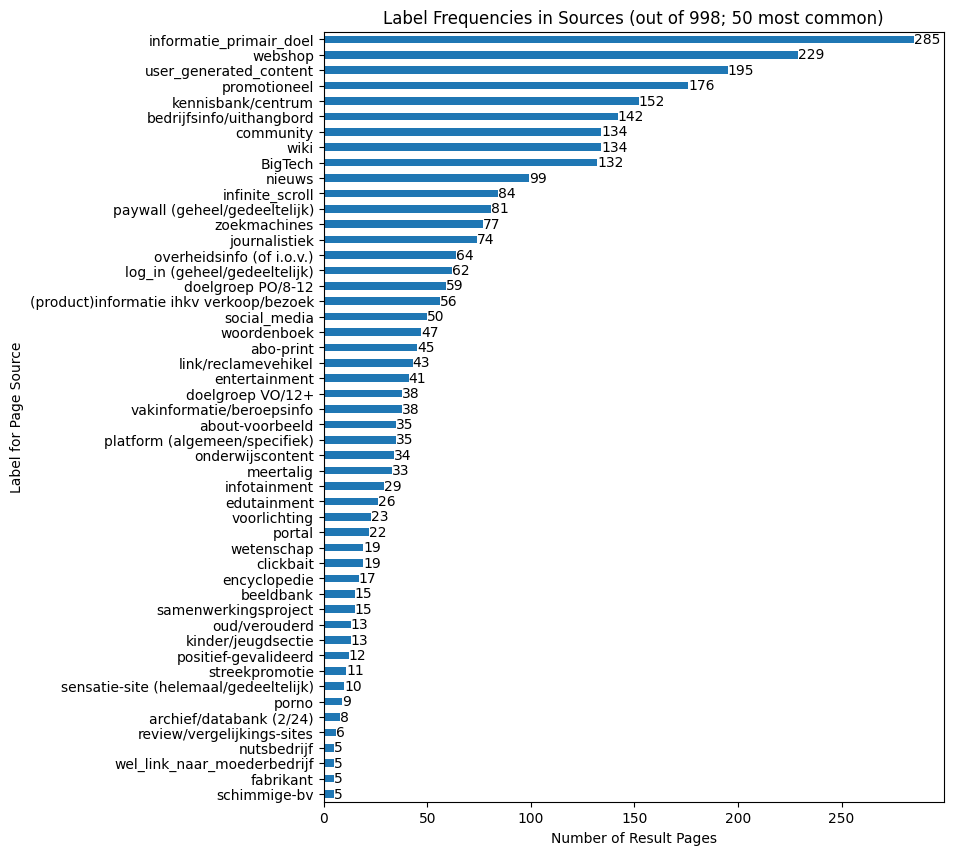
    


```python
k = 50

ax = (
    results_sources[column]
    .str.split(",")
    .explode()
    .str.strip()
    .value_counts(ascending=True)[-k:]
    .plot(
        kind="barh",
        title=f"Label Frequencies in Sources (out of {len(results_sources)}; {k} most common)",
        xlabel="Number of Result Pages",
        ylabel="Label for Page Source",
        figsize=(8, 10),
    )
)

ax.bar_label(ax.containers[0])
```


    [Text(0, 0, '1'),
     Text(0, 0, '1'),
     Text(0, 0, '1'),
     Text(0, 0, '1'),
     Text(0, 0, '1'),
     Text(0, 0, '1'),
     Text(0, 0, '1'),
     Text(0, 0, '1'),
     Text(0, 0, '1'),
     Text(0, 0, '1'),
     Text(0, 0, '1'),
     Text(0, 0, '1'),
     Text(0, 0, '1'),
     Text(0, 0, '1'),
     Text(0, 0, '1'),
     Text(0, 0, '2'),
     Text(0, 0, '2'),
     Text(0, 0, '2'),
     Text(0, 0, '2'),
     Text(0, 0, '2'),
     Text(0, 0, '2'),
     Text(0, 0, '2'),
     Text(0, 0, '2'),
     Text(0, 0, '2'),
     Text(0, 0, '3'),
     Text(0, 0, '3')]


    

    


```python
k = 10

ax = (
    results_sources[column]
    .str.split(",")
    .explode()
    .str.strip()
    .value_counts(ascending=True)[-k:]
    .plot(
        kind="barh",
        title=f"Label Frequencies in Sources (out of {len(results_sources)}; {k} most common)",
        xlabel="Number of Result Pages",
        ylabel="Label for Page Source",
    )
)

ax.bar_label(ax.containers[0])
```


    [Text(0, 0, '2'),
     Text(0, 0, '2'),
     Text(0, 0, '2'),
     Text(0, 0, '2'),
     Text(0, 0, '2'),
     Text(0, 0, '2'),
     Text(0, 0, '2'),
     Text(0, 0, '2'),
     Text(0, 0, '3'),
     Text(0, 0, '3')]


    

    


```python
counts: dict[int, float] = {}
category = "informatie_primair_doel"

for n in range(1, 11):
    _results = results_sources.loc[results_sources["Ranking"] <= n]
    counts[n] = (
        _results[column]
        .str.split(",")
        .explode()
        .str.strip()
        .value_counts(normalize=True)[category]
        * 100
    )

pd.DataFrame(counts.items(), columns=["Ranking", category]).set_index("Ranking").plot(
    title=f"'{category}': Percentage by Top N Results",
    xlabel="Minimum Result Rank (N)",
    ylabel=f"% of '{category}'",
    xticks=range(1, 11),
    yticks=range(0, 25, 5),
    legend=False,
).grid(axis="y")
```


    

    


### Result Sources


```python
k = 100

ax = (
    query_results["Bronnen DB"]
    .value_counts(ascending=True)[-k:]
    .plot(
        kind="barh",
        figsize=(8, k // 5),
        title=f"{k} most common Sources across all Search Results ({len(query_results)})",
        xlabel="Number of Result Pages",
        ylabel="Source",
    )
)

ax.bar_label(ax.containers[0])
```


    [Text(0, 0, '1'),
     Text(0, 0, '1'),
     Text(0, 0, '1'),
     Text(0, 0, '1'),
     Text(0, 0, '1'),
     Text(0, 0, '1'),
     Text(0, 0, '1'),
     Text(0, 0, '1'),
     Text(0, 0, '2')]


    

    


```python
k = 20

ax = (
    query_results["Bronnen DB"]
    .value_counts(ascending=True)[-k:]
    .plot(
        kind="barh",
        figsize=(8, k // 5),
        title=f"{k} most common Sources across all Search Results ({len(query_results)})",
        xlabel="Number of Result Pages",
        ylabel="Source",
    )
)

ax.bar_label(ax.containers[0])
```


    [Text(0, 0, '1'),
     Text(0, 0, '1'),
     Text(0, 0, '1'),
     Text(0, 0, '1'),
     Text(0, 0, '1'),
     Text(0, 0, '1'),
     Text(0, 0, '1'),
     Text(0, 0, '1'),
     Text(0, 0, '2')]


    

    


```python
k = 10

ax = (
    query_results["Bronnen DB"]
    .value_counts(ascending=True)[-k:]
    .plot(
        kind="barh",
        figsize=(8, k // 5),
        title=f"{k} most common Sources across all Search Results ({len(query_results)})",
        xlabel="Number of Result Pages",
        ylabel="Source",
    )
)

ax.bar_label(ax.containers[0])
```


    [Text(0, 0, '1'),
     Text(0, 0, '1'),
     Text(0, 0, '1'),
     Text(0, 0, '1'),
     Text(0, 0, '1'),
     Text(0, 0, '1'),
     Text(0, 0, '1'),
     Text(0, 0, '1'),
     Text(0, 0, '2')]


    
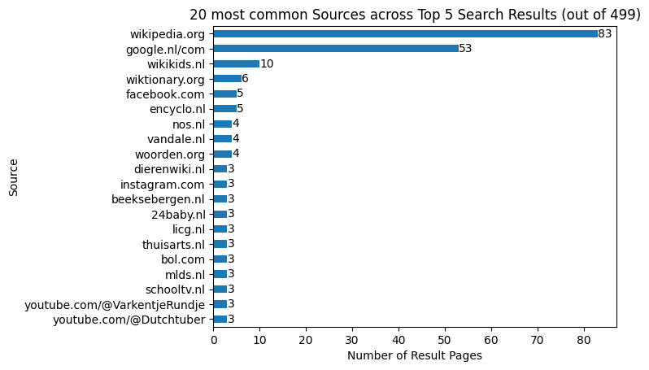
    


```python
n = 5
_results = query_results.loc[query_results["Ranking"] <= n]
k = 20

ax = (
    _results["Bronnen DB"]
    .value_counts(ascending=True)[-k:]
    .plot(
        kind="barh",
        # figsize=(8, k // 5),
        title=f"{k} most common Sources across Top {n} Search Results (out of {len(_results)})",
        xlabel="Number of Result Pages",
        ylabel="Source",
    )
)

ax.bar_label(ax.containers[0])
```


    [Text(0, 0, '1'),
     Text(0, 0, '1'),
     Text(0, 0, '1'),
     Text(0, 0, '1'),
     Text(0, 0, '1')]


    

    


```python
n = 1
_results = query_results.loc[query_results["Ranking"] <= n]
k = 20

ax = (
    _results["Bronnen DB"]
    .value_counts()[:k]
    .sort_values(ascending=True)
    .plot(
        kind="barh",
        figsize=(8, k // 5),
        title=f"{k} most common Sources across Top {n} Search Results (out of {len(_results)})",
        xlabel="Number of Result Pages",
        ylabel="Source",
    )
)

ax.bar_label(ax.containers[0])
```


    [Text(0, 0, '1')]


    

    


```python
n = 1
_results = query_results.loc[query_results["Ranking"] <= n]
k = 5

ax = (
    _results["Bronnen DB"]
    .value_counts()[:k]
    .sort_values(ascending=True)
    .plot(
        kind="barh",
        figsize=(8, k // 5),
        title=f"{k} most common Sources across Top {n} Search Results (out of {len(_results)})",
        xlabel="Number of Result Pages",
        ylabel="Source",
    )
)

ax.bar_label(ax.containers[0])
```


    [Text(0, 0, '1')]


    

    


```python
# Number of distinct sources against number of queries
import numpy as np
k = 10

_results = query_results.loc[query_results["Ranking"] <= k]
sources_per_query = _results.groupby("Query")["Bronnen DB"].unique()

distinct_sources = dict()
for i in range(len(queries)):
    distinct_sources[i + 1] = np.unique(
        np.concatenate(sources_per_query.values[: i + 1])
    ).size

x = list(distinct_sources.keys())
y = list(distinct_sources.values())
plt.plot(x, y)
plt.title("Discovery Curve for Distinct Sources by Number of Queries")
plt.xlabel("Number of Queries")
plt.ylabel("Number of Distinct Sources")
plt.grid()

```


    

    


```python
# wikikids.nl results never appears on first rank:

query_results.loc[(query_results["Bronnen DB"] == ("wikikids.nl")) & (query_results["Ranking"] <= 1)]
```


<div>
<style scoped>
    .dataframe tbody tr th:only-of-type {
        vertical-align: middle;
    }

    .dataframe tbody tr th {
        vertical-align: top;
    }

    .dataframe thead th {
        text-align: right;
    }
</style>
<table border="1" class="dataframe">
  <thead>
    <tr style="text-align: right;">
      <th></th>
      <th>Bron: Thumbs up?</th>
      <th>Titel resultaat</th>
      <th>Ranking</th>
      <th>Link/resultaat</th>
      <th>Query</th>
      <th>Relevant?</th>
      <th>vrije tags page</th>
      <th>Bronnen DB</th>
      <th>Bron: Inst/Bedrijf</th>
      <th>Toegankelijkheid doelgroep (indruk)</th>
      <th>...</th>
      <th>Q: Ranking vrije labels</th>
      <th>Bron: doel</th>
      <th>Bron: Trackers</th>
      <th>OnderzoekNr</th>
      <th>Related to Bronnen DB test (Resultaten DB)</th>
      <th>Bronnen: URL domein</th>
      <th>Query: Video Schooltv</th>
      <th>Created by</th>
      <th>Bron-Status</th>
      <th>Bron: Onderwerp</th>
    </tr>
  </thead>
  <tbody>
  </tbody>
</table>
<p>0 rows × 27 columns</p>
</div>


```python
niet_wikipedia_rank_1 = results_sources.loc[
    (query_results["Bronnen DB"] != ("wikipedia.org")) & (query_results["Ranking"] <= 1)
]
ax = (
    niet_wikipedia_rank_1["Thumbs up 8-14?"]
    .value_counts(ascending=True)
    .plot(
        kind="barh",
        title=f"Thumbs up 8-14? for non-Wikipedia Results in Top 1 (out of {len(niet_wikipedia_rank_1)})",
        xlabel="Number of Result Pages",
    )
)
ax.bar_label(ax.containers[0])
```


    ---------------------------------------------------------------------------

    IndexError                                Traceback (most recent call last)

    Cell In[54], line 7
          1 niet_wikipedia_rank_1 = results_sources.loc[
          2     (query_results["Bronnen DB"] != ("wikipedia.org")) & (query_results["Ranking"] <= 1)
          3 ]
          4 ax = (
          5     niet_wikipedia_rank_1["Thumbs up 8-14?"]
          6     .value_counts(ascending=True)
    ----> 7     .plot(
          8         kind="barh",
          9         title=f"Thumbs up 8-14? for non-Wikipedia Results in Top 1 (out of {len(niet_wikipedia_rank_1)})",
         10         xlabel="Number of Result Pages",
         11     )
         12 )
         13 ax.bar_label(ax.containers[0])


    File ~/SlimZoeken/100queries/.venv/lib/python3.11/site-packages/pandas/plotting/_core.py:1030, in PlotAccessor.__call__(self, *args, **kwargs)
       1027             label_name = label_kw or data.columns
       1028             data.columns = label_name
    -> 1030 return plot_backend.plot(data, kind=kind, **kwargs)


    File ~/SlimZoeken/100queries/.venv/lib/python3.11/site-packages/pandas/plotting/_matplotlib/__init__.py:71, in plot(data, kind, **kwargs)
         69         kwargs["ax"] = getattr(ax, "left_ax", ax)
         70 plot_obj = PLOT_CLASSES[kind](data, **kwargs)
    ---> 71 plot_obj.generate()
         72 plot_obj.draw()
         73 return plot_obj.result


    File ~/SlimZoeken/100queries/.venv/lib/python3.11/site-packages/pandas/plotting/_matplotlib/core.py:508, in MPLPlot.generate(self)
        506 for ax in self.axes:
        507     self._post_plot_logic_common(ax)
    --> 508     self._post_plot_logic(ax, self.data)


    File ~/SlimZoeken/100queries/.venv/lib/python3.11/site-packages/pandas/plotting/_matplotlib/core.py:1966, in BarPlot._post_plot_logic(self, ax, data)
       1963 else:
       1964     str_index = [pprint_thing(key) for key in range(data.shape[0])]
    -> 1966 s_edge = self.ax_pos[0] - 0.25 + self.lim_offset
       1967 e_edge = self.ax_pos[-1] + 0.25 + self.bar_width + self.lim_offset
       1969 self._decorate_ticks(ax, self._get_index_name(), str_index, s_edge, e_edge)


    IndexError: index 0 is out of bounds for axis 0 with size 0


    

    


### Result Types (Informativeness)


```python
column = "Soort Resultaat"

values = results_sources[column].unique()

counts = (
    results_sources.groupby("Query")
    .value_counts(subset=[column], normalize=True)
    .unstack(level=column)
)

counts
```


<div>
<style scoped>
    .dataframe tbody tr th:only-of-type {
        vertical-align: middle;
    }

    .dataframe tbody tr th {
        vertical-align: top;
    }

    .dataframe thead th {
        text-align: right;
    }
</style>
<table border="1" class="dataframe">
  <thead>
    <tr style="text-align: right;">
      <th>Soort Resultaat</th>
      <th>informatief</th>
      <th>navigational</th>
      <th>transactional</th>
    </tr>
    <tr>
      <th>Query</th>
      <th></th>
      <th></th>
      <th></th>
    </tr>
  </thead>
  <tbody>
    <tr>
      <th>De gouverneur van limburg</th>
      <td>0.900000</td>
      <td>0.100000</td>
      <td>NaN</td>
    </tr>
    <tr>
      <th>De smurfen</th>
      <td>0.200000</td>
      <td>0.400000</td>
      <td>0.400000</td>
    </tr>
    <tr>
      <th>Dierentuin</th>
      <td>1.000000</td>
      <td>NaN</td>
      <td>NaN</td>
    </tr>
    <tr>
      <th>Ezel</th>
      <td>0.700000</td>
      <td>NaN</td>
      <td>0.300000</td>
    </tr>
    <tr>
      <th>Hoe komen straatkinderen aan eten</th>
      <td>1.000000</td>
      <td>NaN</td>
      <td>NaN</td>
    </tr>
    <tr>
      <th>...</th>
      <td>...</td>
      <td>...</td>
      <td>...</td>
    </tr>
    <tr>
      <th>welken gebouwen zijn er in West-Vlaanderen</th>
      <td>0.800000</td>
      <td>0.200000</td>
      <td>NaN</td>
    </tr>
    <tr>
      <th>westerschelde waternoodsramp</th>
      <td>0.900000</td>
      <td>0.100000</td>
      <td>NaN</td>
    </tr>
    <tr>
      <th>wist je dat?</th>
      <td>1.000000</td>
      <td>NaN</td>
      <td>NaN</td>
    </tr>
    <tr>
      <th>zebra</th>
      <td>0.636364</td>
      <td>0.272727</td>
      <td>0.090909</td>
    </tr>
    <tr>
      <th>zebrahaai</th>
      <td>0.600000</td>
      <td>0.300000</td>
      <td>0.100000</td>
    </tr>
  </tbody>
</table>
<p>100 rows × 3 columns</p>
</div>


```python
width = 120

for col in counts.columns:
    print("=" * 20 + col + "=" * 20)
    with pd.option_context("display.width", width, "display.min_rows", 50):
        print(counts.sort_values(by=col, ascending=False))
    print("=" * width)
```

    ====================informatief====================
    Soort Resultaat                                     informatief  navigational  transactional
    Query                                                                                       
    mens red peuter van dak racist                         1.000000           NaN            NaN
    wist je dat?                                           1.000000           NaN            NaN
    waar leven giraffen                                    1.000000           NaN            NaN
    wat betekent schotse                                   1.000000           NaN            NaN
    wat is een begin aanhaling                             1.000000           NaN            NaN
    elektronen                                             1.000000           NaN            NaN
    ik wil iemand een bericht steuren                      1.000000           NaN            NaN
    wat is een foetus?                                     1.000000           NaN            NaN
    voortplanting                                          1.000000           NaN            NaN
    wat is en ligboxstal                                   1.000000           NaN            NaN
    welke stammen zijn er in sierra leone                  1.000000           NaN            NaN
    koning van belgieje                                    1.000000           NaN            NaN
    maanstonden                                            1.000000           NaN            NaN
    waar komt de naam Romen van                            1.000000           NaN            NaN
    hirohito                                               1.000000           NaN            NaN
    Dierentuin                                             1.000000           NaN            NaN
    otter kenmerken                                        1.000000           NaN            NaN
    Waarom zijn edelmetalen geschrikt om geld te maken     1.000000           NaN            NaN
    taak slokdarm                                          1.000000           NaN            NaN
    pepernooten recept                                     1.000000           NaN            NaN
    Hoe komen straatkinderen aan eten                      1.000000           NaN            NaN
    Rencontre                                              1.000000           NaN            NaN
    PIRAMIDES CHEOPS                                       1.000000           NaN            NaN
    kerstmis                                               0.909091      0.090909            NaN
    nachtbraker vogel                                      0.900000      0.100000            NaN
    ...                                                         ...           ...            ...
    merelbeke                                              0.444444      0.555556            NaN
    rillaar monumenten                                     0.400000      0.600000            NaN
    handgranat                                             0.400000      0.400000       0.200000
    waterbuffel                                            0.400000           NaN       0.600000
    Rug                                                    0.375000      0.625000            NaN
    azerty                                                 0.375000      0.250000       0.375000
    camille dhont                                          0.333333      0.555556       0.111111
    geld                                                   0.333333      0.444444       0.222222
    ferrari                                                0.300000      0.200000       0.500000
    turne ritmic                                           0.250000      0.625000       0.125000
    echte naakte vrouw                                     0.200000      0.800000            NaN
    De smurfen                                             0.200000      0.400000       0.400000
    middellandse zee                                       0.200000      0.200000       0.600000
    kleren van vikingen                                    0.200000      0.100000       0.700000
    juf hanne de leerboom                                  0.111111      0.888889            NaN
    filters                                                0.100000           NaN       0.900000
    autosport                                              0.090909      0.909091            NaN
    kindermotors                                                NaN      0.272727       0.727273
    klokken                                                     NaN      0.111111       0.888889
    plaatjes van vulkaan                                        NaN      0.200000       0.800000
    post moter                                                  NaN      0.100000       0.900000
    stamboom  familie                                           NaN      1.000000            NaN
    telefoon                                                    NaN      0.100000       0.900000
    vogels huisjes                                              NaN      0.181818       0.818182
    wat voor soort producten worden er gemaakt bij ...          NaN      0.100000       0.900000
    
    [100 rows x 3 columns]
    ========================================================================================================================
    ====================navigational====================
    Soort Resultaat                                     informatief  navigational  transactional
    Query                                                                                       
    stamboom  familie                                           NaN      1.000000            NaN
    autosport                                              0.090909      0.909091            NaN
    juf hanne de leerboom                                  0.111111      0.888889            NaN
    echte naakte vrouw                                     0.200000      0.800000            NaN
    Rug                                                    0.375000      0.625000            NaN
    turne ritmic                                           0.250000      0.625000       0.125000
    rillaar monumenten                                     0.400000      0.600000            NaN
    merelbeke                                              0.444444      0.555556            NaN
    camille dhont                                          0.333333      0.555556       0.111111
    seks                                                   0.500000      0.500000            NaN
    ronaldo                                                0.538462      0.461538            NaN
    geld                                                   0.333333      0.444444       0.222222
    De smurfen                                             0.200000      0.400000       0.400000
    handgranat                                             0.400000      0.400000       0.200000
    spiere                                                 0.600000      0.400000            NaN
    greta thunberg                                         0.636364      0.363636            NaN
    de gea                                                 0.700000      0.300000            NaN
    leven                                                  0.600000      0.300000       0.100000
    zebrahaai                                              0.600000      0.300000       0.100000
    paard hond en wolf                                     0.700000      0.300000            NaN
    beweging                                               0.700000      0.300000            NaN
    kindermotors                                                NaN      0.272727       0.727273
    zebra                                                  0.636364      0.272727       0.090909
    paris saint germain                                    0.500000      0.250000       0.250000
    azerty                                                 0.375000      0.250000       0.375000
    ...                                                         ...           ...            ...
    Waarom zijn edelmetalen geschrikt om geld te maken     1.000000           NaN            NaN
    een hond                                               0.800000           NaN       0.200000
    elektronen                                             1.000000           NaN            NaN
    filters                                                0.100000           NaN       0.900000
    hirohito                                               1.000000           NaN            NaN
    hommels                                                0.900000           NaN       0.100000
    ik wil iemand een bericht steuren                      1.000000           NaN            NaN
    keurmerk max                                           0.800000           NaN       0.200000
    koning van belgieje                                    1.000000           NaN            NaN
    maanstonden                                            1.000000           NaN            NaN
    mens red peuter van dak racist                         1.000000           NaN            NaN
    otter kenmerken                                        1.000000           NaN            NaN
    pepernooten recept                                     1.000000           NaN            NaN
    taak slokdarm                                          1.000000           NaN            NaN
    varkentje                                              0.900000           NaN       0.100000
    voortplanting                                          1.000000           NaN            NaN
    waar komt de naam Romen van                            1.000000           NaN            NaN
    waar leven giraffen                                    1.000000           NaN            NaN
    wat betekent schotse                                   1.000000           NaN            NaN
    wat is een begin aanhaling                             1.000000           NaN            NaN
    wat is een foetus?                                     1.000000           NaN            NaN
    wat is en ligboxstal                                   1.000000           NaN            NaN
    waterbuffel                                            0.400000           NaN       0.600000
    welke stammen zijn er in sierra leone                  1.000000           NaN            NaN
    wist je dat?                                           1.000000           NaN            NaN
    
    [100 rows x 3 columns]
    ========================================================================================================================
    ====================transactional====================
    Soort Resultaat                                     informatief  navigational  transactional
    Query                                                                                       
    wat voor soort producten worden er gemaakt bij ...          NaN      0.100000       0.900000
    telefoon                                                    NaN      0.100000       0.900000
    post moter                                                  NaN      0.100000       0.900000
    filters                                                0.100000           NaN       0.900000
    klokken                                                     NaN      0.111111       0.888889
    vogels huisjes                                              NaN      0.181818       0.818182
    plaatjes van vulkaan                                        NaN      0.200000       0.800000
    kindermotors                                                NaN      0.272727       0.727273
    kleren van vikingen                                    0.200000      0.100000       0.700000
    waterbuffel                                            0.400000           NaN       0.600000
    middellandse zee                                       0.200000      0.200000       0.600000
    ferrari                                                0.300000      0.200000       0.500000
    De smurfen                                             0.200000      0.400000       0.400000
    de bal                                                 0.500000      0.100000       0.400000
    cobra slang                                            0.500000      0.100000       0.400000
    azerty                                                 0.375000      0.250000       0.375000
    stoomschip                                             0.500000      0.200000       0.300000
    Ezel                                                   0.700000           NaN       0.300000
    paris saint germain                                    0.500000      0.250000       0.250000
    geld                                                   0.333333      0.444444       0.222222
    keurmerk max                                           0.800000           NaN       0.200000
    handgranat                                             0.400000      0.400000       0.200000
    een hond                                               0.800000           NaN       0.200000
    het groot Barrierif                                    0.636364      0.181818       0.181818
    engeland                                               0.636364      0.181818       0.181818
    ...                                                         ...           ...            ...
    pasteuriseren                                          0.900000      0.100000            NaN
    pepernooten recept                                     1.000000           NaN            NaN
    poep                                                   0.900000      0.100000            NaN
    populairenamen                                         0.900000      0.100000            NaN
    puberteit                                              0.900000      0.100000            NaN
    rillaar monumenten                                     0.400000      0.600000            NaN
    ronaldo                                                0.538462      0.461538            NaN
    seks                                                   0.500000      0.500000            NaN
    sloot                                                  0.777778      0.222222            NaN
    spiere                                                 0.600000      0.400000            NaN
    stamboom  familie                                           NaN      1.000000            NaN
    taak slokdarm                                          1.000000           NaN            NaN
    vertrekhal met inchekbalie                             0.800000      0.200000            NaN
    video van paarden                                      0.800000      0.200000            NaN
    voortplanting                                          1.000000           NaN            NaN
    waar komt de naam Romen van                            1.000000           NaN            NaN
    waar leven giraffen                                    1.000000           NaN            NaN
    wat betekent schotse                                   1.000000           NaN            NaN
    wat is een begin aanhaling                             1.000000           NaN            NaN
    wat is een foetus?                                     1.000000           NaN            NaN
    wat is en ligboxstal                                   1.000000           NaN            NaN
    welke stammen zijn er in sierra leone                  1.000000           NaN            NaN
    welken gebouwen zijn er in West-Vlaanderen             0.800000      0.200000            NaN
    westerschelde waternoodsramp                           0.900000      0.100000            NaN
    wist je dat?                                           1.000000           NaN            NaN
    
    [100 rows x 3 columns]
    ========================================================================================================================


```python
column = "Soort Resultaat"

informativeness = query_results[column].value_counts(ascending=True)
informativeness.index = ["transactional", "navigational", "informational"]

ax = informativeness.plot(
    kind="barh",
    title=f"Result Types per Result Page (out of {len(query_results)})",
    xlabel="Number of Result Pages",
    ylabel="Result Type",
    figsize=(8, 1),
)
ax.bar_label(ax.containers[0])
```


    [Text(0, 0, '138'), Text(0, 0, '181'), Text(0, 0, '679')]


    

    


```python
value_counts: dict = {}


for n in range(1, 11):
    _results = results_sources.loc[results_sources["Ranking"] <= n]
    value_counts[n] = (
        _results[column]
        .str.split(",")
        .explode()
        .str.strip()
        .value_counts(normalize=True)
        * 100
    )


pd.DataFrame.from_dict(value_counts, orient="index").sort_index().plot(
    title=f"'{column}': Percentage by Top N Results",
    xlabel="Minimum Result Ranking (N)",
    ylabel=f"Percentage in '{column}'",
    xticks=range(1, 11),
    yticks=range(0, 105, 5),
    legend=True,
).grid(axis="y")
```


    

    


### Result Relevance


```python
relevance_counts = query_results["Relevant?"].value_counts(ascending=True)
relevance_counts
```


    Relevant?
    404                1
    misschien         53
    niet_relevant    117
    relevant         827
    Name: count, dtype: int64


```python
relevance_counts.index = ["Error 404", "partially_relevant", "irrelevant", "relevant"]
relevance_counts
```


    Error 404               1
    partially_relevant     53
    irrelevant            117
    relevant              827
    Name: count, dtype: int64


```python
ax = relevance_counts.plot(
    kind="barh",
    title=f"Relevance per Result Page (out of {len(query_results)})",
    xlabel="Number of Result Pages",
    ylabel="Relevancy Category",
    figsize=(8, 1),
)
ax.bar_label(ax.containers[0])
```


    [Text(0, 0, '1'), Text(0, 0, '53'), Text(0, 0, '117'), Text(0, 0, '827')]


    
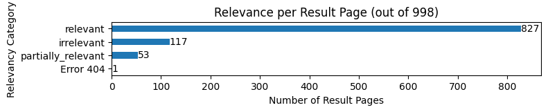
    


```python
counts: dict[int, float] = {}

for n in range(1, 11):
    _results = query_results.loc[query_results["Ranking"] <= n]
    counts[n] = _results["Relevant?"].value_counts(normalize=True)["relevant"] * 100

pd.DataFrame(counts.items(), columns=["Ranking", "Relevance"]).set_index(
    "Ranking"
).plot(
    title="Relevance Percentage by Top N Results across all Queries",
    xlabel="Minimum Result Ranking (N)",
    ylabel="Percentage of Relevant Result Pages",
    xticks=range(1, 11),
    yticks=range(80, 105, 5),
    legend=False,
).grid(axis="y")
```


    

    


```python
value_counts: dict = {}

column = "Relevant?"

for n in range(1, 11):
    _results = results_sources.loc[results_sources["Ranking"] <= n]
    value_counts[n] = (
        _results[column]
        .str.split(",")
        .explode()
        .str.strip()
        .value_counts(normalize=True)[:k]
        * 100
    )


pd.DataFrame.from_dict(value_counts, orient="index").fillna(
    method="bfill"
).sort_index().plot(
    title=f"'{column}': Percentage by Top N Results",
    xlabel="Minimum Result Ranking (N)",
    ylabel=f"Percentage in '{column}'",
    xticks=range(1, 11),
    yticks=range(0, 101, 10),
    legend=True,
).grid(axis="y")
```

    /var/folders/d8/j5_fyf8941j_492zvf8948y40000gn/T/ipykernel_54882/1192633478.py:17: FutureWarning: DataFrame.fillna with 'method' is deprecated and will raise in a future version. Use obj.ffill() or obj.bfill() instead.
      pd.DataFrame.from_dict(value_counts, orient="index").fillna(


    
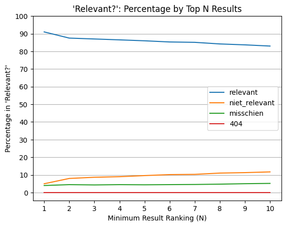
    


### Result Accessibility


```python
ax = (
    query_results["Toegankelijkheid doelgroep (indruk)"]
    .value_counts(ascending=True)
    .plot(
        kind="barh",
        title=f"Accessibility for Audience (8-12 years) (out of {len(query_results)})",
        xlabel="Number of Result Pages",
        ylabel="Accessibility",
    )
)
ax.bar_label(ax.containers[0])
```


    [Text(0, 0, '10'),
     Text(0, 0, '55'),
     Text(0, 0, '300'),
     Text(0, 0, '302'),
     Text(0, 0, '331')]


    

    


### Results Commerciality


```python
n=10

ax = (
    results_sources["Commercialiteit"]
    .str.split(",")
    .explode()
    .str.strip()
    .value_counts(ascending=True)
    .plot(
        kind="barh",
        title=f"Commerciality Labels for Top {n} Result Pages (out of {len(results_sources)})",
        xlabel="Number of Result pages",
        ylabel="Commerciality Label",
    )
)
ax.bar_label(ax.containers[0])
```


    [Text(0, 0, '53'), Text(0, 0, '416'), Text(0, 0, '528')]


    

    


```python
n = 5
_results = results_sources.loc[query_results["Ranking"] <= n]

ax = (
    _results["Commercialiteit"]
    .str.split(",")
    .explode()
    .str.strip()
    .value_counts(ascending=True)
    .plot(
        kind="barh",
        title=f"Commerciality Labels for Top {n} Result Pages (out of {len(_results)})",
        xlabel="Number of Result pages",
        ylabel="Commerciality Label",
    )
)
ax.bar_label(ax.containers[0])
```


    [Text(0, 0, '18'), Text(0, 0, '228'), Text(0, 0, '252')]


    
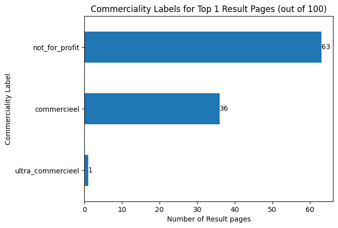
    


```python
n = 1
_results = results_sources.loc[query_results["Ranking"] <= n]

ax = (
    _results["Commercialiteit"]
    .str.split(",")
    .explode()
    .str.strip()
    .value_counts(ascending=True)
    .plot(
        kind="barh",
        title=f"Commerciality Labels for Top {n} Result Pages (out of {len(_results)})",
        xlabel="Number of Result pages",
        ylabel="Commerciality Label",
    )
)
ax.bar_label(ax.containers[0])
```


    [Text(0, 0, '1'), Text(0, 0, '36'), Text(0, 0, '63')]


    

    


```python
value_counts: dict = {}
column = "Commercialiteit"


for n in range(1, 11):
    _results = results_sources.loc[results_sources["Ranking"] <= n]
    value_counts[n] = (
        _results[column]
        .str.split(",")
        .explode()
        .str.strip()
        .value_counts(normalize=True)
        * 100
    )


pd.DataFrame.from_dict(value_counts, orient="index").fillna(0).sort_index().plot(
    title=f"'{column}': Percentage by Top N Results",
    xlabel="Minimum Result Ranking (N)",
    ylabel=f"Percentage in '{column}'",
    xticks=range(1, 11),
    yticks=range(0, 75, 10),
    legend=True,
).grid(axis="y")
```


    

    


### Result Sectors


```python
k = 20

ax = (
    results_sources["Sector"]
    .str.split(",")
    .explode()
    .str.strip()
    .value_counts(ascending=True)[-k:]
    .plot(
        kind="barh",
        title=f"{k} Most Common Sectors per Result Page (out of {len(results_sources)})",
        xlabel="Number of Result Pages",
        ylabel="Sector",
    )
)
ax.bar_label(ax.containers[0])
```


    [Text(0, 0, '9'),
     Text(0, 0, '11'),
     Text(0, 0, '12'),
     Text(0, 0, '13'),
     Text(0, 0, '14'),
     Text(0, 0, '18'),
     Text(0, 0, '18'),
     Text(0, 0, '21'),
     Text(0, 0, '24'),
     Text(0, 0, '24'),
     Text(0, 0, '33'),
     Text(0, 0, '35'),
     Text(0, 0, '37'),
     Text(0, 0, '38'),
     Text(0, 0, '69'),
     Text(0, 0, '77'),
     Text(0, 0, '95'),
     Text(0, 0, '106'),
     Text(0, 0, '140'),
     Text(0, 0, '165')]


    

    


```python
n = 5
k = 20
ax = (
    results_sources.loc[results_sources["Ranking"] <= n]["Sector"]
    .str.split(",")
    .explode()
    .str.strip()
    .value_counts(ascending=True)[-k:]
    .plot(
        kind="barh",
        title=f"{k} Most Common Sectors per Result Page in first {n} results",
        xlabel="Number of Result Pages",
        ylabel="Sector",
    )
)
ax.bar_label(ax.containers[0])
```


    [Text(0, 0, '4'),
     Text(0, 0, '4'),
     Text(0, 0, '4'),
     Text(0, 0, '5'),
     Text(0, 0, '7'),
     Text(0, 0, '7'),
     Text(0, 0, '8'),
     Text(0, 0, '9'),
     Text(0, 0, '10'),
     Text(0, 0, '11'),
     Text(0, 0, '16'),
     Text(0, 0, '16'),
     Text(0, 0, '17'),
     Text(0, 0, '19'),
     Text(0, 0, '31'),
     Text(0, 0, '32'),
     Text(0, 0, '40'),
     Text(0, 0, '63'),
     Text(0, 0, '72'),
     Text(0, 0, '106')]


    
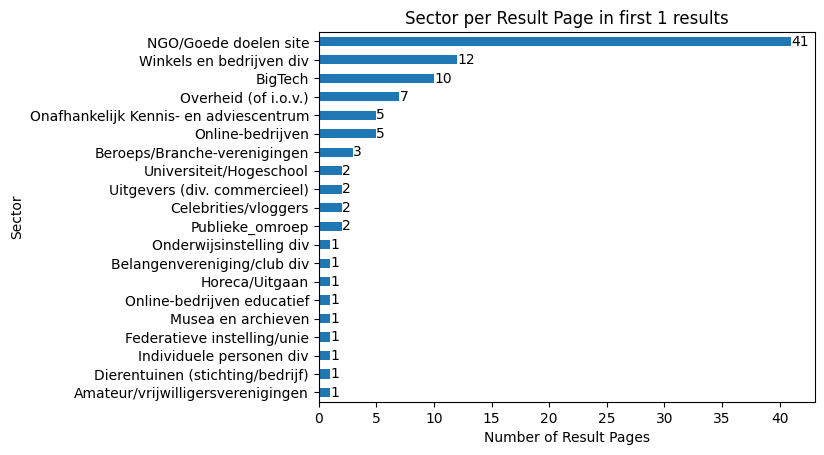
    


```python
n = 1
ax = (
    results_sources.loc[results_sources["Ranking"] <= n]["Sector"]
    .str.split(",")
    .explode()
    .str.strip()
    .value_counts(ascending=True)
    .plot(
        kind="barh",
        title=f"Sector per Result Page in first {n} results",
        xlabel="Number of Result Pages",
        ylabel="Sector",
    )
)
ax.bar_label(ax.containers[0])
```


    [Text(0, 0, '1'),
     Text(0, 0, '1'),
     Text(0, 0, '1'),
     Text(0, 0, '1'),
     Text(0, 0, '1'),
     Text(0, 0, '1'),
     Text(0, 0, '1'),
     Text(0, 0, '1'),
     Text(0, 0, '1'),
     Text(0, 0, '2'),
     Text(0, 0, '2'),
     Text(0, 0, '2'),
     Text(0, 0, '2'),
     Text(0, 0, '3'),
     Text(0, 0, '5'),
     Text(0, 0, '5'),
     Text(0, 0, '7'),
     Text(0, 0, '10'),
     Text(0, 0, '12'),
     Text(0, 0, '41')]


    
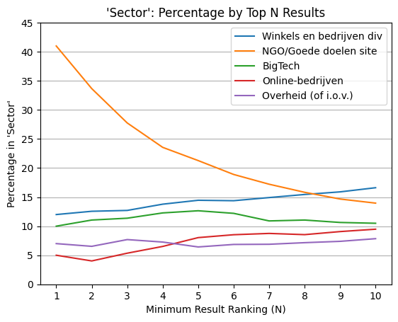
    


```python
value_counts: dict = {}
k = 5
column = "Sector"

top_sectors = results_sources[column].value_counts()[:k].index

for n in range(1, 11):
    _results = results_sources.loc[results_sources["Ranking"] <= n]
    value_counts[n] = (
        _results[column]
        .str.split(",")
        .explode()
        .str.strip()
        .value_counts(normalize=True)[top_sectors]
        * 100
    )


pd.DataFrame.from_dict(value_counts, orient="index").fillna(
    method="ffill"
).sort_index().plot(
    title=f"'{column}': Percentage by Top N Results",
    xlabel="Minimum Result Ranking (N)",
    ylabel=f"Percentage in '{column}'",
    xticks=range(1, 11),
    yticks=range(0, 50, 5),
    legend=True,
).grid(axis="y")
```

    /var/folders/d8/j5_fyf8941j_492zvf8948y40000gn/T/ipykernel_54882/978984602.py:19: FutureWarning: DataFrame.fillna with 'method' is deprecated and will raise in a future version. Use obj.ffill() or obj.bfill() instead.
      pd.DataFrame.from_dict(value_counts, orient="index").fillna(


    

    


### Thumbs-Up


```python
column = "Thumbs up 8-14?"

ax = (
    results_sources[column]
    .str.split(",")
    .explode()
    .str.strip()
    .value_counts(ascending=True)
    .plot(
        kind="barh",
        title=f"{column} per Result Page (out of {len(results_sources)})",
        xlabel="Number of Result Pages",
        ylabel=column,
    )
)
ax.bar_label(ax.containers[0])
```


    [Text(0, 0, '25'), Text(0, 0, '232'), Text(0, 0, '360'), Text(0, 0, '380')]


    

    


```python
column = "Thumbs up 8-14?"
n = 5

ax = (
    results_sources.loc[results_sources["Ranking"] <= n][column]
    .str.split(",")
    .explode()
    .str.strip()
    .value_counts(ascending=True)
    .plot(
        kind="barh",
        title=f"{column} per Result Page in first {n} results",
        xlabel="Number of Result Pages",
        ylabel=column,
    )
)
ax.bar_label(ax.containers[0])
```


    [Text(0, 0, '7'), Text(0, 0, '99'), Text(0, 0, '178'), Text(0, 0, '214')]


    

    


```python
column = "Thumbs up 8-14?"
n = 1

ax = (
    results_sources.loc[results_sources["Ranking"] <= n][column]
    .str.split(",")
    .explode()
    .str.strip()
    .value_counts(ascending=True)
    .plot(
        kind="barh",
        title=f"{column} per Result Page in first {n} results",
        xlabel="Number of Result Pages",
        ylabel=column,
    )
)
ax.bar_label(ax.containers[0])
```


    [Text(0, 0, '1'), Text(0, 0, '11'), Text(0, 0, '27'), Text(0, 0, '61')]


    

    


```python
value_counts: dict = {}

column = "Thumbs up 8-14?"

for n in range(1, 11):
    _results = results_sources.loc[results_sources["Ranking"] <= n]
    value_counts[n] = (
        _results[column]
        .str.split(",")
        .explode()
        .str.strip()
        .value_counts(normalize=True)
        * 100
    )


df = pd.DataFrame.from_dict(value_counts, orient="index").sort_index()
df.columns = columns = ["Yes", "Just in case", "No", "Unclear"]

df.plot(
    title=f"Source suitability for children: percentage by Top N Results",
    xlabel="Top N Results",
    ylabel=f"Percentage of results from suitable sources",
    xticks=range(1, 11),
    yticks=range(0, 80, 5),
    legend=True,
    figsize=(8, 3),
).grid(axis="y")
```


    

    


```python
field = "Bron: Thumbs up?"
agg_field = "Kwaliteit_about"

thumbs_up_vs_about = results_sources.groupby(field)[agg_field].value_counts().unstack()
thumbs_up_vs_about.columns = [
    "contact info only",
    "contact info in footer",
    "N/A",
    "missing information",
    "comprehensive",
    "sufficient",
    "no information",
]
thumbs_up_vs_about.index = ["Yes", "Just in case", "No", "Unclear"]
thumbs_up_vs_about.plot(
    kind="bar",
    stacked=True,
    title="Source Suitability per `About` Page Quality",
    ylabel="Number of results",
    xlabel="Result source suitable for audience?",
    figsize=(9, 4),
    colormap="tab10",
)
```


    <Axes: title={'center': 'Source Suitability per `About` Page Quality'}, xlabel='Result source suitable for audience?', ylabel='Number of results'>


    

    


```python
thumbs_up_vs_about
```


<div>
<style scoped>
    .dataframe tbody tr th:only-of-type {
        vertical-align: middle;
    }

    .dataframe tbody tr th {
        vertical-align: top;
    }

    .dataframe thead th {
        text-align: right;
    }
</style>
<table border="1" class="dataframe">
  <thead>
    <tr style="text-align: right;">
      <th></th>
      <th>contact info only</th>
      <th>contact info in footer</th>
      <th>N/A</th>
      <th>missing information</th>
      <th>comprehensive</th>
      <th>sufficient</th>
      <th>no information</th>
    </tr>
  </thead>
  <tbody>
    <tr>
      <th>Yes</th>
      <td>22.0</td>
      <td>2.0</td>
      <td>NaN</td>
      <td>16.0</td>
      <td>292.0</td>
      <td>47.0</td>
      <td>1.0</td>
    </tr>
    <tr>
      <th>Just in case</th>
      <td>20.0</td>
      <td>20.0</td>
      <td>NaN</td>
      <td>48.0</td>
      <td>110.0</td>
      <td>160.0</td>
      <td>2.0</td>
    </tr>
    <tr>
      <th>No</th>
      <td>14.0</td>
      <td>2.0</td>
      <td>1.0</td>
      <td>51.0</td>
      <td>20.0</td>
      <td>126.0</td>
      <td>18.0</td>
    </tr>
    <tr>
      <th>Unclear</th>
      <td>4.0</td>
      <td>1.0</td>
      <td>NaN</td>
      <td>10.0</td>
      <td>5.0</td>
      <td>5.0</td>
      <td>NaN</td>
    </tr>
  </tbody>
</table>
</div>


```python
thumbs_up_vs_about.sum(axis=1)
```


    Yes             380.0
    Just in case    360.0
    No              232.0
    Unclear          25.0
    dtype: float64


### Goal


```python
column = "Conclusie over doel vd bron"
k = 20

ax = (
    results_sources[column]
    .str.split(",")
    .explode()
    .str.strip()
    .value_counts(ascending=True)[-k:]
    .plot(
        kind="barh",
        title=f"{k} most common '{column}' per Result Page (out of {len(results_sources)})",
        xlabel="Number of Result Pages",
        ylabel=column,
    )
)
ax.bar_label(ax.containers[0])
```


    [Text(0, 0, '20'),
     Text(0, 0, '20'),
     Text(0, 0, '20'),
     Text(0, 0, '22'),
     Text(0, 0, '22'),
     Text(0, 0, '25'),
     Text(0, 0, '26'),
     Text(0, 0, '27'),
     Text(0, 0, '28'),
     Text(0, 0, '29'),
     Text(0, 0, '32'),
     Text(0, 0, '34'),
     Text(0, 0, '37'),
     Text(0, 0, '57'),
     Text(0, 0, '60'),
     Text(0, 0, '63'),
     Text(0, 0, '94'),
     Text(0, 0, '110'),
     Text(0, 0, '111'),
     Text(0, 0, '216')]


    

    


```python
column = "Conclusie over doel vd bron"
n = 5

ax = (
    results_sources.loc[results_sources["Ranking"] <= n][column]
    .str.split(",")
    .explode()
    .str.strip()
    .value_counts(ascending=True)[-k:]
    .plot(
        kind="barh",
        title=f"{k} most frequent '{column}' per First {n} Result Pages",
        xlabel="Number of Result Pages",
        ylabel=column,
    )
)
ax.bar_label(ax.containers[0])
```


    [Text(0, 0, '8'),
     Text(0, 0, '8'),
     Text(0, 0, '10'),
     Text(0, 0, '10'),
     Text(0, 0, '10'),
     Text(0, 0, '13'),
     Text(0, 0, '14'),
     Text(0, 0, '14'),
     Text(0, 0, '15'),
     Text(0, 0, '15'),
     Text(0, 0, '15'),
     Text(0, 0, '16'),
     Text(0, 0, '16'),
     Text(0, 0, '24'),
     Text(0, 0, '24'),
     Text(0, 0, '28'),
     Text(0, 0, '39'),
     Text(0, 0, '49'),
     Text(0, 0, '89'),
     Text(0, 0, '112')]


    
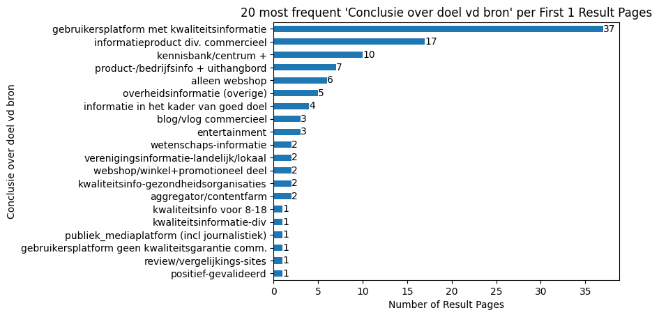
    


```python
column = "Conclusie over doel vd bron"
n = 1
k = 20

ax = (
    results_sources.loc[results_sources["Ranking"] <= n][column]
    .str.split(",")
    .explode()
    .str.strip()
    .value_counts(ascending=True)[-k:]
    .plot(
        kind="barh",
        title=f"{k} most frequent '{column}' per First {n} Result Pages",
        xlabel="Number of Result Pages",
        ylabel=column,
        # figsize=(8, 10),
    )
)
ax.bar_label(ax.containers[0])
```


    [Text(0, 0, '1'),
     Text(0, 0, '1'),
     Text(0, 0, '1'),
     Text(0, 0, '1'),
     Text(0, 0, '1'),
     Text(0, 0, '1'),
     Text(0, 0, '2'),
     Text(0, 0, '2'),
     Text(0, 0, '2'),
     Text(0, 0, '2'),
     Text(0, 0, '2'),
     Text(0, 0, '3'),
     Text(0, 0, '3'),
     Text(0, 0, '4'),
     Text(0, 0, '5'),
     Text(0, 0, '6'),
     Text(0, 0, '7'),
     Text(0, 0, '10'),
     Text(0, 0, '17'),
     Text(0, 0, '37')]


    

    


```python
counts: dict[int, float] = {}
category = "gebruikersplatform met kwaliteitsinformatie"

for n in range(1, 11):
    _results = results_sources.loc[results_sources["Ranking"] <= n]
    counts[n] = (
        _results[column]
        .str.split(",")
        .explode()
        .str.strip()
        .value_counts(normalize=True)[category]
        * 100
    )

pd.DataFrame(counts.items(), columns=["Ranking", "Thumbs Up"]).set_index(
    "Ranking"
).plot(
    title=f"'{category}': Percentage by Top N Results",
    xlabel="Minimum Result Ranking (N)",
    ylabel=f"% of '{category}'",
    xticks=range(1, 11),
    yticks=range(0, 50, 5),
    legend=False,
).grid(axis="y")
```


    

    


### About Page


```python
column = "Kwaliteit_about"
n = 10

ax = (
    results_sources.loc[results_sources["Ranking"] <= n][column]
    .str.split(",")
    .explode()
    .str.strip()
    .value_counts(ascending=True)
    .plot(
        kind="barh",
        title=f"{column} per First {n} Result Pages ",
        xlabel="Number of Result Pages",
        ylabel=column,
        figsize=(8, 10),
    )
)
ax.bar_label(ax.containers[0])
```


    [Text(0, 0, '1'),
     Text(0, 0, '21'),
     Text(0, 0, '24'),
     Text(0, 0, '58'),
     Text(0, 0, '124'),
     Text(0, 0, '331'),
     Text(0, 0, '422')]


    

    


### Ads


```python
column = "Reclame"
n = 5

categories = (
    results_sources[column]
    .str.split(",")
    .explode()
    .str.strip()
    .value_counts(ascending=True)[-n:]
).index
categories
```


    Index(['over_the_top_ads', 'limited_ads', 'many_ads', 'no_ads',
           'company_promotion'],
          dtype='object', name='Reclame')


```python
ax = (
    results_sources[column]
    .str.split(",")
    .explode()
    .str.strip()
    .value_counts(ascending=True)[categories]
    .plot(
        kind="barh",
        title=f"Ad Categories per Result Pages (out of {len(results_sources)})",
        xlabel="Number of Result Pages",
        ylabel="Ad Category",
        figsize=(8, 2)
        
    )
)
ax.bar_label(ax.containers[0])
```


    [Text(0, 0, '39'),
     Text(0, 0, '75'),
     Text(0, 0, '200'),
     Text(0, 0, '363'),
     Text(0, 0, '395')]


    
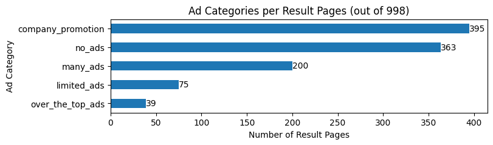
    


```python
column = "Reclame"
n = 5

value_counts: dict = {}


for rank in range(1, 11):
    _results = results_sources.loc[results_sources["Ranking"] <= rank]
    value_counts[rank] = (
        _results[column]
        .str.split(",")
        .explode()
        .str.strip()
        .value_counts(normalize=True)[categories]
        * 100
    )

pd.DataFrame.from_dict(value_counts, orient="index").fillna(
    method="bfill"
).sort_index().plot(
    title="Ad Levels Percentage by Results Rank (cumulative)",
    xlabel="Result Rank",
    ylabel="Percentage (Cumulative)",
    xticks=range(1, 11),
    yticks=range(0, 61, 10),
    legend=True,
    figsize=(8, 3),
).grid(axis="y")
plt.legend(loc="upper right", ncols=2)
```

    /var/folders/d8/j5_fyf8941j_492zvf8948y40000gn/T/ipykernel_54882/2601677357.py:18: FutureWarning: DataFrame.fillna with 'method' is deprecated and will raise in a future version. Use obj.ffill() or obj.bfill() instead.
      pd.DataFrame.from_dict(value_counts, orient="index").fillna(


    <matplotlib.legend.Legend at 0x16c642bd0>


    

    


```python
column = "Reclame"
n = 5

ax = (
    results_sources.loc[results_sources["Ranking"] <= n][column]
    .str.split(",")
    .explode()
    .str.strip()
    .value_counts(ascending=True)
    .plot(
        kind="barh",
        title=f"{column} per First {n} Result Pages",
        xlabel="Number of Result Pages",
        ylabel=column,
        figsize=(8, 10),
    )
)
ax.bar_label(ax.containers[0])
```


    [Text(0, 0, '1'),
     Text(0, 0, '9'),
     Text(0, 0, '13'),
     Text(0, 0, '13'),
     Text(0, 0, '32'),
     Text(0, 0, '113'),
     Text(0, 0, '169'),
     Text(0, 0, '201')]


    

    


```python
column = "Reclame"
n = 1

ax = (
    results_sources.loc[results_sources["Ranking"] <= n][column]
    .str.split(",")
    .explode()
    .str.strip()
    .value_counts(ascending=True)
    .plot(
        kind="barh",
        title=f"{column} per First {n} Result Pages",
        xlabel="Number of Result Pages",
        ylabel=column,
        figsize=(8, 10),
    )
)
ax.bar_label(ax.containers[0])
```


    [Text(0, 0, '1'),
     Text(0, 0, '1'),
     Text(0, 0, '1'),
     Text(0, 0, '1'),
     Text(0, 0, '6'),
     Text(0, 0, '15'),
     Text(0, 0, '22'),
     Text(0, 0, '59')]


    

    


```python
counts: dict[int, float] = {}
category = "no_ads"

for n in range(1, 11):
    _results = results_sources.loc[results_sources["Ranking"] <= n]
    counts[n] = (
        _results[column]
        .str.split(",")
        .explode()
        .str.strip()
        .value_counts(normalize=True)[category]
        * 100
    )

pd.DataFrame(counts.items(), columns=["Ranking", category]).set_index("Ranking").plot(
    title=f"'{column}' = '{category}': Percentage by Top N Results",
    xlabel="Minimum Result Rank (N)",
    ylabel=f"Percentage of '{column}' = '{category}'",
    xticks=range(1, 11),
    yticks=range(0, 70, 5),
    legend=False,
).grid(axis="y")
```


    

    


## Sources

### Commerciality


```python
ax = (
    sources["Commercialiteit"]
    .str.split(",")
    .explode()
    .str.strip()
    .value_counts(ascending=True)
    .plot(
        kind="barh",
        title=f"Commerciality per Source (out of {len(sources)})",
        xlabel="Number of Sources",
        ylabel="Commerciality",
    )
)
ax.bar_label(ax.containers[0])
```


    [Text(0, 0, '17'), Text(0, 0, '197'), Text(0, 0, '328')]


    
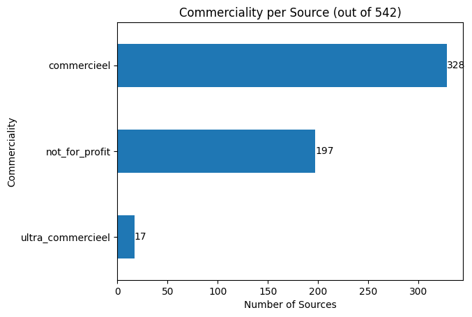
    


### Sectors


```python
ax = (
    sources["Sector"]
    .value_counts(ascending=True)
    .plot(
        kind="barh",
        title=f"Sector per Source (out of {len(sources)})",
        xlabel="Number of Sources",
        ylabel="Sector",
        figsize=(8, 10),
    )
)
ax.bar_label(ax.containers[0])
```


    [Text(0, 0, '1'),
     Text(0, 0, '1'),
     Text(0, 0, '1'),
     Text(0, 0, '1'),
     Text(0, 0, '2'),
     Text(0, 0, '2'),
     Text(0, 0, '3'),
     Text(0, 0, '4'),
     Text(0, 0, '4'),
     Text(0, 0, '4'),
     Text(0, 0, '5'),
     Text(0, 0, '5'),
     Text(0, 0, '5'),
     Text(0, 0, '6'),
     Text(0, 0, '7'),
     Text(0, 0, '7'),
     Text(0, 0, '8'),
     Text(0, 0, '9'),
     Text(0, 0, '10'),
     Text(0, 0, '13'),
     Text(0, 0, '15'),
     Text(0, 0, '15'),
     Text(0, 0, '16'),
     Text(0, 0, '19'),
     Text(0, 0, '21'),
     Text(0, 0, '23'),
     Text(0, 0, '32'),
     Text(0, 0, '35'),
     Text(0, 0, '57'),
     Text(0, 0, '67'),
     Text(0, 0, '144')]


    

    


### Free Labels


```python
ax = (
    sources["Vrije labels bron/onderwerp"]
    .str.split(",")
    .explode()
    .str.strip()
    .value_counts(ascending=True)
    .plot(
        kind="barh",
        title=f"Label Frequencies in Sources (out of {len(sources)}; multiple labels allowed)",
        xlabel="Number of Sources",
        ylabel="Label",
        figsize=(8, 10),
    )
)
ax.bar_label(ax.containers[0])
```


    [Text(0, 0, '1'),
     Text(0, 0, '1'),
     Text(0, 0, '1'),
     Text(0, 0, '1'),
     Text(0, 0, '1'),
     Text(0, 0, '1'),
     Text(0, 0, '1'),
     Text(0, 0, '2'),
     Text(0, 0, '2'),
     Text(0, 0, '2'),
     Text(0, 0, '2'),
     Text(0, 0, '3'),
     Text(0, 0, '3'),
     Text(0, 0, '3'),
     Text(0, 0, '3'),
     Text(0, 0, '3'),
     Text(0, 0, '3'),
     Text(0, 0, '4'),
     Text(0, 0, '4'),
     Text(0, 0, '4'),
     Text(0, 0, '5'),
     Text(0, 0, '7'),
     Text(0, 0, '7'),
     Text(0, 0, '8'),
     Text(0, 0, '8'),
     Text(0, 0, '9'),
     Text(0, 0, '9'),
     Text(0, 0, '10'),
     Text(0, 0, '10'),
     Text(0, 0, '10'),
     Text(0, 0, '11'),
     Text(0, 0, '12'),
     Text(0, 0, '13'),
     Text(0, 0, '13'),
     Text(0, 0, '13'),
     Text(0, 0, '13'),
     Text(0, 0, '15'),
     Text(0, 0, '15'),
     Text(0, 0, '16'),
     Text(0, 0, '17'),
     Text(0, 0, '17'),
     Text(0, 0, '17'),
     Text(0, 0, '17'),
     Text(0, 0, '19'),
     Text(0, 0, '20'),
     Text(0, 0, '23'),
     Text(0, 0, '25'),
     Text(0, 0, '26'),
     Text(0, 0, '26'),
     Text(0, 0, '29'),
     Text(0, 0, '29'),
     Text(0, 0, '40'),
     Text(0, 0, '41'),
     Text(0, 0, '45'),
     Text(0, 0, '47'),
     Text(0, 0, '54'),
     Text(0, 0, '100'),
     Text(0, 0, '106'),
     Text(0, 0, '118'),
     Text(0, 0, '137'),
     Text(0, 0, '179')]


    

    


### Trackers


```python
sources["uBlocked trackers"].plot(
    kind="hist",
    histtype="step",
    bins=range(0, 90),
    title=f"Number of Blocked Trackers per Source (out of {len(sources)})",
    ylabel="Number of Blocked Trackers",
    xlabel="Number of Sources",
)
```


    <Axes: title={'center': 'Number of Blocked Trackers per Source (out of 542)'}, xlabel='Number of Sources', ylabel='Number of Blocked Trackers'>


    

    


```python
ax = (sources["uBlocked trackers"].value_counts(normalize=True) * 100).plot(
    kind="hist",
    xlabel="Number of Blocked Trackers",
    ylabel="Sources (%)",
    title=f"Number of Blocked Trackers per Source (Percentage out of {len(sources)})",
    xticks=range(1, 16),
    bins=15,
)
ax.bar_label(ax.containers[0])
```


    [Text(0, 0, '17'),
     Text(0, 0, '2'),
     Text(0, 0, '6'),
     Text(0, 0, '2'),
     Text(0, 0, '1'),
     Text(0, 0, '1'),
     Text(0, 0, '1'),
     Text(0, 0, '1'),
     Text(0, 0, '0'),
     Text(0, 0, '0'),
     Text(0, 0, '0'),
     Text(0, 0, '1'),
     Text(0, 0, '1'),
     Text(0, 0, '0'),
     Text(0, 0, '1')]


    
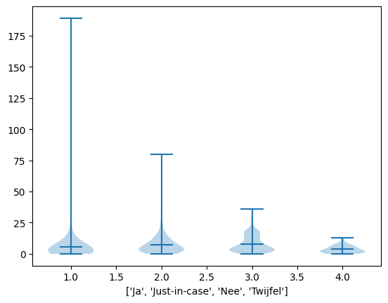
    


```python
thumps_up_vs_trackers = {
    name: group.values.tolist()
    for name, group in sources.groupby("Thumbs up 8-14?")["uBlocked trackers"]
}
list(thumps_up_vs_trackers.values())


plt.violinplot(
    list(thumps_up_vs_trackers.values()),
    showmeans=True,
    # tick_labels=thumps_up_vs_trackers.keys(),
)
plt.xlabel(list(thumps_up_vs_trackers.keys()))
```


    Text(0.5, 0, "['Ja', 'Just-in-case', 'Nee', 'Twijfel']")


    

    


### Ads


```python
ax = (
    sources["Reclame"]
    .str.split(",")
    .explode()
    .str.strip()
    .value_counts()
    .sort_index()
    .plot(
        kind="barh",
        title=f"Ad Categories per Source (out of {len(sources)})",
        xlabel="Count",
        ylabel="Ad Type",
    )
)
ax.bar_label(ax.containers[0])
```


    [Text(0, 0, '18'),
     Text(0, 0, '293'),
     Text(0, 0, '42'),
     Text(0, 0, '58'),
     Text(0, 0, '167'),
     Text(0, 0, '7'),
     Text(0, 0, '20'),
     Text(0, 0, '6')]


    

    


### Goal of Source


```python
ax = (
    sources["Conclusie over doel vd bron"]
    .str.split(",")
    .explode()
    .str.strip()
    .value_counts(ascending=True)
    .plot(
        kind="barh",
        title=f"Conclusions about the Purpose of the Source (out of {len(sources)})",
        xlabel="Count",
        ylabel="Conclusion",
        figsize=(8, 10),
    )
)
ax.bar_label(ax.containers[0])
```


    [Text(0, 0, '1'),
     Text(0, 0, '1'),
     Text(0, 0, '2'),
     Text(0, 0, '3'),
     Text(0, 0, '3'),
     Text(0, 0, '3'),
     Text(0, 0, '3'),
     Text(0, 0, '4'),
     Text(0, 0, '4'),
     Text(0, 0, '6'),
     Text(0, 0, '7'),
     Text(0, 0, '8'),
     Text(0, 0, '8'),
     Text(0, 0, '8'),
     Text(0, 0, '9'),
     Text(0, 0, '9'),
     Text(0, 0, '11'),
     Text(0, 0, '12'),
     Text(0, 0, '12'),
     Text(0, 0, '13'),
     Text(0, 0, '13'),
     Text(0, 0, '14'),
     Text(0, 0, '14'),
     Text(0, 0, '14'),
     Text(0, 0, '15'),
     Text(0, 0, '15'),
     Text(0, 0, '18'),
     Text(0, 0, '25'),
     Text(0, 0, '42'),
     Text(0, 0, '54'),
     Text(0, 0, '56'),
     Text(0, 0, '64'),
     Text(0, 0, '82'),
     Text(0, 0, '94')]


    

    


### Source: Thumbs-Up


```python
ax = (
    sources["Thumbs up 8-14?"]
    .value_counts(ascending=True)
    .plot(
        kind="barh",
        title=f"Thumbs Up for 8-14 years old? (out of {len(sources)})",
        xlabel="Number of Sources",
        ylabel="Thumbs Up",
    )
)
ax.bar_label(ax.containers[0])
```


    [Text(0, 0, '19'), Text(0, 0, '166'), Text(0, 0, '175'), Text(0, 0, '182')]


    

    


### About Page


```python
ax = (
    sources["Kwaliteit_about"]
    .value_counts(ascending=True)
    .plot(
        kind="barh",
        title=f"Quality of About Page per Source (out of {len(sources)})",
        xlabel="Number of Sources",
        ylabel="Quality of About Page",
    )
)
ax.bar_label(ax.containers[0])
```


    [Text(0, 0, '1'),
     Text(0, 0, '10'),
     Text(0, 0, '14'),
     Text(0, 0, '38'),
     Text(0, 0, '62'),
     Text(0, 0, '204'),
     Text(0, 0, '213')]


    

    


### Doelgroep vs. Thumbs-Up


```python
doelgroep_po = sources.loc[
    (sources["Vrije labels bron/onderwerp"].notna())
    & (sources["Vrije labels bron/onderwerp"].str.contains("doelgroep PO/8-12"))
]
doelgroep_po
```


<div>
<style scoped>
    .dataframe tbody tr th:only-of-type {
        vertical-align: middle;
    }

    .dataframe tbody tr th {
        vertical-align: top;
    }

    .dataframe thead th {
        text-align: right;
    }
</style>
<table border="1" class="dataframe">
  <thead>
    <tr style="text-align: right;">
      <th></th>
      <th>URL Domein</th>
      <th>Conclusie over doel vd bron</th>
      <th>Thumbs up 8-14?</th>
      <th>Sector</th>
      <th>Reclame</th>
      <th>Vrije labels bron/onderwerp</th>
      <th>uBlocked trackers</th>
      <th>Commercialiteit</th>
      <th>Onderwerpen</th>
      <th>Div Labels NGO</th>
      <th>...</th>
      <th>Created time</th>
      <th>Created by</th>
      <th>URL Moederbedrijf</th>
      <th>SlimZ Resultaten DB</th>
      <th>Resultaten: toegankelijkheid</th>
      <th>Cookie info page</th>
      <th>More examples</th>
      <th>Related to Resultaten DB 01 (1) (Bronnen DB)</th>
      <th>Res: Ranking</th>
      <th>Res: soort result</th>
    </tr>
    <tr>
      <th>Name</th>
      <th></th>
      <th></th>
      <th></th>
      <th></th>
      <th></th>
      <th></th>
      <th></th>
      <th></th>
      <th></th>
      <th></th>
      <th></th>
      <th></th>
      <th></th>
      <th></th>
      <th></th>
      <th></th>
      <th></th>
      <th></th>
      <th></th>
      <th></th>
      <th></th>
    </tr>
  </thead>
  <tbody>
    <tr>
      <th>canonvannederland.nl</th>
      <td>https://www.canonvannederland.nl/</td>
      <td>kwaliteitsinfo-onderwijs (gratis)</td>
      <td>Ja</td>
      <td>Musea en archieven</td>
      <td>no_ads</td>
      <td>doelgroep PO/8-12, doelgroep VO/12+, informati...</td>
      <td>4</td>
      <td>not_for_profit</td>
      <td>geschiedenis</td>
      <td>NaN</td>
      <td>...</td>
      <td>November 3, 2023 10:10 PM</td>
      <td>Maarten Sprenger</td>
      <td>https://www.openluchtmuseum.nl/</td>
      <td>NaN</td>
      <td>NaN</td>
      <td>https://www.canonvannederland.nl/nl/privacy#co...</td>
      <td>NaN</td>
      <td>NaN</td>
      <td>10,1,3</td>
      <td>informatief,informatief,informatief</td>
    </tr>
    <tr>
      <th>dierenwiki.nl</th>
      <td>https://dierenwiki.nl/</td>
      <td>aggregator/contentfarm</td>
      <td>Nee</td>
      <td>Online-bedrijven</td>
      <td>many_ads</td>
      <td>about-voorbeeld, doelgroep PO/8-12, doelgroep ...</td>
      <td>3</td>
      <td>commercieel</td>
      <td>dieren</td>
      <td>NaN</td>
      <td>...</td>
      <td>November 4, 2023 5:08 PM</td>
      <td>Maarten Sprenger</td>
      <td>NaN</td>
      <td>NaN</td>
      <td>NaN</td>
      <td>Footer. Beheerd door Google. Voldoet aan IAB T...</td>
      <td>NaN</td>
      <td>NaN</td>
      <td>4,5,10,5,6</td>
      <td>informatief,informatief,informatief,informatie...</td>
    </tr>
    <tr>
      <th>dierpedia.nl</th>
      <td>https://dierpedia.nl/</td>
      <td>aggregator/contentfarm, informatieproduct div....</td>
      <td>Nee</td>
      <td>Online-bedrijven</td>
      <td>limited_ads</td>
      <td>about-voorbeeld, doelgroep PO/8-12, doelgroep ...</td>
      <td>7</td>
      <td>commercieel</td>
      <td>dieren</td>
      <td>NaN</td>
      <td>...</td>
      <td>November 4, 2023 5:05 PM</td>
      <td>Maarten Sprenger</td>
      <td>https://www.heers.nl/</td>
      <td>NaN</td>
      <td>NaN</td>
      <td>NaN</td>
      <td>NaN</td>
      <td>NaN</td>
      <td>5</td>
      <td>informatief</td>
    </tr>
    <tr>
      <th>docukit.nl</th>
      <td>https://www.docukit.nl/</td>
      <td>kwaliteitsinfo voor 8-18</td>
      <td>Ja</td>
      <td>Uitgevers (educatief/literair)</td>
      <td>company_promotion</td>
      <td>bedrijfsinfo/uithangbord, doelgroep PO/8-12, i...</td>
      <td>1</td>
      <td>commercieel</td>
      <td>NaN</td>
      <td>NaN</td>
      <td>...</td>
      <td>August 25, 2023 9:31 AM</td>
      <td>Maarten Sprenger</td>
      <td>Schoolsupport</td>
      <td>NaN</td>
      <td>NaN</td>
      <td>heel onduidelijk; geen toestemming…</td>
      <td>NaN</td>
      <td>NaN</td>
      <td>9,8,5,6</td>
      <td>informatief,informatief,informatief,informatief</td>
    </tr>
    <tr>
      <th>natgeojunior.nl</th>
      <td>https://www.natgeojunior.nl</td>
      <td>kwaliteitsinfo voor 8-18</td>
      <td>Ja</td>
      <td>Uitgevers (educatief/literair)</td>
      <td>company_promotion</td>
      <td>doelgroep PO/8-12, promotioneel, webshop</td>
      <td>2</td>
      <td>commercieel</td>
      <td>NaN</td>
      <td>NaN</td>
      <td>...</td>
      <td>January 12, 2024 6:38 PM</td>
      <td>Maarten Sprenger</td>
      <td>https://www.blinkshop.nl/national-geographic-j...</td>
      <td>NaN</td>
      <td>NaN</td>
      <td>https://blink.nl/privacy/privacyverklaring-per...</td>
      <td>https://www.blinkshop.nl/national-geographic-j...</td>
      <td>NaN</td>
      <td>2</td>
      <td>informatief</td>
    </tr>
    <tr>
      <th>rangerclub.be</th>
      <td>https://rangerclub.be</td>
      <td>kwaliteitsinfo voor 8-18</td>
      <td>Ja</td>
      <td>Uitgevers (educatief/literair)</td>
      <td>company_promotion</td>
      <td>doelgroep PO/8-12, promotioneel</td>
      <td>5</td>
      <td>not_for_profit</td>
      <td>dieren, natuur</td>
      <td>NaN</td>
      <td>...</td>
      <td>January 13, 2024 11:56 AM</td>
      <td>Maarten Sprenger</td>
      <td>https://wwf.be/nl</td>
      <td>NaN</td>
      <td>NaN</td>
      <td>NaN</td>
      <td>NaN</td>
      <td>NaN</td>
      <td>7</td>
      <td>informatief</td>
    </tr>
    <tr>
      <th>rangers.wwf.nl</th>
      <td>https://rangers.wwf.nl/</td>
      <td>informatie in het kader van goed doel, kwalite...</td>
      <td>Ja</td>
      <td>NGO/Goede doelen site</td>
      <td>company_promotion</td>
      <td>(product)informatie ihkv verkoop/bezoek, doelg...</td>
      <td>3</td>
      <td>not_for_profit</td>
      <td>dieren, natuur</td>
      <td>ANBI, CBF</td>
      <td>...</td>
      <td>January 13, 2024 3:40 PM</td>
      <td>Maarten Sprenger</td>
      <td>WWF</td>
      <td>NaN</td>
      <td>NaN</td>
      <td>cookie consent alleen vanuit start/footer by C...</td>
      <td>NaN</td>
      <td>NaN</td>
      <td>2</td>
      <td>informatief</td>
    </tr>
    <tr>
      <th>schoolsupport.nl</th>
      <td>https://schoolsupport.nl</td>
      <td>kwaliteitsinfo voor 8-18</td>
      <td>Ja</td>
      <td>Uitgevers (educatief/literair)</td>
      <td>company_promotion</td>
      <td>bedrijfsinfo/uithangbord, doelgroep PO/8-12, k...</td>
      <td>3</td>
      <td>commercieel</td>
      <td>NaN</td>
      <td>NaN</td>
      <td>...</td>
      <td>January 2, 2024 4:34 PM</td>
      <td>Maarten Sprenger</td>
      <td>NaN</td>
      <td>NaN</td>
      <td>NaN</td>
      <td>NaN</td>
      <td>NaN</td>
      <td>NaN</td>
      <td>9</td>
      <td>transactional</td>
    </tr>
    <tr>
      <th>schooltv.nl</th>
      <td>https://schooltv.nl/</td>
      <td>kwaliteitsinfo voor 8-18, publiek_mediaplatfor...</td>
      <td>Ja</td>
      <td>Publieke_omroep</td>
      <td>no_ads</td>
      <td>doelgroep PO/8-12, doelgroep VO/12+, edutainme...</td>
      <td>12</td>
      <td>not_for_profit</td>
      <td>NaN</td>
      <td>NaN</td>
      <td>...</td>
      <td>November 6, 2023 10:21 AM</td>
      <td>Maarten Sprenger</td>
      <td>https://ntr.nl/site/tekst/over-ntr/8</td>
      <td>NaN</td>
      <td>NaN</td>
      <td>NaN</td>
      <td>NaN</td>
      <td>NaN</td>
      <td>5,2,4</td>
      <td>informatief,informatief,informatief</td>
    </tr>
    <tr>
      <th>superspreekbeurt.nl</th>
      <td>https://superspreekbeurt.nl</td>
      <td>aggregator/contentfarm</td>
      <td>Nee</td>
      <td>Online-bedrijven</td>
      <td>over_the_top_ads</td>
      <td>doelgroep PO/8-12, link/reclamevehikel, oud/ve...</td>
      <td>8</td>
      <td>commercieel</td>
      <td>NaN</td>
      <td>NaN</td>
      <td>...</td>
      <td>January 15, 2024 11:52 AM</td>
      <td>Maarten Sprenger</td>
      <td>NaN</td>
      <td>NaN</td>
      <td>NaN</td>
      <td>NaN</td>
      <td>NaN</td>
      <td>NaN</td>
      <td>6</td>
      <td>informatief</td>
    </tr>
    <tr>
      <th>taal-oefenen.nl</th>
      <td>https://www.taal-oefenen.nl</td>
      <td>kwaliteitsinfo-onderwijs (gratis), onderwijsco...</td>
      <td>Ja</td>
      <td>Uitgevers (educatief/literair)</td>
      <td>company_promotion</td>
      <td>doelgroep PO/8-12, informatie_primair_doel, lo...</td>
      <td>3</td>
      <td>commercieel</td>
      <td>NaN</td>
      <td>NaN</td>
      <td>...</td>
      <td>December 14, 2023 7:13 PM</td>
      <td>Maarten Sprenger</td>
      <td>https://www.junioreinstein.nl/</td>
      <td>NaN</td>
      <td>NaN</td>
      <td>https://www.taal-oefenen.nl/webshop/about/cookies</td>
      <td>NaN</td>
      <td>NaN</td>
      <td>2</td>
      <td>informatief</td>
    </tr>
    <tr>
      <th>weetwatjeviert.nl</th>
      <td>https://weetwatjeviert.nl/</td>
      <td>kennisbank/centrum +, kwaliteitsinfo voor 8-18</td>
      <td>Ja</td>
      <td>Musea en archieven</td>
      <td>no_ads</td>
      <td>doelgroep PO/8-12, informatie_primair_doel, sa...</td>
      <td>1</td>
      <td>not_for_profit</td>
      <td>NaN</td>
      <td>NaN</td>
      <td>...</td>
      <td>January 13, 2024 12:42 PM</td>
      <td>Maarten Sprenger</td>
      <td>NaN</td>
      <td>NaN</td>
      <td>NaN</td>
      <td>NaN</td>
      <td>NaN</td>
      <td>NaN</td>
      <td>5</td>
      <td>informatief</td>
    </tr>
    <tr>
      <th>wikikids.nl</th>
      <td>https://wikikids.nl/</td>
      <td>gebruikersplatform geen kwaliteitsgarantie non...</td>
      <td>Nee</td>
      <td>Amateur/vrijwilligersverenigingen</td>
      <td>no_ads</td>
      <td>community, doelgroep PO/8-12, informatie_prima...</td>
      <td>4</td>
      <td>not_for_profit</td>
      <td>NaN</td>
      <td>NaN</td>
      <td>...</td>
      <td>August 24, 2023 2:05 PM</td>
      <td>Maarten Sprenger</td>
      <td>NaN</td>
      <td>NaN</td>
      <td>NaN</td>
      <td>NaN</td>
      <td>NaN</td>
      <td>NaN</td>
      <td>4,2,7,3,7,3,4,2,7,6,5,5,6,11,3,6,7,6,8,9,7,8,7,4</td>
      <td>informatief,informatief,informatief,navigation...</td>
    </tr>
    <tr>
      <th>wildvanfreek.nl</th>
      <td>https://www.wildvanfreek.nl</td>
      <td>kwaliteitsinfo voor 8-18</td>
      <td>Ja</td>
      <td>Uitgevers (educatief/literair)</td>
      <td>company_promotion</td>
      <td>doelgroep PO/8-12, webshop</td>
      <td>5</td>
      <td>commercieel</td>
      <td>dieren</td>
      <td>NaN</td>
      <td>...</td>
      <td>January 2, 2024 3:00 PM</td>
      <td>Maarten Sprenger</td>
      <td>https://blink.nl/</td>
      <td>NaN</td>
      <td>NaN</td>
      <td>https://www.wildvanfreek.nl/privacy-en-cookieb...</td>
      <td>NaN</td>
      <td>NaN</td>
      <td>4,9</td>
      <td>informatief,informatief</td>
    </tr>
    <tr>
      <th>willemwever.kro-ncrv.nl</th>
      <td>https://willemwever.kro-ncrv.nl/</td>
      <td>kwaliteitsinfo voor 8-18, publiek_mediaplatfor...</td>
      <td>Ja</td>
      <td>Publieke_omroep</td>
      <td>no_ads</td>
      <td>doelgroep PO/8-12, edutainment, infinite_scrol...</td>
      <td>4</td>
      <td>not_for_profit</td>
      <td>NaN</td>
      <td>NaN</td>
      <td>...</td>
      <td>November 6, 2023 10:21 AM</td>
      <td>Maarten Sprenger</td>
      <td>https://kro-ncrv.nl/</td>
      <td>NaN</td>
      <td>NaN</td>
      <td>NaN</td>
      <td>NaN</td>
      <td>NaN</td>
      <td>4,6</td>
      <td>informatief,informatief</td>
    </tr>
    <tr>
      <th>youtube.com/@VarkentjeRundje</th>
      <td>https://www.youtube.com/@VarkentjeRundje/</td>
      <td>entertainment</td>
      <td>Just-in-case</td>
      <td>Publieke_omroep</td>
      <td>limited_ads</td>
      <td>BigTech, doelgroep PO/8-12, entertainment, inf...</td>
      <td>25</td>
      <td>commercieel</td>
      <td>NaN</td>
      <td>NaN</td>
      <td>...</td>
      <td>February 26, 2024 2:58 PM</td>
      <td>Maarten Sprenger</td>
      <td>https://www.rundshop.nl/</td>
      <td>NaN</td>
      <td>NaN</td>
      <td>https://policies.google.com/technologies/cooki...</td>
      <td>NaN</td>
      <td>NaN</td>
      <td>1,2,3,6,7,8,9,10</td>
      <td>informatief,informatief,informatief,informatie...</td>
    </tr>
  </tbody>
</table>
<p>16 rows × 31 columns</p>
</div>


```python
doelgroep_vo = sources.loc[
    (sources["Vrije labels bron/onderwerp"].notna())
    & (sources["Vrije labels bron/onderwerp"].str.contains("doelgroep VO/12+"))
]
doelgroep_vo
```


<div>
<style scoped>
    .dataframe tbody tr th:only-of-type {
        vertical-align: middle;
    }

    .dataframe tbody tr th {
        vertical-align: top;
    }

    .dataframe thead th {
        text-align: right;
    }
</style>
<table border="1" class="dataframe">
  <thead>
    <tr style="text-align: right;">
      <th></th>
      <th>URL Domein</th>
      <th>Conclusie over doel vd bron</th>
      <th>Thumbs up 8-14?</th>
      <th>Sector</th>
      <th>Reclame</th>
      <th>Vrije labels bron/onderwerp</th>
      <th>uBlocked trackers</th>
      <th>Commercialiteit</th>
      <th>Onderwerpen</th>
      <th>Div Labels NGO</th>
      <th>...</th>
      <th>Created time</th>
      <th>Created by</th>
      <th>URL Moederbedrijf</th>
      <th>SlimZ Resultaten DB</th>
      <th>Resultaten: toegankelijkheid</th>
      <th>Cookie info page</th>
      <th>More examples</th>
      <th>Related to Resultaten DB 01 (1) (Bronnen DB)</th>
      <th>Res: Ranking</th>
      <th>Res: soort result</th>
    </tr>
    <tr>
      <th>Name</th>
      <th></th>
      <th></th>
      <th></th>
      <th></th>
      <th></th>
      <th></th>
      <th></th>
      <th></th>
      <th></th>
      <th></th>
      <th></th>
      <th></th>
      <th></th>
      <th></th>
      <th></th>
      <th></th>
      <th></th>
      <th></th>
      <th></th>
      <th></th>
      <th></th>
    </tr>
  </thead>
  <tbody>
    <tr>
      <th>aljevragen.nl</th>
      <td>https://www.aljevragen.nl</td>
      <td>informatieproduct div. commercieel</td>
      <td>Just-in-case</td>
      <td>Leraren/Docenten</td>
      <td>limited_ads</td>
      <td>doelgroep VO/12+, onderwijscontent</td>
      <td>7</td>
      <td>commercieel</td>
      <td>NaN</td>
      <td>NaN</td>
      <td>...</td>
      <td>November 4, 2023 3:28 PM</td>
      <td>Maarten Sprenger</td>
      <td>NaN</td>
      <td>NaN</td>
      <td>NaN</td>
      <td>NaN</td>
      <td>NaN</td>
      <td>NaN</td>
      <td>10</td>
      <td>informatief</td>
    </tr>
    <tr>
      <th>allesoverseks.be</th>
      <td>https://www.allesoverseks.be/</td>
      <td>kwaliteitsinfo voor 8-18, overheidsinformatie ...</td>
      <td>Ja</td>
      <td>Overheid (of i.o.v.)</td>
      <td>no_ads</td>
      <td>doelgroep VO/12+, informatie_primair_doel, ove...</td>
      <td>3</td>
      <td>not_for_profit</td>
      <td>lichaam</td>
      <td>NaN</td>
      <td>...</td>
      <td>January 7, 2024 4:48 PM</td>
      <td>Maarten Sprenger</td>
      <td>https://www.sensoa.be/</td>
      <td>NaN</td>
      <td>NaN</td>
      <td>https://www.allesoverseks.be/cookie-en-privacy...</td>
      <td>NaN</td>
      <td>NaN</td>
      <td>5,6,3,4</td>
      <td>informatief,informatief,informatief,informatief</td>
    </tr>
    <tr>
      <th>biologielessen.nl</th>
      <td>https://biologielessen.nl/</td>
      <td>kwaliteitsinfo-onderwijs (gratis)</td>
      <td>Ja</td>
      <td>Leraren/Docenten</td>
      <td>no_ads</td>
      <td>doelgroep VO/12+, informatie_primair_doel, ken...</td>
      <td>1</td>
      <td>not_for_profit</td>
      <td>lichaam</td>
      <td>NaN</td>
      <td>...</td>
      <td>November 6, 2023 10:22 AM</td>
      <td>Maarten Sprenger</td>
      <td>ism Noordhoff Uitgevers</td>
      <td>NaN</td>
      <td>NaN</td>
      <td>NaN</td>
      <td>NaN</td>
      <td>NaN</td>
      <td>6,8,9,4,5</td>
      <td>informatief,informatief,informatief,informatie...</td>
    </tr>
    <tr>
      <th>canonvannederland.nl</th>
      <td>https://www.canonvannederland.nl/</td>
      <td>kwaliteitsinfo-onderwijs (gratis)</td>
      <td>Ja</td>
      <td>Musea en archieven</td>
      <td>no_ads</td>
      <td>doelgroep PO/8-12, doelgroep VO/12+, informati...</td>
      <td>4</td>
      <td>not_for_profit</td>
      <td>geschiedenis</td>
      <td>NaN</td>
      <td>...</td>
      <td>November 3, 2023 10:10 PM</td>
      <td>Maarten Sprenger</td>
      <td>https://www.openluchtmuseum.nl/</td>
      <td>NaN</td>
      <td>NaN</td>
      <td>https://www.canonvannederland.nl/nl/privacy#co...</td>
      <td>NaN</td>
      <td>NaN</td>
      <td>10,1,3</td>
      <td>informatief,informatief,informatief</td>
    </tr>
    <tr>
      <th>cyberpoli.nl</th>
      <td>https://www.cyberpoli.nl/</td>
      <td>kwaliteitsinfo voor 8-18</td>
      <td>Ja</td>
      <td>Onafhankelijk Kennis- en adviescentrum</td>
      <td>no_ads</td>
      <td>about-voorbeeld, doelgroep VO/12+, kennisbank/...</td>
      <td>4</td>
      <td>not_for_profit</td>
      <td>gezondheid, lichaam</td>
      <td>ANBI, CBF</td>
      <td>...</td>
      <td>November 6, 2023 10:03 AM</td>
      <td>Maarten Sprenger</td>
      <td>NaN</td>
      <td>NaN</td>
      <td>NaN</td>
      <td>https://www.cyberpoli.nl/info/cookies</td>
      <td>https://www.cyberpoli.nl/info/spelregels</td>
      <td>NaN</td>
      <td>2</td>
      <td>informatief</td>
    </tr>
    <tr>
      <th>dierenwiki.nl</th>
      <td>https://dierenwiki.nl/</td>
      <td>aggregator/contentfarm</td>
      <td>Nee</td>
      <td>Online-bedrijven</td>
      <td>many_ads</td>
      <td>about-voorbeeld, doelgroep PO/8-12, doelgroep ...</td>
      <td>3</td>
      <td>commercieel</td>
      <td>dieren</td>
      <td>NaN</td>
      <td>...</td>
      <td>November 4, 2023 5:08 PM</td>
      <td>Maarten Sprenger</td>
      <td>NaN</td>
      <td>NaN</td>
      <td>NaN</td>
      <td>Footer. Beheerd door Google. Voldoet aan IAB T...</td>
      <td>NaN</td>
      <td>NaN</td>
      <td>4,5,10,5,6</td>
      <td>informatief,informatief,informatief,informatie...</td>
    </tr>
    <tr>
      <th>dierpedia.nl</th>
      <td>https://dierpedia.nl/</td>
      <td>aggregator/contentfarm, informatieproduct div....</td>
      <td>Nee</td>
      <td>Online-bedrijven</td>
      <td>limited_ads</td>
      <td>about-voorbeeld, doelgroep PO/8-12, doelgroep ...</td>
      <td>7</td>
      <td>commercieel</td>
      <td>dieren</td>
      <td>NaN</td>
      <td>...</td>
      <td>November 4, 2023 5:05 PM</td>
      <td>Maarten Sprenger</td>
      <td>https://www.heers.nl/</td>
      <td>NaN</td>
      <td>NaN</td>
      <td>NaN</td>
      <td>NaN</td>
      <td>NaN</td>
      <td>5</td>
      <td>informatief</td>
    </tr>
    <tr>
      <th>examenoverzicht.nl</th>
      <td>https://www.examenoverzicht.nl/</td>
      <td>onderwijscontent (betaald)</td>
      <td>Just-in-case</td>
      <td>Online-bedrijven</td>
      <td>company_promotion</td>
      <td>bedrijfsinfo/uithangbord, doelgroep VO/12+, pr...</td>
      <td>3</td>
      <td>commercieel</td>
      <td>NaN</td>
      <td>NaN</td>
      <td>...</td>
      <td>December 14, 2023 2:25 PM</td>
      <td>Maarten Sprenger</td>
      <td>NaN</td>
      <td>NaN</td>
      <td>NaN</td>
      <td>NaN</td>
      <td>NaN</td>
      <td>NaN</td>
      <td>5</td>
      <td>informatief</td>
    </tr>
    <tr>
      <th>jouwggd.nl</th>
      <td>https://www.jouwggd.nl/</td>
      <td>kwaliteitsinfo-gezondheidsorganisaties</td>
      <td>Ja</td>
      <td>Federatieve instelling/unie</td>
      <td>no_ads</td>
      <td>doelgroep VO/12+, informatie_primair_doel, ken...</td>
      <td>1</td>
      <td>not_for_profit</td>
      <td>gezondheid, lichaam</td>
      <td>NaN</td>
      <td>...</td>
      <td>January 7, 2024 4:49 PM</td>
      <td>Maarten Sprenger</td>
      <td>NaN</td>
      <td>NaN</td>
      <td>NaN</td>
      <td>NaN</td>
      <td>NaN</td>
      <td>NaN</td>
      <td>4,4</td>
      <td>navigational,informatief</td>
    </tr>
    <tr>
      <th>mlochemie.nl</th>
      <td>https://www.mlochemie.nl</td>
      <td>kwaliteitsinfo-onderwijs (gratis)</td>
      <td>Ja</td>
      <td>Uitgevers (educatief/literair)</td>
      <td>no_ads</td>
      <td>doelgroep VO/12+, informatie_primair_doel, ond...</td>
      <td>1</td>
      <td>commercieel</td>
      <td>NaN</td>
      <td>NaN</td>
      <td>...</td>
      <td>November 4, 2023 3:18 PM</td>
      <td>Maarten Sprenger</td>
      <td>https://syntaxmedia.nl/</td>
      <td>NaN</td>
      <td>NaN</td>
      <td>-</td>
      <td>NaN</td>
      <td>NaN</td>
      <td>3</td>
      <td>informatief</td>
    </tr>
    <tr>
      <th>mrchadd.nl</th>
      <td>https://www.mrchadd.nl/</td>
      <td>kwaliteitsinfo-onderwijs (gratis), onderwijsco...</td>
      <td>Ja</td>
      <td>Online-bedrijven educatief</td>
      <td>company_promotion</td>
      <td>doelgroep VO/12+, informatie_primair_doel, ond...</td>
      <td>10</td>
      <td>commercieel</td>
      <td>NaN</td>
      <td>NaN</td>
      <td>...</td>
      <td>November 4, 2023 3:23 PM</td>
      <td>Maarten Sprenger</td>
      <td>NaN</td>
      <td>NaN</td>
      <td>NaN</td>
      <td>NaN</td>
      <td>NaN</td>
      <td>NaN</td>
      <td>7,5</td>
      <td>informatief,informatief</td>
    </tr>
    <tr>
      <th>schooltv.nl</th>
      <td>https://schooltv.nl/</td>
      <td>kwaliteitsinfo voor 8-18, publiek_mediaplatfor...</td>
      <td>Ja</td>
      <td>Publieke_omroep</td>
      <td>no_ads</td>
      <td>doelgroep PO/8-12, doelgroep VO/12+, edutainme...</td>
      <td>12</td>
      <td>not_for_profit</td>
      <td>NaN</td>
      <td>NaN</td>
      <td>...</td>
      <td>November 6, 2023 10:21 AM</td>
      <td>Maarten Sprenger</td>
      <td>https://ntr.nl/site/tekst/over-ntr/8</td>
      <td>NaN</td>
      <td>NaN</td>
      <td>NaN</td>
      <td>NaN</td>
      <td>NaN</td>
      <td>5,2,4</td>
      <td>informatief,informatief,informatief</td>
    </tr>
    <tr>
      <th>seksualiteit.nl</th>
      <td>https://seksualiteit.nl</td>
      <td>informatie in het kader van goed doel, kennisb...</td>
      <td>Ja</td>
      <td>Onafhankelijk Kennis- en adviescentrum</td>
      <td>no_ads</td>
      <td>doelgroep VO/12+, kennisbank/centrum, vakinfor...</td>
      <td>1</td>
      <td>not_for_profit</td>
      <td>lichaam</td>
      <td>NaN</td>
      <td>...</td>
      <td>January 7, 2024 4:44 PM</td>
      <td>Maarten Sprenger</td>
      <td>https://rutgers.nl/</td>
      <td>NaN</td>
      <td>NaN</td>
      <td>https://seksualiteit.nl/disclaimer-privacyverk...</td>
      <td>NaN</td>
      <td>NaN</td>
      <td>10,6</td>
      <td>informatief,navigational</td>
    </tr>
    <tr>
      <th>sense.info</th>
      <td>https://sense.info</td>
      <td>kwaliteitsinfo voor 8-18</td>
      <td>Ja</td>
      <td>Overheid (of i.o.v.)</td>
      <td>no_ads</td>
      <td>doelgroep VO/12+, samenwerkingsproject, voorli...</td>
      <td>5</td>
      <td>not_for_profit</td>
      <td>lichaam</td>
      <td>NaN</td>
      <td>...</td>
      <td>January 7, 2024 4:49 PM</td>
      <td>Maarten Sprenger</td>
      <td>NaN</td>
      <td>NaN</td>
      <td>NaN</td>
      <td>NaN</td>
      <td>NaN</td>
      <td>NaN</td>
      <td>1,2,8</td>
      <td>navigational,navigational,informatief</td>
    </tr>
    <tr>
      <th>surinamewebquest.nl</th>
      <td>http://www.surinamewebquest.nl/</td>
      <td>kwaliteitsinfo-onderwijs (gratis)</td>
      <td>Ja</td>
      <td>Leraren/Docenten</td>
      <td>no_ads</td>
      <td>doelgroep VO/12+, informatie_primair_doel</td>
      <td>0</td>
      <td>not_for_profit</td>
      <td>NaN</td>
      <td>NaN</td>
      <td>...</td>
      <td>December 15, 2023 10:38 AM</td>
      <td>Maarten Sprenger</td>
      <td>NaN</td>
      <td>NaN</td>
      <td>NaN</td>
      <td>-</td>
      <td>NaN</td>
      <td>NaN</td>
      <td>8</td>
      <td>informatief</td>
    </tr>
    <tr>
      <th>wetenschapsschool.nl</th>
      <td>https://www.wetenschapsschool.nl/</td>
      <td>kwaliteitsinfo-onderwijs (gratis), onderwijsco...</td>
      <td>Ja</td>
      <td>Leraren/Docenten</td>
      <td>no_ads</td>
      <td>about-voorbeeld, doelgroep VO/12+, informatie_...</td>
      <td>11</td>
      <td>commercieel</td>
      <td>NaN</td>
      <td>NaN</td>
      <td>...</td>
      <td>November 4, 2023 3:22 PM</td>
      <td>Maarten Sprenger</td>
      <td>NaN</td>
      <td>NaN</td>
      <td>NaN</td>
      <td>NaN</td>
      <td>https://www.wetenschapsschool.nl/new_chapters/...</td>
      <td>NaN</td>
      <td>6,9</td>
      <td>informatief,informatief</td>
    </tr>
    <tr>
      <th>youtube.com/@WouterRenkema</th>
      <td>https://www.youtube.com/@WouterRenkema</td>
      <td>kwaliteitsinfo-onderwijs (gratis)</td>
      <td>Ja</td>
      <td>Leraren/Docenten</td>
      <td>many_ads</td>
      <td>BigTech, doelgroep VO/12+, infinite_scroll, in...</td>
      <td>23</td>
      <td>commercieel</td>
      <td>NaN</td>
      <td>NaN</td>
      <td>...</td>
      <td>February 26, 2024 2:52 PM</td>
      <td>Maarten Sprenger</td>
      <td>https://scheikundehavovwo.nl</td>
      <td>NaN</td>
      <td>NaN</td>
      <td>https://policies.google.com/technologies/cooki...</td>
      <td>NaN</td>
      <td>NaN</td>
      <td>5</td>
      <td>informatief</td>
    </tr>
  </tbody>
</table>
<p>17 rows × 31 columns</p>
</div>


```python
from matplotlib_venn import venn2

venn2(
    [set(doelgroep_po.index), set(doelgroep_vo.index)],
    set_labels=["Doelgroep PO", "Doelgroep VO"],
)
```


    <matplotlib_venn._common.VennDiagram at 0x17faeee90>


    
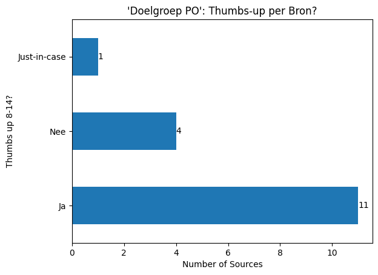
    


```python
ax = (
    doelgroep_po["Thumbs up 8-14?"]
    .value_counts()
    .plot(
        kind="barh",
        title="'Doelgroep PO': Thumbs-up per Bron?",
        xlabel="Number of Sources",
    )
)
ax.bar_label(ax.containers[0])
```


    [Text(0, 0, '11'), Text(0, 0, '4'), Text(0, 0, '1')]


    

    


```python
ax = (
    doelgroep_vo["Thumbs up 8-14?"]
    .value_counts()
    .plot(
        kind="barh",
        title="'Doelgroep VO': Thumbs-up per Bron?",
        xlabel="Number of Sources",
    )
)
ax.bar_label(ax.containers[0])
```


    [Text(0, 0, '13'), Text(0, 0, '2'), Text(0, 0, '2')]


    

    


### Top-level domains


```python
sources["tld"] = sources["URL Domein"].str.split(".").str[-1].str.split("/").str[0]
sources["tld"].value_counts()
```


    tld
    nl                                 390
    com                                 76
    be                                  40
    org                                 13
    net                                  7
    nu                                   3
    brussels                             2
    fr                                   2
    n                                    1
    gov                                  1
    122                                  1
    info                                 1
    shop                                 1
    gent                                 1
    redirect                             1
    do?ctx=46163,46173&anav=4154073      1
    html                                 1
    Name: count, dtype: int64


```python
n = 5
tlds = pd.Series(sources["tld"].value_counts()[:n])

ja_counts = pd.Series(
    [
        len(sources.loc[(sources["tld"] == tld) & (sources["Thumbs up 8-14?"] == "Ja")])
        for tld in tlds.index
    ],
    index=tlds.index,
)
ja_counts
ax = (ja_counts / tlds).plot(
    kind="barh",
    title=f"Good Sources (Thumbs-Up) per top-level domain (top {n})",
    xlabel="Proportion of positive 'Thumbs-Up'",
    legend=False,
)

bar_labels = [
    f"({int(ja_counts[tld])} / { sources['tld'].value_counts()[tld]})"
    for tld in tlds.index
]
ax.bar_label(ax.containers[0], labels=bar_labels)
```


    [Text(0, 0, '(127 / 390)'),
     Text(0, 0, '(6 / 76)'),
     Text(0, 0, '(27 / 40)'),
     Text(0, 0, '(7 / 13)'),
     Text(0, 0, '(3 / 7)')]


    

    


## Queries and Result Pages

### Ok/Good/Bad for Students


```python
column = "good_for_students"

grouped = results_sources.groupby("Query")
ax = grouped.apply(
    lambda group: group[column].sum() / len(group), include_groups=False
).plot(
    kind="hist",
    bins=10,
    title=f"'{column}' results per Query (out of {len(grouped)})",
    xlabel=f"Portion of '{column}' results",
    ylabel="Number of Queries",
    xticks=[0, 0.1, 0.2, 0.3, 0.4, 0.5, 0.6, 0.7, 0.8, 0.9, 1],
)
ax.bar_label(ax.containers[0])
```


    [Text(0, 0, '35'),
     Text(0, 0, '20'),
     Text(0, 0, '15'),
     Text(0, 0, '9'),
     Text(0, 0, '2'),
     Text(0, 0, '9'),
     Text(0, 0, '5'),
     Text(0, 0, '4'),
     Text(0, 0, '0'),
     Text(0, 0, '1')]


    

    


```python
column = "bad_for_students"

grouped = results_sources.groupby("Query")
ax = grouped.apply(
    lambda group: group[column].sum() / len(group), include_groups=False
).plot(
    kind="hist",
    bins=10,
    title=f"'{column}' results per Query (out of {len(grouped)})",
    xlabel=f"Portion of '{column}' results",
    ylabel="Number of Queries",
    xticks=[0, 0.1, 0.2, 0.3, 0.4, 0.5, 0.6, 0.7, 0.8, 0.9, 1],
)
ax.bar_label(ax.containers[0])
```


    [Text(0, 0, '36'),
     Text(0, 0, '28'),
     Text(0, 0, '11'),
     Text(0, 0, '7'),
     Text(0, 0, '5'),
     Text(0, 0, '1'),
     Text(0, 0, '2'),
     Text(0, 0, '1'),
     Text(0, 0, '2'),
     Text(0, 0, '7')]


    

    


```python
column = "ok_for_students"

grouped = results_sources.groupby("Query")
ax = grouped.apply(
    lambda group: group[column].sum() / len(group), include_groups=False
).plot(
    kind="hist",
    bins=10,
    title=f"'{column}' results per Query (out of {len(grouped)})",
    xlabel=f"Portion of '{column}' results",
    ylabel="Number of Queries",
    xticks=[0, 0.1, 0.2, 0.3, 0.4, 0.5, 0.6, 0.7, 0.8, 0.9, 1],
)
ax.bar_label(ax.containers[0])
```


    [Text(0, 0, '1'),
     Text(0, 0, '7'),
     Text(0, 0, '4'),
     Text(0, 0, '2'),
     Text(0, 0, '2'),
     Text(0, 0, '13'),
     Text(0, 0, '8'),
     Text(0, 0, '4'),
     Text(0, 0, '18'),
     Text(0, 0, '41')]


    

    


```python
columns = ["good_for_students", "bad_for_students", "ok_for_students"]
results_sources.loc[~results_sources[columns].any(axis=1)]
```


<div>
<style scoped>
    .dataframe tbody tr th:only-of-type {
        vertical-align: middle;
    }

    .dataframe tbody tr th {
        vertical-align: top;
    }

    .dataframe thead th {
        text-align: right;
    }
</style>
<table border="1" class="dataframe">
  <thead>
    <tr style="text-align: right;">
      <th></th>
      <th>Bron: Thumbs up?</th>
      <th>Titel resultaat</th>
      <th>Ranking</th>
      <th>Link/resultaat</th>
      <th>Query</th>
      <th>Relevant?</th>
      <th>vrije tags page</th>
      <th>Bronnen DB</th>
      <th>Bron: Inst/Bedrijf</th>
      <th>Toegankelijkheid doelgroep (indruk)</th>
      <th>...</th>
      <th>SlimZ Resultaten DB</th>
      <th>Resultaten: toegankelijkheid</th>
      <th>Cookie info page</th>
      <th>More examples</th>
      <th>Related to Resultaten DB 01 (1) (Bronnen DB)</th>
      <th>Res: Ranking</th>
      <th>Res: soort result</th>
      <th>ok_for_students</th>
      <th>good_for_students</th>
      <th>bad_for_students</th>
    </tr>
  </thead>
  <tbody>
    <tr>
      <th>2</th>
      <td>Nee</td>
      <td>Knups - Wist je datjes</td>
      <td>1</td>
      <td>https://www.knups.nl/wist-je-dat</td>
      <td>wist je dat?</td>
      <td>relevant</td>
      <td>outdated</td>
      <td>knups.nl</td>
      <td>Knups.nl</td>
      <td>redelijk_begrijpelijk</td>
      <td>...</td>
      <td>NaN</td>
      <td>NaN</td>
      <td>NaN</td>
      <td>NaN</td>
      <td>NaN</td>
      <td>1</td>
      <td>informatief</td>
      <td>False</td>
      <td>False</td>
      <td>False</td>
    </tr>
    <tr>
      <th>102</th>
      <td>Nee</td>
      <td>33 Nutteloze feitjes om enorm indruk mee te ma...</td>
      <td>2</td>
      <td>https://www.saarmagazine.nl/33-nutteloze-feitj...</td>
      <td>wist je dat?</td>
      <td>relevant</td>
      <td>NaN</td>
      <td>saarmagazine.nl</td>
      <td>Saar Magazine, Snippet Media</td>
      <td>redelijk_begrijpelijk</td>
      <td>...</td>
      <td>NaN</td>
      <td>NaN</td>
      <td>NaN</td>
      <td>NaN</td>
      <td>NaN</td>
      <td>4,2</td>
      <td>informatief,informatief</td>
      <td>False</td>
      <td>False</td>
      <td>False</td>
    </tr>
    <tr>
      <th>146</th>
      <td>Nee</td>
      <td>wereldwonderen.com/oude-wereldwonderen/piramid...</td>
      <td>2</td>
      <td>https://www.wereldwonderen.com/oude-wereldwond...</td>
      <td>PIRAMIDES CHEOPS</td>
      <td>relevant</td>
      <td>NaN</td>
      <td>dewereldwonderen.nl</td>
      <td>Joey van Beerschoten? (viaSIDN/LInkedin: Owner...</td>
      <td>complex</td>
      <td>...</td>
      <td>NaN</td>
      <td>NaN</td>
      <td>-</td>
      <td>NaN</td>
      <td>NaN</td>
      <td>4,2</td>
      <td>informatief,informatief</td>
      <td>False</td>
      <td>False</td>
      <td>False</td>
    </tr>
    <tr>
      <th>156</th>
      <td>Nee</td>
      <td>Engeland - Wikikids</td>
      <td>2</td>
      <td>https://wikikids.nl/Engeland</td>
      <td>engeland</td>
      <td>relevant</td>
      <td>NaN</td>
      <td>wikikids.nl</td>
      <td>Stichting Wikikids, ondersteund door Kennisnet...</td>
      <td>complex</td>
      <td>...</td>
      <td>NaN</td>
      <td>NaN</td>
      <td>NaN</td>
      <td>NaN</td>
      <td>NaN</td>
      <td>4,2,7,3,7,3,4,2,7,6,5,5,6,11,3,6,7,6,8,9,7,8,7,4</td>
      <td>informatief,informatief,informatief,navigation...</td>
      <td>False</td>
      <td>False</td>
      <td>False</td>
    </tr>
    <tr>
      <th>176</th>
      <td>Nee</td>
      <td>Babynamen: dé trends in 2022 | WIJ Geboortekaa...</td>
      <td>2</td>
      <td>https://wijgeboortekaartjes.nl/inspiratie/baby...</td>
      <td>populairenamen</td>
      <td>relevant</td>
      <td>NaN</td>
      <td>wijgeboortekaartjes.nl</td>
      <td>WIJ Geboortekaartjes 2024 | powered by DRN Car...</td>
      <td>redelijk_begrijpelijk</td>
      <td>...</td>
      <td>NaN</td>
      <td>NaN</td>
      <td>NaN</td>
      <td>NaN</td>
      <td>NaN</td>
      <td>2</td>
      <td>informatief</td>
      <td>False</td>
      <td>False</td>
      <td>False</td>
    </tr>
    <tr>
      <th>...</th>
      <td>...</td>
      <td>...</td>
      <td>...</td>
      <td>...</td>
      <td>...</td>
      <td>...</td>
      <td>...</td>
      <td>...</td>
      <td>...</td>
      <td>...</td>
      <td>...</td>
      <td>...</td>
      <td>...</td>
      <td>...</td>
      <td>...</td>
      <td>...</td>
      <td>...</td>
      <td>...</td>
      <td>...</td>
      <td>...</td>
      <td>...</td>
    </tr>
    <tr>
      <th>935</th>
      <td>Nee</td>
      <td>De straatkinderen - Reisverslag uit Ulaanbaata...</td>
      <td>10</td>
      <td>https://straatkinderenchoibalsan.waarbenjij.nu...</td>
      <td>Hoe komen straatkinderen aan eten</td>
      <td>relevant</td>
      <td>NaN</td>
      <td>waarbenjij.nu</td>
      <td>waarbenjij.nu</td>
      <td>redelijk_begrijpelijk</td>
      <td>...</td>
      <td>NaN</td>
      <td>NaN</td>
      <td>NaN</td>
      <td>NaN</td>
      <td>NaN</td>
      <td>10</td>
      <td>informatief</td>
      <td>False</td>
      <td>False</td>
      <td>False</td>
    </tr>
    <tr>
      <th>980</th>
      <td>Nee</td>
      <td>D-reizen - Cruise Middellandse Zee – Veel keuz...</td>
      <td>10</td>
      <td>https://www.d-reizen.nl/cruise/middellandse-ze...</td>
      <td>middellandse zee</td>
      <td>niet_relevant</td>
      <td>NaN</td>
      <td>d-reizen.nl</td>
      <td>D-reizen</td>
      <td>nvt</td>
      <td>...</td>
      <td>NaN</td>
      <td>NaN</td>
      <td>https://www.d-reizen.nl/informatie/cookies - C...</td>
      <td>NaN</td>
      <td>NaN</td>
      <td>10</td>
      <td>navigational</td>
      <td>False</td>
      <td>False</td>
      <td>False</td>
    </tr>
    <tr>
      <th>987</th>
      <td>Nee</td>
      <td>Zebra - Wikikids</td>
      <td>11</td>
      <td>https://wikikids.nl/Zebra</td>
      <td>zebra</td>
      <td>relevant</td>
      <td>NaN</td>
      <td>wikikids.nl</td>
      <td>Stichting Wikikids, ondersteund door Kennisnet...</td>
      <td>redelijk_begrijpelijk</td>
      <td>...</td>
      <td>NaN</td>
      <td>NaN</td>
      <td>NaN</td>
      <td>NaN</td>
      <td>NaN</td>
      <td>4,2,7,3,7,3,4,2,7,6,5,5,6,11,3,6,7,6,8,9,7,8,7,4</td>
      <td>informatief,informatief,informatief,navigation...</td>
      <td>False</td>
      <td>False</td>
      <td>False</td>
    </tr>
    <tr>
      <th>994</th>
      <td>Nee</td>
      <td>Messi laat zich uit over strijd met 'aartsriva...</td>
      <td>12</td>
      <td>https://www.soccernews.nl/news/messi-laat-zich...</td>
      <td>ronaldo</td>
      <td>relevant</td>
      <td>NaN</td>
      <td>soccernews.nl</td>
      <td>Soccernews</td>
      <td>redelijk_begrijpelijk</td>
      <td>...</td>
      <td>NaN</td>
      <td>NaN</td>
      <td>NaN</td>
      <td>NaN</td>
      <td>NaN</td>
      <td>12,5</td>
      <td>informatief,navigational</td>
      <td>False</td>
      <td>False</td>
      <td>False</td>
    </tr>
    <tr>
      <th>997</th>
      <td>Nee</td>
      <td>Azerty - YouTube  (Video Facet 1)</td>
      <td>&lt;NA&gt;</td>
      <td>https://www.youtube.com/channel/UC7ZEsyQv8FAYk...</td>
      <td>azerty</td>
      <td>niet_relevant</td>
      <td>NaN</td>
      <td>azerty.nl</td>
      <td>Azerty</td>
      <td>nvt</td>
      <td>...</td>
      <td>NaN</td>
      <td>NaN</td>
      <td>NaN</td>
      <td>NaN</td>
      <td>NaN</td>
      <td>1</td>
      <td>transactional,informatief</td>
      <td>False</td>
      <td>False</td>
      <td>False</td>
    </tr>
  </tbody>
</table>
<p>99 rows × 61 columns</p>
</div>


```python
columns = ["good_for_students", "bad_for_students"]
results_sources.loc[results_sources[columns].all(axis=1)]
```


<div>
<style scoped>
    .dataframe tbody tr th:only-of-type {
        vertical-align: middle;
    }

    .dataframe tbody tr th {
        vertical-align: top;
    }

    .dataframe thead th {
        text-align: right;
    }
</style>
<table border="1" class="dataframe">
  <thead>
    <tr style="text-align: right;">
      <th></th>
      <th>Bron: Thumbs up?</th>
      <th>Titel resultaat</th>
      <th>Ranking</th>
      <th>Link/resultaat</th>
      <th>Query</th>
      <th>Relevant?</th>
      <th>vrije tags page</th>
      <th>Bronnen DB</th>
      <th>Bron: Inst/Bedrijf</th>
      <th>Toegankelijkheid doelgroep (indruk)</th>
      <th>...</th>
      <th>SlimZ Resultaten DB</th>
      <th>Resultaten: toegankelijkheid</th>
      <th>Cookie info page</th>
      <th>More examples</th>
      <th>Related to Resultaten DB 01 (1) (Bronnen DB)</th>
      <th>Res: Ranking</th>
      <th>Res: soort result</th>
      <th>ok_for_students</th>
      <th>good_for_students</th>
      <th>bad_for_students</th>
    </tr>
  </thead>
  <tbody>
  </tbody>
</table>
<p>0 rows × 61 columns</p>
</div>


### Soort Resultaten Distribution per Query


```python
column = "Soort Resultaat"
value = "informatief"

ax = (
    query_results.groupby("Query")
    .apply(
        lambda x: x[column]
        .str.split(",")
        .explode()
        .str.strip()
        .value_counts(ascending=True)
    )
    .reset_index()
    .set_index(column)
    .loc[value]
    .plot(
        kind="hist",
        title=f"Distribution of Result Types per Query ({len(query_results.groupby('Query'))} queries)",
        xlabel=f"Number of '{value}' Results",
        ylabel="Number of Queries",
        legend=False,
    )
)
ax.bar_label(ax.containers[0])
```

    /var/folders/d8/j5_fyf8941j_492zvf8948y40000gn/T/ipykernel_54882/2519624949.py:6: DeprecationWarning: DataFrameGroupBy.apply operated on the grouping columns. This behavior is deprecated, and in a future version of pandas the grouping columns will be excluded from the operation. Either pass `include_groups=False` to exclude the groupings or explicitly select the grouping columns after groupby to silence this warning.
      .apply(


    [Text(0, 0, '3'),
     Text(0, 0, '5'),
     Text(0, 0, '5'),
     Text(0, 0, '5'),
     Text(0, 0, '4'),
     Text(0, 0, '3'),
     Text(0, 0, '10'),
     Text(0, 0, '11'),
     Text(0, 0, '25'),
     Text(0, 0, '21')]


    

    


```python
column = "Soort Resultaat"
value = "transactional"

ax = (
    query_results.groupby("Query")
    .apply(
        lambda x: x[column]
        .str.split(",")
        .explode()
        .str.strip()
        .value_counts(ascending=True)
    )
    .reset_index()
    .set_index(column)
    .loc[value]
    .plot(
        kind="hist",
        title=f"Distribution of Result Types per Query ({len(query_results.groupby('Query'))} queries)",
        xlabel=f"Number of '{value}' Results",
        ylabel="Number of Queries",
        legend=False,
    )
)
ax.bar_label(ax.containers[0])
```

    /var/folders/d8/j5_fyf8941j_492zvf8948y40000gn/T/ipykernel_54882/1416800553.py:6: DeprecationWarning: DataFrameGroupBy.apply operated on the grouping columns. This behavior is deprecated, and in a future version of pandas the grouping columns will be excluded from the operation. Either pass `include_groups=False` to exclude the groupings or explicitly select the grouping columns after groupby to silence this warning.
      .apply(


    [Text(0, 0, '10'),
     Text(0, 0, '7'),
     Text(0, 0, '3'),
     Text(0, 0, '3'),
     Text(0, 0, '0'),
     Text(0, 0, '1'),
     Text(0, 0, '2'),
     Text(0, 0, '1'),
     Text(0, 0, '3'),
     Text(0, 0, '5')]


    

    


```python
column = "Soort Resultaat"
value = "navigational"

ax = (
    query_results.groupby("Query")
    .apply(
        lambda x: x[column]
        .str.split(",")
        .explode()
        .str.strip()
        .value_counts(ascending=True)
    )
    .reset_index()
    .set_index(column)
    .loc[value]
    .plot(
        kind="hist",
        title=f"Distribution of Result Types per Query ({len(query_results.groupby('Query'))} queries)",
        xlabel=f"Number of '{value}' Results",
        ylabel="Number of Queries",
        legend=False,
    )
)
ax.bar_label(ax.containers[0])
```

    /var/folders/d8/j5_fyf8941j_492zvf8948y40000gn/T/ipykernel_54882/3201790118.py:6: DeprecationWarning: DataFrameGroupBy.apply operated on the grouping columns. This behavior is deprecated, and in a future version of pandas the grouping columns will be excluded from the operation. Either pass `include_groups=False` to exclude the groupings or explicitly select the grouping columns after groupby to silence this warning.
      .apply(


    [Text(0, 0, '28'),
     Text(0, 0, '18'),
     Text(0, 0, '8'),
     Text(0, 0, '5'),
     Text(0, 0, '5'),
     Text(0, 0, '2'),
     Text(0, 0, '0'),
     Text(0, 0, '2'),
     Text(0, 0, '0'),
     Text(0, 0, '2')]


    

    


### Accessibility Distribution per Query


```python
column = "Toegankelijkheid doelgroep (indruk)"
value = "redelijk_begrijpelijk"

ax = (
    query_results.groupby("Query")
    .apply(
        lambda x: x[column]
        .str.split(",")
        .explode()
        .str.strip()
        .value_counts(ascending=True)
    )
    .reset_index()
    .set_index(column)
    .loc[value]
    .plot(
        kind="hist",
        title=f"Distribution of Result Types per Query ({len(query_results.groupby('Query'))} queries)",
        xlabel=f"Number of '{value}' Results",
        ylabel="Number of Queries",
        legend=False,
    )
)
ax.bar_label(ax.containers[0])
```

    /var/folders/d8/j5_fyf8941j_492zvf8948y40000gn/T/ipykernel_54882/3774244460.py:6: DeprecationWarning: DataFrameGroupBy.apply operated on the grouping columns. This behavior is deprecated, and in a future version of pandas the grouping columns will be excluded from the operation. Either pass `include_groups=False` to exclude the groupings or explicitly select the grouping columns after groupby to silence this warning.
      .apply(


    [Text(0, 0, '16'),
     Text(0, 0, '9'),
     Text(0, 0, '16'),
     Text(0, 0, '7'),
     Text(0, 0, '11'),
     Text(0, 0, '10'),
     Text(0, 0, '9'),
     Text(0, 0, '3'),
     Text(0, 0, '1'),
     Text(0, 0, '1')]


    

    


```python
column = "Toegankelijkheid doelgroep (indruk)"
value = "complex"

ax = (
    query_results.groupby("Query")
    .apply(
        lambda x: x[column]
        .str.split(",")
        .explode()
        .str.strip()
        .value_counts(ascending=True)
    )
    .reset_index()
    .set_index(column)
    .loc[value]
    .plot(
        kind="hist",
        title=f"Distribution of Result Types per Query ({len(query_results.groupby('Query'))} queries)",
        xlabel=f"Number of '{value}' Results",
        ylabel="Number of Queries",
        legend=False,
    )
)
ax.bar_label(ax.containers[0])
```

    /var/folders/d8/j5_fyf8941j_492zvf8948y40000gn/T/ipykernel_54882/1130612084.py:6: DeprecationWarning: DataFrameGroupBy.apply operated on the grouping columns. This behavior is deprecated, and in a future version of pandas the grouping columns will be excluded from the operation. Either pass `include_groups=False` to exclude the groupings or explicitly select the grouping columns after groupby to silence this warning.
      .apply(


    [Text(0, 0, '13'),
     Text(0, 0, '15'),
     Text(0, 0, '12'),
     Text(0, 0, '11'),
     Text(0, 0, '12'),
     Text(0, 0, '5'),
     Text(0, 0, '4'),
     Text(0, 0, '5'),
     Text(0, 0, '1'),
     Text(0, 0, '1')]


    

    


### Age


```python
bins = range(all_queries["Leeftijd"].min(), all_queries["Leeftijd"].max() + 2)

hist = all_queries.hist(column="Leeftijd", bins=bins)
for ax in hist.flatten():
    ax.set_xlabel("Age")
    ax.set_ylabel("Number of Queries")
    ax.bar_label(ax.containers[0])
ax.title.set_text(f"Age Distribution of Queries (out of {len(all_queries)})")
ax.set_xlabel("Age")
ax.set_ylabel("Number of Queries")
```


    Text(0, 0.5, 'Number of Queries')


    

    


### Query Length


```python
lengths = all_queries["Query"].str.strip().str.split().str.len().value_counts()
values = range(1, lengths.index.max() + 1)

ax = lengths.reindex(values, fill_value=0).plot(
    kind="barh",
    title=f"Query Lengths (out of {len(all_queries)})",
    ylabel="Query length (#words)",
    xlabel="#Queries",
    figsize=(8, 3),
    yticks=range(0, 120, 5),
)
ax.bar_label(ax.containers[0])
```


    [Text(0, 0, '108'),
     Text(0, 0, '50'),
     Text(0, 0, '22'),
     Text(0, 0, '10'),
     Text(0, 0, '2'),
     Text(0, 0, '5'),
     Text(0, 0, '1'),
     Text(0, 0, '1'),
     Text(0, 0, '0'),
     Text(0, 0, '1')]


    

    


### Query Type


```python
ax = (
    all_queries["Soort Query (select)"]
    .value_counts(ascending=True)
    .plot(
        kind="barh",
        title=f"Query Types (out of {len(all_queries)})",
        ylabel="Query Type",
        xlabel="Count",
    )
)
ax.bar_label(ax.containers[0])
```


    [Text(0, 0, '16'),
     Text(0, 0, '19'),
     Text(0, 0, '36'),
     Text(0, 0, '55'),
     Text(0, 0, '74')]


    

    


```python
ax = (
    all_queries["Extra (multi)"]
    .str.split(",")
    .explode()
    .str.strip()
    .value_counts(ascending=True)
    .plot(
        kind="barh",
        title=f"Extra Information per Query (out of {len(all_queries)})",
        xlabel="Count",
        ylabel="Extra Information",
    )
)
ax.bar_label(ax.containers[0])
```


    [Text(0, 0, '6'),
     Text(0, 0, '8'),
     Text(0, 0, '16'),
     Text(0, 0, '24'),
     Text(0, 0, '36')]


    

    


### Result Page Extras


```python
ax = (
    all_queries["Extra (top-down)"]
    .str.split(", ")
    .explode()
    .value_counts(ascending=True)
    .plot(
        kind="barh",
        title=f"'Extra' fields per query (out of {len(all_queries)}; multiple possible)",
        figsize=(8, 8),
        xlabel="Count",
        ylabel="Extra Field",
    )
)
ax.bar_label(ax.containers[0])
```


    [Text(0, 0, '1'),
     Text(0, 0, '1'),
     Text(0, 0, '1'),
     Text(0, 0, '1'),
     Text(0, 0, '1'),
     Text(0, 0, '1'),
     Text(0, 0, '1'),
     Text(0, 0, '1'),
     Text(0, 0, '1'),
     Text(0, 0, '1'),
     Text(0, 0, '1'),
     Text(0, 0, '1'),
     Text(0, 0, '1'),
     Text(0, 0, '1'),
     Text(0, 0, '2'),
     Text(0, 0, '2'),
     Text(0, 0, '2'),
     Text(0, 0, '2'),
     Text(0, 0, '2'),
     Text(0, 0, '2'),
     Text(0, 0, '2'),
     Text(0, 0, '3'),
     Text(0, 0, '3'),
     Text(0, 0, '6'),
     Text(0, 0, '7'),
     Text(0, 0, '7'),
     Text(0, 0, '8'),
     Text(0, 0, '12'),
     Text(0, 0, '15'),
     Text(0, 0, '25'),
     Text(0, 0, '29'),
     Text(0, 0, '68'),
     Text(0, 0, '86')]


    

    


### Thumbs Up per Query

# Export


```python
%pip install nbconvert rpds-py==0.5.3
```

    Requirement already satisfied: nbconvert in /Users/carstenschnober/SlimZoeken/100queries/.venv/lib/python3.11/site-packages (7.16.3)
    Requirement already satisfied: rpds-py==0.5.3 in /Users/carstenschnober/SlimZoeken/100queries/.venv/lib/python3.11/site-packages (0.5.3)
    Requirement already satisfied: beautifulsoup4 in /Users/carstenschnober/SlimZoeken/100queries/.venv/lib/python3.11/site-packages (from nbconvert) (4.12.3)
    Requirement already satisfied: bleach!=5.0.0 in /Users/carstenschnober/SlimZoeken/100queries/.venv/lib/python3.11/site-packages (from nbconvert) (6.1.0)
    Requirement already satisfied: defusedxml in /Users/carstenschnober/SlimZoeken/100queries/.venv/lib/python3.11/site-packages (from nbconvert) (0.7.1)
    Requirement already satisfied: jinja2>=3.0 in /Users/carstenschnober/SlimZoeken/100queries/.venv/lib/python3.11/site-packages (from nbconvert) (3.1.3)
    Requirement already satisfied: jupyter-core>=4.7 in /Users/carstenschnober/SlimZoeken/100queries/.venv/lib/python3.11/site-packages (from nbconvert) (5.7.1)
    Requirement already satisfied: jupyterlab-pygments in /Users/carstenschnober/SlimZoeken/100queries/.venv/lib/python3.11/site-packages (from nbconvert) (0.3.0)
    Requirement already satisfied: markupsafe>=2.0 in /Users/carstenschnober/SlimZoeken/100queries/.venv/lib/python3.11/site-packages (from nbconvert) (2.1.5)
    Requirement already satisfied: mistune<4,>=2.0.3 in /Users/carstenschnober/SlimZoeken/100queries/.venv/lib/python3.11/site-packages (from nbconvert) (3.0.2)
    Requirement already satisfied: nbclient>=0.5.0 in /Users/carstenschnober/SlimZoeken/100queries/.venv/lib/python3.11/site-packages (from nbconvert) (0.10.0)
    Requirement already satisfied: nbformat>=5.7 in /Users/carstenschnober/SlimZoeken/100queries/.venv/lib/python3.11/site-packages (from nbconvert) (5.10.4)
    Requirement already satisfied: packaging in /Users/carstenschnober/SlimZoeken/100queries/.venv/lib/python3.11/site-packages (from nbconvert) (23.2)
    Requirement already satisfied: pandocfilters>=1.4.1 in /Users/carstenschnober/SlimZoeken/100queries/.venv/lib/python3.11/site-packages (from nbconvert) (1.5.1)
    Requirement already satisfied: pygments>=2.4.1 in /Users/carstenschnober/SlimZoeken/100queries/.venv/lib/python3.11/site-packages (from nbconvert) (2.17.2)
    Requirement already satisfied: tinycss2 in /Users/carstenschnober/SlimZoeken/100queries/.venv/lib/python3.11/site-packages (from nbconvert) (1.2.1)
    Requirement already satisfied: traitlets>=5.1 in /Users/carstenschnober/SlimZoeken/100queries/.venv/lib/python3.11/site-packages (from nbconvert) (5.14.1)
    Requirement already satisfied: six>=1.9.0 in /Users/carstenschnober/SlimZoeken/100queries/.venv/lib/python3.11/site-packages (from bleach!=5.0.0->nbconvert) (1.16.0)
    Requirement already satisfied: webencodings in /Users/carstenschnober/SlimZoeken/100queries/.venv/lib/python3.11/site-packages (from bleach!=5.0.0->nbconvert) (0.5.1)
    Requirement already satisfied: platformdirs>=2.5 in /Users/carstenschnober/SlimZoeken/100queries/.venv/lib/python3.11/site-packages (from jupyter-core>=4.7->nbconvert) (4.2.0)
    Requirement already satisfied: jupyter-client>=6.1.12 in /Users/carstenschnober/SlimZoeken/100queries/.venv/lib/python3.11/site-packages (from nbclient>=0.5.0->nbconvert) (8.6.0)
    Requirement already satisfied: fastjsonschema>=2.15 in /Users/carstenschnober/SlimZoeken/100queries/.venv/lib/python3.11/site-packages (from nbformat>=5.7->nbconvert) (2.19.1)
    Requirement already satisfied: jsonschema>=2.6 in /Users/carstenschnober/SlimZoeken/100queries/.venv/lib/python3.11/site-packages (from nbformat>=5.7->nbconvert) (4.17.3)
    Requirement already satisfied: soupsieve>1.2 in /Users/carstenschnober/SlimZoeken/100queries/.venv/lib/python3.11/site-packages (from beautifulsoup4->nbconvert) (2.5)
    Requirement already satisfied: attrs>=17.4.0 in /Users/carstenschnober/SlimZoeken/100queries/.venv/lib/python3.11/site-packages (from jsonschema>=2.6->nbformat>=5.7->nbconvert) (23.2.0)
    Requirement already satisfied: pyrsistent!=0.17.0,!=0.17.1,!=0.17.2,>=0.14.0 in /Users/carstenschnober/SlimZoeken/100queries/.venv/lib/python3.11/site-packages (from jsonschema>=2.6->nbformat>=5.7->nbconvert) (0.20.0)
    Requirement already satisfied: python-dateutil>=2.8.2 in /Users/carstenschnober/SlimZoeken/100queries/.venv/lib/python3.11/site-packages (from jupyter-client>=6.1.12->nbclient>=0.5.0->nbconvert) (2.8.2)
    Requirement already satisfied: pyzmq>=23.0 in /Users/carstenschnober/SlimZoeken/100queries/.venv/lib/python3.11/site-packages (from jupyter-client>=6.1.12->nbclient>=0.5.0->nbconvert) (25.1.2)
    Requirement already satisfied: tornado>=6.2 in /Users/carstenschnober/SlimZoeken/100queries/.venv/lib/python3.11/site-packages (from jupyter-client>=6.1.12->nbclient>=0.5.0->nbconvert) (6.4)
    
    [notice] A new release of pip is available: 23.3.2 -> 24.3.1
    [notice] To update, run: pip install --upgrade pip
    Note: you may need to restart the kernel to use updated packages.


```python
!jupyter nbconvert --to markdown analysis.ipynb
```

    [NbConvertApp] Converting notebook analysis.ipynb to markdown
    [NbConvertApp] Support files will be in analysis_files/
    [NbConvertApp] Writing 219289 bytes to analysis.md

