# Install Requirements


```python
%pip install pandas matplotlib matplotlib-venn
```

    Requirement already satisfied: pandas in /Users/carstenschnober/SlimZoeken/100queries/.venv/lib/python3.11/site-packages (2.2.0)
    Requirement already satisfied: matplotlib in /Users/carstenschnober/SlimZoeken/100queries/.venv/lib/python3.11/site-packages (3.8.3)
    Requirement already satisfied: matplotlib-venn in /Users/carstenschnober/SlimZoeken/100queries/.venv/lib/python3.11/site-packages (0.11.10)
    Requirement already satisfied: numpy<2,>=1.23.2 in /Users/carstenschnober/SlimZoeken/100queries/.venv/lib/python3.11/site-packages (from pandas) (1.26.4)
    Requirement already satisfied: python-dateutil>=2.8.2 in /Users/carstenschnober/SlimZoeken/100queries/.venv/lib/python3.11/site-packages (from pandas) (2.8.2)
    Requirement already satisfied: pytz>=2020.1 in /Users/carstenschnober/SlimZoeken/100queries/.venv/lib/python3.11/site-packages (from pandas) (2024.1)
    Requirement already satisfied: tzdata>=2022.7 in /Users/carstenschnober/SlimZoeken/100queries/.venv/lib/python3.11/site-packages (from pandas) (2023.4)
    Requirement already satisfied: contourpy>=1.0.1 in /Users/carstenschnober/SlimZoeken/100queries/.venv/lib/python3.11/site-packages (from matplotlib) (1.2.0)
    Requirement already satisfied: cycler>=0.10 in /Users/carstenschnober/SlimZoeken/100queries/.venv/lib/python3.11/site-packages (from matplotlib) (0.12.1)
    Requirement already satisfied: fonttools>=4.22.0 in /Users/carstenschnober/SlimZoeken/100queries/.venv/lib/python3.11/site-packages (from matplotlib) (4.49.0)
    Requirement already satisfied: kiwisolver>=1.3.1 in /Users/carstenschnober/SlimZoeken/100queries/.venv/lib/python3.11/site-packages (from matplotlib) (1.4.5)
    Requirement already satisfied: packaging>=20.0 in /Users/carstenschnober/SlimZoeken/100queries/.venv/lib/python3.11/site-packages (from matplotlib) (23.2)
    Requirement already satisfied: pillow>=8 in /Users/carstenschnober/SlimZoeken/100queries/.venv/lib/python3.11/site-packages (from matplotlib) (10.2.0)
    Requirement already satisfied: pyparsing>=2.3.1 in /Users/carstenschnober/SlimZoeken/100queries/.venv/lib/python3.11/site-packages (from matplotlib) (3.1.1)
    Requirement already satisfied: scipy in /Users/carstenschnober/SlimZoeken/100queries/.venv/lib/python3.11/site-packages (from matplotlib-venn) (1.13.0)
    Requirement already satisfied: six>=1.5 in /Users/carstenschnober/SlimZoeken/100queries/.venv/lib/python3.11/site-packages (from python-dateutil>=2.8.2->pandas) (1.16.0)
    
    [notice] A new release of pip is available: 23.3.2 -> 24.1.2
    [notice] To update, run: pip install --upgrade pip
    Note: you may need to restart the kernel to use updated packages.


```python
import pandas as pd
```

    /var/folders/d8/j5_fyf8941j_492zvf8948y40000gn/T/ipykernel_52598/4080736814.py:1: DeprecationWarning: 
    Pyarrow will become a required dependency of pandas in the next major release of pandas (pandas 3.0),
    (to allow more performant data types, such as the Arrow string type, and better interoperability with other libraries)
    but was not found to be installed on your system.
    If this would cause problems for you,
    please provide us feedback at https://github.com/pandas-dev/pandas/issues/54466
            
      import pandas as pd


# Load Data


```python
from pathlib import Path

REPOSITORY_PATH = Path().absolute().parent
DATA_DIR = REPOSITORY_PATH / Path("data")

assert DATA_DIR.is_dir()
```

## Load Sources DB


```python
prefixes = ["https://", "http://", "www.", '"']
suffixes = ["/", '"']


def strip_url(url: str) -> str:
    for prefix in sorted(prefixes):
        if url.startswith(prefix):
            url = url[len(prefix) :]
    for suffix in sorted(suffixes):
        if url.endswith(suffix):
            url = url[: -len(suffix)]
    return url.strip()


urls = [
    "http://muurmooi.nl/",
    "museumpassmusees.be",
    '"wikipedia.org "',
    "http://www.fonq.nl",
]
expecteds = ["muurmooi.nl", "museumpassmusees.be", "wikipedia.org", "fonq.nl"]

for url, expected in zip(urls, expecteds):
    stripped = strip_url(url)
    assert stripped == expected, f"Got: {stripped}\tExpected: {expected}"
```


```python
BRONNEN_DB_DIR = DATA_DIR / Path("Bronnen DB")
assert BRONNEN_DB_DIR.is_dir()

BRONNEN_FILE = BRONNEN_DB_DIR / Path(
    "Bronnen DB ebb1bca364c64cfebc8109b4fc3951eb_all.csv"
)
assert BRONNEN_FILE.is_file()
```


```python
sources = (
    pd.read_csv(
        BRONNEN_FILE,
        keep_default_na=True,
        dtype={"uBlocked trackers": "Int64"},
        converters={"Name": strip_url},
    )
    .dropna(subset=["Name", "NR"])
    .set_index("Name", verify_integrity=True)
)
sources.head()
```


<div>
<style scoped>
    .dataframe tbody tr th:only-of-type {
        vertical-align: middle;
    }

    .dataframe tbody tr th {
        vertical-align: top;
    }

    .dataframe thead th {
        text-align: right;
    }
</style>
<table border="1" class="dataframe">
  <thead>
    <tr style="text-align: right;">
      <th></th>
      <th>URL Domein</th>
      <th>Conclusie over doel vd bron</th>
      <th>Thumbs up 8-14?</th>
      <th>Sector</th>
      <th>Reclame</th>
      <th>Vrije labels bron/onderwerp</th>
      <th>uBlocked trackers</th>
      <th>Commercialiteit</th>
      <th>Onderwerpen</th>
      <th>Div Labels NGO</th>
      <th>...</th>
      <th>Created time</th>
      <th>Created by</th>
      <th>URL Moederbedrijf</th>
      <th>SlimZ Resultaten DB</th>
      <th>Resultaten: toegankelijkheid</th>
      <th>Cookie info page</th>
      <th>More examples</th>
      <th>Related to Resultaten DB 01 (1) (Bronnen DB)</th>
      <th>Res: Ranking</th>
      <th>Res: soort result</th>
    </tr>
    <tr>
      <th>Name</th>
      <th></th>
      <th></th>
      <th></th>
      <th></th>
      <th></th>
      <th></th>
      <th></th>
      <th></th>
      <th></th>
      <th></th>
      <th></th>
      <th></th>
      <th></th>
      <th></th>
      <th></th>
      <th></th>
      <th></th>
      <th></th>
      <th></th>
      <th></th>
      <th></th>
    </tr>
  </thead>
  <tbody>
    <tr>
      <th>24baby.nl</th>
      <td>https://www.24baby.nl/</td>
      <td>informatieproduct div. commercieel</td>
      <td>Just-in-case</td>
      <td>Winkels en bedrijven div</td>
      <td>over_the_top_ads</td>
      <td>link/reclamevehikel, nieuws, promotioneel, web...</td>
      <td>5</td>
      <td>commercieel</td>
      <td>NaN</td>
      <td>NaN</td>
      <td>...</td>
      <td>November 6, 2023 11:09 AM</td>
      <td>Maarten Sprenger</td>
      <td>NaN</td>
      <td>NaN</td>
      <td>NaN</td>
      <td>https://24baby.app/privacybeleid</td>
      <td>NaN</td>
      <td>NaN</td>
      <td>10,7,1,4,2</td>
      <td>informatief,informatief,informatief,informatie...</td>
    </tr>
    <tr>
      <th>24kitchen.nl</th>
      <td>https://www.24kitchen.nl</td>
      <td>entertainment, informatieproduct div. commercieel</td>
      <td>Just-in-case</td>
      <td>Entertainment-industrie</td>
      <td>company_promotion, limited_ads, sluikreclame -...</td>
      <td>entertainment, infotainment, promotioneel</td>
      <td>17</td>
      <td>commercieel</td>
      <td>NaN</td>
      <td>NaN</td>
      <td>...</td>
      <td>December 14, 2023 6:43 PM</td>
      <td>Maarten Sprenger</td>
      <td>https://privacy.thewaltdisneycompany.com/nl/de...</td>
      <td>NaN</td>
      <td>NaN</td>
      <td>https://privacy.thewaltdisneycompany.com/nl/pr...</td>
      <td>NaN</td>
      <td>NaN</td>
      <td>6</td>
      <td>informatief</td>
    </tr>
    <tr>
      <th>333travel.nl</th>
      <td>https://www.333travel.nl/</td>
      <td>webshop/winkel+promotioneel deel</td>
      <td>Just-in-case</td>
      <td>Reisorganisaties</td>
      <td>company_promotion</td>
      <td>(product)informatie ihkv verkoop/bezoek, bedri...</td>
      <td>7</td>
      <td>commercieel</td>
      <td>NaN</td>
      <td>NaN</td>
      <td>...</td>
      <td>February 23, 2024 5:35 PM</td>
      <td>Maarten Sprenger</td>
      <td>NaN</td>
      <td>NaN</td>
      <td>NaN</td>
      <td>https://www.333travel.nl/cookies</td>
      <td>NaN</td>
      <td>NaN</td>
      <td>8</td>
      <td>informatief</td>
    </tr>
    <tr>
      <th>absolutefacts.nl</th>
      <td>https://www.absolutefacts.nl/</td>
      <td>informatieproduct div. commercieel</td>
      <td>Twijfel</td>
      <td>Online-bedrijven</td>
      <td>company_promotion</td>
      <td>abo-print, informatie_primair_doel, webshop</td>
      <td>2</td>
      <td>commercieel</td>
      <td>geschiedenis</td>
      <td>NaN</td>
      <td>...</td>
      <td>December 14, 2023 7:29 PM</td>
      <td>Maarten Sprenger</td>
      <td>https://www.absolutefigures.nl/</td>
      <td>NaN</td>
      <td>NaN</td>
      <td>https://www.absolutefacts.nl/uw-privacy.htm</td>
      <td>NaN</td>
      <td>NaN</td>
      <td>7</td>
      <td>informatief</td>
    </tr>
    <tr>
      <th>accuautoshop.nl</th>
      <td>https://www.accuautoshop.nl/</td>
      <td>webshop/winkel+promotioneel deel</td>
      <td>Nee</td>
      <td>Winkels en bedrijven div</td>
      <td>company_promotion</td>
      <td>webshop</td>
      <td>6</td>
      <td>commercieel</td>
      <td>NaN</td>
      <td>NaN</td>
      <td>...</td>
      <td>February 22, 2024 3:23 PM</td>
      <td>Maarten Sprenger</td>
      <td>NaN</td>
      <td>NaN</td>
      <td>NaN</td>
      <td>NaN</td>
      <td>NaN</td>
      <td>NaN</td>
      <td>10,9</td>
      <td>transactional,transactional</td>
    </tr>
  </tbody>
</table>
<p>5 rows × 31 columns</p>
</div>


```python
sources.columns
```


    Index(['URL Domein', 'Conclusie over doel vd bron', 'Thumbs up 8-14?',
           'Sector', 'Reclame', 'Vrije labels bron/onderwerp', 'uBlocked trackers',
           'Commercialiteit', 'Onderwerpen', 'Div Labels NGO', 'Status',
           'About page', ' Notes', 'Kwaliteit_about', 'Instelling/Bedrijf/Persoon',
           'Resultaten: vrije labels', 'Moederbedrijf DB', 'NR',
           'Toegankelijkheidspagina', 'Resultaten DB', 'Extra URL', 'Created time',
           'Created by', 'URL Moederbedrijf', 'SlimZ Resultaten DB',
           'Resultaten: toegankelijkheid', 'Cookie info page', 'More examples',
           'Related to Resultaten DB 01 (1) (Bronnen DB)', 'Res: Ranking',
           'Res: soort result '],
          dtype='object')


```python
len(sources)
```


    542


## Load Query DB


```python
QUERY_DIR = DATA_DIR / Path("Query DB")
assert QUERY_DIR.is_dir()

QUERY_FILE = QUERY_DIR / Path(
    "Query DB 01 5a4aec0449af4acc87a45c19be574353/Untitled cacf3a0313a84561bac9b6ea48ecc189_all.csv"
)
assert QUERY_FILE.is_file()
```


```python
all_queries = pd.read_csv(QUERY_FILE)
all_queries.head()
```


<div>
<style scoped>
    .dataframe tbody tr th:only-of-type {
        vertical-align: middle;
    }

    .dataframe tbody tr th {
        vertical-align: top;
    }

    .dataframe thead th {
        text-align: right;
    }
</style>
<table border="1" class="dataframe">
  <thead>
    <tr style="text-align: right;">
      <th></th>
      <th>Query</th>
      <th>Add Results</th>
      <th>Google</th>
      <th>Video Facet</th>
      <th>Videos-Schooltv?</th>
      <th>Kennisvenster?</th>
      <th>'Samenvatting'?</th>
      <th>Extra (top-down)</th>
      <th>Opmerkingen</th>
      <th>Soort Query (select)</th>
      <th>...</th>
      <th>Leeftijd</th>
      <th>Resultaten DB</th>
      <th>OK-100</th>
      <th>Ranking Conclusie</th>
      <th>Date</th>
      <th>Bronnen DB</th>
      <th>Created time</th>
      <th>Bronnen DB 1</th>
      <th>Bronnen: Thumbs up?</th>
      <th>Bronnen: Toeg.</th>
    </tr>
  </thead>
  <tbody>
    <tr>
      <th>0</th>
      <td>leven</td>
      <td>Done</td>
      <td>https://www.google.com/search?q=leven&amp;rlz=1C5C...</td>
      <td>https://www.google.com/search?sca_esv=60037616...</td>
      <td>-</td>
      <td>Nee</td>
      <td>Nee</td>
      <td>Gerelateerde zoekopdrachten (na 10), Meer om t...</td>
      <td>Bij Video’s (na 2) staat de Maan-song Leven ge...</td>
      <td>Named entity</td>
      <td>...</td>
      <td>8</td>
      <td>NaN</td>
      <td>Yes</td>
      <td>NaN</td>
      <td>NaN</td>
      <td>NaN</td>
      <td>July 18, 2023 7:47 PM</td>
      <td>NaN</td>
      <td>NaN</td>
      <td>NaN</td>
    </tr>
    <tr>
      <th>1</th>
      <td>wat betekent schotse</td>
      <td>Done</td>
      <td>https://www.google.com/search?q=wat+betekent+s...</td>
      <td>https://www.google.com/search?sca_esv=60037616...</td>
      <td>-</td>
      <td>Nee</td>
      <td>Ja</td>
      <td>Vragen van anderen (top)</td>
      <td>NaN</td>
      <td>Vragen</td>
      <td>...</td>
      <td>10</td>
      <td>Schotse - 2 definities - Encyclo (https://www....</td>
      <td>Yes</td>
      <td>NaN</td>
      <td>NaN</td>
      <td>NaN</td>
      <td>July 18, 2023 7:47 PM</td>
      <td>NaN</td>
      <td>NaN</td>
      <td>NaN</td>
    </tr>
    <tr>
      <th>2</th>
      <td>middellandse zee</td>
      <td>Done</td>
      <td>https://www.google.com/search?q=middellandse+z...</td>
      <td>https://www.google.com/search?sca_esv=60037616...</td>
      <td>-</td>
      <td>Ja uitgebreid</td>
      <td>Nee</td>
      <td>Afbeeldingen carroussel (top), Gerelateerde zo...</td>
      <td>NaN</td>
      <td>Named entity</td>
      <td>...</td>
      <td>11</td>
      <td>NaN</td>
      <td>Yes</td>
      <td>NaN</td>
      <td>NaN</td>
      <td>NaN</td>
      <td>July 18, 2023 7:47 PM</td>
      <td>NaN</td>
      <td>NaN</td>
      <td>NaN</td>
    </tr>
    <tr>
      <th>3</th>
      <td>De smurfen</td>
      <td>Done</td>
      <td>https://www.google.nl/search?q=De+smurfen&amp;sca_...</td>
      <td>https://www.google.nl/search?sca_esv=578451392...</td>
      <td>-</td>
      <td>Ja</td>
      <td>Nee</td>
      <td>Gerelateerde zoekopdrachten (na 10), Meer om t...</td>
      <td>NaN</td>
      <td>Named entity</td>
      <td>...</td>
      <td>10</td>
      <td>NaN</td>
      <td>Yes</td>
      <td>NaN</td>
      <td>NaN</td>
      <td>google.nl/com (https://www.notion.so/google-nl...</td>
      <td>July 18, 2023 7:47 PM</td>
      <td>NaN</td>
      <td>NaN</td>
      <td>NaN</td>
    </tr>
    <tr>
      <th>4</th>
      <td>keurmerk max</td>
      <td>Done</td>
      <td>https://www.google.com/search?q=keurmerk+max&amp;r...</td>
      <td>https://www.google.com/search?sca_esv=60037616...</td>
      <td>-</td>
      <td>Nee</td>
      <td>Nee</td>
      <td>Gerelateerde zoekopdrachten (na 10), Meer om t...</td>
      <td>NaN</td>
      <td>2 of meer woorden</td>
      <td>...</td>
      <td>7</td>
      <td>NaN</td>
      <td>Yes</td>
      <td>NaN</td>
      <td>NaN</td>
      <td>NaN</td>
      <td>July 18, 2023 7:47 PM</td>
      <td>NaN</td>
      <td>NaN</td>
      <td>NaN</td>
    </tr>
  </tbody>
</table>
<p>5 rows × 22 columns</p>
</div>


```python
all_queries.columns
```


    Index(['Query', 'Add Results', 'Google', 'Video Facet', 'Videos-Schooltv?',
           'Kennisvenster?', ''Samenvatting'?', 'Extra (top-down)', 'Opmerkingen',
           'Soort Query (select)', 'Extra (multi)', 'Onderwerp', 'Leeftijd',
           'Resultaten DB', 'OK-100', 'Ranking Conclusie', 'Date', 'Bronnen DB',
           'Created time', 'Bronnen DB 1', 'Bronnen: Thumbs up?',
           'Bronnen: Toeg.'],
          dtype='object')


```python

queries = (
    all_queries[all_queries["OK-100"] == "Yes"]
    .drop(["Created time"], axis=1)
    .astype({"Query": pd.StringDtype()})
)
queries.head()
```


<div>
<style scoped>
    .dataframe tbody tr th:only-of-type {
        vertical-align: middle;
    }

    .dataframe tbody tr th {
        vertical-align: top;
    }

    .dataframe thead th {
        text-align: right;
    }
</style>
<table border="1" class="dataframe">
  <thead>
    <tr style="text-align: right;">
      <th></th>
      <th>Query</th>
      <th>Add Results</th>
      <th>Google</th>
      <th>Video Facet</th>
      <th>Videos-Schooltv?</th>
      <th>Kennisvenster?</th>
      <th>'Samenvatting'?</th>
      <th>Extra (top-down)</th>
      <th>Opmerkingen</th>
      <th>Soort Query (select)</th>
      <th>...</th>
      <th>Onderwerp</th>
      <th>Leeftijd</th>
      <th>Resultaten DB</th>
      <th>OK-100</th>
      <th>Ranking Conclusie</th>
      <th>Date</th>
      <th>Bronnen DB</th>
      <th>Bronnen DB 1</th>
      <th>Bronnen: Thumbs up?</th>
      <th>Bronnen: Toeg.</th>
    </tr>
  </thead>
  <tbody>
    <tr>
      <th>0</th>
      <td>leven</td>
      <td>Done</td>
      <td>https://www.google.com/search?q=leven&amp;rlz=1C5C...</td>
      <td>https://www.google.com/search?sca_esv=60037616...</td>
      <td>-</td>
      <td>Nee</td>
      <td>Nee</td>
      <td>Gerelateerde zoekopdrachten (na 10), Meer om t...</td>
      <td>Bij Video’s (na 2) staat de Maan-song Leven ge...</td>
      <td>Named entity</td>
      <td>...</td>
      <td>Natuur/Biologie</td>
      <td>8</td>
      <td>NaN</td>
      <td>Yes</td>
      <td>NaN</td>
      <td>NaN</td>
      <td>NaN</td>
      <td>NaN</td>
      <td>NaN</td>
      <td>NaN</td>
    </tr>
    <tr>
      <th>1</th>
      <td>wat betekent schotse</td>
      <td>Done</td>
      <td>https://www.google.com/search?q=wat+betekent+s...</td>
      <td>https://www.google.com/search?sca_esv=60037616...</td>
      <td>-</td>
      <td>Nee</td>
      <td>Ja</td>
      <td>Vragen van anderen (top)</td>
      <td>NaN</td>
      <td>Vragen</td>
      <td>...</td>
      <td>Taal/Cultuur</td>
      <td>10</td>
      <td>Schotse - 2 definities - Encyclo (https://www....</td>
      <td>Yes</td>
      <td>NaN</td>
      <td>NaN</td>
      <td>NaN</td>
      <td>NaN</td>
      <td>NaN</td>
      <td>NaN</td>
    </tr>
    <tr>
      <th>2</th>
      <td>middellandse zee</td>
      <td>Done</td>
      <td>https://www.google.com/search?q=middellandse+z...</td>
      <td>https://www.google.com/search?sca_esv=60037616...</td>
      <td>-</td>
      <td>Ja uitgebreid</td>
      <td>Nee</td>
      <td>Afbeeldingen carroussel (top), Gerelateerde zo...</td>
      <td>NaN</td>
      <td>Named entity</td>
      <td>...</td>
      <td>Aardrijkskunde</td>
      <td>11</td>
      <td>NaN</td>
      <td>Yes</td>
      <td>NaN</td>
      <td>NaN</td>
      <td>NaN</td>
      <td>NaN</td>
      <td>NaN</td>
      <td>NaN</td>
    </tr>
    <tr>
      <th>3</th>
      <td>De smurfen</td>
      <td>Done</td>
      <td>https://www.google.nl/search?q=De+smurfen&amp;sca_...</td>
      <td>https://www.google.nl/search?sca_esv=578451392...</td>
      <td>-</td>
      <td>Ja</td>
      <td>Nee</td>
      <td>Gerelateerde zoekopdrachten (na 10), Meer om t...</td>
      <td>NaN</td>
      <td>Named entity</td>
      <td>...</td>
      <td>Taal/Cultuur</td>
      <td>10</td>
      <td>NaN</td>
      <td>Yes</td>
      <td>NaN</td>
      <td>NaN</td>
      <td>google.nl/com (https://www.notion.so/google-nl...</td>
      <td>NaN</td>
      <td>NaN</td>
      <td>NaN</td>
    </tr>
    <tr>
      <th>4</th>
      <td>keurmerk max</td>
      <td>Done</td>
      <td>https://www.google.com/search?q=keurmerk+max&amp;r...</td>
      <td>https://www.google.com/search?sca_esv=60037616...</td>
      <td>-</td>
      <td>Nee</td>
      <td>Nee</td>
      <td>Gerelateerde zoekopdrachten (na 10), Meer om t...</td>
      <td>NaN</td>
      <td>2 of meer woorden</td>
      <td>...</td>
      <td>Maatschappij</td>
      <td>7</td>
      <td>NaN</td>
      <td>Yes</td>
      <td>NaN</td>
      <td>NaN</td>
      <td>NaN</td>
      <td>NaN</td>
      <td>NaN</td>
      <td>NaN</td>
    </tr>
  </tbody>
</table>
<p>5 rows × 21 columns</p>
</div>


```python
len(queries)
```


    100


## Load Results DB


```python
RESULTS_DIR = DATA_DIR / Path("Resultaten DB")
assert RESULTS_DIR.is_dir()

RESULTS_FILE = RESULTS_DIR / Path(
    "Resultaten DB 01 a7ef3ccdfad447148261278e6ca29856_all.csv"
)
assert RESULTS_FILE.is_file()
```


```python
results = (
    pd.read_csv(
        RESULTS_FILE,
        converters={"Bronnen DB": str.strip},
    )
    .drop(["Created time"], axis=1)
    .rename(columns=lambda x: x.strip())
    .astype({"Query": pd.StringDtype(), "Ranking": "Int64"})
)
results.head()
```


<div>
<style scoped>
    .dataframe tbody tr th:only-of-type {
        vertical-align: middle;
    }

    .dataframe tbody tr th {
        vertical-align: top;
    }

    .dataframe thead th {
        text-align: right;
    }
</style>
<table border="1" class="dataframe">
  <thead>
    <tr style="text-align: right;">
      <th></th>
      <th>Bron: Thumbs up?</th>
      <th>Titel resultaat</th>
      <th>Link/resultaat</th>
      <th>Query</th>
      <th>Relevant?</th>
      <th>vrije tags page</th>
      <th>Bronnen DB</th>
      <th>Bron: Inst/Bedrijf</th>
      <th>Toegankelijkheid doelgroep (indruk)</th>
      <th>Soort Resultaat</th>
      <th>...</th>
      <th>Bron: doel</th>
      <th>Bron: Trackers</th>
      <th>OnderzoekNr</th>
      <th>Ranking</th>
      <th>Related to Bronnen DB test (Resultaten DB)</th>
      <th>Bronnen: URL domein</th>
      <th>Query: Video Schooltv</th>
      <th>Created by</th>
      <th>Bron-Status</th>
      <th>Bron: Onderwerp</th>
    </tr>
  </thead>
  <tbody>
    <tr>
      <th>0</th>
      <td>Just-in-case</td>
      <td>Schotse - 2 definities - Encyclo</td>
      <td>https://www.encyclo.nl/begrip/schotse#:~:text=...</td>
      <td>wat betekent schotse (https://www.notion.so/wa...</td>
      <td>relevant</td>
      <td>NaN</td>
      <td>encyclo.nl (https://www.notion.so/encyclo-nl-9...</td>
      <td>Slot Webcommerce bv.</td>
      <td>complex</td>
      <td>informatief</td>
      <td>...</td>
      <td>aggregator/contenfarm,informatieproduct div. c...</td>
      <td>7</td>
      <td>1</td>
      <td>1</td>
      <td>NaN</td>
      <td>www.encyclo.nl</td>
      <td>-</td>
      <td>Maarten Sprenger</td>
      <td>Needs peer-review</td>
      <td>NaN</td>
    </tr>
    <tr>
      <th>1</th>
      <td>Nee</td>
      <td>Gratis woordenboek | Van Dale NEDERLAND</td>
      <td>https://www.vandale.nl/gratis-woordenboek/nede...</td>
      <td>wat betekent schotse (https://www.notion.so/wa...</td>
      <td>relevant</td>
      <td>NaN</td>
      <td>vandale.nl (https://www.notion.so/vandale-nl-8...</td>
      <td>Van Dale Uitgevers, Utrecht/Antwerpen</td>
      <td>complex</td>
      <td>informatief</td>
      <td>...</td>
      <td>informatieproduct div. commercieel</td>
      <td>4</td>
      <td>1</td>
      <td>3</td>
      <td>NaN</td>
      <td>https://www.vandale.nl/</td>
      <td>-</td>
      <td>Maarten Sprenger</td>
      <td>Done</td>
      <td>NaN</td>
    </tr>
    <tr>
      <th>2</th>
      <td>Just-in-case</td>
      <td>Schots - WikiWoordenboek</td>
      <td>https://nl.wiktionary.org/wiki/Schots</td>
      <td>wat betekent schotse (https://www.notion.so/wa...</td>
      <td>relevant</td>
      <td>NaN</td>
      <td>wiktionary.org (https://www.notion.so/wiktiona...</td>
      <td>Wiktionary, Wikimedia foundation</td>
      <td>complex</td>
      <td>informatief</td>
      <td>...</td>
      <td>gebruikersplatform met kwaliteitsinformatie</td>
      <td>0</td>
      <td>1</td>
      <td>6</td>
      <td>NaN</td>
      <td>https://nl.wiktionary.org/</td>
      <td>-</td>
      <td>Maarten Sprenger</td>
      <td>Almost completed</td>
      <td>NaN</td>
    </tr>
    <tr>
      <th>3</th>
      <td>Ja</td>
      <td>Wat is de betekenis van Schotse</td>
      <td>https://www.ensie.nl/betekenis/schotse</td>
      <td>wat betekent schotse (https://www.notion.so/wa...</td>
      <td>relevant</td>
      <td>NaN</td>
      <td>Ensie.nl (https://www.notion.so/Ensie-nl-2aa00...</td>
      <td>Stichting Ensie Encyclopedie</td>
      <td>redelijk_begrijpelijk</td>
      <td>informatief</td>
      <td>...</td>
      <td>kwaliteitsinformatie-div</td>
      <td>1</td>
      <td>1</td>
      <td>7</td>
      <td>NaN</td>
      <td>https://www.ensie.nl/</td>
      <td>-</td>
      <td>Maarten Sprenger</td>
      <td>Almost completed</td>
      <td>NaN</td>
    </tr>
    <tr>
      <th>4</th>
      <td>Ja</td>
      <td>Schotland - Wikipedia</td>
      <td>https://nl.wikipedia.org/wiki/Schotland</td>
      <td>wat betekent schotse (https://www.notion.so/wa...</td>
      <td>relevant</td>
      <td>NaN</td>
      <td>wikipedia.org  (https://www.notion.so/wikipedi...</td>
      <td>Wikimedia Foundation inc</td>
      <td>complex</td>
      <td>informatief</td>
      <td>...</td>
      <td>gebruikersplatform met kwaliteitsinformatie</td>
      <td>1</td>
      <td>1</td>
      <td>8</td>
      <td>NaN</td>
      <td>https://nl.wikipedia.org/</td>
      <td>-</td>
      <td>Maarten Sprenger</td>
      <td>Done</td>
      <td>NaN</td>
    </tr>
  </tbody>
</table>
<p>5 rows × 27 columns</p>
</div>


```python
len(results)
```


    998


```python
COLUMNS_WITH_LINK = ["Query", "Bronnen DB"]
assert all(column in results.columns for column in COLUMNS_WITH_LINK)

results[["Query", "Bronnen DB"]]
```


<div>
<style scoped>
    .dataframe tbody tr th:only-of-type {
        vertical-align: middle;
    }

    .dataframe tbody tr th {
        vertical-align: top;
    }

    .dataframe thead th {
        text-align: right;
    }
</style>
<table border="1" class="dataframe">
  <thead>
    <tr style="text-align: right;">
      <th></th>
      <th>Query</th>
      <th>Bronnen DB</th>
    </tr>
  </thead>
  <tbody>
    <tr>
      <th>0</th>
      <td>wat betekent schotse (https://www.notion.so/wa...</td>
      <td>encyclo.nl (https://www.notion.so/encyclo-nl-9...</td>
    </tr>
    <tr>
      <th>1</th>
      <td>wat betekent schotse (https://www.notion.so/wa...</td>
      <td>vandale.nl (https://www.notion.so/vandale-nl-8...</td>
    </tr>
    <tr>
      <th>2</th>
      <td>wat betekent schotse (https://www.notion.so/wa...</td>
      <td>wiktionary.org (https://www.notion.so/wiktiona...</td>
    </tr>
    <tr>
      <th>3</th>
      <td>wat betekent schotse (https://www.notion.so/wa...</td>
      <td>Ensie.nl (https://www.notion.so/Ensie-nl-2aa00...</td>
    </tr>
    <tr>
      <th>4</th>
      <td>wat betekent schotse (https://www.notion.so/wa...</td>
      <td>wikipedia.org  (https://www.notion.so/wikipedi...</td>
    </tr>
    <tr>
      <th>...</th>
      <td>...</td>
      <td>...</td>
    </tr>
    <tr>
      <th>993</th>
      <td>geld (https://www.notion.so/geld-03503decdc9c4...</td>
      <td>telegraaf.nl (https://www.notion.so/telegraaf-...</td>
    </tr>
    <tr>
      <th>994</th>
      <td>geld (https://www.notion.so/geld-03503decdc9c4...</td>
      <td>ad.nl (https://www.notion.so/ad-nl-800ddede7f5...</td>
    </tr>
    <tr>
      <th>995</th>
      <td>geld (https://www.notion.so/geld-03503decdc9c4...</td>
      <td>rtlnieuws.nl (https://www.notion.so/rtlnieuws-...</td>
    </tr>
    <tr>
      <th>996</th>
      <td>geld (https://www.notion.so/geld-03503decdc9c4...</td>
      <td>nibud.nl (https://www.notion.so/nibud-nl-624f2...</td>
    </tr>
    <tr>
      <th>997</th>
      <td>geld (https://www.notion.so/geld-03503decdc9c4...</td>
      <td>rijksoverheid.nl (https://www.notion.so/rijkso...</td>
    </tr>
  </tbody>
</table>
<p>998 rows × 2 columns</p>
</div>


```python
for column in COLUMNS_WITH_LINK:
    results[column] = (
        (results[column].str.split(" \(").str[0])
        .astype(pd.StringDtype())
        .apply(strip_url)
    )
results[COLUMNS_WITH_LINK]
```


<div>
<style scoped>
    .dataframe tbody tr th:only-of-type {
        vertical-align: middle;
    }

    .dataframe tbody tr th {
        vertical-align: top;
    }

    .dataframe thead th {
        text-align: right;
    }
</style>
<table border="1" class="dataframe">
  <thead>
    <tr style="text-align: right;">
      <th></th>
      <th>Query</th>
      <th>Bronnen DB</th>
    </tr>
  </thead>
  <tbody>
    <tr>
      <th>0</th>
      <td>wat betekent schotse</td>
      <td>encyclo.nl</td>
    </tr>
    <tr>
      <th>1</th>
      <td>wat betekent schotse</td>
      <td>vandale.nl</td>
    </tr>
    <tr>
      <th>2</th>
      <td>wat betekent schotse</td>
      <td>wiktionary.org</td>
    </tr>
    <tr>
      <th>3</th>
      <td>wat betekent schotse</td>
      <td>Ensie.nl</td>
    </tr>
    <tr>
      <th>4</th>
      <td>wat betekent schotse</td>
      <td>wikipedia.org</td>
    </tr>
    <tr>
      <th>...</th>
      <td>...</td>
      <td>...</td>
    </tr>
    <tr>
      <th>993</th>
      <td>geld</td>
      <td>telegraaf.nl</td>
    </tr>
    <tr>
      <th>994</th>
      <td>geld</td>
      <td>ad.nl</td>
    </tr>
    <tr>
      <th>995</th>
      <td>geld</td>
      <td>rtlnieuws.nl</td>
    </tr>
    <tr>
      <th>996</th>
      <td>geld</td>
      <td>nibud.nl</td>
    </tr>
    <tr>
      <th>997</th>
      <td>geld</td>
      <td>rijksoverheid.nl</td>
    </tr>
  </tbody>
</table>
<p>998 rows × 2 columns</p>
</div>


```python
# Filter out results that are not in the 100 queries set
results = results.loc[results["Query"].isin(queries["Query"])]  # .reindex()
len(results)
```


    998


```python
results.columns
```


    Index(['Bron: Thumbs up?', 'Titel resultaat', 'Link/resultaat', 'Query',
           'Relevant?', 'vrije tags page', 'Bronnen DB', 'Bron: Inst/Bedrijf',
           'Toegankelijkheid doelgroep (indruk)', 'Soort Resultaat',
           'Bron: Vrije labels', 'Bron: Commerciality', 'Bron: Sector', 'Q: soort',
           'Bron: reclame', 'Opmerking', 'Q: Ranking vrije labels', 'Bron: doel',
           'Bron: Trackers', 'OnderzoekNr', 'Ranking',
           'Related to Bronnen DB test (Resultaten DB)', 'Bronnen: URL domein',
           'Query: Video Schooltv', 'Created by', 'Bron-Status',
           'Bron: Onderwerp'],
          dtype='object')


## Join Results and Sources


```python
results_sources = results.join(
    sources, on="Bronnen DB", how="left", lsuffix="_source", rsuffix="_result"
)

results_sources
```


<div>
<style scoped>
    .dataframe tbody tr th:only-of-type {
        vertical-align: middle;
    }

    .dataframe tbody tr th {
        vertical-align: top;
    }

    .dataframe thead th {
        text-align: right;
    }
</style>
<table border="1" class="dataframe">
  <thead>
    <tr style="text-align: right;">
      <th></th>
      <th>Bron: Thumbs up?</th>
      <th>Titel resultaat</th>
      <th>Link/resultaat</th>
      <th>Query</th>
      <th>Relevant?</th>
      <th>vrije tags page</th>
      <th>Bronnen DB</th>
      <th>Bron: Inst/Bedrijf</th>
      <th>Toegankelijkheid doelgroep (indruk)</th>
      <th>Soort Resultaat</th>
      <th>...</th>
      <th>Created time</th>
      <th>Created by_result</th>
      <th>URL Moederbedrijf</th>
      <th>SlimZ Resultaten DB</th>
      <th>Resultaten: toegankelijkheid</th>
      <th>Cookie info page</th>
      <th>More examples</th>
      <th>Related to Resultaten DB 01 (1) (Bronnen DB)</th>
      <th>Res: Ranking</th>
      <th>Res: soort result</th>
    </tr>
  </thead>
  <tbody>
    <tr>
      <th>0</th>
      <td>Just-in-case</td>
      <td>Schotse - 2 definities - Encyclo</td>
      <td>https://www.encyclo.nl/begrip/schotse#:~:text=...</td>
      <td>wat betekent schotse</td>
      <td>relevant</td>
      <td>NaN</td>
      <td>encyclo.nl</td>
      <td>Slot Webcommerce bv.</td>
      <td>complex</td>
      <td>informatief</td>
      <td>...</td>
      <td>October 26, 2023 10:25 AM</td>
      <td>Maarten Sprenger</td>
      <td>NaN</td>
      <td>NaN</td>
      <td>NaN</td>
      <td>https://www.encyclo.nl/privacy.php</td>
      <td>NaN</td>
      <td>NaN</td>
      <td>1,2,7,2,9,8,2,4</td>
      <td>informatief,informatief,informatief,informatie...</td>
    </tr>
    <tr>
      <th>1</th>
      <td>Nee</td>
      <td>Gratis woordenboek | Van Dale NEDERLAND</td>
      <td>https://www.vandale.nl/gratis-woordenboek/nede...</td>
      <td>wat betekent schotse</td>
      <td>relevant</td>
      <td>NaN</td>
      <td>vandale.nl</td>
      <td>Van Dale Uitgevers, Utrecht/Antwerpen</td>
      <td>complex</td>
      <td>informatief</td>
      <td>...</td>
      <td>October 26, 2023 12:23 PM</td>
      <td>Maarten Sprenger</td>
      <td>NaN</td>
      <td>NaN</td>
      <td>NaN</td>
      <td>NaN</td>
      <td>NaN</td>
      <td>NaN</td>
      <td>3,6,3,5,9,4</td>
      <td>informatief,informatief,informatief,informatie...</td>
    </tr>
    <tr>
      <th>2</th>
      <td>Just-in-case</td>
      <td>Schots - WikiWoordenboek</td>
      <td>https://nl.wiktionary.org/wiki/Schots</td>
      <td>wat betekent schotse</td>
      <td>relevant</td>
      <td>NaN</td>
      <td>wiktionary.org</td>
      <td>Wiktionary, Wikimedia foundation</td>
      <td>complex</td>
      <td>informatief</td>
      <td>...</td>
      <td>October 26, 2023 12:22 PM</td>
      <td>Maarten Sprenger</td>
      <td>https://wikimediafoundation.org/</td>
      <td>NaN</td>
      <td>NaN</td>
      <td>https://foundation.wikimedia.org/wiki/Policy:C...</td>
      <td>NaN</td>
      <td>NaN</td>
      <td>6,12,4,3,9,4,3,4,5,9</td>
      <td>informatief,informatief,informatief,informatie...</td>
    </tr>
    <tr>
      <th>3</th>
      <td>Ja</td>
      <td>Wat is de betekenis van Schotse</td>
      <td>https://www.ensie.nl/betekenis/schotse</td>
      <td>wat betekent schotse</td>
      <td>relevant</td>
      <td>NaN</td>
      <td>Ensie.nl</td>
      <td>Stichting Ensie Encyclopedie</td>
      <td>redelijk_begrijpelijk</td>
      <td>informatief</td>
      <td>...</td>
      <td>October 26, 2023 12:22 PM</td>
      <td>Maarten Sprenger</td>
      <td>NaN</td>
      <td>NaN</td>
      <td>NaN</td>
      <td>NaN</td>
      <td>NaN</td>
      <td>NaN</td>
      <td>7</td>
      <td>informatief</td>
    </tr>
    <tr>
      <th>4</th>
      <td>Ja</td>
      <td>Schotland - Wikipedia</td>
      <td>https://nl.wikipedia.org/wiki/Schotland</td>
      <td>wat betekent schotse</td>
      <td>relevant</td>
      <td>NaN</td>
      <td>wikipedia.org</td>
      <td>Wikimedia Foundation inc</td>
      <td>complex</td>
      <td>informatief</td>
      <td>...</td>
      <td>July 22, 2023 5:49 PM</td>
      <td>Maarten Sprenger</td>
      <td>https://wikimediafoundation.org/</td>
      <td>NaN</td>
      <td>NaN</td>
      <td>NaN</td>
      <td>NaN</td>
      <td>NaN</td>
      <td>9,8,1,1,4,2,1,4,1,11,8,2,2,4,1,2,1,6,1,3,1,1,1...</td>
      <td>informatief,informatief,informatief,informatie...</td>
    </tr>
    <tr>
      <th>...</th>
      <td>...</td>
      <td>...</td>
      <td>...</td>
      <td>...</td>
      <td>...</td>
      <td>...</td>
      <td>...</td>
      <td>...</td>
      <td>...</td>
      <td>...</td>
      <td>...</td>
      <td>...</td>
      <td>...</td>
      <td>...</td>
      <td>...</td>
      <td>...</td>
      <td>...</td>
      <td>...</td>
      <td>...</td>
      <td>...</td>
      <td>...</td>
    </tr>
    <tr>
      <th>993</th>
      <td>Just-in-case</td>
      <td>Geld | Het laatste nieuws uit Nederland lees j...</td>
      <td>https://www.telegraaf.nl/financieel/geld</td>
      <td>geld</td>
      <td>relevant</td>
      <td>NaN</td>
      <td>telegraaf.nl</td>
      <td>De Telegraaf, Mediahuis Nederland B.V.</td>
      <td>nvt</td>
      <td>navigational</td>
      <td>...</td>
      <td>December 15, 2023 12:38 PM</td>
      <td>Maarten Sprenger</td>
      <td>https://www.mediahuis.nl/</td>
      <td>NaN</td>
      <td>NaN</td>
      <td>alleen pop-up van didomi (106 partners…)</td>
      <td>NaN</td>
      <td>NaN</td>
      <td>3,6,8,5</td>
      <td>navigational,informatief,navigational,navigati...</td>
    </tr>
    <tr>
      <th>994</th>
      <td>Just-in-case</td>
      <td>Geld | AD.nl</td>
      <td>https://www.ad.nl/geld/?referrer=https%3A%2F%2...</td>
      <td>geld</td>
      <td>relevant</td>
      <td>NaN</td>
      <td>ad.nl</td>
      <td>AD, DPG Media Group</td>
      <td>nvt</td>
      <td>navigational</td>
      <td>...</td>
      <td>October 26, 2023 2:46 PM</td>
      <td>Maarten Sprenger</td>
      <td>https://www.dpgmediagroup.com/</td>
      <td>NaN</td>
      <td>NaN</td>
      <td>NaN</td>
      <td>NaN</td>
      <td>NaN</td>
      <td>7,3,8,3,10,6</td>
      <td>informatief,informatief,informatief,informatie...</td>
    </tr>
    <tr>
      <th>995</th>
      <td>Just-in-case</td>
      <td>Geld | RTL Nieuws</td>
      <td>https://www.rtlnieuws.nl/tags/onderwerpen/econ...</td>
      <td>geld</td>
      <td>relevant</td>
      <td>NaN</td>
      <td>rtlnieuws.nl</td>
      <td>RTL Nederland B.V.</td>
      <td>nvt</td>
      <td>navigational</td>
      <td>...</td>
      <td>December 14, 2023 3:15 PM</td>
      <td>Maarten Sprenger</td>
      <td>NaN</td>
      <td>NaN</td>
      <td>NaN</td>
      <td>https://privacy.rtl.nl/uitleg-over-cookies.html</td>
      <td>NaN</td>
      <td>NaN</td>
      <td>7,8,4,6,11,7</td>
      <td>informatief,navigational,informatief,informati...</td>
    </tr>
    <tr>
      <th>996</th>
      <td>Ja</td>
      <td>Het Nibud (Nationaal Instituut voor Budgetvoor...</td>
      <td>https://www.nibud.nl/</td>
      <td>geld</td>
      <td>misschien</td>
      <td>homepage</td>
      <td>nibud.nl</td>
      <td>Nibud (Nationaal Instituut voor Budgetvoorlich...</td>
      <td>redelijk_begrijpelijk</td>
      <td>informatief</td>
      <td>...</td>
      <td>January 15, 2024 3:46 PM</td>
      <td>Maarten Sprenger</td>
      <td>NaN</td>
      <td>NaN</td>
      <td>NaN</td>
      <td>NaN</td>
      <td>NaN</td>
      <td>NaN</td>
      <td>8</td>
      <td>informatief</td>
    </tr>
    <tr>
      <th>997</th>
      <td>Ja</td>
      <td>Hoeveel contant geld mag ik thuis bewaren? | R...</td>
      <td>https://www.rijksoverheid.nl/onderwerpen/geldz...</td>
      <td>geld</td>
      <td>misschien</td>
      <td>NaN</td>
      <td>rijksoverheid.nl</td>
      <td>Rijksoverheid</td>
      <td>redelijk_begrijpelijk</td>
      <td>informatief</td>
      <td>...</td>
      <td>December 15, 2023 11:31 AM</td>
      <td>Maarten Sprenger</td>
      <td>NaN</td>
      <td>NaN</td>
      <td>NaN</td>
      <td>https://www.rijksoverheid.nl/cookies</td>
      <td>NaN</td>
      <td>NaN</td>
      <td>6,9</td>
      <td>informatief,informatief</td>
    </tr>
  </tbody>
</table>
<p>998 rows × 58 columns</p>
</div>


```python
results_sources.columns
```


    Index(['Bron: Thumbs up?', 'Titel resultaat', 'Link/resultaat', 'Query',
           'Relevant?', 'vrije tags page', 'Bronnen DB', 'Bron: Inst/Bedrijf',
           'Toegankelijkheid doelgroep (indruk)', 'Soort Resultaat',
           'Bron: Vrije labels', 'Bron: Commerciality', 'Bron: Sector', 'Q: soort',
           'Bron: reclame', 'Opmerking', 'Q: Ranking vrije labels', 'Bron: doel',
           'Bron: Trackers', 'OnderzoekNr', 'Ranking',
           'Related to Bronnen DB test (Resultaten DB)', 'Bronnen: URL domein',
           'Query: Video Schooltv', 'Created by_source', 'Bron-Status',
           'Bron: Onderwerp', 'URL Domein', 'Conclusie over doel vd bron',
           'Thumbs up 8-14?', 'Sector', 'Reclame', 'Vrije labels bron/onderwerp',
           'uBlocked trackers', 'Commercialiteit', 'Onderwerpen', 'Div Labels NGO',
           'Status', 'About page', ' Notes', 'Kwaliteit_about',
           'Instelling/Bedrijf/Persoon', 'Resultaten: vrije labels',
           'Moederbedrijf DB', 'NR', 'Toegankelijkheidspagina', 'Resultaten DB',
           'Extra URL', 'Created time', 'Created by_result', 'URL Moederbedrijf',
           'SlimZ Resultaten DB', 'Resultaten: toegankelijkheid',
           'Cookie info page', 'More examples',
           'Related to Resultaten DB 01 (1) (Bronnen DB)', 'Res: Ranking',
           'Res: soort result '],
          dtype='object')


### DEBUG: results vs sources


```python
sources.loc[sources.index.str.contains("fonq")]
```


<div>
<style scoped>
    .dataframe tbody tr th:only-of-type {
        vertical-align: middle;
    }

    .dataframe tbody tr th {
        vertical-align: top;
    }

    .dataframe thead th {
        text-align: right;
    }
</style>
<table border="1" class="dataframe">
  <thead>
    <tr style="text-align: right;">
      <th></th>
      <th>URL Domein</th>
      <th>Conclusie over doel vd bron</th>
      <th>Thumbs up 8-14?</th>
      <th>Sector</th>
      <th>Reclame</th>
      <th>Vrije labels bron/onderwerp</th>
      <th>uBlocked trackers</th>
      <th>Commercialiteit</th>
      <th>Onderwerpen</th>
      <th>Div Labels NGO</th>
      <th>...</th>
      <th>Created time</th>
      <th>Created by</th>
      <th>URL Moederbedrijf</th>
      <th>SlimZ Resultaten DB</th>
      <th>Resultaten: toegankelijkheid</th>
      <th>Cookie info page</th>
      <th>More examples</th>
      <th>Related to Resultaten DB 01 (1) (Bronnen DB)</th>
      <th>Res: Ranking</th>
      <th>Res: soort result</th>
    </tr>
    <tr>
      <th>Name</th>
      <th></th>
      <th></th>
      <th></th>
      <th></th>
      <th></th>
      <th></th>
      <th></th>
      <th></th>
      <th></th>
      <th></th>
      <th></th>
      <th></th>
      <th></th>
      <th></th>
      <th></th>
      <th></th>
      <th></th>
      <th></th>
      <th></th>
      <th></th>
      <th></th>
    </tr>
  </thead>
  <tbody>
    <tr>
      <th>fonq.nl</th>
      <td>https://www.fonq.nl/</td>
      <td>alleen webshop</td>
      <td>Nee</td>
      <td>Winkels en bedrijven div</td>
      <td>company_promotion</td>
      <td>webshop</td>
      <td>8</td>
      <td>commercieel</td>
      <td>NaN</td>
      <td>NaN</td>
      <td>...</td>
      <td>February 22, 2024 1:54 PM</td>
      <td>Maarten Sprenger</td>
      <td>NaN</td>
      <td>NaN</td>
      <td>NaN</td>
      <td>NaN</td>
      <td>NaN</td>
      <td>NaN</td>
      <td>9,5</td>
      <td>transactional,transactional</td>
    </tr>
  </tbody>
</table>
<p>1 rows × 31 columns</p>
</div>


```python
results.loc[results["Bronnen DB"].str.contains("fonq")]
```


<div>
<style scoped>
    .dataframe tbody tr th:only-of-type {
        vertical-align: middle;
    }

    .dataframe tbody tr th {
        vertical-align: top;
    }

    .dataframe thead th {
        text-align: right;
    }
</style>
<table border="1" class="dataframe">
  <thead>
    <tr style="text-align: right;">
      <th></th>
      <th>Bron: Thumbs up?</th>
      <th>Titel resultaat</th>
      <th>Link/resultaat</th>
      <th>Query</th>
      <th>Relevant?</th>
      <th>vrije tags page</th>
      <th>Bronnen DB</th>
      <th>Bron: Inst/Bedrijf</th>
      <th>Toegankelijkheid doelgroep (indruk)</th>
      <th>Soort Resultaat</th>
      <th>...</th>
      <th>Bron: doel</th>
      <th>Bron: Trackers</th>
      <th>OnderzoekNr</th>
      <th>Ranking</th>
      <th>Related to Bronnen DB test (Resultaten DB)</th>
      <th>Bronnen: URL domein</th>
      <th>Query: Video Schooltv</th>
      <th>Created by</th>
      <th>Bron-Status</th>
      <th>Bron: Onderwerp</th>
    </tr>
  </thead>
  <tbody>
    <tr>
      <th>210</th>
      <td>Nee</td>
      <td>Vogelhuis kopen? Kies uit 50+ Vogelhuisjes bij...</td>
      <td>https://www.fonq.nl/producten/categorie-vogelh...</td>
      <td>vogels huisjes</td>
      <td>misschien</td>
      <td>webshop_result_page</td>
      <td>fonq.nl</td>
      <td>fonQ</td>
      <td>nvt</td>
      <td>transactional</td>
      <td>...</td>
      <td>alleen webshop</td>
      <td>8</td>
      <td>1</td>
      <td>9</td>
      <td>NaN</td>
      <td>https://www.fonq.nl/</td>
      <td>8, 10</td>
      <td>Maarten Sprenger</td>
      <td>Done</td>
      <td>NaN</td>
    </tr>
    <tr>
      <th>964</th>
      <td>Nee</td>
      <td>Stijlvolle klokken: vind jouw unieke klok bij ...</td>
      <td>https://www.fonq.nl/producten/categorie-klokken/</td>
      <td>klokken</td>
      <td>relevant</td>
      <td>webshop_result_page</td>
      <td>fonq.nl</td>
      <td>fonQ</td>
      <td>nvt</td>
      <td>transactional</td>
      <td>...</td>
      <td>alleen webshop</td>
      <td>8</td>
      <td>1</td>
      <td>5</td>
      <td>NaN</td>
      <td>https://www.fonq.nl/</td>
      <td>-</td>
      <td>Maarten Sprenger</td>
      <td>Done</td>
      <td>NaN</td>
    </tr>
  </tbody>
</table>
<p>2 rows × 27 columns</p>
</div>


```python
results.loc[~results["Bronnen DB"].str.strip().isin(sources.index.str.strip())][
    "Bronnen DB"
]
```


    822    Untitled
    Name: Bronnen DB, dtype: object


```python
results_sources.loc[results_sources["Commercialiteit"].isna()]
```


<div>
<style scoped>
    .dataframe tbody tr th:only-of-type {
        vertical-align: middle;
    }

    .dataframe tbody tr th {
        vertical-align: top;
    }

    .dataframe thead th {
        text-align: right;
    }
</style>
<table border="1" class="dataframe">
  <thead>
    <tr style="text-align: right;">
      <th></th>
      <th>Bron: Thumbs up?</th>
      <th>Titel resultaat</th>
      <th>Link/resultaat</th>
      <th>Query</th>
      <th>Relevant?</th>
      <th>vrije tags page</th>
      <th>Bronnen DB</th>
      <th>Bron: Inst/Bedrijf</th>
      <th>Toegankelijkheid doelgroep (indruk)</th>
      <th>Soort Resultaat</th>
      <th>...</th>
      <th>Created time</th>
      <th>Created by_result</th>
      <th>URL Moederbedrijf</th>
      <th>SlimZ Resultaten DB</th>
      <th>Resultaten: toegankelijkheid</th>
      <th>Cookie info page</th>
      <th>More examples</th>
      <th>Related to Resultaten DB 01 (1) (Bronnen DB)</th>
      <th>Res: Ranking</th>
      <th>Res: soort result</th>
    </tr>
  </thead>
  <tbody>
    <tr>
      <th>822</th>
      <td>Just-in-case</td>
      <td>Kangoeroe - Australie.nl</td>
      <td>https://www.australie.nl/australie/reisgids/fl...</td>
      <td>kangoeroe</td>
      <td>relevant</td>
      <td>NaN</td>
      <td>Untitled</td>
      <td>GetawayTravel©</td>
      <td>redelijk_begrijpelijk</td>
      <td>informatief</td>
      <td>...</td>
      <td>NaN</td>
      <td>NaN</td>
      <td>NaN</td>
      <td>NaN</td>
      <td>NaN</td>
      <td>NaN</td>
      <td>NaN</td>
      <td>NaN</td>
      <td>NaN</td>
      <td>NaN</td>
    </tr>
  </tbody>
</table>
<p>1 rows × 58 columns</p>
</div>


## Match Sources and Queries


```python
query = queries["Query"].sample(n=1).iloc[0]
query
```


    'greta thunberg'


```python
results.loc[results["Query"].str.startswith(query)].sort_values(by="Ranking")
```


<div>
<style scoped>
    .dataframe tbody tr th:only-of-type {
        vertical-align: middle;
    }

    .dataframe tbody tr th {
        vertical-align: top;
    }

    .dataframe thead th {
        text-align: right;
    }
</style>
<table border="1" class="dataframe">
  <thead>
    <tr style="text-align: right;">
      <th></th>
      <th>Bron: Thumbs up?</th>
      <th>Titel resultaat</th>
      <th>Link/resultaat</th>
      <th>Query</th>
      <th>Relevant?</th>
      <th>vrije tags page</th>
      <th>Bronnen DB</th>
      <th>Bron: Inst/Bedrijf</th>
      <th>Toegankelijkheid doelgroep (indruk)</th>
      <th>Soort Resultaat</th>
      <th>...</th>
      <th>Bron: doel</th>
      <th>Bron: Trackers</th>
      <th>OnderzoekNr</th>
      <th>Ranking</th>
      <th>Related to Bronnen DB test (Resultaten DB)</th>
      <th>Bronnen: URL domein</th>
      <th>Query: Video Schooltv</th>
      <th>Created by</th>
      <th>Bron-Status</th>
      <th>Bron: Onderwerp</th>
    </tr>
  </thead>
  <tbody>
    <tr>
      <th>782</th>
      <td>Ja</td>
      <td>Greta Thunberg - Wikipedia</td>
      <td>https://nl.wikipedia.org/wiki/Greta_Thunberg</td>
      <td>greta thunberg</td>
      <td>relevant</td>
      <td>NaN</td>
      <td>wikipedia.org</td>
      <td>Wikimedia Foundation inc</td>
      <td>complex</td>
      <td>informatief</td>
      <td>...</td>
      <td>gebruikersplatform met kwaliteitsinformatie</td>
      <td>1</td>
      <td>1</td>
      <td>1</td>
      <td>NaN</td>
      <td>https://nl.wikipedia.org/</td>
      <td>-  (JJ 3, 9)</td>
      <td>Maarten Sprenger</td>
      <td>Done</td>
      <td>NaN</td>
    </tr>
    <tr>
      <th>783</th>
      <td>Just-in-case</td>
      <td>Greta Thunberg (@gretathunberg) • Instagram-fo...</td>
      <td>https://www.instagram.com/gretathunberg/</td>
      <td>greta thunberg</td>
      <td>relevant</td>
      <td>NaN</td>
      <td>instagram.com</td>
      <td>(Meta)</td>
      <td>nvt</td>
      <td>navigational</td>
      <td>...</td>
      <td>gebruikersplatform geen kwaliteitsgarantie comm.</td>
      <td>6</td>
      <td>1</td>
      <td>2</td>
      <td>NaN</td>
      <td>https://www.instagram.com/</td>
      <td>-  (JJ 3, 9)</td>
      <td>Maarten Sprenger</td>
      <td>Done</td>
      <td>NaN</td>
    </tr>
    <tr>
      <th>784</th>
      <td>Ja</td>
      <td>Greta Thunberg - Wikipedia</td>
      <td>https://en.wikipedia.org/wiki/Greta_Thunberg</td>
      <td>greta thunberg</td>
      <td>relevant</td>
      <td>NaN</td>
      <td>wikipedia.org</td>
      <td>Wikimedia Foundation inc</td>
      <td>complex</td>
      <td>informatief</td>
      <td>...</td>
      <td>gebruikersplatform met kwaliteitsinformatie</td>
      <td>1</td>
      <td>1</td>
      <td>3</td>
      <td>NaN</td>
      <td>https://nl.wikipedia.org/</td>
      <td>-  (JJ 3, 9)</td>
      <td>Maarten Sprenger</td>
      <td>Done</td>
      <td>NaN</td>
    </tr>
    <tr>
      <th>785</th>
      <td>Nee</td>
      <td>Greta Thunberg (@GretaThunberg) / X</td>
      <td>https://twitter.com/GretaThunberg</td>
      <td>greta thunberg</td>
      <td>relevant</td>
      <td>NaN</td>
      <td>twitter.com X</td>
      <td>X voorheen Twitter</td>
      <td>nvt</td>
      <td>navigational</td>
      <td>...</td>
      <td>gebruikersplatform geen kwaliteitsgarantie comm.</td>
      <td>30</td>
      <td>1</td>
      <td>4</td>
      <td>NaN</td>
      <td>https://twitter.com/</td>
      <td>-  (JJ 3, 9)</td>
      <td>Maarten Sprenger</td>
      <td>Done</td>
      <td>NaN</td>
    </tr>
    <tr>
      <th>786</th>
      <td>Just-in-case</td>
      <td>greta thunberg - Google Zoeken Videos</td>
      <td>https://www.google.nl/search?sca_esv=596572399...</td>
      <td>greta thunberg</td>
      <td>relevant</td>
      <td>zoekmachine_facet_link</td>
      <td>google.nl/com</td>
      <td>Aphabet</td>
      <td>nvt</td>
      <td>navigational</td>
      <td>...</td>
      <td>informatieproduct div. commercieel</td>
      <td>13</td>
      <td>1</td>
      <td>5</td>
      <td>NaN</td>
      <td>https://www.google.com/</td>
      <td>-  (JJ 3, 9)</td>
      <td>Maarten Sprenger</td>
      <td>Almost completed</td>
      <td>NaN</td>
    </tr>
    <tr>
      <th>787</th>
      <td>Ja</td>
      <td>Greta Thunberg: Who is the climate activist an...</td>
      <td>https://www.bbc.com/news/world-europe-49918719</td>
      <td>greta thunberg</td>
      <td>relevant</td>
      <td>NaN</td>
      <td>bbc.com</td>
      <td>BBC</td>
      <td>complex</td>
      <td>informatief</td>
      <td>...</td>
      <td>publiek_mediaplatform (incl journalistiek)</td>
      <td>13</td>
      <td>1</td>
      <td>6</td>
      <td>NaN</td>
      <td>https://www.bbc.com</td>
      <td>-  (JJ 3, 9)</td>
      <td>Maarten Sprenger</td>
      <td>Done</td>
      <td>NaN</td>
    </tr>
    <tr>
      <th>788</th>
      <td>Ja</td>
      <td>Wie is Greta Thunberg? | NPO Kennis</td>
      <td>https://npokennis.nl/story/596/wie-is-greta-th...</td>
      <td>greta thunberg</td>
      <td>relevant</td>
      <td>NaN</td>
      <td>npokennis.nl</td>
      <td>NPO Kennis (NTR)</td>
      <td>redelijk_begrijpelijk</td>
      <td>informatief</td>
      <td>...</td>
      <td>publiek_mediaplatform (incl journalistiek)</td>
      <td>32</td>
      <td>1</td>
      <td>7</td>
      <td>NaN</td>
      <td>https://npokennis.nl</td>
      <td>-  (JJ 3, 9)</td>
      <td>Maarten Sprenger</td>
      <td>Almost completed</td>
      <td>NaN</td>
    </tr>
    <tr>
      <th>789</th>
      <td>Just-in-case</td>
      <td>Greta Thunberg | Facebook</td>
      <td>https://www.facebook.com/gretathunbergsweden/</td>
      <td>greta thunberg</td>
      <td>relevant</td>
      <td>NaN</td>
      <td>facebook.com</td>
      <td>Meta</td>
      <td>nvt</td>
      <td>navigational</td>
      <td>...</td>
      <td>gebruikersplatform geen kwaliteitsgarantie comm.</td>
      <td>6</td>
      <td>1</td>
      <td>8</td>
      <td>NaN</td>
      <td>https://www.facebook.com</td>
      <td>-  (JJ 3, 9)</td>
      <td>Maarten Sprenger</td>
      <td>Done</td>
      <td>NaN</td>
    </tr>
    <tr>
      <th>790</th>
      <td>Ja</td>
      <td>Nooit meer 'klimaatspijbelen', Greta Thunberg ...</td>
      <td>https://nos.nl/artikel/2478331-nooit-meer-klim...</td>
      <td>greta thunberg</td>
      <td>relevant</td>
      <td>NaN</td>
      <td>nos.nl</td>
      <td>Nederlandse Omroep Stichting (NOS)</td>
      <td>redelijk_begrijpelijk</td>
      <td>informatief</td>
      <td>...</td>
      <td>journalistiek informatieproduct,publiek_mediap...</td>
      <td>14</td>
      <td>1</td>
      <td>9</td>
      <td>NaN</td>
      <td>https://nos.nl/</td>
      <td>-  (JJ 3, 9)</td>
      <td>Maarten Sprenger</td>
      <td>Done</td>
      <td>NaN</td>
    </tr>
    <tr>
      <th>791</th>
      <td>Just-in-case</td>
      <td>Hoe goed ken jij Greta Thunberg? Test je kenni...</td>
      <td>https://www.ad.nl/sterren/hoe-goed-ken-jij-gre...</td>
      <td>greta thunberg</td>
      <td>niet_relevant</td>
      <td>NaN</td>
      <td>ad.nl</td>
      <td>AD, DPG Media Group</td>
      <td>nvt</td>
      <td>informatief</td>
      <td>...</td>
      <td>journalistiek informatieproduct (betaald)</td>
      <td>15</td>
      <td>1</td>
      <td>10</td>
      <td>NaN</td>
      <td>https://www.ad.nl/</td>
      <td>-  (JJ 3, 9)</td>
      <td>Maarten Sprenger</td>
      <td>Done</td>
      <td>NaN</td>
    </tr>
    <tr>
      <th>792</th>
      <td>Just-in-case</td>
      <td>Greta Thunberg, maakt de weg vrij naar een duu...</td>
      <td>https://justiceandpeace.nl/greta-thunberg-maak...</td>
      <td>greta thunberg</td>
      <td>relevant</td>
      <td>NaN</td>
      <td>justiceandpeace.nl</td>
      <td>Justice &amp; Peace Nederland</td>
      <td>complex</td>
      <td>informatief</td>
      <td>...</td>
      <td>informatie in het kader van goed doel</td>
      <td>10</td>
      <td>1</td>
      <td>11</td>
      <td>NaN</td>
      <td>https://justiceandpeace.nl</td>
      <td>-  (JJ 3, 9)</td>
      <td>Maarten Sprenger</td>
      <td>Done</td>
      <td>NaN</td>
    </tr>
  </tbody>
</table>
<p>11 rows × 27 columns</p>
</div>


### DEBUG: Queries


```python
set(results_sources.groupby("Query").groups.keys()) - set(queries["Query"])
```


    set()


```python
all_queries.loc[all_queries["Query"] == "cristiano ronaldo"]
```


<div>
<style scoped>
    .dataframe tbody tr th:only-of-type {
        vertical-align: middle;
    }

    .dataframe tbody tr th {
        vertical-align: top;
    }

    .dataframe thead th {
        text-align: right;
    }
</style>
<table border="1" class="dataframe">
  <thead>
    <tr style="text-align: right;">
      <th></th>
      <th>Query</th>
      <th>Add Results</th>
      <th>Google</th>
      <th>Video Facet</th>
      <th>Videos-Schooltv?</th>
      <th>Kennisvenster?</th>
      <th>'Samenvatting'?</th>
      <th>Extra (top-down)</th>
      <th>Opmerkingen</th>
      <th>Soort Query (select)</th>
      <th>...</th>
      <th>Leeftijd</th>
      <th>Resultaten DB</th>
      <th>OK-100</th>
      <th>Ranking Conclusie</th>
      <th>Date</th>
      <th>Bronnen DB</th>
      <th>Created time</th>
      <th>Bronnen DB 1</th>
      <th>Bronnen: Thumbs up?</th>
      <th>Bronnen: Toeg.</th>
    </tr>
  </thead>
  <tbody>
    <tr>
      <th>11</th>
      <td>cristiano ronaldo</td>
      <td>Done</td>
      <td>https://www.google.com/search?q=cristiano+rona...</td>
      <td>NaN</td>
      <td>NaN</td>
      <td>Ja</td>
      <td>Nee</td>
      <td>Gerelateerde zoekopdrachten (na 10), Meer om t...</td>
      <td>resultaten apart opgeslagen</td>
      <td>Eén woord</td>
      <td>...</td>
      <td>11</td>
      <td>NaN</td>
      <td>No</td>
      <td>NaN</td>
      <td>NaN</td>
      <td>NaN</td>
      <td>July 18, 2023 7:47 PM</td>
      <td>NaN</td>
      <td>NaN</td>
      <td>NaN</td>
    </tr>
  </tbody>
</table>
<p>1 rows × 22 columns</p>
</div>


```python
results_sources.loc[results_sources["Query"] == "cristiano ronaldo"]
```


<div>
<style scoped>
    .dataframe tbody tr th:only-of-type {
        vertical-align: middle;
    }

    .dataframe tbody tr th {
        vertical-align: top;
    }

    .dataframe thead th {
        text-align: right;
    }
</style>
<table border="1" class="dataframe">
  <thead>
    <tr style="text-align: right;">
      <th></th>
      <th>Bron: Thumbs up?</th>
      <th>Titel resultaat</th>
      <th>Link/resultaat</th>
      <th>Query</th>
      <th>Relevant?</th>
      <th>vrije tags page</th>
      <th>Bronnen DB</th>
      <th>Bron: Inst/Bedrijf</th>
      <th>Toegankelijkheid doelgroep (indruk)</th>
      <th>Soort Resultaat</th>
      <th>...</th>
      <th>Created time</th>
      <th>Created by_result</th>
      <th>URL Moederbedrijf</th>
      <th>SlimZ Resultaten DB</th>
      <th>Resultaten: toegankelijkheid</th>
      <th>Cookie info page</th>
      <th>More examples</th>
      <th>Related to Resultaten DB 01 (1) (Bronnen DB)</th>
      <th>Res: Ranking</th>
      <th>Res: soort result</th>
    </tr>
  </thead>
  <tbody>
  </tbody>
</table>
<p>0 rows × 58 columns</p>
</div>


# Analysis

## Results

### Combined Criteria


```python
column = "ok_for_students"
results_sources[column] = (results_sources["Soort Resultaat"] != "transactional") & (
    results_sources["Thumbs up 8-14?"] != "Nee"
)
results_sources[column].sum()
```


    726


```python
results_sources.loc[results_sources[column]].sort_values(by="Ranking")
```


<div>
<style scoped>
    .dataframe tbody tr th:only-of-type {
        vertical-align: middle;
    }

    .dataframe tbody tr th {
        vertical-align: top;
    }

    .dataframe thead th {
        text-align: right;
    }
</style>
<table border="1" class="dataframe">
  <thead>
    <tr style="text-align: right;">
      <th></th>
      <th>Bron: Thumbs up?</th>
      <th>Titel resultaat</th>
      <th>Link/resultaat</th>
      <th>Query</th>
      <th>Relevant?</th>
      <th>vrije tags page</th>
      <th>Bronnen DB</th>
      <th>Bron: Inst/Bedrijf</th>
      <th>Toegankelijkheid doelgroep (indruk)</th>
      <th>Soort Resultaat</th>
      <th>...</th>
      <th>SlimZ Resultaten DB</th>
      <th>Resultaten: toegankelijkheid</th>
      <th>Cookie info page</th>
      <th>More examples</th>
      <th>Related to Resultaten DB 01 (1) (Bronnen DB)</th>
      <th>Res: Ranking</th>
      <th>Res: soort result</th>
      <th>ok_for_students</th>
      <th>good_for_students</th>
      <th>bad_for_students</th>
    </tr>
  </thead>
  <tbody>
    <tr>
      <th>0</th>
      <td>Just-in-case</td>
      <td>Schotse - 2 definities - Encyclo</td>
      <td>https://www.encyclo.nl/begrip/schotse#:~:text=...</td>
      <td>wat betekent schotse</td>
      <td>relevant</td>
      <td>NaN</td>
      <td>encyclo.nl</td>
      <td>Slot Webcommerce bv.</td>
      <td>complex</td>
      <td>informatief</td>
      <td>...</td>
      <td>NaN</td>
      <td>NaN</td>
      <td>https://www.encyclo.nl/privacy.php</td>
      <td>NaN</td>
      <td>NaN</td>
      <td>1,2,7,2,9,8,2,4</td>
      <td>informatief,informatief,informatief,informatie...</td>
      <td>True</td>
      <td>False</td>
      <td>True</td>
    </tr>
    <tr>
      <th>363</th>
      <td>Just-in-case</td>
      <td>plaatjes van vulkaan - Google Zoeken Afbeeldingen</td>
      <td>https://www.google.nl/search?sca_esv=590945601...</td>
      <td>plaatjes van vulkaan</td>
      <td>relevant</td>
      <td>zoekmachine_facet_link</td>
      <td>google.nl/com</td>
      <td>Aphabet</td>
      <td>nvt</td>
      <td>navigational</td>
      <td>...</td>
      <td>NaN</td>
      <td>NaN</td>
      <td>https://policies.google.com/technologies/cooki...</td>
      <td>NaN</td>
      <td>NaN</td>
      <td>4,3,2,1,2,6,2,8,7,1,5,13,4,3,5,10,5,1,2,1,4,1,...</td>
      <td>navigational,navigational,navigational,navigat...</td>
      <td>True</td>
      <td>False</td>
      <td>False</td>
    </tr>
    <tr>
      <th>373</th>
      <td>Just-in-case</td>
      <td>Pepernoten / kruidnoten bakken - LeukeRecepten</td>
      <td>https://www.leukerecepten.nl/recepten/pepernoten/</td>
      <td>pepernooten recept</td>
      <td>relevant</td>
      <td>NaN</td>
      <td>leukerecepten.nl</td>
      <td>Sandra Waterschoot Koopmans en  Eric</td>
      <td>eenvoudig</td>
      <td>informatief</td>
      <td>...</td>
      <td>NaN</td>
      <td>NaN</td>
      <td>https://www.leukerecepten.nl/disclaimer-en-coo...</td>
      <td>NaN</td>
      <td>NaN</td>
      <td>1</td>
      <td>informatief</td>
      <td>True</td>
      <td>False</td>
      <td>False</td>
    </tr>
    <tr>
      <th>382</th>
      <td>Just-in-case</td>
      <td>Romijn - Herkomst en betekenis van de naam Rom...</td>
      <td>https://www.24baby.nl/babynamen/romijn/#:~:tex...</td>
      <td>waar komt de naam Romen van</td>
      <td>relevant</td>
      <td>NaN</td>
      <td>24baby.nl</td>
      <td>24baby</td>
      <td>redelijk_begrijpelijk</td>
      <td>informatief</td>
      <td>...</td>
      <td>NaN</td>
      <td>NaN</td>
      <td>https://24baby.app/privacybeleid</td>
      <td>NaN</td>
      <td>NaN</td>
      <td>10,7,1,4,2</td>
      <td>informatief,informatief,informatief,informatie...</td>
      <td>True</td>
      <td>False</td>
      <td>False</td>
    </tr>
    <tr>
      <th>392</th>
      <td>Ja</td>
      <td>Aanhalingstekens (algemeen) - Taaladvies.net</td>
      <td>https://taaladvies.net/aanhalingstekens-algeme...</td>
      <td>wat is een begin aanhaling</td>
      <td>relevant</td>
      <td>NaN</td>
      <td>taaladvies.net</td>
      <td>Samenwerking van Taalunie, Instituut voor de N...</td>
      <td>complex</td>
      <td>informatief</td>
      <td>...</td>
      <td>NaN</td>
      <td>NaN</td>
      <td>-</td>
      <td>NaN</td>
      <td>NaN</td>
      <td>1,6</td>
      <td>informatief,informatief</td>
      <td>True</td>
      <td>False</td>
      <td>False</td>
    </tr>
    <tr>
      <th>...</th>
      <td>...</td>
      <td>...</td>
      <td>...</td>
      <td>...</td>
      <td>...</td>
      <td>...</td>
      <td>...</td>
      <td>...</td>
      <td>...</td>
      <td>...</td>
      <td>...</td>
      <td>...</td>
      <td>...</td>
      <td>...</td>
      <td>...</td>
      <td>...</td>
      <td>...</td>
      <td>...</td>
      <td>...</td>
      <td>...</td>
      <td>...</td>
    </tr>
    <tr>
      <th>312</th>
      <td>Just-in-case</td>
      <td>kindermotors - Google Zoeken videos</td>
      <td>https://www.google.nl/search?sca_esv=590880697...</td>
      <td>kindermotors</td>
      <td>misschien</td>
      <td>zoekmachine_facet_link</td>
      <td>google.nl/com</td>
      <td>Aphabet</td>
      <td>nvt</td>
      <td>navigational</td>
      <td>...</td>
      <td>NaN</td>
      <td>NaN</td>
      <td>https://policies.google.com/technologies/cooki...</td>
      <td>NaN</td>
      <td>NaN</td>
      <td>4,3,2,1,2,6,2,8,7,1,5,13,4,3,5,10,5,1,2,1,4,1,...</td>
      <td>navigational,navigational,navigational,navigat...</td>
      <td>True</td>
      <td>False</td>
      <td>False</td>
    </tr>
    <tr>
      <th>733</th>
      <td>Just-in-case</td>
      <td>Prinses Amalia | RTL Nieuws</td>
      <td>https://www.rtlnieuws.nl/tags/personen/prinses...</td>
      <td>amalia</td>
      <td>relevant</td>
      <td>NaN</td>
      <td>rtlnieuws.nl</td>
      <td>RTL Nederland B.V.</td>
      <td>nvt</td>
      <td>navigational</td>
      <td>...</td>
      <td>NaN</td>
      <td>NaN</td>
      <td>https://privacy.rtl.nl/uitleg-over-cookies.html</td>
      <td>NaN</td>
      <td>NaN</td>
      <td>7,8,4,6,11,7</td>
      <td>informatief,navigational,informatief,informati...</td>
      <td>True</td>
      <td>False</td>
      <td>True</td>
    </tr>
    <tr>
      <th>442</th>
      <td>Just-in-case</td>
      <td>Bezienswaardigheden in Engeland - ViaTioga</td>
      <td>https://viatioga.nl/voorpret/bezienswaardighed...</td>
      <td>engeland</td>
      <td>relevant</td>
      <td>NaN</td>
      <td>viatioga.nl</td>
      <td>NaN</td>
      <td>complex</td>
      <td>informatief</td>
      <td>...</td>
      <td>NaN</td>
      <td>NaN</td>
      <td>https://viatioga.nl/privacy/, geen cookiepagina</td>
      <td>NaN</td>
      <td>NaN</td>
      <td>11</td>
      <td>informatief</td>
      <td>True</td>
      <td>False</td>
      <td>False</td>
    </tr>
    <tr>
      <th>71</th>
      <td>Just-in-case</td>
      <td>Brussel - WikiWoordenboek</td>
      <td>https://nl.wiktionary.org/wiki/Brussel</td>
      <td>brussel</td>
      <td>niet_relevant</td>
      <td>NaN</td>
      <td>wiktionary.org</td>
      <td>Wiktionary, Wikimedia foundation</td>
      <td>complex</td>
      <td>informatief</td>
      <td>...</td>
      <td>NaN</td>
      <td>NaN</td>
      <td>https://foundation.wikimedia.org/wiki/Policy:C...</td>
      <td>NaN</td>
      <td>NaN</td>
      <td>6,12,4,3,9,4,3,4,5,9</td>
      <td>informatief,informatief,informatief,informatie...</td>
      <td>True</td>
      <td>False</td>
      <td>False</td>
    </tr>
    <tr>
      <th>91</th>
      <td>Just-in-case</td>
      <td>ronaldo - Google Zoeken VIDEOS</td>
      <td>https://www.google.nl/search?sca_esv=578856877...</td>
      <td>ronaldo</td>
      <td>relevant</td>
      <td>zoekmachine_facet_link</td>
      <td>google.nl/com</td>
      <td>Aphabet</td>
      <td>nvt</td>
      <td>navigational</td>
      <td>...</td>
      <td>NaN</td>
      <td>NaN</td>
      <td>https://policies.google.com/technologies/cooki...</td>
      <td>NaN</td>
      <td>NaN</td>
      <td>4,3,2,1,2,6,2,8,7,1,5,13,4,3,5,10,5,1,2,1,4,1,...</td>
      <td>navigational,navigational,navigational,navigat...</td>
      <td>True</td>
      <td>False</td>
      <td>False</td>
    </tr>
  </tbody>
</table>
<p>726 rows × 61 columns</p>
</div>


```python
column = "good_for_students"
results_sources[column] = (
    (results_sources["Soort Resultaat"] == "informatief")
    & (results_sources["Thumbs up 8-14?"] == "Ja")
    & (
        results["Toegankelijkheid doelgroep (indruk)"].str.contains(
            "redelijk_begrijpelijk"
        )
        | results["Toegankelijkheid doelgroep (indruk)"].str.contains("eenvoudig")
    )
)
results_sources[column].sum()
```


    178


```python
results_sources.loc[results_sources[column]].sort_values(by="Ranking")
```


<div>
<style scoped>
    .dataframe tbody tr th:only-of-type {
        vertical-align: middle;
    }

    .dataframe tbody tr th {
        vertical-align: top;
    }

    .dataframe thead th {
        text-align: right;
    }
</style>
<table border="1" class="dataframe">
  <thead>
    <tr style="text-align: right;">
      <th></th>
      <th>Bron: Thumbs up?</th>
      <th>Titel resultaat</th>
      <th>Link/resultaat</th>
      <th>Query</th>
      <th>Relevant?</th>
      <th>vrije tags page</th>
      <th>Bronnen DB</th>
      <th>Bron: Inst/Bedrijf</th>
      <th>Toegankelijkheid doelgroep (indruk)</th>
      <th>Soort Resultaat</th>
      <th>...</th>
      <th>SlimZ Resultaten DB</th>
      <th>Resultaten: toegankelijkheid</th>
      <th>Cookie info page</th>
      <th>More examples</th>
      <th>Related to Resultaten DB 01 (1) (Bronnen DB)</th>
      <th>Res: Ranking</th>
      <th>Res: soort result</th>
      <th>ok_for_students</th>
      <th>good_for_students</th>
      <th>bad_for_students</th>
    </tr>
  </thead>
  <tbody>
    <tr>
      <th>514</th>
      <td>Ja</td>
      <td>Wat is je spijsvertering? - Maag Lever Darm St...</td>
      <td>https://www.mlds.nl/spijsvertering/wat-is-je-s...</td>
      <td>taak slokdarm</td>
      <td>relevant</td>
      <td>NaN</td>
      <td>mlds.nl</td>
      <td>Maag Lever Darm Stichting</td>
      <td>redelijk_begrijpelijk</td>
      <td>informatief</td>
      <td>...</td>
      <td>NaN</td>
      <td>NaN</td>
      <td>https://www.mlds.nl/cookieverklaring/</td>
      <td>NaN</td>
      <td>NaN</td>
      <td>3,1,9,2</td>
      <td>informatief,informatief,informatief,informatief</td>
      <td>True</td>
      <td>True</td>
      <td>False</td>
    </tr>
    <tr>
      <th>253</th>
      <td>Ja</td>
      <td>Voortplanting (biologie) - Wikipedia</td>
      <td>https://nl.wikipedia.org/wiki/Voortplanting_(b...</td>
      <td>voortplanting</td>
      <td>relevant</td>
      <td>NaN</td>
      <td>wikipedia.org</td>
      <td>Wikimedia Foundation inc</td>
      <td>redelijk_begrijpelijk</td>
      <td>informatief</td>
      <td>...</td>
      <td>NaN</td>
      <td>NaN</td>
      <td>NaN</td>
      <td>NaN</td>
      <td>NaN</td>
      <td>9,8,1,1,4,2,1,4,1,11,8,2,2,4,1,2,1,6,1,3,1,1,1...</td>
      <td>informatief,informatief,informatief,informatie...</td>
      <td>True</td>
      <td>True</td>
      <td>False</td>
    </tr>
    <tr>
      <th>402</th>
      <td>Ja</td>
      <td>Watersnoodramp 1953 - Canon van Nederland</td>
      <td>https://www.canonvannederland.nl/nl/zeeland/ve...</td>
      <td>westerschelde waternoodsramp</td>
      <td>relevant</td>
      <td>NaN</td>
      <td>canonvannederland.nl</td>
      <td>Nederlands Openluchtmuseum / canonvannederland.nl</td>
      <td>redelijk_begrijpelijk</td>
      <td>informatief</td>
      <td>...</td>
      <td>NaN</td>
      <td>NaN</td>
      <td>https://www.canonvannederland.nl/nl/privacy#co...</td>
      <td>NaN</td>
      <td>NaN</td>
      <td>10,1,3</td>
      <td>informatief,informatief,informatief</td>
      <td>True</td>
      <td>True</td>
      <td>False</td>
    </tr>
    <tr>
      <th>422</th>
      <td>Ja</td>
      <td>Marrons - Wikipedia</td>
      <td>https://nl.wikipedia.org/wiki/Marrons</td>
      <td>marrons</td>
      <td>relevant</td>
      <td>NaN</td>
      <td>wikipedia.org</td>
      <td>Wikimedia Foundation inc</td>
      <td>redelijk_begrijpelijk</td>
      <td>informatief</td>
      <td>...</td>
      <td>NaN</td>
      <td>NaN</td>
      <td>NaN</td>
      <td>NaN</td>
      <td>NaN</td>
      <td>9,8,1,1,4,2,1,4,1,11,8,2,2,4,1,2,1,6,1,3,1,1,1...</td>
      <td>informatief,informatief,informatief,informatie...</td>
      <td>True</td>
      <td>True</td>
      <td>False</td>
    </tr>
    <tr>
      <th>443</th>
      <td>Ja</td>
      <td>Ik heb diarree | Thuisarts.nl</td>
      <td>https://www.thuisarts.nl/diarree/ik-heb-diarree</td>
      <td>diaree</td>
      <td>relevant</td>
      <td>NaN</td>
      <td>thuisarts.nl</td>
      <td>Thuisarts.nl, Het Nederlands Huisartsen Genoot...</td>
      <td>redelijk_begrijpelijk</td>
      <td>informatief</td>
      <td>...</td>
      <td>NaN</td>
      <td>NaN</td>
      <td>https://www.thuisarts.nl/privacy-en-cookies</td>
      <td>https://gpinfo.nl/</td>
      <td>NaN</td>
      <td>7,2,1,2,10,9,9,10</td>
      <td>informatief,informatief,informatief,informatie...</td>
      <td>True</td>
      <td>True</td>
      <td>False</td>
    </tr>
    <tr>
      <th>...</th>
      <td>...</td>
      <td>...</td>
      <td>...</td>
      <td>...</td>
      <td>...</td>
      <td>...</td>
      <td>...</td>
      <td>...</td>
      <td>...</td>
      <td>...</td>
      <td>...</td>
      <td>...</td>
      <td>...</td>
      <td>...</td>
      <td>...</td>
      <td>...</td>
      <td>...</td>
      <td>...</td>
      <td>...</td>
      <td>...</td>
      <td>...</td>
    </tr>
    <tr>
      <th>673</th>
      <td>Ja</td>
      <td>Houten galei | Industriemuseum</td>
      <td>https://www.industriemuseum.be/nl/collectie-it...</td>
      <td>galei</td>
      <td>relevant</td>
      <td>NaN</td>
      <td>industriemuseum.be</td>
      <td>Het Industriemuseum</td>
      <td>redelijk_begrijpelijk</td>
      <td>informatief</td>
      <td>...</td>
      <td>NaN</td>
      <td>NaN</td>
      <td>NaN</td>
      <td>NaN</td>
      <td>NaN</td>
      <td>10</td>
      <td>informatief</td>
      <td>True</td>
      <td>True</td>
      <td>False</td>
    </tr>
    <tr>
      <th>49</th>
      <td>Ja</td>
      <td>Kwaliteit van leven | Volksgezondheid en Zorg</td>
      <td>https://www.vzinfo.nl/Kwaliteit-van-leven</td>
      <td>leven</td>
      <td>misschien</td>
      <td>NaN</td>
      <td>vzinfo.nl</td>
      <td>RIVM in opdracht van het Ministerie van Volksg...</td>
      <td>redelijk_begrijpelijk</td>
      <td>informatief</td>
      <td>...</td>
      <td>NaN</td>
      <td>NaN</td>
      <td>https://www.vzinfo.nl/cookies</td>
      <td>NaN</td>
      <td>NaN</td>
      <td>10</td>
      <td>informatief</td>
      <td>True</td>
      <td>True</td>
      <td>False</td>
    </tr>
    <tr>
      <th>362</th>
      <td>Ja</td>
      <td>PowerPoint-presentatie Giraffe Wildlands.nl</td>
      <td>https://www.wildlands.nl/uploads/animals/Diere...</td>
      <td>waar leven giraffen</td>
      <td>relevant</td>
      <td>pdf</td>
      <td>wildlands.nl</td>
      <td>NaN</td>
      <td>redelijk_begrijpelijk</td>
      <td>informatief</td>
      <td>...</td>
      <td>NaN</td>
      <td>NaN</td>
      <td>https://www.wildlands.nl/privacybeleid</td>
      <td>NaN</td>
      <td>NaN</td>
      <td>7,10,6,4</td>
      <td>informatief,informatief,informatief,informatief</td>
      <td>True</td>
      <td>True</td>
      <td>False</td>
    </tr>
    <tr>
      <th>28</th>
      <td>Ja</td>
      <td>Belgische koning Albert (89) onwel geworden en...</td>
      <td>https://nos.nl/artikel/2480443-belgische-konin...</td>
      <td>koning van belgieje</td>
      <td>relevant</td>
      <td>NaN</td>
      <td>nos.nl</td>
      <td>Nederlandse Omroep Stichting (NOS)</td>
      <td>eenvoudig</td>
      <td>informatief</td>
      <td>...</td>
      <td>NaN</td>
      <td>NaN</td>
      <td>NaN</td>
      <td>NaN</td>
      <td>NaN</td>
      <td>10,5,10,1,2,5,9</td>
      <td>informatief,informatief,navigational,informati...</td>
      <td>True</td>
      <td>True</td>
      <td>False</td>
    </tr>
    <tr>
      <th>420</th>
      <td>Ja</td>
      <td>Vertrekhal Schiphol alleen toegankelijk voor r...</td>
      <td>https://www.parool.nl/nederland/vertrekhal-sch...</td>
      <td>vertrekhal met inchekbalie</td>
      <td>relevant</td>
      <td>NaN</td>
      <td>parool.nl</td>
      <td>Het Parool, DPG Media B.V</td>
      <td>redelijk_begrijpelijk</td>
      <td>informatief</td>
      <td>...</td>
      <td>NaN</td>
      <td>NaN</td>
      <td>https://privacy.dpgmedia.nl/nl/document/cookie...</td>
      <td>NaN</td>
      <td>NaN</td>
      <td>10,5,8,10</td>
      <td>informatief,informatief,informatief,informatief</td>
      <td>True</td>
      <td>True</td>
      <td>False</td>
    </tr>
  </tbody>
</table>
<p>178 rows × 61 columns</p>
</div>


```python
column = "bad_for_students"
results_sources[column] = (
    (results_sources["Soort Resultaat"] == "transactional")
    | (
        results_sources["Conclusie over doel vd bron"]
        .fillna("")
        .str.contains("reclamevehikel")
    )
    | (
        results_sources["Conclusie over doel vd bron"]
        .fillna("")
        .str.contains("aggregator")
    )
    | (
        results_sources["Vrije labels bron/onderwerp"]
        .fillna("")
        .str.contains("clickbait")
    )
    | (results_sources["Vrije labels bron/onderwerp"].fillna("").str.contains("porno"))
)
results_sources[column].sum()
```


    192


```python
results_sources.loc[results_sources[column]].sort_values(by="Ranking")
```


<div>
<style scoped>
    .dataframe tbody tr th:only-of-type {
        vertical-align: middle;
    }

    .dataframe tbody tr th {
        vertical-align: top;
    }

    .dataframe thead th {
        text-align: right;
    }
</style>
<table border="1" class="dataframe">
  <thead>
    <tr style="text-align: right;">
      <th></th>
      <th>Bron: Thumbs up?</th>
      <th>Titel resultaat</th>
      <th>Link/resultaat</th>
      <th>Query</th>
      <th>Relevant?</th>
      <th>vrije tags page</th>
      <th>Bronnen DB</th>
      <th>Bron: Inst/Bedrijf</th>
      <th>Toegankelijkheid doelgroep (indruk)</th>
      <th>Soort Resultaat</th>
      <th>...</th>
      <th>SlimZ Resultaten DB</th>
      <th>Resultaten: toegankelijkheid</th>
      <th>Cookie info page</th>
      <th>More examples</th>
      <th>Related to Resultaten DB 01 (1) (Bronnen DB)</th>
      <th>Res: Ranking</th>
      <th>Res: soort result</th>
      <th>ok_for_students</th>
      <th>good_for_students</th>
      <th>bad_for_students</th>
    </tr>
  </thead>
  <tbody>
    <tr>
      <th>0</th>
      <td>Just-in-case</td>
      <td>Schotse - 2 definities - Encyclo</td>
      <td>https://www.encyclo.nl/begrip/schotse#:~:text=...</td>
      <td>wat betekent schotse</td>
      <td>relevant</td>
      <td>NaN</td>
      <td>encyclo.nl</td>
      <td>Slot Webcommerce bv.</td>
      <td>complex</td>
      <td>informatief</td>
      <td>...</td>
      <td>NaN</td>
      <td>NaN</td>
      <td>https://www.encyclo.nl/privacy.php</td>
      <td>NaN</td>
      <td>NaN</td>
      <td>1,2,7,2,9,8,2,4</td>
      <td>informatief,informatief,informatief,informatie...</td>
      <td>False</td>
      <td>False</td>
      <td>True</td>
    </tr>
    <tr>
      <th>172</th>
      <td>Nee</td>
      <td>Blote vrouwen | Naaktkrant</td>
      <td>https://www.naaktkrant.nl/category/blote-vrouwen/</td>
      <td>echte naakte vrouw</td>
      <td>misschien</td>
      <td>NaN</td>
      <td>naaktkrant.nl</td>
      <td>naaktkrant</td>
      <td>nvt</td>
      <td>navigational</td>
      <td>...</td>
      <td>NaN</td>
      <td>NaN</td>
      <td>NaN</td>
      <td>NaN</td>
      <td>NaN</td>
      <td>1</td>
      <td>navigational</td>
      <td>False</td>
      <td>False</td>
      <td>True</td>
    </tr>
    <tr>
      <th>421</th>
      <td>Just-in-case</td>
      <td>Vertrekhal Schiphol » Alle Info over de Schiph...</td>
      <td>https://www.vliegenenparkeren.nl/blog/vertrekh...</td>
      <td>vertrekhal met inchekbalie</td>
      <td>relevant</td>
      <td>NaN</td>
      <td>vliegenenparkeren.nl</td>
      <td>Vliegen en Parkeren is onderdeel van ROOSH Pla...</td>
      <td>nvt</td>
      <td>informatief</td>
      <td>...</td>
      <td>NaN</td>
      <td>NaN</td>
      <td>NaN</td>
      <td>NaN</td>
      <td>NaN</td>
      <td>1</td>
      <td>informatief</td>
      <td>False</td>
      <td>False</td>
      <td>True</td>
    </tr>
    <tr>
      <th>39</th>
      <td>Just-in-case</td>
      <td>Schots - 7 definities - Encyclo</td>
      <td>https://www.encyclo.nl/begrip/schots</td>
      <td>wat betekent schotse</td>
      <td>niet_relevant</td>
      <td>NaN</td>
      <td>encyclo.nl</td>
      <td>Slot Webcommerce bv.</td>
      <td>complex</td>
      <td>informatief</td>
      <td>...</td>
      <td>NaN</td>
      <td>NaN</td>
      <td>https://www.encyclo.nl/privacy.php</td>
      <td>NaN</td>
      <td>NaN</td>
      <td>1,2,7,2,9,8,2,4</td>
      <td>informatief,informatief,informatief,informatie...</td>
      <td>False</td>
      <td>False</td>
      <td>True</td>
    </tr>
    <tr>
      <th>665</th>
      <td>Just-in-case</td>
      <td>Galei - 18 definities - Encyclo</td>
      <td>https://www.encyclo.nl/begrip/galei</td>
      <td>galei</td>
      <td>relevant</td>
      <td>NaN</td>
      <td>encyclo.nl</td>
      <td>Slot Webcommerce bv.</td>
      <td>complex</td>
      <td>informatief</td>
      <td>...</td>
      <td>NaN</td>
      <td>NaN</td>
      <td>https://www.encyclo.nl/privacy.php</td>
      <td>NaN</td>
      <td>NaN</td>
      <td>1,2,7,2,9,8,2,4</td>
      <td>informatief,informatief,informatief,informatie...</td>
      <td>False</td>
      <td>False</td>
      <td>True</td>
    </tr>
    <tr>
      <th>314</th>
      <td>Just-in-case</td>
      <td>Trilling - 8 definities - Encyclo</td>
      <td>https://www.encyclo.nl/begrip/trilling</td>
      <td>trilling</td>
      <td>relevant</td>
      <td>NaN</td>
      <td>encyclo.nl</td>
      <td>Slot Webcommerce bv.</td>
      <td>complex</td>
      <td>informatief</td>
      <td>...</td>
      <td>NaN</td>
      <td>NaN</td>
      <td>https://www.encyclo.nl/privacy.php</td>
      <td>NaN</td>
      <td>NaN</td>
      <td>1,2,7,2,9,8,2,4</td>
      <td>informatief,informatief,informatief,informatie...</td>
      <td>False</td>
      <td>False</td>
      <td>True</td>
    </tr>
    <tr>
      <th>173</th>
      <td>Nee</td>
      <td>Naakte Vrouwen Verzameld - Seks Met</td>
      <td>https://seksmet.nl/naaktfotos/naakte-vrouwen-v...</td>
      <td>echte naakte vrouw</td>
      <td>misschien</td>
      <td>NaN</td>
      <td>seksmet.nl</td>
      <td>Seks Met</td>
      <td>nvt</td>
      <td>navigational</td>
      <td>...</td>
      <td>NaN</td>
      <td>NaN</td>
      <td>NaN</td>
      <td>NaN</td>
      <td>NaN</td>
      <td>2,3</td>
      <td>navigational,informatief</td>
      <td>False</td>
      <td>False</td>
      <td>True</td>
    </tr>
    <tr>
      <th>526</th>
      <td>Nee</td>
      <td>Verschrikkelijk: mama vergeet peuter op autoda...</td>
      <td>https://www.nieuwsblad.be/cnt/dmf20190107_0408...</td>
      <td>mens red peuter van dak racist</td>
      <td>relevant</td>
      <td>NaN</td>
      <td>nieuwsblad.be</td>
      <td>Het Nieuwsblad, MEDIAHUIS N.V.</td>
      <td>complex</td>
      <td>informatief</td>
      <td>...</td>
      <td>NaN</td>
      <td>NaN</td>
      <td>NaN</td>
      <td>NaN</td>
      <td>NaN</td>
      <td>3</td>
      <td>informatief</td>
      <td>False</td>
      <td>False</td>
      <td>True</td>
    </tr>
    <tr>
      <th>174</th>
      <td>Nee</td>
      <td>Meest bekeken mooie naakte vrouwen, de top 100...</td>
      <td>https://seksmet.nl/meest-bekeken-mooie-naakte-...</td>
      <td>echte naakte vrouw</td>
      <td>misschien</td>
      <td>NaN</td>
      <td>seksmet.nl</td>
      <td>Seks Met</td>
      <td>nvt</td>
      <td>informatief</td>
      <td>...</td>
      <td>NaN</td>
      <td>NaN</td>
      <td>NaN</td>
      <td>NaN</td>
      <td>NaN</td>
      <td>2,3</td>
      <td>navigational,informatief</td>
      <td>False</td>
      <td>False</td>
      <td>True</td>
    </tr>
    <tr>
      <th>414</th>
      <td>Nee</td>
      <td>Schiphol vertrekhal – Vertrektijden Schiphol</td>
      <td>https://www.vertrektijden-schiphol.nl/schiphol...</td>
      <td>vertrekhal met inchekbalie</td>
      <td>relevant</td>
      <td>NaN</td>
      <td>vertrektijden-schiphol.nl</td>
      <td>Twenty Four Webvertising B.V. ? https://www.si...</td>
      <td>nvt</td>
      <td>informatief</td>
      <td>...</td>
      <td>NaN</td>
      <td>NaN</td>
      <td>-</td>
      <td>NaN</td>
      <td>NaN</td>
      <td>4</td>
      <td>informatief</td>
      <td>False</td>
      <td>False</td>
      <td>True</td>
    </tr>
    <tr>
      <th>615</th>
      <td>Just-in-case</td>
      <td>Braziliaanse voetballegende Pelé op 82-jarige ...</td>
      <td>https://www.rtlnieuws.nl/sport/voetbal/artikel...</td>
      <td>braziliaanse voetballegende pele overleden</td>
      <td>relevant</td>
      <td>NaN</td>
      <td>rtlnieuws.nl</td>
      <td>RTL Nederland B.V.</td>
      <td>redelijk_begrijpelijk</td>
      <td>informatief</td>
      <td>...</td>
      <td>NaN</td>
      <td>NaN</td>
      <td>https://privacy.rtl.nl/uitleg-over-cookies.html</td>
      <td>NaN</td>
      <td>NaN</td>
      <td>7,8,4,6,11,7</td>
      <td>informatief,navigational,informatief,informati...</td>
      <td>False</td>
      <td>False</td>
      <td>True</td>
    </tr>
    <tr>
      <th>696</th>
      <td>Nee</td>
      <td>Vroege vogel of eerder een nachtbraker? Wat je...</td>
      <td>https://www.hln.be/gezond-en-gelukkig/vroege-v...</td>
      <td>nachtbraker vogel</td>
      <td>niet_relevant</td>
      <td>NaN</td>
      <td>hln.be</td>
      <td>DPG Media Group</td>
      <td>redelijk_begrijpelijk</td>
      <td>informatief</td>
      <td>...</td>
      <td>NaN</td>
      <td>NaN</td>
      <td>https://privacy.dpgmedia.be/nl/document/cookie...</td>
      <td>NaN</td>
      <td>NaN</td>
      <td>8,7,9,4</td>
      <td>informatief,informatief,navigational,informatief</td>
      <td>False</td>
      <td>False</td>
      <td>True</td>
    </tr>
    <tr>
      <th>844</th>
      <td>Just-in-case</td>
      <td>Sloot - 15 definities - Encyclo</td>
      <td>https://www.encyclo.nl/begrip/sloot</td>
      <td>sloot</td>
      <td>relevant</td>
      <td>NaN</td>
      <td>encyclo.nl</td>
      <td>Slot Webcommerce bv.</td>
      <td>complex</td>
      <td>informatief</td>
      <td>...</td>
      <td>NaN</td>
      <td>NaN</td>
      <td>https://www.encyclo.nl/privacy.php</td>
      <td>NaN</td>
      <td>NaN</td>
      <td>1,2,7,2,9,8,2,4</td>
      <td>informatief,informatief,informatief,informatie...</td>
      <td>False</td>
      <td>False</td>
      <td>True</td>
    </tr>
    <tr>
      <th>884</th>
      <td>Twijfel</td>
      <td>Super Grappige En Schattige Paarden Filmpjes |...</td>
      <td>https://www.youtube.com/watch?v=kqzTVEKqRnM</td>
      <td>video van paarden</td>
      <td>relevant</td>
      <td>NaN</td>
      <td>youtube.com/@YTtechsupportint todo</td>
      <td>Paarden Club NL</td>
      <td>te_simpel</td>
      <td>informatief</td>
      <td>...</td>
      <td>NaN</td>
      <td>NaN</td>
      <td>https://policies.google.com/technologies/cooki...</td>
      <td>NaN</td>
      <td>NaN</td>
      <td>4</td>
      <td>informatief</td>
      <td>False</td>
      <td>False</td>
      <td>True</td>
    </tr>
    <tr>
      <th>507</th>
      <td>Nee</td>
      <td>Straatkinderen. slapen op stenen, eten uit vui...</td>
      <td>https://docplayer.nl/2555433-Straatkinderen-sl...</td>
      <td>Hoe komen straatkinderen aan eten</td>
      <td>relevant</td>
      <td>pdf</td>
      <td>docplayer.nl</td>
      <td>Vladimir Nesterenko</td>
      <td>nvt</td>
      <td>informatief</td>
      <td>...</td>
      <td>NaN</td>
      <td>NaN</td>
      <td>https://docplayer.nl/support/privacy-policy/</td>
      <td>NaN</td>
      <td>NaN</td>
      <td>6,8,4</td>
      <td>informatief,navigational,informatief</td>
      <td>False</td>
      <td>False</td>
      <td>True</td>
    </tr>
    <tr>
      <th>175</th>
      <td>Nee</td>
      <td>Gratis Naakte Vrouwen pornovideo's | xHamster</td>
      <td>https://nl.xhamster.com/tags/naked-women</td>
      <td>echte naakte vrouw</td>
      <td>misschien</td>
      <td>NaN</td>
      <td>xhamster.com</td>
      <td>xHamster.com</td>
      <td>nvt</td>
      <td>navigational</td>
      <td>...</td>
      <td>NaN</td>
      <td>NaN</td>
      <td>NaN</td>
      <td>NaN</td>
      <td>NaN</td>
      <td>4</td>
      <td>navigational</td>
      <td>False</td>
      <td>False</td>
      <td>True</td>
    </tr>
    <tr>
      <th>164</th>
      <td>Nee</td>
      <td>Zebrahaai | DierenWiki | Zebrahaai</td>
      <td>https://dierenwiki.nl/wiki/zebrahaai</td>
      <td>zebrahaai</td>
      <td>relevant</td>
      <td>NaN</td>
      <td>dierenwiki.nl</td>
      <td>KD Internet Services B.V.  - Dirk Braam - BTW:...</td>
      <td>redelijk_begrijpelijk</td>
      <td>informatief</td>
      <td>...</td>
      <td>NaN</td>
      <td>NaN</td>
      <td>Footer. Beheerd door Google. Voldoet aan IAB T...</td>
      <td>NaN</td>
      <td>NaN</td>
      <td>4,5,10,5,6</td>
      <td>informatief,informatief,informatief,informatie...</td>
      <td>False</td>
      <td>False</td>
      <td>True</td>
    </tr>
    <tr>
      <th>864</th>
      <td>Nee</td>
      <td>Otter | DierenWiki | Otter</td>
      <td>https://dierenwiki.nl/wiki/otter</td>
      <td>otter kenmerken</td>
      <td>relevant</td>
      <td>NaN</td>
      <td>dierenwiki.nl</td>
      <td>KD Internet Services B.V.  - Dirk Braam - BTW:...</td>
      <td>redelijk_begrijpelijk</td>
      <td>informatief</td>
      <td>...</td>
      <td>NaN</td>
      <td>NaN</td>
      <td>Footer. Beheerd door Google. Voldoet aan IAB T...</td>
      <td>NaN</td>
      <td>NaN</td>
      <td>4,5,10,5,6</td>
      <td>informatief,informatief,informatief,informatie...</td>
      <td>False</td>
      <td>False</td>
      <td>True</td>
    </tr>
    <tr>
      <th>165</th>
      <td>Nee</td>
      <td>De zebrahaai (Stegostoma fasciatum) is een ong...</td>
      <td>https://dierpedia.nl/haaien/zebrahaai/</td>
      <td>zebrahaai</td>
      <td>relevant</td>
      <td>NaN</td>
      <td>dierpedia.nl</td>
      <td>SEO-test door online marketingbureau Heers</td>
      <td>redelijk_begrijpelijk</td>
      <td>informatief</td>
      <td>...</td>
      <td>NaN</td>
      <td>NaN</td>
      <td>NaN</td>
      <td>NaN</td>
      <td>NaN</td>
      <td>5</td>
      <td>informatief</td>
      <td>False</td>
      <td>False</td>
      <td>True</td>
    </tr>
    <tr>
      <th>357</th>
      <td>Nee</td>
      <td>Giraffen | DierenWiki - Evenhoevige dieren - G...</td>
      <td>https://dierenwiki.nl/wiki/giraffen</td>
      <td>waar leven giraffen</td>
      <td>relevant</td>
      <td>NaN</td>
      <td>dierenwiki.nl</td>
      <td>KD Internet Services B.V.  - Dirk Braam - BTW:...</td>
      <td>complex</td>
      <td>informatief</td>
      <td>...</td>
      <td>NaN</td>
      <td>NaN</td>
      <td>Footer. Beheerd door Google. Voldoet aan IAB T...</td>
      <td>NaN</td>
      <td>NaN</td>
      <td>4,5,10,5,6</td>
      <td>informatief,informatief,informatief,informatie...</td>
      <td>False</td>
      <td>False</td>
      <td>True</td>
    </tr>
    <tr>
      <th>176</th>
      <td>Nee</td>
      <td>Blote vrouwen gratis kijken! Geile foto's van ...</td>
      <td>https://blotevrouwen.net/</td>
      <td>echte naakte vrouw</td>
      <td>misschien</td>
      <td>homepage</td>
      <td>blotevrouwen.net</td>
      <td>Blote vrouwen</td>
      <td>nvt</td>
      <td>navigational</td>
      <td>...</td>
      <td>NaN</td>
      <td>NaN</td>
      <td>-</td>
      <td>NaN</td>
      <td>NaN</td>
      <td>5</td>
      <td>navigational</td>
      <td>False</td>
      <td>False</td>
      <td>True</td>
    </tr>
    <tr>
      <th>915</th>
      <td>Nee</td>
      <td>Ongewervelden | DierenWiki | Ongewervelden</td>
      <td>https://dierenwiki.nl/wiki/ongewervelden</td>
      <td>Ongewervelde dieren</td>
      <td>relevant</td>
      <td>NaN</td>
      <td>dierenwiki.nl</td>
      <td>KD Internet Services B.V.  - Dirk Braam - BTW:...</td>
      <td>complex</td>
      <td>informatief</td>
      <td>...</td>
      <td>NaN</td>
      <td>NaN</td>
      <td>Footer. Beheerd door Google. Voldoet aan IAB T...</td>
      <td>NaN</td>
      <td>NaN</td>
      <td>4,5,10,5,6</td>
      <td>informatief,informatief,informatief,informatie...</td>
      <td>False</td>
      <td>False</td>
      <td>True</td>
    </tr>
    <tr>
      <th>974</th>
      <td>Nee</td>
      <td>Leuke weetjes die jij zeker nog niet kende!</td>
      <td>https://superspreekbeurt.nl/leuke-weetjes</td>
      <td>wist je dat?</td>
      <td>relevant</td>
      <td>NaN</td>
      <td>superspreekbeurt.nl</td>
      <td>? M. Bok volgens SIDN</td>
      <td>redelijk_begrijpelijk</td>
      <td>informatief</td>
      <td>...</td>
      <td>NaN</td>
      <td>NaN</td>
      <td>NaN</td>
      <td>NaN</td>
      <td>NaN</td>
      <td>6</td>
      <td>informatief</td>
      <td>False</td>
      <td>False</td>
      <td>True</td>
    </tr>
    <tr>
      <th>158</th>
      <td>Nee</td>
      <td>krant De schoolkrant is terug! Vrijdag 21 dece...</td>
      <td>https://docplayer.nl/129339563-Krant-de-school...</td>
      <td>juf hanne de leerboom</td>
      <td>relevant</td>
      <td>NaN</td>
      <td>docplayer.nl</td>
      <td>Vladimir Nesterenko</td>
      <td>complex</td>
      <td>informatief</td>
      <td>...</td>
      <td>NaN</td>
      <td>NaN</td>
      <td>https://docplayer.nl/support/privacy-policy/</td>
      <td>NaN</td>
      <td>NaN</td>
      <td>6,8,4</td>
      <td>informatief,navigational,informatief</td>
      <td>False</td>
      <td>False</td>
      <td>True</td>
    </tr>
    <tr>
      <th>34</th>
      <td>Twijfel</td>
      <td>Fairtrade Max Havelaar - Allesduurzaam</td>
      <td>https://www.allesduurzaam.nl/keurmerken/keurme...</td>
      <td>keurmerk max</td>
      <td>relevant</td>
      <td>NaN</td>
      <td>allesduurzaam.nl</td>
      <td>Allesduurzaam.nl, Pear Online (hosting)</td>
      <td>complex</td>
      <td>informatief</td>
      <td>...</td>
      <td>NaN</td>
      <td>NaN</td>
      <td>NaN</td>
      <td>NaN</td>
      <td>NaN</td>
      <td>6</td>
      <td>informatief</td>
      <td>False</td>
      <td>False</td>
      <td>True</td>
    </tr>
    <tr>
      <th>24</th>
      <td>Just-in-case</td>
      <td>Het bruist in België: zo viert koning Filip zi...</td>
      <td>https://www.rtlnieuws.nl/entertainment/royalty...</td>
      <td>koning van belgieje</td>
      <td>relevant</td>
      <td>NaN</td>
      <td>rtlnieuws.nl</td>
      <td>RTL Nederland B.V.</td>
      <td>complex</td>
      <td>informatief</td>
      <td>...</td>
      <td>NaN</td>
      <td>NaN</td>
      <td>https://privacy.rtl.nl/uitleg-over-cookies.html</td>
      <td>NaN</td>
      <td>NaN</td>
      <td>7,8,4,6,11,7</td>
      <td>informatief,navigational,informatief,informati...</td>
      <td>False</td>
      <td>False</td>
      <td>True</td>
    </tr>
    <tr>
      <th>177</th>
      <td>Nee</td>
      <td>Dikke Geile Tieten Borsten Blote Vrouwen Meide...</td>
      <td>https://iedereennaakt.nl/geile/blote-borsten/</td>
      <td>echte naakte vrouw</td>
      <td>misschien</td>
      <td>NaN</td>
      <td>iedereennaakt.nl</td>
      <td>NaN</td>
      <td>nvt</td>
      <td>navigational</td>
      <td>...</td>
      <td>NaN</td>
      <td>NaN</td>
      <td>NaN</td>
      <td>NaN</td>
      <td>NaN</td>
      <td>6,8</td>
      <td>navigational,navigational</td>
      <td>False</td>
      <td>False</td>
      <td>True</td>
    </tr>
    <tr>
      <th>680</th>
      <td>Nee</td>
      <td>Ervaren mannen en vrouwen seks hetzelfde?</td>
      <td>https://www.womenshealthmag.com/nl/relaties-se...</td>
      <td>seks</td>
      <td>relevant</td>
      <td>NaN</td>
      <td>womenshealthmag.com</td>
      <td>Women's Health, Onderdeel van Hearst Netherlands</td>
      <td>complex</td>
      <td>informatief</td>
      <td>...</td>
      <td>NaN</td>
      <td>NaN</td>
      <td>NaN</td>
      <td>NaN</td>
      <td>NaN</td>
      <td>7</td>
      <td>informatief</td>
      <td>False</td>
      <td>False</td>
      <td>True</td>
    </tr>
    <tr>
      <th>530</th>
      <td>Nee</td>
      <td>Walter Baele geeft de Sint in nieuw kinderboek...</td>
      <td>https://www.hln.be/kunst-en-literatuur/walter-...</td>
      <td>mens red peuter van dak racist</td>
      <td>niet_relevant</td>
      <td>NaN</td>
      <td>hln.be</td>
      <td>DPG Media Group</td>
      <td>complex</td>
      <td>informatief</td>
      <td>...</td>
      <td>NaN</td>
      <td>NaN</td>
      <td>https://privacy.dpgmedia.be/nl/document/cookie...</td>
      <td>NaN</td>
      <td>NaN</td>
      <td>8,7,9,4</td>
      <td>informatief,informatief,navigational,informatief</td>
      <td>False</td>
      <td>False</td>
      <td>True</td>
    </tr>
    <tr>
      <th>995</th>
      <td>Just-in-case</td>
      <td>Geld | RTL Nieuws</td>
      <td>https://www.rtlnieuws.nl/tags/onderwerpen/econ...</td>
      <td>geld</td>
      <td>relevant</td>
      <td>NaN</td>
      <td>rtlnieuws.nl</td>
      <td>RTL Nederland B.V.</td>
      <td>nvt</td>
      <td>navigational</td>
      <td>...</td>
      <td>NaN</td>
      <td>NaN</td>
      <td>https://privacy.rtl.nl/uitleg-over-cookies.html</td>
      <td>NaN</td>
      <td>NaN</td>
      <td>7,8,4,6,11,7</td>
      <td>informatief,navigational,informatief,informati...</td>
      <td>False</td>
      <td>False</td>
      <td>True</td>
    </tr>
    <tr>
      <th>229</th>
      <td>Just-in-case</td>
      <td>Orgaan - 25 definities - Encyclo</td>
      <td>https://www.encyclo.nl/begrip/orgaan</td>
      <td>Wat zijn organen</td>
      <td>relevant</td>
      <td>NaN</td>
      <td>encyclo.nl</td>
      <td>Slot Webcommerce bv.</td>
      <td>redelijk_begrijpelijk</td>
      <td>informatief</td>
      <td>...</td>
      <td>NaN</td>
      <td>NaN</td>
      <td>https://www.encyclo.nl/privacy.php</td>
      <td>NaN</td>
      <td>NaN</td>
      <td>1,2,7,2,9,8,2,4</td>
      <td>informatief,informatief,informatief,informatie...</td>
      <td>False</td>
      <td>False</td>
      <td>True</td>
    </tr>
    <tr>
      <th>480</th>
      <td>Nee</td>
      <td>#DURFTEVRAGEN: Wat is het hoogste gebouw van W...</td>
      <td>https://kw.be/nieuws/samenleving/durftevragen-...</td>
      <td>welken gebouwen zijn er in West-Vlaanderen</td>
      <td>relevant</td>
      <td>pdf</td>
      <td>kw.be</td>
      <td>De Krant van West-Vlaanderen is onderdeel van ...</td>
      <td>complex</td>
      <td>informatief</td>
      <td>...</td>
      <td>NaN</td>
      <td>NaN</td>
      <td>via footer pop-up</td>
      <td>NaN</td>
      <td>NaN</td>
      <td>7,8</td>
      <td>informatief,informatief</td>
      <td>False</td>
      <td>False</td>
      <td>True</td>
    </tr>
    <tr>
      <th>339</th>
      <td>Just-in-case</td>
      <td>Nog een mensensoort ontdekt in ons DNA | RTL N...</td>
      <td>https://www.rtlnieuws.nl/nieuws/buitenland/art...</td>
      <td>welke stammen zijn er in sierra leone</td>
      <td>relevant</td>
      <td>NaN</td>
      <td>rtlnieuws.nl</td>
      <td>RTL Nederland B.V.</td>
      <td>redelijk_begrijpelijk</td>
      <td>informatief</td>
      <td>...</td>
      <td>NaN</td>
      <td>NaN</td>
      <td>https://privacy.rtl.nl/uitleg-over-cookies.html</td>
      <td>NaN</td>
      <td>NaN</td>
      <td>7,8,4,6,11,7</td>
      <td>informatief,navigational,informatief,informati...</td>
      <td>False</td>
      <td>False</td>
      <td>True</td>
    </tr>
    <tr>
      <th>976</th>
      <td>Nee</td>
      <td>21 nutteloze feiten waarmee je interessant kun...</td>
      <td>https://www.menshealth.com/nl/lifestyle/a26514...</td>
      <td>wist je dat?</td>
      <td>relevant</td>
      <td>NaN</td>
      <td>menshealth.com</td>
      <td>Men's Health, Hearst Magazines Netherlands BV</td>
      <td>redelijk_begrijpelijk</td>
      <td>informatief</td>
      <td>...</td>
      <td>NaN</td>
      <td>NaN</td>
      <td>NaN</td>
      <td>NaN</td>
      <td>NaN</td>
      <td>8</td>
      <td>informatief</td>
      <td>False</td>
      <td>False</td>
      <td>True</td>
    </tr>
    <tr>
      <th>160</th>
      <td>Nee</td>
      <td>DE VEERBOOT PRAKTISCH - PDF Free Download</td>
      <td>https://docplayer.nl/160008580-De-veerboot-pra...</td>
      <td>juf hanne de leerboom</td>
      <td>relevant</td>
      <td>NaN</td>
      <td>docplayer.nl</td>
      <td>Vladimir Nesterenko</td>
      <td>complex</td>
      <td>navigational</td>
      <td>...</td>
      <td>NaN</td>
      <td>NaN</td>
      <td>https://docplayer.nl/support/privacy-policy/</td>
      <td>NaN</td>
      <td>NaN</td>
      <td>6,8,4</td>
      <td>informatief,navigational,informatief</td>
      <td>False</td>
      <td>False</td>
      <td>True</td>
    </tr>
    <tr>
      <th>179</th>
      <td>Nee</td>
      <td>Amateur Sex Naakt Foto's Delen Met Amateurs Ie...</td>
      <td>https://iedereennaakt.nl/</td>
      <td>echte naakte vrouw</td>
      <td>misschien</td>
      <td>homepage</td>
      <td>iedereennaakt.nl</td>
      <td>NaN</td>
      <td>nvt</td>
      <td>navigational</td>
      <td>...</td>
      <td>NaN</td>
      <td>NaN</td>
      <td>NaN</td>
      <td>NaN</td>
      <td>NaN</td>
      <td>6,8</td>
      <td>navigational,navigational</td>
      <td>False</td>
      <td>False</td>
      <td>True</td>
    </tr>
    <tr>
      <th>288</th>
      <td>Nee</td>
      <td>De wolf is helemaal terug. Wat eet hij graag? ...</td>
      <td>https://www.hln.be/dieren/de-wolf-is-helemaal-...</td>
      <td>paard hond en wolf</td>
      <td>relevant</td>
      <td>NaN</td>
      <td>hln.be</td>
      <td>DPG Media Group</td>
      <td>redelijk_begrijpelijk</td>
      <td>informatief</td>
      <td>...</td>
      <td>NaN</td>
      <td>NaN</td>
      <td>https://privacy.dpgmedia.be/nl/document/cookie...</td>
      <td>NaN</td>
      <td>NaN</td>
      <td>8,7,9,4</td>
      <td>informatief,informatief,navigational,informatief</td>
      <td>False</td>
      <td>False</td>
      <td>True</td>
    </tr>
    <tr>
      <th>490</th>
      <td>Just-in-case</td>
      <td>Foetus - 22 definities - Encyclo</td>
      <td>https://www.encyclo.nl/begrip/foetus</td>
      <td>wat is een foetus?</td>
      <td>relevant</td>
      <td>NaN</td>
      <td>encyclo.nl</td>
      <td>Slot Webcommerce bv.</td>
      <td>complex</td>
      <td>informatief</td>
      <td>...</td>
      <td>NaN</td>
      <td>NaN</td>
      <td>https://www.encyclo.nl/privacy.php</td>
      <td>NaN</td>
      <td>NaN</td>
      <td>1,2,7,2,9,8,2,4</td>
      <td>informatief,informatief,informatief,informatie...</td>
      <td>False</td>
      <td>False</td>
      <td>True</td>
    </tr>
    <tr>
      <th>609</th>
      <td>Nee</td>
      <td>Camille Dhont - KW.be</td>
      <td>https://kw.be/p/camille-dhont/</td>
      <td>camille dhont</td>
      <td>relevant</td>
      <td>NaN</td>
      <td>kw.be</td>
      <td>De Krant van West-Vlaanderen is onderdeel van ...</td>
      <td>redelijk_begrijpelijk</td>
      <td>informatief</td>
      <td>...</td>
      <td>NaN</td>
      <td>NaN</td>
      <td>via footer pop-up</td>
      <td>NaN</td>
      <td>NaN</td>
      <td>7,8</td>
      <td>informatief,informatief</td>
      <td>False</td>
      <td>False</td>
      <td>True</td>
    </tr>
    <tr>
      <th>470</th>
      <td>Just-in-case</td>
      <td>Autosport | RTL Nieuws</td>
      <td>https://www.rtlnieuws.nl/tags/onderwerpen/spor...</td>
      <td>autosport</td>
      <td>relevant</td>
      <td>NaN</td>
      <td>rtlnieuws.nl</td>
      <td>RTL Nederland B.V.</td>
      <td>nvt</td>
      <td>navigational</td>
      <td>...</td>
      <td>NaN</td>
      <td>NaN</td>
      <td>https://privacy.rtl.nl/uitleg-over-cookies.html</td>
      <td>NaN</td>
      <td>NaN</td>
      <td>7,8,4,6,11,7</td>
      <td>informatief,navigational,informatief,informati...</td>
      <td>False</td>
      <td>False</td>
      <td>True</td>
    </tr>
    <tr>
      <th>660</th>
      <td>Just-in-case</td>
      <td>Groot Barrièrerif — Google Arts &amp; Culture</td>
      <td>https://artsandculture.google.com/entity/m0jbx...</td>
      <td>het groot Barrierif</td>
      <td>relevant</td>
      <td>NaN</td>
      <td>artsandculture.google.com</td>
      <td>Alphabet</td>
      <td>redelijk_begrijpelijk</td>
      <td>informatief</td>
      <td>...</td>
      <td>NaN</td>
      <td>NaN</td>
      <td>NaN</td>
      <td>NaN</td>
      <td>NaN</td>
      <td>8</td>
      <td>informatief</td>
      <td>False</td>
      <td>False</td>
      <td>True</td>
    </tr>
    <tr>
      <th>418</th>
      <td>Nee</td>
      <td>Vertrektijden - Info Schiphol</td>
      <td>http://www.infoschiphol.nl/tijden/vertrektijde...</td>
      <td>vertrekhal met inchekbalie</td>
      <td>relevant</td>
      <td>NaN</td>
      <td>infoschiphol.nl</td>
      <td>E-smart is een slim netwerk op internet bedach...</td>
      <td>nvt</td>
      <td>informatief</td>
      <td>...</td>
      <td>NaN</td>
      <td>NaN</td>
      <td>NaN</td>
      <td>NaN</td>
      <td>NaN</td>
      <td>8</td>
      <td>informatief</td>
      <td>False</td>
      <td>False</td>
      <td>True</td>
    </tr>
    <tr>
      <th>351</th>
      <td>Just-in-case</td>
      <td>Spiere - definitie - Encyclo</td>
      <td>https://www.encyclo.nl/begrip/spiere</td>
      <td>spiere</td>
      <td>relevant</td>
      <td>NaN</td>
      <td>encyclo.nl</td>
      <td>Slot Webcommerce bv.</td>
      <td>complex</td>
      <td>informatief</td>
      <td>...</td>
      <td>NaN</td>
      <td>NaN</td>
      <td>https://www.encyclo.nl/privacy.php</td>
      <td>NaN</td>
      <td>NaN</td>
      <td>1,2,7,2,9,8,2,4</td>
      <td>informatief,informatief,informatief,informatie...</td>
      <td>False</td>
      <td>False</td>
      <td>True</td>
    </tr>
    <tr>
      <th>682</th>
      <td>Nee</td>
      <td>Dit zijn simpele tips om nog betere seks te he...</td>
      <td>https://www.cosmopolitan.com/nl/liefde-en-sex/...</td>
      <td>seks</td>
      <td>relevant</td>
      <td>NaN</td>
      <td>cosmopolitan.com</td>
      <td>Hearst Media Nederland</td>
      <td>redelijk_begrijpelijk</td>
      <td>informatief</td>
      <td>...</td>
      <td>NaN</td>
      <td>NaN</td>
      <td>NaN</td>
      <td>NaN</td>
      <td>NaN</td>
      <td>9</td>
      <td>informatief</td>
      <td>False</td>
      <td>False</td>
      <td>True</td>
    </tr>
    <tr>
      <th>692</th>
      <td>Nee</td>
      <td>Merelbeke | http://hln.be</td>
      <td>https://www.hln.be/merelbeke/?referrer=https%3...</td>
      <td>merelbeke</td>
      <td>relevant</td>
      <td>NaN</td>
      <td>hln.be</td>
      <td>DPG Media Group</td>
      <td>nvt</td>
      <td>navigational</td>
      <td>...</td>
      <td>NaN</td>
      <td>NaN</td>
      <td>https://privacy.dpgmedia.be/nl/document/cookie...</td>
      <td>NaN</td>
      <td>NaN</td>
      <td>8,7,9,4</td>
      <td>informatief,informatief,navigational,informatief</td>
      <td>False</td>
      <td>False</td>
      <td>True</td>
    </tr>
    <tr>
      <th>701</th>
      <td>Nee</td>
      <td>Hoe word je als nachtbraker net zo gelukkig al...</td>
      <td>https://www.indespiegel.nl/psychologie/hoe-wor...</td>
      <td>nachtbraker vogel</td>
      <td>niet_relevant</td>
      <td>NaN</td>
      <td>indespiegel.nl</td>
      <td>In de Spiegel - Terug naar Moeder Natuur /Valk...</td>
      <td>complex</td>
      <td>informatief</td>
      <td>...</td>
      <td>NaN</td>
      <td>NaN</td>
      <td>NaN</td>
      <td>NaN</td>
      <td>NaN</td>
      <td>9</td>
      <td>informatief</td>
      <td>False</td>
      <td>False</td>
      <td>True</td>
    </tr>
    <tr>
      <th>180</th>
      <td>Nee</td>
      <td>Naakte Vrouwen Porno Video's | Pornhub.com</td>
      <td>https://nl.pornhub.com/video/search?search=naa...</td>
      <td>echte naakte vrouw</td>
      <td>misschien</td>
      <td>NaN</td>
      <td>pornhub.com</td>
      <td>Pornhub.com</td>
      <td>nvt</td>
      <td>navigational</td>
      <td>...</td>
      <td>NaN</td>
      <td>NaN</td>
      <td>NaN</td>
      <td>NaN</td>
      <td>NaN</td>
      <td>9</td>
      <td>navigational</td>
      <td>False</td>
      <td>False</td>
      <td>True</td>
    </tr>
    <tr>
      <th>878</th>
      <td>Nee</td>
      <td>Kerstmis</td>
      <td>https://www.wettelijke-feestdagen.nl/Feestdage...</td>
      <td>kerstmis</td>
      <td>relevant</td>
      <td>NaN</td>
      <td>wettelijke-feestdagen.nl</td>
      <td>Netpulse nv/Netpulse BVBA, geregistreerd in Be...</td>
      <td>redelijk_begrijpelijk</td>
      <td>informatief</td>
      <td>...</td>
      <td>NaN</td>
      <td>NaN</td>
      <td>NaN</td>
      <td>NaN</td>
      <td>NaN</td>
      <td>9</td>
      <td>informatief</td>
      <td>False</td>
      <td>False</td>
      <td>True</td>
    </tr>
    <tr>
      <th>743</th>
      <td>Nee</td>
      <td>Nijlpaarden | DierenWiki | Zoogdieren &gt; Nijlpa...</td>
      <td>https://dierenwiki.nl/wiki/nijlpaarden</td>
      <td>nijlpaard</td>
      <td>relevant</td>
      <td>NaN</td>
      <td>dierenwiki.nl</td>
      <td>KD Internet Services B.V.  - Dirk Braam - BTW:...</td>
      <td>redelijk_begrijpelijk</td>
      <td>informatief</td>
      <td>...</td>
      <td>NaN</td>
      <td>NaN</td>
      <td>Footer. Beheerd door Google. Voldoet aan IAB T...</td>
      <td>NaN</td>
      <td>NaN</td>
      <td>4,5,10,5,6</td>
      <td>informatief,informatief,informatief,informatie...</td>
      <td>False</td>
      <td>False</td>
      <td>True</td>
    </tr>
    <tr>
      <th>181</th>
      <td>Nee</td>
      <td>nl.biguz.net</td>
      <td>https://nl.biguz.net/3104783/echte+naakte+vrou...</td>
      <td>echte naakte vrouw</td>
      <td>404</td>
      <td>NaN</td>
      <td>biguz.net</td>
      <td>Biguz ?</td>
      <td>nvt</td>
      <td>navigational</td>
      <td>...</td>
      <td>NaN</td>
      <td>NaN</td>
      <td>NaN</td>
      <td>NaN</td>
      <td>NaN</td>
      <td>10</td>
      <td>navigational</td>
      <td>False</td>
      <td>False</td>
      <td>True</td>
    </tr>
    <tr>
      <th>401</th>
      <td>Ja</td>
      <td>Correct gebruik van aanhalingstekens – Correct...</td>
      <td>https://www.correctnederlands.nl/correct-gebru...</td>
      <td>wat is een begin aanhaling</td>
      <td>relevant</td>
      <td>NaN</td>
      <td>correctnederlands.nl</td>
      <td>Correct Nederlands, Frank den Hond</td>
      <td>redelijk_begrijpelijk</td>
      <td>informatief</td>
      <td>...</td>
      <td>NaN</td>
      <td>NaN</td>
      <td>NaN</td>
      <td>NaN</td>
      <td>NaN</td>
      <td>10</td>
      <td>informatief</td>
      <td>True</td>
      <td>True</td>
      <td>True</td>
    </tr>
    <tr>
      <th>170</th>
      <td>Nee</td>
      <td>Geboorte zebrahaai</td>
      <td>http://voormijnhuisdier.nl/CMS/Geboorte_zebrah...</td>
      <td>zebrahaai</td>
      <td>relevant</td>
      <td>NaN</td>
      <td>voormijnhuisdier.nl</td>
      <td>-</td>
      <td>nvt</td>
      <td>informatief</td>
      <td>...</td>
      <td>NaN</td>
      <td>NaN</td>
      <td>cookie popup bij start bezoek en vanuit footer</td>
      <td>NaN</td>
      <td>NaN</td>
      <td>10</td>
      <td>informatief</td>
      <td>False</td>
      <td>False</td>
      <td>True</td>
    </tr>
    <tr>
      <th>978</th>
      <td>Nee</td>
      <td>17 gekke weetjes over je lichaam die je écht n...</td>
      <td>https://rumag.nl/17-dingen-lichaam/</td>
      <td>wist je dat?</td>
      <td>relevant</td>
      <td>NaN</td>
      <td>rumag.nl</td>
      <td>Rumag. &gt; Just Another Network</td>
      <td>eenvoudig</td>
      <td>informatief</td>
      <td>...</td>
      <td>NaN</td>
      <td>NaN</td>
      <td>NaN</td>
      <td>NaN</td>
      <td>NaN</td>
      <td>10</td>
      <td>informatief</td>
      <td>False</td>
      <td>False</td>
      <td>True</td>
    </tr>
    <tr>
      <th>733</th>
      <td>Just-in-case</td>
      <td>Prinses Amalia | RTL Nieuws</td>
      <td>https://www.rtlnieuws.nl/tags/personen/prinses...</td>
      <td>amalia</td>
      <td>relevant</td>
      <td>NaN</td>
      <td>rtlnieuws.nl</td>
      <td>RTL Nederland B.V.</td>
      <td>nvt</td>
      <td>navigational</td>
      <td>...</td>
      <td>NaN</td>
      <td>NaN</td>
      <td>https://privacy.rtl.nl/uitleg-over-cookies.html</td>
      <td>NaN</td>
      <td>NaN</td>
      <td>7,8,4,6,11,7</td>
      <td>informatief,navigational,informatief,informati...</td>
      <td>False</td>
      <td>False</td>
      <td>True</td>
    </tr>
  </tbody>
</table>
<p>54 rows × 61 columns</p>
</div>


```python
from matplotlib_venn import venn3
from matplotlib import pyplot as plt

columns = ["good_for_students", "bad_for_students", "ok_for_students"]

plt.figure(figsize=(4, 4))
venn3(
    [set(results_sources[results_sources[column]].index) for column in columns],
    set_labels=columns,
)
plt.title(f"Combined Quality per Result Page ({len(results_sources)})")
plt.show()
```


    

    


```python
results_sources.loc[results_sources["good_for_students"] & results_sources["bad_for_students"]]
```


<div>
<style scoped>
    .dataframe tbody tr th:only-of-type {
        vertical-align: middle;
    }

    .dataframe tbody tr th {
        vertical-align: top;
    }

    .dataframe thead th {
        text-align: right;
    }
</style>
<table border="1" class="dataframe">
  <thead>
    <tr style="text-align: right;">
      <th></th>
      <th>Bron: Thumbs up?</th>
      <th>Titel resultaat</th>
      <th>Link/resultaat</th>
      <th>Query</th>
      <th>Relevant?</th>
      <th>vrije tags page</th>
      <th>Bronnen DB</th>
      <th>Bron: Inst/Bedrijf</th>
      <th>Toegankelijkheid doelgroep (indruk)</th>
      <th>Soort Resultaat</th>
      <th>...</th>
      <th>SlimZ Resultaten DB</th>
      <th>Resultaten: toegankelijkheid</th>
      <th>Cookie info page</th>
      <th>More examples</th>
      <th>Related to Resultaten DB 01 (1) (Bronnen DB)</th>
      <th>Res: Ranking</th>
      <th>Res: soort result</th>
      <th>ok_for_students</th>
      <th>good_for_students</th>
      <th>bad_for_students</th>
    </tr>
  </thead>
  <tbody>
    <tr>
      <th>401</th>
      <td>Ja</td>
      <td>Correct gebruik van aanhalingstekens – Correct...</td>
      <td>https://www.correctnederlands.nl/correct-gebru...</td>
      <td>wat is een begin aanhaling</td>
      <td>relevant</td>
      <td>NaN</td>
      <td>correctnederlands.nl</td>
      <td>Correct Nederlands, Frank den Hond</td>
      <td>redelijk_begrijpelijk</td>
      <td>informatief</td>
      <td>...</td>
      <td>NaN</td>
      <td>NaN</td>
      <td>NaN</td>
      <td>NaN</td>
      <td>NaN</td>
      <td>10</td>
      <td>informatief</td>
      <td>True</td>
      <td>True</td>
      <td>True</td>
    </tr>
  </tbody>
</table>
<p>1 rows × 61 columns</p>
</div>


```python
results_sources.loc[results_sources["ok_for_students"] & results_sources["bad_for_students"]]
```


<div>
<style scoped>
    .dataframe tbody tr th:only-of-type {
        vertical-align: middle;
    }

    .dataframe tbody tr th {
        vertical-align: top;
    }

    .dataframe thead th {
        text-align: right;
    }
</style>
<table border="1" class="dataframe">
  <thead>
    <tr style="text-align: right;">
      <th></th>
      <th>Bron: Thumbs up?</th>
      <th>Titel resultaat</th>
      <th>Link/resultaat</th>
      <th>Query</th>
      <th>Relevant?</th>
      <th>vrije tags page</th>
      <th>Bronnen DB</th>
      <th>Bron: Inst/Bedrijf</th>
      <th>Toegankelijkheid doelgroep (indruk)</th>
      <th>Soort Resultaat</th>
      <th>...</th>
      <th>SlimZ Resultaten DB</th>
      <th>Resultaten: toegankelijkheid</th>
      <th>Cookie info page</th>
      <th>More examples</th>
      <th>Related to Resultaten DB 01 (1) (Bronnen DB)</th>
      <th>Res: Ranking</th>
      <th>Res: soort result</th>
      <th>ok_for_students</th>
      <th>good_for_students</th>
      <th>bad_for_students</th>
    </tr>
  </thead>
  <tbody>
    <tr>
      <th>0</th>
      <td>Just-in-case</td>
      <td>Schotse - 2 definities - Encyclo</td>
      <td>https://www.encyclo.nl/begrip/schotse#:~:text=...</td>
      <td>wat betekent schotse</td>
      <td>relevant</td>
      <td>NaN</td>
      <td>encyclo.nl</td>
      <td>Slot Webcommerce bv.</td>
      <td>complex</td>
      <td>informatief</td>
      <td>...</td>
      <td>NaN</td>
      <td>NaN</td>
      <td>https://www.encyclo.nl/privacy.php</td>
      <td>NaN</td>
      <td>NaN</td>
      <td>1,2,7,2,9,8,2,4</td>
      <td>informatief,informatief,informatief,informatie...</td>
      <td>True</td>
      <td>False</td>
      <td>True</td>
    </tr>
    <tr>
      <th>24</th>
      <td>Just-in-case</td>
      <td>Het bruist in België: zo viert koning Filip zi...</td>
      <td>https://www.rtlnieuws.nl/entertainment/royalty...</td>
      <td>koning van belgieje</td>
      <td>relevant</td>
      <td>NaN</td>
      <td>rtlnieuws.nl</td>
      <td>RTL Nederland B.V.</td>
      <td>complex</td>
      <td>informatief</td>
      <td>...</td>
      <td>NaN</td>
      <td>NaN</td>
      <td>https://privacy.rtl.nl/uitleg-over-cookies.html</td>
      <td>NaN</td>
      <td>NaN</td>
      <td>7,8,4,6,11,7</td>
      <td>informatief,navigational,informatief,informati...</td>
      <td>True</td>
      <td>False</td>
      <td>True</td>
    </tr>
    <tr>
      <th>34</th>
      <td>Twijfel</td>
      <td>Fairtrade Max Havelaar - Allesduurzaam</td>
      <td>https://www.allesduurzaam.nl/keurmerken/keurme...</td>
      <td>keurmerk max</td>
      <td>relevant</td>
      <td>NaN</td>
      <td>allesduurzaam.nl</td>
      <td>Allesduurzaam.nl, Pear Online (hosting)</td>
      <td>complex</td>
      <td>informatief</td>
      <td>...</td>
      <td>NaN</td>
      <td>NaN</td>
      <td>NaN</td>
      <td>NaN</td>
      <td>NaN</td>
      <td>6</td>
      <td>informatief</td>
      <td>True</td>
      <td>False</td>
      <td>True</td>
    </tr>
    <tr>
      <th>39</th>
      <td>Just-in-case</td>
      <td>Schots - 7 definities - Encyclo</td>
      <td>https://www.encyclo.nl/begrip/schots</td>
      <td>wat betekent schotse</td>
      <td>niet_relevant</td>
      <td>NaN</td>
      <td>encyclo.nl</td>
      <td>Slot Webcommerce bv.</td>
      <td>complex</td>
      <td>informatief</td>
      <td>...</td>
      <td>NaN</td>
      <td>NaN</td>
      <td>https://www.encyclo.nl/privacy.php</td>
      <td>NaN</td>
      <td>NaN</td>
      <td>1,2,7,2,9,8,2,4</td>
      <td>informatief,informatief,informatief,informatie...</td>
      <td>True</td>
      <td>False</td>
      <td>True</td>
    </tr>
    <tr>
      <th>229</th>
      <td>Just-in-case</td>
      <td>Orgaan - 25 definities - Encyclo</td>
      <td>https://www.encyclo.nl/begrip/orgaan</td>
      <td>Wat zijn organen</td>
      <td>relevant</td>
      <td>NaN</td>
      <td>encyclo.nl</td>
      <td>Slot Webcommerce bv.</td>
      <td>redelijk_begrijpelijk</td>
      <td>informatief</td>
      <td>...</td>
      <td>NaN</td>
      <td>NaN</td>
      <td>https://www.encyclo.nl/privacy.php</td>
      <td>NaN</td>
      <td>NaN</td>
      <td>1,2,7,2,9,8,2,4</td>
      <td>informatief,informatief,informatief,informatie...</td>
      <td>True</td>
      <td>False</td>
      <td>True</td>
    </tr>
    <tr>
      <th>314</th>
      <td>Just-in-case</td>
      <td>Trilling - 8 definities - Encyclo</td>
      <td>https://www.encyclo.nl/begrip/trilling</td>
      <td>trilling</td>
      <td>relevant</td>
      <td>NaN</td>
      <td>encyclo.nl</td>
      <td>Slot Webcommerce bv.</td>
      <td>complex</td>
      <td>informatief</td>
      <td>...</td>
      <td>NaN</td>
      <td>NaN</td>
      <td>https://www.encyclo.nl/privacy.php</td>
      <td>NaN</td>
      <td>NaN</td>
      <td>1,2,7,2,9,8,2,4</td>
      <td>informatief,informatief,informatief,informatie...</td>
      <td>True</td>
      <td>False</td>
      <td>True</td>
    </tr>
    <tr>
      <th>339</th>
      <td>Just-in-case</td>
      <td>Nog een mensensoort ontdekt in ons DNA | RTL N...</td>
      <td>https://www.rtlnieuws.nl/nieuws/buitenland/art...</td>
      <td>welke stammen zijn er in sierra leone</td>
      <td>relevant</td>
      <td>NaN</td>
      <td>rtlnieuws.nl</td>
      <td>RTL Nederland B.V.</td>
      <td>redelijk_begrijpelijk</td>
      <td>informatief</td>
      <td>...</td>
      <td>NaN</td>
      <td>NaN</td>
      <td>https://privacy.rtl.nl/uitleg-over-cookies.html</td>
      <td>NaN</td>
      <td>NaN</td>
      <td>7,8,4,6,11,7</td>
      <td>informatief,navigational,informatief,informati...</td>
      <td>True</td>
      <td>False</td>
      <td>True</td>
    </tr>
    <tr>
      <th>351</th>
      <td>Just-in-case</td>
      <td>Spiere - definitie - Encyclo</td>
      <td>https://www.encyclo.nl/begrip/spiere</td>
      <td>spiere</td>
      <td>relevant</td>
      <td>NaN</td>
      <td>encyclo.nl</td>
      <td>Slot Webcommerce bv.</td>
      <td>complex</td>
      <td>informatief</td>
      <td>...</td>
      <td>NaN</td>
      <td>NaN</td>
      <td>https://www.encyclo.nl/privacy.php</td>
      <td>NaN</td>
      <td>NaN</td>
      <td>1,2,7,2,9,8,2,4</td>
      <td>informatief,informatief,informatief,informatie...</td>
      <td>True</td>
      <td>False</td>
      <td>True</td>
    </tr>
    <tr>
      <th>401</th>
      <td>Ja</td>
      <td>Correct gebruik van aanhalingstekens – Correct...</td>
      <td>https://www.correctnederlands.nl/correct-gebru...</td>
      <td>wat is een begin aanhaling</td>
      <td>relevant</td>
      <td>NaN</td>
      <td>correctnederlands.nl</td>
      <td>Correct Nederlands, Frank den Hond</td>
      <td>redelijk_begrijpelijk</td>
      <td>informatief</td>
      <td>...</td>
      <td>NaN</td>
      <td>NaN</td>
      <td>NaN</td>
      <td>NaN</td>
      <td>NaN</td>
      <td>10</td>
      <td>informatief</td>
      <td>True</td>
      <td>True</td>
      <td>True</td>
    </tr>
    <tr>
      <th>421</th>
      <td>Just-in-case</td>
      <td>Vertrekhal Schiphol » Alle Info over de Schiph...</td>
      <td>https://www.vliegenenparkeren.nl/blog/vertrekh...</td>
      <td>vertrekhal met inchekbalie</td>
      <td>relevant</td>
      <td>NaN</td>
      <td>vliegenenparkeren.nl</td>
      <td>Vliegen en Parkeren is onderdeel van ROOSH Pla...</td>
      <td>nvt</td>
      <td>informatief</td>
      <td>...</td>
      <td>NaN</td>
      <td>NaN</td>
      <td>NaN</td>
      <td>NaN</td>
      <td>NaN</td>
      <td>1</td>
      <td>informatief</td>
      <td>True</td>
      <td>False</td>
      <td>True</td>
    </tr>
    <tr>
      <th>470</th>
      <td>Just-in-case</td>
      <td>Autosport | RTL Nieuws</td>
      <td>https://www.rtlnieuws.nl/tags/onderwerpen/spor...</td>
      <td>autosport</td>
      <td>relevant</td>
      <td>NaN</td>
      <td>rtlnieuws.nl</td>
      <td>RTL Nederland B.V.</td>
      <td>nvt</td>
      <td>navigational</td>
      <td>...</td>
      <td>NaN</td>
      <td>NaN</td>
      <td>https://privacy.rtl.nl/uitleg-over-cookies.html</td>
      <td>NaN</td>
      <td>NaN</td>
      <td>7,8,4,6,11,7</td>
      <td>informatief,navigational,informatief,informati...</td>
      <td>True</td>
      <td>False</td>
      <td>True</td>
    </tr>
    <tr>
      <th>490</th>
      <td>Just-in-case</td>
      <td>Foetus - 22 definities - Encyclo</td>
      <td>https://www.encyclo.nl/begrip/foetus</td>
      <td>wat is een foetus?</td>
      <td>relevant</td>
      <td>NaN</td>
      <td>encyclo.nl</td>
      <td>Slot Webcommerce bv.</td>
      <td>complex</td>
      <td>informatief</td>
      <td>...</td>
      <td>NaN</td>
      <td>NaN</td>
      <td>https://www.encyclo.nl/privacy.php</td>
      <td>NaN</td>
      <td>NaN</td>
      <td>1,2,7,2,9,8,2,4</td>
      <td>informatief,informatief,informatief,informatie...</td>
      <td>True</td>
      <td>False</td>
      <td>True</td>
    </tr>
    <tr>
      <th>615</th>
      <td>Just-in-case</td>
      <td>Braziliaanse voetballegende Pelé op 82-jarige ...</td>
      <td>https://www.rtlnieuws.nl/sport/voetbal/artikel...</td>
      <td>braziliaanse voetballegende pele overleden</td>
      <td>relevant</td>
      <td>NaN</td>
      <td>rtlnieuws.nl</td>
      <td>RTL Nederland B.V.</td>
      <td>redelijk_begrijpelijk</td>
      <td>informatief</td>
      <td>...</td>
      <td>NaN</td>
      <td>NaN</td>
      <td>https://privacy.rtl.nl/uitleg-over-cookies.html</td>
      <td>NaN</td>
      <td>NaN</td>
      <td>7,8,4,6,11,7</td>
      <td>informatief,navigational,informatief,informati...</td>
      <td>True</td>
      <td>False</td>
      <td>True</td>
    </tr>
    <tr>
      <th>660</th>
      <td>Just-in-case</td>
      <td>Groot Barrièrerif — Google Arts &amp; Culture</td>
      <td>https://artsandculture.google.com/entity/m0jbx...</td>
      <td>het groot Barrierif</td>
      <td>relevant</td>
      <td>NaN</td>
      <td>artsandculture.google.com</td>
      <td>Alphabet</td>
      <td>redelijk_begrijpelijk</td>
      <td>informatief</td>
      <td>...</td>
      <td>NaN</td>
      <td>NaN</td>
      <td>NaN</td>
      <td>NaN</td>
      <td>NaN</td>
      <td>8</td>
      <td>informatief</td>
      <td>True</td>
      <td>False</td>
      <td>True</td>
    </tr>
    <tr>
      <th>665</th>
      <td>Just-in-case</td>
      <td>Galei - 18 definities - Encyclo</td>
      <td>https://www.encyclo.nl/begrip/galei</td>
      <td>galei</td>
      <td>relevant</td>
      <td>NaN</td>
      <td>encyclo.nl</td>
      <td>Slot Webcommerce bv.</td>
      <td>complex</td>
      <td>informatief</td>
      <td>...</td>
      <td>NaN</td>
      <td>NaN</td>
      <td>https://www.encyclo.nl/privacy.php</td>
      <td>NaN</td>
      <td>NaN</td>
      <td>1,2,7,2,9,8,2,4</td>
      <td>informatief,informatief,informatief,informatie...</td>
      <td>True</td>
      <td>False</td>
      <td>True</td>
    </tr>
    <tr>
      <th>733</th>
      <td>Just-in-case</td>
      <td>Prinses Amalia | RTL Nieuws</td>
      <td>https://www.rtlnieuws.nl/tags/personen/prinses...</td>
      <td>amalia</td>
      <td>relevant</td>
      <td>NaN</td>
      <td>rtlnieuws.nl</td>
      <td>RTL Nederland B.V.</td>
      <td>nvt</td>
      <td>navigational</td>
      <td>...</td>
      <td>NaN</td>
      <td>NaN</td>
      <td>https://privacy.rtl.nl/uitleg-over-cookies.html</td>
      <td>NaN</td>
      <td>NaN</td>
      <td>7,8,4,6,11,7</td>
      <td>informatief,navigational,informatief,informati...</td>
      <td>True</td>
      <td>False</td>
      <td>True</td>
    </tr>
    <tr>
      <th>844</th>
      <td>Just-in-case</td>
      <td>Sloot - 15 definities - Encyclo</td>
      <td>https://www.encyclo.nl/begrip/sloot</td>
      <td>sloot</td>
      <td>relevant</td>
      <td>NaN</td>
      <td>encyclo.nl</td>
      <td>Slot Webcommerce bv.</td>
      <td>complex</td>
      <td>informatief</td>
      <td>...</td>
      <td>NaN</td>
      <td>NaN</td>
      <td>https://www.encyclo.nl/privacy.php</td>
      <td>NaN</td>
      <td>NaN</td>
      <td>1,2,7,2,9,8,2,4</td>
      <td>informatief,informatief,informatief,informatie...</td>
      <td>True</td>
      <td>False</td>
      <td>True</td>
    </tr>
    <tr>
      <th>884</th>
      <td>Twijfel</td>
      <td>Super Grappige En Schattige Paarden Filmpjes |...</td>
      <td>https://www.youtube.com/watch?v=kqzTVEKqRnM</td>
      <td>video van paarden</td>
      <td>relevant</td>
      <td>NaN</td>
      <td>youtube.com/@YTtechsupportint todo</td>
      <td>Paarden Club NL</td>
      <td>te_simpel</td>
      <td>informatief</td>
      <td>...</td>
      <td>NaN</td>
      <td>NaN</td>
      <td>https://policies.google.com/technologies/cooki...</td>
      <td>NaN</td>
      <td>NaN</td>
      <td>4</td>
      <td>informatief</td>
      <td>True</td>
      <td>False</td>
      <td>True</td>
    </tr>
    <tr>
      <th>995</th>
      <td>Just-in-case</td>
      <td>Geld | RTL Nieuws</td>
      <td>https://www.rtlnieuws.nl/tags/onderwerpen/econ...</td>
      <td>geld</td>
      <td>relevant</td>
      <td>NaN</td>
      <td>rtlnieuws.nl</td>
      <td>RTL Nederland B.V.</td>
      <td>nvt</td>
      <td>navigational</td>
      <td>...</td>
      <td>NaN</td>
      <td>NaN</td>
      <td>https://privacy.rtl.nl/uitleg-over-cookies.html</td>
      <td>NaN</td>
      <td>NaN</td>
      <td>7,8,4,6,11,7</td>
      <td>informatief,navigational,informatief,informati...</td>
      <td>True</td>
      <td>False</td>
      <td>True</td>
    </tr>
  </tbody>
</table>
<p>19 rows × 61 columns</p>
</div>


### Vrije Labels


```python
column = "Vrije labels bron/onderwerp"

ax = (
    results_sources[column]
    .str.split(",")
    .explode()
    .str.strip()
    .value_counts(ascending=True)
    .plot(
        kind="barh",
        title=f"Label Frequencies in Sources (out of {len(results_sources)})",
        xlabel="Number of Result Pages",
        ylabel="Label for Page Source",
        figsize=(8, 10),
    )
)

ax.bar_label(ax.containers[0])
```


    [Text(0, 0, '1'),
     Text(0, 0, '1'),
     Text(0, 0, '1'),
     Text(0, 0, '1'),
     Text(0, 0, '2'),
     Text(0, 0, '2'),
     Text(0, 0, '2'),
     Text(0, 0, '3'),
     Text(0, 0, '3'),
     Text(0, 0, '4'),
     Text(0, 0, '4'),
     Text(0, 0, '5'),
     Text(0, 0, '5'),
     Text(0, 0, '5'),
     Text(0, 0, '5'),
     Text(0, 0, '6'),
     Text(0, 0, '8'),
     Text(0, 0, '9'),
     Text(0, 0, '10'),
     Text(0, 0, '11'),
     Text(0, 0, '12'),
     Text(0, 0, '13'),
     Text(0, 0, '13'),
     Text(0, 0, '15'),
     Text(0, 0, '15'),
     Text(0, 0, '17'),
     Text(0, 0, '19'),
     Text(0, 0, '19'),
     Text(0, 0, '22'),
     Text(0, 0, '23'),
     Text(0, 0, '26'),
     Text(0, 0, '29'),
     Text(0, 0, '33'),
     Text(0, 0, '34'),
     Text(0, 0, '35'),
     Text(0, 0, '35'),
     Text(0, 0, '35'),
     Text(0, 0, '38'),
     Text(0, 0, '38'),
     Text(0, 0, '41'),
     Text(0, 0, '43'),
     Text(0, 0, '45'),
     Text(0, 0, '47'),
     Text(0, 0, '50'),
     Text(0, 0, '56'),
     Text(0, 0, '59'),
     Text(0, 0, '62'),
     Text(0, 0, '74'),
     Text(0, 0, '77'),
     Text(0, 0, '81'),
     Text(0, 0, '84'),
     Text(0, 0, '99'),
     Text(0, 0, '132'),
     Text(0, 0, '134'),
     Text(0, 0, '134'),
     Text(0, 0, '142'),
     Text(0, 0, '152'),
     Text(0, 0, '176'),
     Text(0, 0, '195'),
     Text(0, 0, '229'),
     Text(0, 0, '285')]


    

    


```python
k = 50

ax = (
    results_sources[column]
    .str.split(",")
    .explode()
    .str.strip()
    .value_counts(ascending=True)[-k:]
    .plot(
        kind="barh",
        title=f"Label Frequencies in Sources (out of {len(results_sources)}; {k} most common)",
        xlabel="Number of Result Pages",
        ylabel="Label for Page Source",
        figsize=(8, 10),
    )
)

ax.bar_label(ax.containers[0])
```


    [Text(0, 0, '5'),
     Text(0, 0, '5'),
     Text(0, 0, '5'),
     Text(0, 0, '5'),
     Text(0, 0, '6'),
     Text(0, 0, '8'),
     Text(0, 0, '9'),
     Text(0, 0, '10'),
     Text(0, 0, '11'),
     Text(0, 0, '12'),
     Text(0, 0, '13'),
     Text(0, 0, '13'),
     Text(0, 0, '15'),
     Text(0, 0, '15'),
     Text(0, 0, '17'),
     Text(0, 0, '19'),
     Text(0, 0, '19'),
     Text(0, 0, '22'),
     Text(0, 0, '23'),
     Text(0, 0, '26'),
     Text(0, 0, '29'),
     Text(0, 0, '33'),
     Text(0, 0, '34'),
     Text(0, 0, '35'),
     Text(0, 0, '35'),
     Text(0, 0, '35'),
     Text(0, 0, '38'),
     Text(0, 0, '38'),
     Text(0, 0, '41'),
     Text(0, 0, '43'),
     Text(0, 0, '45'),
     Text(0, 0, '47'),
     Text(0, 0, '50'),
     Text(0, 0, '56'),
     Text(0, 0, '59'),
     Text(0, 0, '62'),
     Text(0, 0, '74'),
     Text(0, 0, '77'),
     Text(0, 0, '81'),
     Text(0, 0, '84'),
     Text(0, 0, '99'),
     Text(0, 0, '132'),
     Text(0, 0, '134'),
     Text(0, 0, '134'),
     Text(0, 0, '142'),
     Text(0, 0, '152'),
     Text(0, 0, '176'),
     Text(0, 0, '195'),
     Text(0, 0, '229'),
     Text(0, 0, '285')]


    

    


```python
k = 10

ax = (
    results_sources[column]
    .str.split(",")
    .explode()
    .str.strip()
    .value_counts(ascending=True)[-k:]
    .plot(
        kind="barh",
        title=f"Label Frequencies in Sources (out of {len(results_sources)}; {k} most common)",
        xlabel="Number of Result Pages",
        ylabel="Label for Page Source",
    )
)

ax.bar_label(ax.containers[0])
```


    [Text(0, 0, '99'),
     Text(0, 0, '132'),
     Text(0, 0, '134'),
     Text(0, 0, '134'),
     Text(0, 0, '142'),
     Text(0, 0, '152'),
     Text(0, 0, '176'),
     Text(0, 0, '195'),
     Text(0, 0, '229'),
     Text(0, 0, '285')]


    

    


```python
counts: dict[int, float] = {}
category = "informatie_primair_doel"

for n in range(1, 11):
    _results = results_sources.loc[results_sources["Ranking"] <= n]
    counts[n] = (
        _results[column]
        .str.split(",")
        .explode()
        .str.strip()
        .value_counts(normalize=True)[category]
        * 100
    )

pd.DataFrame(counts.items(), columns=["Ranking", category]).set_index("Ranking").plot(
    title=f"'{category}': Percentage by Top N Results",
    xlabel="Minimum Result Rank (N)",
    ylabel=f"% of '{category}'",
    xticks=range(1, 11),
    yticks=range(0, 25, 5),
    legend=False,
).grid(axis="y")
```


    

    


### Result Sources


```python
k = 100

ax = (
    results["Bronnen DB"]
    .value_counts(ascending=True)[-k:]
    .plot(
        kind="barh",
        figsize=(8, k // 5),
        title=f"{k} most common Sources across all Search Results ({len(results)})",
        xlabel="Number of Result Pages",
        ylabel="Source",
    )
)

ax.bar_label(ax.containers[0])
```


    [Text(0, 0, '2'),
     Text(0, 0, '2'),
     Text(0, 0, '2'),
     Text(0, 0, '2'),
     Text(0, 0, '2'),
     Text(0, 0, '2'),
     Text(0, 0, '2'),
     Text(0, 0, '2'),
     Text(0, 0, '2'),
     Text(0, 0, '2'),
     Text(0, 0, '2'),
     Text(0, 0, '2'),
     Text(0, 0, '2'),
     Text(0, 0, '2'),
     Text(0, 0, '2'),
     Text(0, 0, '2'),
     Text(0, 0, '2'),
     Text(0, 0, '2'),
     Text(0, 0, '2'),
     Text(0, 0, '2'),
     Text(0, 0, '2'),
     Text(0, 0, '2'),
     Text(0, 0, '2'),
     Text(0, 0, '2'),
     Text(0, 0, '2'),
     Text(0, 0, '2'),
     Text(0, 0, '2'),
     Text(0, 0, '2'),
     Text(0, 0, '2'),
     Text(0, 0, '2'),
     Text(0, 0, '2'),
     Text(0, 0, '2'),
     Text(0, 0, '2'),
     Text(0, 0, '2'),
     Text(0, 0, '2'),
     Text(0, 0, '2'),
     Text(0, 0, '2'),
     Text(0, 0, '2'),
     Text(0, 0, '2'),
     Text(0, 0, '2'),
     Text(0, 0, '2'),
     Text(0, 0, '2'),
     Text(0, 0, '2'),
     Text(0, 0, '2'),
     Text(0, 0, '2'),
     Text(0, 0, '2'),
     Text(0, 0, '2'),
     Text(0, 0, '2'),
     Text(0, 0, '3'),
     Text(0, 0, '3'),
     Text(0, 0, '3'),
     Text(0, 0, '3'),
     Text(0, 0, '3'),
     Text(0, 0, '3'),
     Text(0, 0, '3'),
     Text(0, 0, '3'),
     Text(0, 0, '3'),
     Text(0, 0, '3'),
     Text(0, 0, '3'),
     Text(0, 0, '3'),
     Text(0, 0, '3'),
     Text(0, 0, '3'),
     Text(0, 0, '3'),
     Text(0, 0, '3'),
     Text(0, 0, '3'),
     Text(0, 0, '3'),
     Text(0, 0, '3'),
     Text(0, 0, '3'),
     Text(0, 0, '3'),
     Text(0, 0, '4'),
     Text(0, 0, '4'),
     Text(0, 0, '4'),
     Text(0, 0, '4'),
     Text(0, 0, '4'),
     Text(0, 0, '4'),
     Text(0, 0, '4'),
     Text(0, 0, '4'),
     Text(0, 0, '4'),
     Text(0, 0, '4'),
     Text(0, 0, '5'),
     Text(0, 0, '5'),
     Text(0, 0, '5'),
     Text(0, 0, '5'),
     Text(0, 0, '5'),
     Text(0, 0, '5'),
     Text(0, 0, '6'),
     Text(0, 0, '6'),
     Text(0, 0, '6'),
     Text(0, 0, '6'),
     Text(0, 0, '6'),
     Text(0, 0, '7'),
     Text(0, 0, '7'),
     Text(0, 0, '8'),
     Text(0, 0, '8'),
     Text(0, 0, '8'),
     Text(0, 0, '10'),
     Text(0, 0, '14'),
     Text(0, 0, '24'),
     Text(0, 0, '77'),
     Text(0, 0, '99')]


    

    


```python
k = 20

ax = (
    results["Bronnen DB"]
    .value_counts(ascending=True)[-k:]
    .plot(
        kind="barh",
        figsize=(8, k // 5),
        title=f"{k} most common Sources across all Search Results ({len(results)})",
        xlabel="Number of Result Pages",
        ylabel="Source",
    )
)

ax.bar_label(ax.containers[0])
```


    [Text(0, 0, '5'),
     Text(0, 0, '5'),
     Text(0, 0, '5'),
     Text(0, 0, '5'),
     Text(0, 0, '5'),
     Text(0, 0, '6'),
     Text(0, 0, '6'),
     Text(0, 0, '6'),
     Text(0, 0, '6'),
     Text(0, 0, '6'),
     Text(0, 0, '7'),
     Text(0, 0, '7'),
     Text(0, 0, '8'),
     Text(0, 0, '8'),
     Text(0, 0, '8'),
     Text(0, 0, '10'),
     Text(0, 0, '14'),
     Text(0, 0, '24'),
     Text(0, 0, '77'),
     Text(0, 0, '99')]


    

    


```python
k = 5

ax = (
    results["Bronnen DB"]
    .value_counts(ascending=True)[-k:]
    .plot(
        kind="barh",
        figsize=(8, k // 5),
        title=f"{k} most common Sources across all Search Results ({len(results)})",
        xlabel="Number of Result Pages",
        ylabel="Source",
    )
)

ax.bar_label(ax.containers[0])
```


    [Text(0, 0, '10'),
     Text(0, 0, '14'),
     Text(0, 0, '24'),
     Text(0, 0, '77'),
     Text(0, 0, '99')]


    

    


```python
n = 5
_results = results.loc[results["Ranking"] <= n]
k = 20

ax = (
    _results["Bronnen DB"]
    .value_counts(ascending=True)[-k:]
    .plot(
        kind="barh",
        # figsize=(8, k // 5),
        title=f"{k} most common Sources across Top {n} Search Results (out of {len(_results)})",
        xlabel="Number of Result Pages",
        ylabel="Source",
    )
)

ax.bar_label(ax.containers[0])
```


    [Text(0, 0, '3'),
     Text(0, 0, '3'),
     Text(0, 0, '3'),
     Text(0, 0, '3'),
     Text(0, 0, '3'),
     Text(0, 0, '3'),
     Text(0, 0, '3'),
     Text(0, 0, '3'),
     Text(0, 0, '3'),
     Text(0, 0, '3'),
     Text(0, 0, '3'),
     Text(0, 0, '4'),
     Text(0, 0, '4'),
     Text(0, 0, '4'),
     Text(0, 0, '5'),
     Text(0, 0, '5'),
     Text(0, 0, '6'),
     Text(0, 0, '10'),
     Text(0, 0, '53'),
     Text(0, 0, '83')]


    
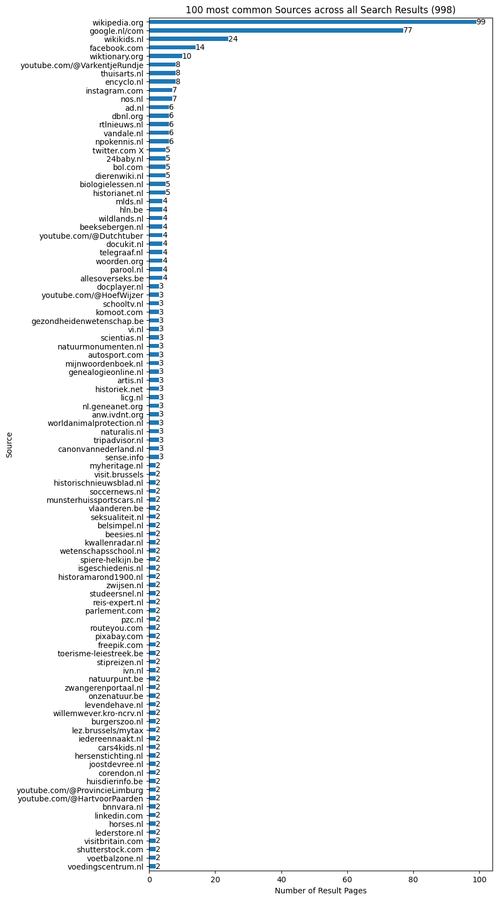
    


```python
n = 1
_results = results.loc[results["Ranking"] <= n]
k = 20

ax = (
    _results["Bronnen DB"]
    .value_counts()[:k]
    .sort_values(ascending=True)
    .plot(
        kind="barh",
        figsize=(8, k // 5),
        title=f"{k} most common Sources across Top {n} Search Results (out of {len(_results)})",
        xlabel="Number of Result Pages",
        ylabel="Source",
    )
)

ax.bar_label(ax.containers[0])
```


    [Text(0, 0, '1'),
     Text(0, 0, '1'),
     Text(0, 0, '1'),
     Text(0, 0, '1'),
     Text(0, 0, '1'),
     Text(0, 0, '1'),
     Text(0, 0, '1'),
     Text(0, 0, '1'),
     Text(0, 0, '1'),
     Text(0, 0, '1'),
     Text(0, 0, '1'),
     Text(0, 0, '1'),
     Text(0, 0, '1'),
     Text(0, 0, '1'),
     Text(0, 0, '1'),
     Text(0, 0, '1'),
     Text(0, 0, '1'),
     Text(0, 0, '1'),
     Text(0, 0, '10'),
     Text(0, 0, '37')]


    
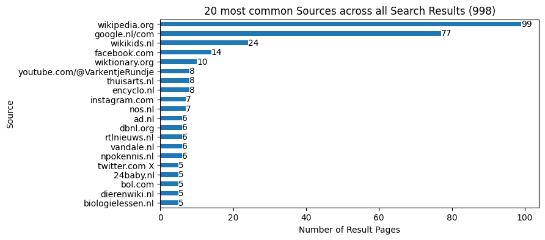
    


```python
n = 1
_results = results.loc[results["Ranking"] <= n]
k = 5

ax = (
    _results["Bronnen DB"]
    .value_counts()[:k]
    .sort_values(ascending=True)
    .plot(
        kind="barh",
        figsize=(8, k // 5),
        title=f"{k} most common Sources across Top {n} Search Results (out of {len(_results)})",
        xlabel="Number of Result Pages",
        ylabel="Source",
    )
)

ax.bar_label(ax.containers[0])
```


    [Text(0, 0, '1'),
     Text(0, 0, '1'),
     Text(0, 0, '1'),
     Text(0, 0, '10'),
     Text(0, 0, '37')]


    
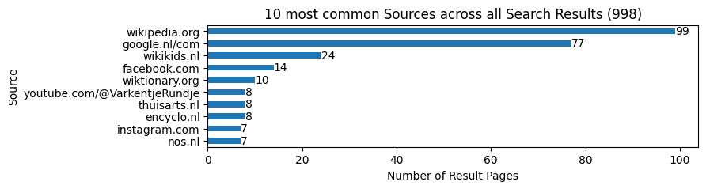
    


```python
# wikikids.nl results never appears on first rank:

results.loc[(results["Bronnen DB"] == ("wikikids.nl")) & (results["Ranking"] <= 1)]
```


<div>
<style scoped>
    .dataframe tbody tr th:only-of-type {
        vertical-align: middle;
    }

    .dataframe tbody tr th {
        vertical-align: top;
    }

    .dataframe thead th {
        text-align: right;
    }
</style>
<table border="1" class="dataframe">
  <thead>
    <tr style="text-align: right;">
      <th></th>
      <th>Bron: Thumbs up?</th>
      <th>Titel resultaat</th>
      <th>Link/resultaat</th>
      <th>Query</th>
      <th>Relevant?</th>
      <th>vrije tags page</th>
      <th>Bronnen DB</th>
      <th>Bron: Inst/Bedrijf</th>
      <th>Toegankelijkheid doelgroep (indruk)</th>
      <th>Soort Resultaat</th>
      <th>...</th>
      <th>Bron: doel</th>
      <th>Bron: Trackers</th>
      <th>OnderzoekNr</th>
      <th>Ranking</th>
      <th>Related to Bronnen DB test (Resultaten DB)</th>
      <th>Bronnen: URL domein</th>
      <th>Query: Video Schooltv</th>
      <th>Created by</th>
      <th>Bron-Status</th>
      <th>Bron: Onderwerp</th>
    </tr>
  </thead>
  <tbody>
  </tbody>
</table>
<p>0 rows × 27 columns</p>
</div>


```python
niet_wikipedia_rank_1 = results_sources.loc[
    (results["Bronnen DB"] != ("wikipedia.org")) & (results["Ranking"] <= 1)
]
ax = (
    niet_wikipedia_rank_1["Thumbs up 8-14?"]
    .value_counts(ascending=True)
    .plot(
        kind="barh",
        title=f"Thumbs up 8-14? for non-Wikipedia Results in Top 1 (out of {len(niet_wikipedia_rank_1)})",
        xlabel="Number of Result Pages",
    )
)
ax.bar_label(ax.containers[0])
```


    [Text(0, 0, '1'), Text(0, 0, '11'), Text(0, 0, '23'), Text(0, 0, '27')]


    

    


### Result Types (Informativeness)


```python
column = "Soort Resultaat"

values = results_sources[column].unique()

counts = (
    results_sources.groupby("Query")
    .value_counts(subset=[column], normalize=True)
    .unstack(level=column)
)

counts
```


<div>
<style scoped>
    .dataframe tbody tr th:only-of-type {
        vertical-align: middle;
    }

    .dataframe tbody tr th {
        vertical-align: top;
    }

    .dataframe thead th {
        text-align: right;
    }
</style>
<table border="1" class="dataframe">
  <thead>
    <tr style="text-align: right;">
      <th>Soort Resultaat</th>
      <th>informatief</th>
      <th>navigational</th>
      <th>transactional</th>
    </tr>
    <tr>
      <th>Query</th>
      <th></th>
      <th></th>
      <th></th>
    </tr>
  </thead>
  <tbody>
    <tr>
      <th>De gouverneur van limburg</th>
      <td>0.900000</td>
      <td>0.100000</td>
      <td>NaN</td>
    </tr>
    <tr>
      <th>De smurfen</th>
      <td>0.200000</td>
      <td>0.400000</td>
      <td>0.400000</td>
    </tr>
    <tr>
      <th>Dierentuin</th>
      <td>1.000000</td>
      <td>NaN</td>
      <td>NaN</td>
    </tr>
    <tr>
      <th>Ezel</th>
      <td>0.700000</td>
      <td>NaN</td>
      <td>0.300000</td>
    </tr>
    <tr>
      <th>Hoe komen straatkinderen aan eten</th>
      <td>1.000000</td>
      <td>NaN</td>
      <td>NaN</td>
    </tr>
    <tr>
      <th>...</th>
      <td>...</td>
      <td>...</td>
      <td>...</td>
    </tr>
    <tr>
      <th>welken gebouwen zijn er in West-Vlaanderen</th>
      <td>0.800000</td>
      <td>0.200000</td>
      <td>NaN</td>
    </tr>
    <tr>
      <th>westerschelde waternoodsramp</th>
      <td>0.900000</td>
      <td>0.100000</td>
      <td>NaN</td>
    </tr>
    <tr>
      <th>wist je dat?</th>
      <td>1.000000</td>
      <td>NaN</td>
      <td>NaN</td>
    </tr>
    <tr>
      <th>zebra</th>
      <td>0.636364</td>
      <td>0.272727</td>
      <td>0.090909</td>
    </tr>
    <tr>
      <th>zebrahaai</th>
      <td>0.600000</td>
      <td>0.300000</td>
      <td>0.100000</td>
    </tr>
  </tbody>
</table>
<p>100 rows × 3 columns</p>
</div>


```python
width = 120

for col in counts.columns:
    print("=" * 20 + col + "=" * 20)
    with pd.option_context("display.width", width, "display.min_rows", 50):
        print(counts.sort_values(by=col, ascending=False))
    print("=" * width)
```

    ====================informatief====================
    Soort Resultaat                                     informatief  navigational  transactional
    Query                                                                                       
    mens red peuter van dak racist                         1.000000           NaN            NaN
    wist je dat?                                           1.000000           NaN            NaN
    waar leven giraffen                                    1.000000           NaN            NaN
    wat betekent schotse                                   1.000000           NaN            NaN
    wat is een begin aanhaling                             1.000000           NaN            NaN
    elektronen                                             1.000000           NaN            NaN
    ik wil iemand een bericht steuren                      1.000000           NaN            NaN
    wat is een foetus?                                     1.000000           NaN            NaN
    voortplanting                                          1.000000           NaN            NaN
    wat is en ligboxstal                                   1.000000           NaN            NaN
    welke stammen zijn er in sierra leone                  1.000000           NaN            NaN
    koning van belgieje                                    1.000000           NaN            NaN
    maanstonden                                            1.000000           NaN            NaN
    waar komt de naam Romen van                            1.000000           NaN            NaN
    hirohito                                               1.000000           NaN            NaN
    Dierentuin                                             1.000000           NaN            NaN
    otter kenmerken                                        1.000000           NaN            NaN
    Waarom zijn edelmetalen geschrikt om geld te maken     1.000000           NaN            NaN
    taak slokdarm                                          1.000000           NaN            NaN
    pepernooten recept                                     1.000000           NaN            NaN
    Hoe komen straatkinderen aan eten                      1.000000           NaN            NaN
    Rencontre                                              1.000000           NaN            NaN
    PIRAMIDES CHEOPS                                       1.000000           NaN            NaN
    kerstmis                                               0.909091      0.090909            NaN
    nachtbraker vogel                                      0.900000      0.100000            NaN
    ...                                                         ...           ...            ...
    merelbeke                                              0.444444      0.555556            NaN
    rillaar monumenten                                     0.400000      0.600000            NaN
    handgranat                                             0.400000      0.400000       0.200000
    waterbuffel                                            0.400000           NaN       0.600000
    Rug                                                    0.375000      0.625000            NaN
    azerty                                                 0.375000      0.250000       0.375000
    camille dhont                                          0.333333      0.555556       0.111111
    geld                                                   0.333333      0.444444       0.222222
    ferrari                                                0.300000      0.200000       0.500000
    turne ritmic                                           0.250000      0.625000       0.125000
    echte naakte vrouw                                     0.200000      0.800000            NaN
    De smurfen                                             0.200000      0.400000       0.400000
    middellandse zee                                       0.200000      0.200000       0.600000
    kleren van vikingen                                    0.200000      0.100000       0.700000
    juf hanne de leerboom                                  0.111111      0.888889            NaN
    filters                                                0.100000           NaN       0.900000
    autosport                                              0.090909      0.909091            NaN
    kindermotors                                                NaN      0.272727       0.727273
    klokken                                                     NaN      0.111111       0.888889
    plaatjes van vulkaan                                        NaN      0.200000       0.800000
    post moter                                                  NaN      0.100000       0.900000
    stamboom  familie                                           NaN      1.000000            NaN
    telefoon                                                    NaN      0.100000       0.900000
    vogels huisjes                                              NaN      0.181818       0.818182
    wat voor soort producten worden er gemaakt bij ...          NaN      0.100000       0.900000
    
    [100 rows x 3 columns]
    ========================================================================================================================
    ====================navigational====================
    Soort Resultaat                                     informatief  navigational  transactional
    Query                                                                                       
    stamboom  familie                                           NaN      1.000000            NaN
    autosport                                              0.090909      0.909091            NaN
    juf hanne de leerboom                                  0.111111      0.888889            NaN
    echte naakte vrouw                                     0.200000      0.800000            NaN
    Rug                                                    0.375000      0.625000            NaN
    turne ritmic                                           0.250000      0.625000       0.125000
    rillaar monumenten                                     0.400000      0.600000            NaN
    merelbeke                                              0.444444      0.555556            NaN
    camille dhont                                          0.333333      0.555556       0.111111
    seks                                                   0.500000      0.500000            NaN
    ronaldo                                                0.538462      0.461538            NaN
    geld                                                   0.333333      0.444444       0.222222
    De smurfen                                             0.200000      0.400000       0.400000
    handgranat                                             0.400000      0.400000       0.200000
    spiere                                                 0.600000      0.400000            NaN
    greta thunberg                                         0.636364      0.363636            NaN
    de gea                                                 0.700000      0.300000            NaN
    leven                                                  0.600000      0.300000       0.100000
    zebrahaai                                              0.600000      0.300000       0.100000
    paard hond en wolf                                     0.700000      0.300000            NaN
    beweging                                               0.700000      0.300000            NaN
    kindermotors                                                NaN      0.272727       0.727273
    zebra                                                  0.636364      0.272727       0.090909
    paris saint germain                                    0.500000      0.250000       0.250000
    azerty                                                 0.375000      0.250000       0.375000
    ...                                                         ...           ...            ...
    Waarom zijn edelmetalen geschrikt om geld te maken     1.000000           NaN            NaN
    een hond                                               0.800000           NaN       0.200000
    elektronen                                             1.000000           NaN            NaN
    filters                                                0.100000           NaN       0.900000
    hirohito                                               1.000000           NaN            NaN
    hommels                                                0.900000           NaN       0.100000
    ik wil iemand een bericht steuren                      1.000000           NaN            NaN
    keurmerk max                                           0.800000           NaN       0.200000
    koning van belgieje                                    1.000000           NaN            NaN
    maanstonden                                            1.000000           NaN            NaN
    mens red peuter van dak racist                         1.000000           NaN            NaN
    otter kenmerken                                        1.000000           NaN            NaN
    pepernooten recept                                     1.000000           NaN            NaN
    taak slokdarm                                          1.000000           NaN            NaN
    varkentje                                              0.900000           NaN       0.100000
    voortplanting                                          1.000000           NaN            NaN
    waar komt de naam Romen van                            1.000000           NaN            NaN
    waar leven giraffen                                    1.000000           NaN            NaN
    wat betekent schotse                                   1.000000           NaN            NaN
    wat is een begin aanhaling                             1.000000           NaN            NaN
    wat is een foetus?                                     1.000000           NaN            NaN
    wat is en ligboxstal                                   1.000000           NaN            NaN
    waterbuffel                                            0.400000           NaN       0.600000
    welke stammen zijn er in sierra leone                  1.000000           NaN            NaN
    wist je dat?                                           1.000000           NaN            NaN
    
    [100 rows x 3 columns]
    ========================================================================================================================
    ====================transactional====================
    Soort Resultaat                                     informatief  navigational  transactional
    Query                                                                                       
    wat voor soort producten worden er gemaakt bij ...          NaN      0.100000       0.900000
    telefoon                                                    NaN      0.100000       0.900000
    post moter                                                  NaN      0.100000       0.900000
    filters                                                0.100000           NaN       0.900000
    klokken                                                     NaN      0.111111       0.888889
    vogels huisjes                                              NaN      0.181818       0.818182
    plaatjes van vulkaan                                        NaN      0.200000       0.800000
    kindermotors                                                NaN      0.272727       0.727273
    kleren van vikingen                                    0.200000      0.100000       0.700000
    waterbuffel                                            0.400000           NaN       0.600000
    middellandse zee                                       0.200000      0.200000       0.600000
    ferrari                                                0.300000      0.200000       0.500000
    De smurfen                                             0.200000      0.400000       0.400000
    de bal                                                 0.500000      0.100000       0.400000
    cobra slang                                            0.500000      0.100000       0.400000
    azerty                                                 0.375000      0.250000       0.375000
    stoomschip                                             0.500000      0.200000       0.300000
    Ezel                                                   0.700000           NaN       0.300000
    paris saint germain                                    0.500000      0.250000       0.250000
    geld                                                   0.333333      0.444444       0.222222
    keurmerk max                                           0.800000           NaN       0.200000
    handgranat                                             0.400000      0.400000       0.200000
    een hond                                               0.800000           NaN       0.200000
    het groot Barrierif                                    0.636364      0.181818       0.181818
    engeland                                               0.636364      0.181818       0.181818
    ...                                                         ...           ...            ...
    pasteuriseren                                          0.900000      0.100000            NaN
    pepernooten recept                                     1.000000           NaN            NaN
    poep                                                   0.900000      0.100000            NaN
    populairenamen                                         0.900000      0.100000            NaN
    puberteit                                              0.900000      0.100000            NaN
    rillaar monumenten                                     0.400000      0.600000            NaN
    ronaldo                                                0.538462      0.461538            NaN
    seks                                                   0.500000      0.500000            NaN
    sloot                                                  0.777778      0.222222            NaN
    spiere                                                 0.600000      0.400000            NaN
    stamboom  familie                                           NaN      1.000000            NaN
    taak slokdarm                                          1.000000           NaN            NaN
    vertrekhal met inchekbalie                             0.800000      0.200000            NaN
    video van paarden                                      0.800000      0.200000            NaN
    voortplanting                                          1.000000           NaN            NaN
    waar komt de naam Romen van                            1.000000           NaN            NaN
    waar leven giraffen                                    1.000000           NaN            NaN
    wat betekent schotse                                   1.000000           NaN            NaN
    wat is een begin aanhaling                             1.000000           NaN            NaN
    wat is een foetus?                                     1.000000           NaN            NaN
    wat is en ligboxstal                                   1.000000           NaN            NaN
    welke stammen zijn er in sierra leone                  1.000000           NaN            NaN
    welken gebouwen zijn er in West-Vlaanderen             0.800000      0.200000            NaN
    westerschelde waternoodsramp                           0.900000      0.100000            NaN
    wist je dat?                                           1.000000           NaN            NaN
    
    [100 rows x 3 columns]
    ========================================================================================================================


```python
column = "Soort Resultaat"

ax = (
    results[column]
    .value_counts(ascending=True)
    .plot(
        kind="barh",
        title=f"Result Types per Result Page (out of {len(results)})",
        xlabel="Number of Result Pages",
        ylabel="Result Type",
    )
)
ax.bar_label(ax.containers[0])
```


    [Text(0, 0, '138'), Text(0, 0, '181'), Text(0, 0, '679')]


    
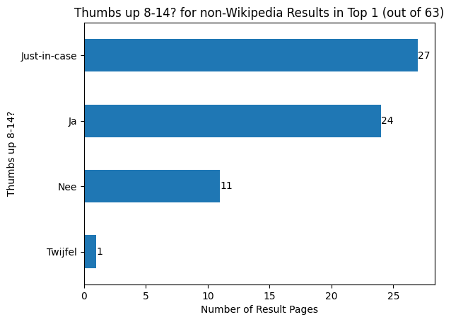
    


```python
value_counts: dict = {}


for n in range(1, 11):
    _results = results_sources.loc[results_sources["Ranking"] <= n]
    value_counts[n] = (
        _results[column]
        .str.split(",")
        .explode()
        .str.strip()
        .value_counts(normalize=True)
        * 100
    )


pd.DataFrame.from_dict(value_counts, orient="index").sort_index().plot(
    title=f"'{column}': Percentage by Top N Results",
    xlabel="Minimum Result Ranking (N)",
    ylabel=f"Percentage in '{column}'",
    xticks=range(1, 11),
    yticks=range(0, 105, 5),
    legend=True,
).grid(axis="y")
```


    

    


### Result Relevance


```python
ax = (
    results["Relevant?"]
    .value_counts(ascending=True)
    .plot(
        kind="barh",
        title=f"Relevance per Result Page (out of {len(results)})",
        xlabel="Number of Result Pages",
        ylabel="Relevancy Category",
    )
)
ax.bar_label(ax.containers[0])
```


    [Text(0, 0, '1'), Text(0, 0, '53'), Text(0, 0, '117'), Text(0, 0, '827')]


    

    


```python
counts: dict[int, float] = {}

for n in range(1, 11):
    _results = results.loc[results["Ranking"] <= n]
    counts[n] = _results["Relevant?"].value_counts(normalize=True)["relevant"] * 100

pd.DataFrame(counts.items(), columns=["Ranking", "Relevance"]).set_index(
    "Ranking"
).plot(
    title="Relevance Percentage by Top N Results across all Queries",
    xlabel="Minimum Result Ranking (N)",
    ylabel="Percentage of Relevant Result Pages",
    xticks=range(1, 11),
    yticks=range(80, 105, 5),
    legend=False,
).grid(axis="y")
```


    

    


```python
value_counts: dict = {}

column = "Relevant?"

for n in range(1, 11):
    _results = results_sources.loc[results_sources["Ranking"] <= n]
    value_counts[n] = (
        _results[column]
        .str.split(",")
        .explode()
        .str.strip()
        .value_counts(normalize=True)[:k]
        * 100
    )


pd.DataFrame.from_dict(value_counts, orient="index").fillna(
    method="bfill"
).sort_index().plot(
    title=f"'{column}': Percentage by Top N Results",
    xlabel="Minimum Result Ranking (N)",
    ylabel=f"Percentage in '{column}'",
    xticks=range(1, 11),
    yticks=range(0, 101, 10),
    legend=True,
).grid(axis="y")
```

    /var/folders/d8/j5_fyf8941j_492zvf8948y40000gn/T/ipykernel_52598/1192633478.py:17: FutureWarning: DataFrame.fillna with 'method' is deprecated and will raise in a future version. Use obj.ffill() or obj.bfill() instead.
      pd.DataFrame.from_dict(value_counts, orient="index").fillna(


    

    


### Result Accessibility


```python
ax = (
    results["Toegankelijkheid doelgroep (indruk)"]
    .value_counts(ascending=True)
    .plot(
        kind="barh",
        title=f"Accessibility for Audience (8-12 years) (out of {len(results)})",
        xlabel="Number of Result Pages",
        ylabel="Accessibility",
    )
)
ax.bar_label(ax.containers[0])
```


    [Text(0, 0, '10'),
     Text(0, 0, '55'),
     Text(0, 0, '300'),
     Text(0, 0, '302'),
     Text(0, 0, '331')]


    

    


### Results Commerciality


```python
n=10

ax = (
    results_sources["Commercialiteit"]
    .str.split(",")
    .explode()
    .str.strip()
    .value_counts(ascending=True)
    .plot(
        kind="barh",
        title=f"Commerciality Labels for Top {n} Result Pages (out of {len(results_sources)})",
        xlabel="Number of Result pages",
        ylabel="Commerciality Label",
    )
)
ax.bar_label(ax.containers[0])
```


    [Text(0, 0, '53'), Text(0, 0, '416'), Text(0, 0, '528')]


    

    


```python
n = 5
_results = results_sources.loc[results["Ranking"] <= n]

ax = (
    _results["Commercialiteit"]
    .str.split(",")
    .explode()
    .str.strip()
    .value_counts(ascending=True)
    .plot(
        kind="barh",
        title=f"Commerciality Labels for Top {n} Result Pages (out of {len(_results)})",
        xlabel="Number of Result pages",
        ylabel="Commerciality Label",
    )
)
ax.bar_label(ax.containers[0])
```


    [Text(0, 0, '18'), Text(0, 0, '228'), Text(0, 0, '252')]


    

    


```python
n = 1
_results = results_sources.loc[results["Ranking"] <= n]

ax = (
    _results["Commercialiteit"]
    .str.split(",")
    .explode()
    .str.strip()
    .value_counts(ascending=True)
    .plot(
        kind="barh",
        title=f"Commerciality Labels for Top {n} Result Pages (out of {len(_results)})",
        xlabel="Number of Result pages",
        ylabel="Commerciality Label",
    )
)
ax.bar_label(ax.containers[0])
```


    [Text(0, 0, '1'), Text(0, 0, '36'), Text(0, 0, '62')]


    

    


```python
value_counts: dict = {}
column = "Commercialiteit"


for n in range(1, 11):
    _results = results_sources.loc[results_sources["Ranking"] <= n]
    value_counts[n] = (
        _results[column]
        .str.split(",")
        .explode()
        .str.strip()
        .value_counts(normalize=True)
        * 100
    )


pd.DataFrame.from_dict(value_counts, orient="index").fillna(0).sort_index().plot(
    title=f"'{column}': Percentage by Top N Results",
    xlabel="Minimum Result Ranking (N)",
    ylabel=f"Percentage in '{column}'",
    xticks=range(1, 11),
    yticks=range(0, 75, 10),
    legend=True,
).grid(axis="y")
```


    

    


### Result Sectors


```python
k = 20

ax = (
    results_sources["Sector"]
    .str.split(",")
    .explode()
    .str.strip()
    .value_counts(ascending=True)[-k:]
    .plot(
        kind="barh",
        title=f"{k} Most Common Sectors per Result Page (out of {len(results_sources)})",
        xlabel="Number of Result Pages",
        ylabel="Sector",
    )
)
ax.bar_label(ax.containers[0])
```


    [Text(0, 0, '9'),
     Text(0, 0, '11'),
     Text(0, 0, '12'),
     Text(0, 0, '13'),
     Text(0, 0, '15'),
     Text(0, 0, '18'),
     Text(0, 0, '18'),
     Text(0, 0, '21'),
     Text(0, 0, '24'),
     Text(0, 0, '24'),
     Text(0, 0, '33'),
     Text(0, 0, '35'),
     Text(0, 0, '37'),
     Text(0, 0, '38'),
     Text(0, 0, '69'),
     Text(0, 0, '76'),
     Text(0, 0, '95'),
     Text(0, 0, '106'),
     Text(0, 0, '140'),
     Text(0, 0, '165')]


    

    


```python
n = 5
k = 20
ax = (
    results_sources.loc[results_sources["Ranking"] <= n]["Sector"]
    .str.split(",")
    .explode()
    .str.strip()
    .value_counts(ascending=True)[-k:]
    .plot(
        kind="barh",
        title=f"{k} Most Common Sectors per Result Page in first {n} results",
        xlabel="Number of Result Pages",
        ylabel="Sector",
    )
)
ax.bar_label(ax.containers[0])
```


    [Text(0, 0, '4'),
     Text(0, 0, '4'),
     Text(0, 0, '5'),
     Text(0, 0, '5'),
     Text(0, 0, '7'),
     Text(0, 0, '7'),
     Text(0, 0, '8'),
     Text(0, 0, '9'),
     Text(0, 0, '10'),
     Text(0, 0, '11'),
     Text(0, 0, '16'),
     Text(0, 0, '16'),
     Text(0, 0, '17'),
     Text(0, 0, '19'),
     Text(0, 0, '31'),
     Text(0, 0, '31'),
     Text(0, 0, '40'),
     Text(0, 0, '63'),
     Text(0, 0, '72'),
     Text(0, 0, '106')]


    

    


```python
n = 1
ax = (
    results_sources.loc[results_sources["Ranking"] <= n]["Sector"]
    .str.split(",")
    .explode()
    .str.strip()
    .value_counts(ascending=True)
    .plot(
        kind="barh",
        title=f"Sector per Result Page in first {n} results",
        xlabel="Number of Result Pages",
        ylabel="Sector",
    )
)
ax.bar_label(ax.containers[0])
```


    [Text(0, 0, '1'),
     Text(0, 0, '1'),
     Text(0, 0, '1'),
     Text(0, 0, '1'),
     Text(0, 0, '1'),
     Text(0, 0, '1'),
     Text(0, 0, '1'),
     Text(0, 0, '1'),
     Text(0, 0, '1'),
     Text(0, 0, '2'),
     Text(0, 0, '2'),
     Text(0, 0, '2'),
     Text(0, 0, '2'),
     Text(0, 0, '3'),
     Text(0, 0, '4'),
     Text(0, 0, '5'),
     Text(0, 0, '7'),
     Text(0, 0, '10'),
     Text(0, 0, '12'),
     Text(0, 0, '41')]


    
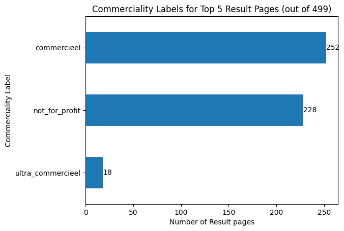
    


```python
value_counts: dict = {}
k = 5
column = "Sector"

top_sectors = results_sources[column].value_counts()[:k].index

for n in range(1, 11):
    _results = results_sources.loc[results_sources["Ranking"] <= n]
    value_counts[n] = (
        _results[column]
        .str.split(",")
        .explode()
        .str.strip()
        .value_counts(normalize=True)[top_sectors]
        * 100
    )


pd.DataFrame.from_dict(value_counts, orient="index").fillna(
    method="ffill"
).sort_index().plot(
    title=f"'{column}': Percentage by Top N Results",
    xlabel="Minimum Result Ranking (N)",
    ylabel=f"Percentage in '{column}'",
    xticks=range(1, 11),
    yticks=range(0, 50, 5),
    legend=True,
).grid(axis="y")
```

    /var/folders/d8/j5_fyf8941j_492zvf8948y40000gn/T/ipykernel_52598/978984602.py:19: FutureWarning: DataFrame.fillna with 'method' is deprecated and will raise in a future version. Use obj.ffill() or obj.bfill() instead.
      pd.DataFrame.from_dict(value_counts, orient="index").fillna(


    

    


### Thumbs-Up


```python
column = "Thumbs up 8-14?"

ax = (
    results_sources[column]
    .str.split(",")
    .explode()
    .str.strip()
    .value_counts(ascending=True)
    .plot(
        kind="barh",
        title=f"{column} per Result Page (out of {len(results_sources)})",
        xlabel="Number of Result Pages",
        ylabel=column,
    )
)
ax.bar_label(ax.containers[0])
```


    [Text(0, 0, '25'), Text(0, 0, '232'), Text(0, 0, '359'), Text(0, 0, '381')]


    

    


```python
column = "Thumbs up 8-14?"
n = 5

ax = (
    results_sources.loc[results_sources["Ranking"] <= n][column]
    .str.split(",")
    .explode()
    .str.strip()
    .value_counts(ascending=True)
    .plot(
        kind="barh",
        title=f"{column} per Result Page in first {n} results",
        xlabel="Number of Result Pages",
        ylabel=column,
    )
)
ax.bar_label(ax.containers[0])
```


    [Text(0, 0, '7'), Text(0, 0, '99'), Text(0, 0, '178'), Text(0, 0, '214')]


    

    


```python
column = "Thumbs up 8-14?"
n = 1

ax = (
    results_sources.loc[results_sources["Ranking"] <= n][column]
    .str.split(",")
    .explode()
    .str.strip()
    .value_counts(ascending=True)
    .plot(
        kind="barh",
        title=f"{column} per Result Page in first {n} results",
        xlabel="Number of Result Pages",
        ylabel=column,
    )
)
ax.bar_label(ax.containers[0])
```


    [Text(0, 0, '1'), Text(0, 0, '11'), Text(0, 0, '27'), Text(0, 0, '60')]


    
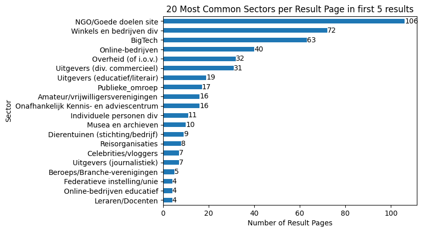
    


```python
value_counts: dict = {}

categories = ["Ja", "Just-in-case"]
column = "Thumbs up 8-14?"

for n in range(1, 11):
    _results = results_sources.loc[results_sources["Ranking"] <= n]
    value_counts[n] = (
        _results[column]
        .str.split(",")
        .explode()
        .str.strip()
        .value_counts(normalize=True)
        * 100
    )


pd.DataFrame.from_dict(value_counts, orient="index").sort_index().plot(
    title=f"'{column}': Percentage by Top N Results",
    xlabel="Minimum Result Ranking (N)",
    ylabel=f"Percentage in '{column}'",
    xticks=range(1, 11),
    yticks=range(0, 80, 5),
    legend=True,
).grid(axis="y")
```


    

    


### Goal


```python
column = "Conclusie over doel vd bron"
k = 20

ax = (
    results_sources[column]
    .str.split(",")
    .explode()
    .str.strip()
    .value_counts(ascending=True)[-k:]
    .plot(
        kind="barh",
        title=f"{k} most common '{column}' per Result Page (out of {len(results_sources)})",
        xlabel="Number of Result Pages",
        ylabel=column,
    )
)
ax.bar_label(ax.containers[0])
```


    [Text(0, 0, '20'),
     Text(0, 0, '20'),
     Text(0, 0, '20'),
     Text(0, 0, '22'),
     Text(0, 0, '22'),
     Text(0, 0, '25'),
     Text(0, 0, '26'),
     Text(0, 0, '27'),
     Text(0, 0, '28'),
     Text(0, 0, '29'),
     Text(0, 0, '32'),
     Text(0, 0, '34'),
     Text(0, 0, '37'),
     Text(0, 0, '48'),
     Text(0, 0, '60'),
     Text(0, 0, '63'),
     Text(0, 0, '94'),
     Text(0, 0, '110'),
     Text(0, 0, '111'),
     Text(0, 0, '216')]


    

    


```python
column = "Conclusie over doel vd bron"
n = 5

ax = (
    results_sources.loc[results_sources["Ranking"] <= n][column]
    .str.split(",")
    .explode()
    .str.strip()
    .value_counts(ascending=True)[-k:]
    .plot(
        kind="barh",
        title=f"{k} most frequent '{column}' per First {n} Result Pages",
        xlabel="Number of Result Pages",
        ylabel=column,
    )
)
ax.bar_label(ax.containers[0])
```


    [Text(0, 0, '8'),
     Text(0, 0, '8'),
     Text(0, 0, '10'),
     Text(0, 0, '10'),
     Text(0, 0, '10'),
     Text(0, 0, '13'),
     Text(0, 0, '14'),
     Text(0, 0, '14'),
     Text(0, 0, '15'),
     Text(0, 0, '15'),
     Text(0, 0, '15'),
     Text(0, 0, '16'),
     Text(0, 0, '16'),
     Text(0, 0, '20'),
     Text(0, 0, '24'),
     Text(0, 0, '28'),
     Text(0, 0, '39'),
     Text(0, 0, '49'),
     Text(0, 0, '89'),
     Text(0, 0, '112')]


    
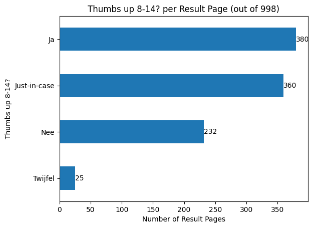
    


```python
column = "Conclusie over doel vd bron"
n = 1
k = 20

ax = (
    results_sources.loc[results_sources["Ranking"] <= n][column]
    .str.split(",")
    .explode()
    .str.strip()
    .value_counts(ascending=True)[-k:]
    .plot(
        kind="barh",
        title=f"{k} most frequent '{column}' per First {n} Result Pages",
        xlabel="Number of Result Pages",
        ylabel=column,
        # figsize=(8, 10),
    )
)
ax.bar_label(ax.containers[0])
```


    [Text(0, 0, '1'),
     Text(0, 0, '1'),
     Text(0, 0, '1'),
     Text(0, 0, '1'),
     Text(0, 0, '1'),
     Text(0, 0, '1'),
     Text(0, 0, '2'),
     Text(0, 0, '2'),
     Text(0, 0, '2'),
     Text(0, 0, '2'),
     Text(0, 0, '2'),
     Text(0, 0, '3'),
     Text(0, 0, '3'),
     Text(0, 0, '4'),
     Text(0, 0, '4'),
     Text(0, 0, '6'),
     Text(0, 0, '7'),
     Text(0, 0, '9'),
     Text(0, 0, '17'),
     Text(0, 0, '37')]


    
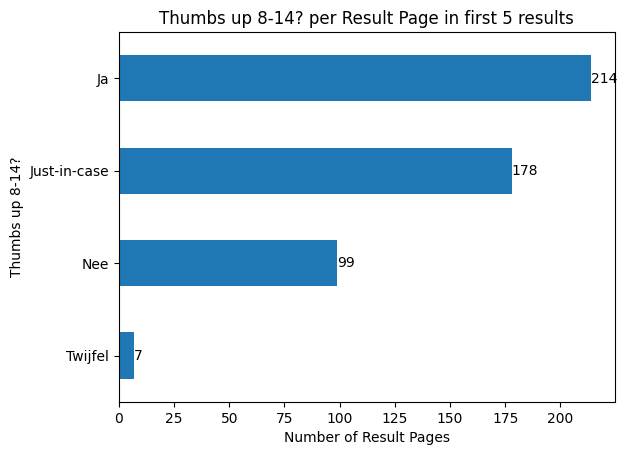
    


```python
counts: dict[int, float] = {}
category = "gebruikersplatform met kwaliteitsinformatie"

for n in range(1, 11):
    _results = results_sources.loc[results_sources["Ranking"] <= n]
    counts[n] = (
        _results[column]
        .str.split(",")
        .explode()
        .str.strip()
        .value_counts(normalize=True)[category]
        * 100
    )

pd.DataFrame(counts.items(), columns=["Ranking", "Thumbs Up"]).set_index(
    "Ranking"
).plot(
    title=f"'{category}': Percentage by Top N Results",
    xlabel="Minimum Result Ranking (N)",
    ylabel=f"% of '{category}'",
    xticks=range(1, 11),
    yticks=range(0, 50, 5),
    legend=False,
).grid(axis="y")
```


    

    


### About Page


```python
column = "Kwaliteit_about"
n = 10

ax = (
    results_sources.loc[results_sources["Ranking"] <= n][column]
    .str.split(",")
    .explode()
    .str.strip()
    .value_counts(ascending=True)
    .plot(
        kind="barh",
        title=f"{column} per First {n} Result Pages ",
        xlabel="Number of Result Pages",
        ylabel=column,
        figsize=(8, 10),
    )
)
ax.bar_label(ax.containers[0])
```


    [Text(0, 0, '1'),
     Text(0, 0, '21'),
     Text(0, 0, '27'),
     Text(0, 0, '53'),
     Text(0, 0, '125'),
     Text(0, 0, '331'),
     Text(0, 0, '423')]


    

    


### Ads


```python
column = "Reclame"
n = 5

categories = (
    results_sources[column]
    .str.split(",")
    .explode()
    .str.strip()
    .value_counts(ascending=True)[-n:]
).index
categories
```


    Index(['over_the_top_ads', 'limited_ads', 'many_ads', 'none',
           'company_promotion'],
          dtype='object', name='Reclame')


```python
ax = (
    results_sources[column]
    .str.split(",")
    .explode()
    .str.strip()
    .value_counts(ascending=True)[categories]
    .plot(
        kind="barh",
        title=f"Top {n} {column} Types per Result Pages (out of {len(results_sources)})",
        xlabel="Number of Result Pages",
        ylabel=column,
    )
)
ax.bar_label(ax.containers[0])
```


    [Text(0, 0, '39'),
     Text(0, 0, '76'),
     Text(0, 0, '199'),
     Text(0, 0, '357'),
     Text(0, 0, '389')]


    

    


```python
column = "Reclame"
n = 5

value_counts: dict = {}


for rank in range(1, 11):
    _results = results_sources.loc[results_sources["Ranking"] <= rank]
    value_counts[rank] = (
        _results[column]
        .str.split(",")
        .explode()
        .str.strip()
        .value_counts(normalize=True)[categories]
        * 100
    )

pd.DataFrame.from_dict(value_counts, orient="index").fillna(
    method="bfill"
).sort_index().plot(
    title=f"'{column}': Percentage by Top N Results",
    xlabel="Minimum Result Ranking (N)",
    ylabel=f"Percentage in '{column}'",
    xticks=range(1, 11),
    yticks=range(0, 61, 10),
    legend=True,
).grid(axis="y")
```

    /var/folders/d8/j5_fyf8941j_492zvf8948y40000gn/T/ipykernel_52598/331480954.py:18: FutureWarning: DataFrame.fillna with 'method' is deprecated and will raise in a future version. Use obj.ffill() or obj.bfill() instead.
      pd.DataFrame.from_dict(value_counts, orient="index").fillna(


    
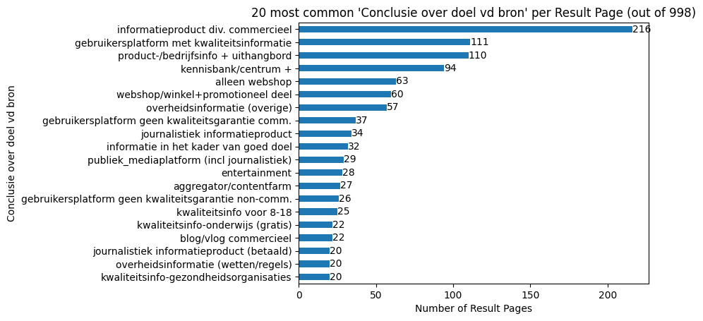
    


```python
column = "Reclame"
n = 5

ax = (
    results_sources.loc[results_sources["Ranking"] <= n][column]
    .str.split(",")
    .explode()
    .str.strip()
    .value_counts(ascending=True)
    .plot(
        kind="barh",
        title=f"{column} per First {n} Result Pages",
        xlabel="Number of Result Pages",
        ylabel=column,
        figsize=(8, 10),
    )
)
ax.bar_label(ax.containers[0])
```


    [Text(0, 0, '1'),
     Text(0, 0, '9'),
     Text(0, 0, '13'),
     Text(0, 0, '13'),
     Text(0, 0, '32'),
     Text(0, 0, '113'),
     Text(0, 0, '168'),
     Text(0, 0, '196')]


    

    


```python
column = "Reclame"
n = 1

ax = (
    results_sources.loc[results_sources["Ranking"] <= n][column]
    .str.split(",")
    .explode()
    .str.strip()
    .value_counts(ascending=True)
    .plot(
        kind="barh",
        title=f"{column} per First {n} Result Pages",
        xlabel="Number of Result Pages",
        ylabel=column,
        figsize=(8, 10),
    )
)
ax.bar_label(ax.containers[0])
```


    [Text(0, 0, '1'),
     Text(0, 0, '1'),
     Text(0, 0, '1'),
     Text(0, 0, '1'),
     Text(0, 0, '5'),
     Text(0, 0, '15'),
     Text(0, 0, '22'),
     Text(0, 0, '58')]


    

    


```python
counts: dict[int, float] = {}
category = "none"

for n in range(1, 11):
    _results = results_sources.loc[results_sources["Ranking"] <= n]
    counts[n] = (
        _results[column]
        .str.split(",")
        .explode()
        .str.strip()
        .value_counts(normalize=True)[category]
        * 100
    )

pd.DataFrame(counts.items(), columns=["Ranking", category]).set_index("Ranking").plot(
    title=f"'{column}' = '{category}': Percentage by Top N Results",
    xlabel="Minimum Result Rank (N)",
    ylabel=f"Percentage of '{column}' = '{category}'",
    xticks=range(1, 11),
    yticks=range(0, 70, 5),
    legend=False,
).grid(axis="y")
```


    

    


## Sources

### Commerciality


```python
ax = (
    sources["Commercialiteit"]
    .str.split(",")
    .explode()
    .str.strip()
    .value_counts(ascending=True)
    .plot(
        kind="barh",
        title=f"Commerciality per Source (out of {len(sources)})",
        xlabel="Number of Sources",
        ylabel="Commerciality",
    )
)
ax.bar_label(ax.containers[0])
```


    [Text(0, 0, '17'), Text(0, 0, '197'), Text(0, 0, '328')]


    

    


### Sectors


```python
ax = (
    sources["Sector"]
    .value_counts(ascending=True)
    .plot(
        kind="barh",
        title=f"Sector per Source (out of {len(sources)})",
        xlabel="Number of Sources",
        ylabel="Sector",
        figsize=(8, 10),
    )
)
ax.bar_label(ax.containers[0])
```


    [Text(0, 0, '1'),
     Text(0, 0, '1'),
     Text(0, 0, '1'),
     Text(0, 0, '1'),
     Text(0, 0, '2'),
     Text(0, 0, '2'),
     Text(0, 0, '3'),
     Text(0, 0, '4'),
     Text(0, 0, '4'),
     Text(0, 0, '4'),
     Text(0, 0, '5'),
     Text(0, 0, '5'),
     Text(0, 0, '5'),
     Text(0, 0, '6'),
     Text(0, 0, '7'),
     Text(0, 0, '8'),
     Text(0, 0, '8'),
     Text(0, 0, '9'),
     Text(0, 0, '10'),
     Text(0, 0, '13'),
     Text(0, 0, '15'),
     Text(0, 0, '15'),
     Text(0, 0, '16'),
     Text(0, 0, '19'),
     Text(0, 0, '21'),
     Text(0, 0, '23'),
     Text(0, 0, '32'),
     Text(0, 0, '35'),
     Text(0, 0, '56'),
     Text(0, 0, '67'),
     Text(0, 0, '144')]


    

    


### Free Labels


```python
ax = (
    sources["Vrije labels bron/onderwerp"]
    .str.split(",")
    .explode()
    .str.strip()
    .value_counts(ascending=True)
    .plot(
        kind="barh",
        title=f"Label Frequencies in Sources (out of {len(sources)}; multiple labels allowed)",
        xlabel="Number of Sources",
        ylabel="Label",
        figsize=(8, 10),
    )
)
ax.bar_label(ax.containers[0])
```


    [Text(0, 0, '1'),
     Text(0, 0, '1'),
     Text(0, 0, '1'),
     Text(0, 0, '1'),
     Text(0, 0, '1'),
     Text(0, 0, '1'),
     Text(0, 0, '1'),
     Text(0, 0, '2'),
     Text(0, 0, '2'),
     Text(0, 0, '2'),
     Text(0, 0, '2'),
     Text(0, 0, '3'),
     Text(0, 0, '3'),
     Text(0, 0, '3'),
     Text(0, 0, '3'),
     Text(0, 0, '3'),
     Text(0, 0, '3'),
     Text(0, 0, '4'),
     Text(0, 0, '4'),
     Text(0, 0, '4'),
     Text(0, 0, '5'),
     Text(0, 0, '7'),
     Text(0, 0, '7'),
     Text(0, 0, '8'),
     Text(0, 0, '8'),
     Text(0, 0, '9'),
     Text(0, 0, '9'),
     Text(0, 0, '10'),
     Text(0, 0, '10'),
     Text(0, 0, '10'),
     Text(0, 0, '11'),
     Text(0, 0, '12'),
     Text(0, 0, '13'),
     Text(0, 0, '13'),
     Text(0, 0, '13'),
     Text(0, 0, '13'),
     Text(0, 0, '15'),
     Text(0, 0, '15'),
     Text(0, 0, '16'),
     Text(0, 0, '17'),
     Text(0, 0, '17'),
     Text(0, 0, '17'),
     Text(0, 0, '17'),
     Text(0, 0, '19'),
     Text(0, 0, '20'),
     Text(0, 0, '23'),
     Text(0, 0, '24'),
     Text(0, 0, '25'),
     Text(0, 0, '26'),
     Text(0, 0, '26'),
     Text(0, 0, '29'),
     Text(0, 0, '29'),
     Text(0, 0, '40'),
     Text(0, 0, '41'),
     Text(0, 0, '45'),
     Text(0, 0, '54'),
     Text(0, 0, '100'),
     Text(0, 0, '106'),
     Text(0, 0, '118'),
     Text(0, 0, '137'),
     Text(0, 0, '179')]


    
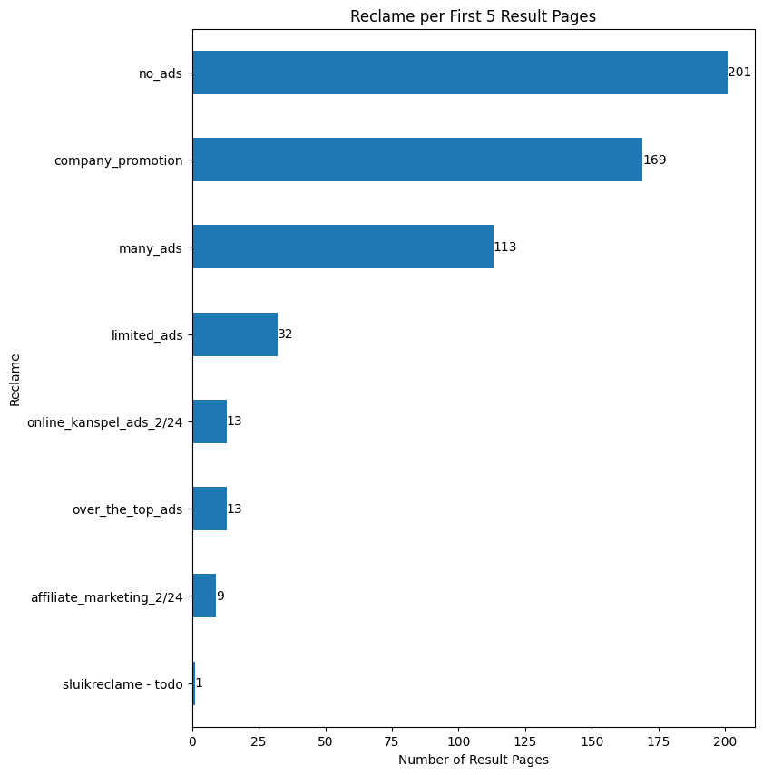
    


### Trackers


```python
sources["uBlocked trackers"].plot(
    kind="hist",
    histtype="step",
    bins=range(0, 90),
    title=f"Number of Blocked Trackers per Source (out of {len(sources)})",
    ylabel="Number of Blocked Trackers",
    xlabel="Number of Sources",
)
```


    <Axes: title={'center': 'Number of Blocked Trackers per Source (out of 542)'}, xlabel='Number of Sources', ylabel='Number of Blocked Trackers'>


    

    


### Ads


```python
ax = (
    sources["Reclame"]
    .str.split(",")
    .explode()
    .str.strip()
    .value_counts()
    .sort_index()
    .plot(
        kind="barh",
        title=f"Ad Categories per Source (out of {len(sources)})",
        xlabel="Count",
        ylabel="Ad Type",
    )
)
ax.bar_label(ax.containers[0])
```


    [Text(0, 0, '18'),
     Text(0, 0, '288'),
     Text(0, 0, '43'),
     Text(0, 0, '57'),
     Text(0, 0, '162'),
     Text(0, 0, '7'),
     Text(0, 0, '20'),
     Text(0, 0, '6')]


    

    


### Goal of Source


```python
ax = (
    sources["Conclusie over doel vd bron"]
    .str.split(",")
    .explode()
    .str.strip()
    .value_counts(ascending=True)
    .plot(
        kind="barh",
        title=f"Conclusions about the Purpose of the Source (out of {len(sources)})",
        xlabel="Count",
        ylabel="Conclusion",
        figsize=(8, 10),
    )
)
ax.bar_label(ax.containers[0])
```


    [Text(0, 0, '1'),
     Text(0, 0, '1'),
     Text(0, 0, '2'),
     Text(0, 0, '3'),
     Text(0, 0, '3'),
     Text(0, 0, '3'),
     Text(0, 0, '3'),
     Text(0, 0, '4'),
     Text(0, 0, '4'),
     Text(0, 0, '6'),
     Text(0, 0, '7'),
     Text(0, 0, '8'),
     Text(0, 0, '8'),
     Text(0, 0, '8'),
     Text(0, 0, '9'),
     Text(0, 0, '9'),
     Text(0, 0, '11'),
     Text(0, 0, '12'),
     Text(0, 0, '12'),
     Text(0, 0, '13'),
     Text(0, 0, '13'),
     Text(0, 0, '14'),
     Text(0, 0, '14'),
     Text(0, 0, '14'),
     Text(0, 0, '15'),
     Text(0, 0, '15'),
     Text(0, 0, '18'),
     Text(0, 0, '25'),
     Text(0, 0, '38'),
     Text(0, 0, '54'),
     Text(0, 0, '56'),
     Text(0, 0, '64'),
     Text(0, 0, '82'),
     Text(0, 0, '94')]


    

    


### Source: Thumbs-Up


```python
ax = (
    sources["Thumbs up 8-14?"]
    .value_counts(ascending=True)
    .plot(
        kind="barh",
        title=f"Thumbs Up for 8-14 years old? (out of {len(sources)})",
        xlabel="Number of Sources",
        ylabel="Thumbs Up",
    )
)
ax.bar_label(ax.containers[0])
```


    [Text(0, 0, '19'), Text(0, 0, '166'), Text(0, 0, '176'), Text(0, 0, '181')]


    

    


### About Page


```python
ax = (
    sources["Kwaliteit_about"]
    .value_counts(ascending=True)
    .plot(
        kind="barh",
        title=f"Quality of About Page per Source (out of {len(sources)})",
        xlabel="Number of Sources",
        ylabel="Quality of About Page",
    )
)
ax.bar_label(ax.containers[0])
```


    [Text(0, 0, '1'),
     Text(0, 0, '11'),
     Text(0, 0, '14'),
     Text(0, 0, '35'),
     Text(0, 0, '63'),
     Text(0, 0, '204'),
     Text(0, 0, '214')]


    

    


### Doelgroep vs. Thumbs-Up


```python
doelgroep_po = sources.loc[
    (sources["Vrije labels bron/onderwerp"].notna())
    & (sources["Vrije labels bron/onderwerp"].str.contains("doelgroep PO/8-12"))
]
doelgroep_po
```


<div>
<style scoped>
    .dataframe tbody tr th:only-of-type {
        vertical-align: middle;
    }

    .dataframe tbody tr th {
        vertical-align: top;
    }

    .dataframe thead th {
        text-align: right;
    }
</style>
<table border="1" class="dataframe">
  <thead>
    <tr style="text-align: right;">
      <th></th>
      <th>URL Domein</th>
      <th>Conclusie over doel vd bron</th>
      <th>Thumbs up 8-14?</th>
      <th>Sector</th>
      <th>Reclame</th>
      <th>Vrije labels bron/onderwerp</th>
      <th>uBlocked trackers</th>
      <th>Commercialiteit</th>
      <th>Onderwerpen</th>
      <th>Div Labels NGO</th>
      <th>...</th>
      <th>Created by</th>
      <th>URL Moederbedrijf</th>
      <th>SlimZ Resultaten DB</th>
      <th>Resultaten: toegankelijkheid</th>
      <th>Cookie info page</th>
      <th>More examples</th>
      <th>Related to Resultaten DB 01 (1) (Bronnen DB)</th>
      <th>Res: Ranking</th>
      <th>Res: soort result</th>
      <th>tld</th>
    </tr>
    <tr>
      <th>Name</th>
      <th></th>
      <th></th>
      <th></th>
      <th></th>
      <th></th>
      <th></th>
      <th></th>
      <th></th>
      <th></th>
      <th></th>
      <th></th>
      <th></th>
      <th></th>
      <th></th>
      <th></th>
      <th></th>
      <th></th>
      <th></th>
      <th></th>
      <th></th>
      <th></th>
    </tr>
  </thead>
  <tbody>
    <tr>
      <th>canonvannederland.nl</th>
      <td>https://www.canonvannederland.nl/</td>
      <td>kwaliteitsinfo-onderwijs (gratis)</td>
      <td>Ja</td>
      <td>Musea en archieven</td>
      <td>none</td>
      <td>doelgroep PO/8-12, doelgroep VO/12+, informati...</td>
      <td>4</td>
      <td>not_for_profit</td>
      <td>geschiedenis</td>
      <td>NaN</td>
      <td>...</td>
      <td>Maarten Sprenger</td>
      <td>https://www.openluchtmuseum.nl/</td>
      <td>NaN</td>
      <td>NaN</td>
      <td>https://www.canonvannederland.nl/nl/privacy#co...</td>
      <td>NaN</td>
      <td>NaN</td>
      <td>10,1,3</td>
      <td>informatief,informatief,informatief</td>
      <td>nl</td>
    </tr>
    <tr>
      <th>dierenwiki.nl</th>
      <td>https://dierenwiki.nl/</td>
      <td>aggregator/contenfarm</td>
      <td>Nee</td>
      <td>Online-bedrijven</td>
      <td>many_ads</td>
      <td>about-voorbeeld, doelgroep PO/8-12, doelgroep ...</td>
      <td>3</td>
      <td>commercieel</td>
      <td>dieren</td>
      <td>NaN</td>
      <td>...</td>
      <td>Maarten Sprenger</td>
      <td>NaN</td>
      <td>NaN</td>
      <td>NaN</td>
      <td>Footer. Beheerd door Google. Voldoet aan IAB T...</td>
      <td>NaN</td>
      <td>NaN</td>
      <td>4,5,10,5,6</td>
      <td>informatief,informatief,informatief,informatie...</td>
      <td>nl</td>
    </tr>
    <tr>
      <th>dierpedia.nl</th>
      <td>https://dierpedia.nl/</td>
      <td>aggregator/contenfarm, informatieproduct div. ...</td>
      <td>Nee</td>
      <td>Online-bedrijven</td>
      <td>limited_ads</td>
      <td>about-voorbeeld, doelgroep PO/8-12, doelgroep ...</td>
      <td>7</td>
      <td>commercieel</td>
      <td>dieren</td>
      <td>NaN</td>
      <td>...</td>
      <td>Maarten Sprenger</td>
      <td>https://www.heers.nl/</td>
      <td>NaN</td>
      <td>NaN</td>
      <td>NaN</td>
      <td>NaN</td>
      <td>NaN</td>
      <td>5</td>
      <td>informatief</td>
      <td>nl</td>
    </tr>
    <tr>
      <th>docukit.nl</th>
      <td>https://www.docukit.nl/</td>
      <td>kwaliteitsinfo voor 8-18</td>
      <td>Ja</td>
      <td>Uitgevers (educatief/literair)</td>
      <td>company_promotion</td>
      <td>bedrijfsinfo/uithangbord, doelgroep PO/8-12, i...</td>
      <td>1</td>
      <td>commercieel</td>
      <td>NaN</td>
      <td>NaN</td>
      <td>...</td>
      <td>Maarten Sprenger</td>
      <td>Schoolsupport</td>
      <td>NaN</td>
      <td>NaN</td>
      <td>heel onduidelijk; geen toestemming…</td>
      <td>NaN</td>
      <td>NaN</td>
      <td>9,8,5,6</td>
      <td>informatief,informatief,informatief,informatief</td>
      <td>nl</td>
    </tr>
    <tr>
      <th>natgeojunior.nl</th>
      <td>https://www.natgeojunior.nl</td>
      <td>kwaliteitsinfo voor 8-18</td>
      <td>Ja</td>
      <td>Uitgevers (educatief/literair)</td>
      <td>company_promotion</td>
      <td>doelgroep PO/8-12, promotioneel, webshop</td>
      <td>2</td>
      <td>commercieel</td>
      <td>NaN</td>
      <td>NaN</td>
      <td>...</td>
      <td>Maarten Sprenger</td>
      <td>https://www.blinkshop.nl/national-geographic-j...</td>
      <td>NaN</td>
      <td>NaN</td>
      <td>https://blink.nl/privacy/privacyverklaring-per...</td>
      <td>https://www.blinkshop.nl/national-geographic-j...</td>
      <td>NaN</td>
      <td>2</td>
      <td>informatief</td>
      <td>nl</td>
    </tr>
    <tr>
      <th>rangerclub.be</th>
      <td>https://rangerclub.be</td>
      <td>kwaliteitsinfo voor 8-18</td>
      <td>Ja</td>
      <td>Uitgevers (educatief/literair)</td>
      <td>company_promotion</td>
      <td>doelgroep PO/8-12, promotioneel</td>
      <td>5</td>
      <td>not_for_profit</td>
      <td>dieren, natuur</td>
      <td>NaN</td>
      <td>...</td>
      <td>Maarten Sprenger</td>
      <td>https://wwf.be/nl</td>
      <td>NaN</td>
      <td>NaN</td>
      <td>NaN</td>
      <td>NaN</td>
      <td>NaN</td>
      <td>7</td>
      <td>informatief</td>
      <td>be</td>
    </tr>
    <tr>
      <th>rangers.wwf.nl</th>
      <td>https://rangers.wwf.nl/</td>
      <td>informatie in het kader van goed doel, kwalite...</td>
      <td>Ja</td>
      <td>NGO/Goede doelen site</td>
      <td>company_promotion</td>
      <td>(product)informatie ihkv verkoop/bezoek, doelg...</td>
      <td>3</td>
      <td>not_for_profit</td>
      <td>dieren, natuur</td>
      <td>ANBI, CBF</td>
      <td>...</td>
      <td>Maarten Sprenger</td>
      <td>WWF</td>
      <td>NaN</td>
      <td>NaN</td>
      <td>cookie consent alleen vanuit start/footer by C...</td>
      <td>NaN</td>
      <td>NaN</td>
      <td>2</td>
      <td>informatief</td>
      <td>nl</td>
    </tr>
    <tr>
      <th>schoolsupport.nl</th>
      <td>https://schoolsupport.nl</td>
      <td>kwaliteitsinfo voor 8-18</td>
      <td>Ja</td>
      <td>Uitgevers (educatief/literair)</td>
      <td>company_promotion</td>
      <td>bedrijfsinfo/uithangbord, doelgroep PO/8-12, k...</td>
      <td>3</td>
      <td>commercieel</td>
      <td>NaN</td>
      <td>NaN</td>
      <td>...</td>
      <td>Maarten Sprenger</td>
      <td>NaN</td>
      <td>NaN</td>
      <td>NaN</td>
      <td>NaN</td>
      <td>NaN</td>
      <td>NaN</td>
      <td>9</td>
      <td>transactional</td>
      <td>nl</td>
    </tr>
    <tr>
      <th>schooltv.nl</th>
      <td>https://schooltv.nl/</td>
      <td>kwaliteitsinfo voor 8-18, publiek_mediaplatfor...</td>
      <td>Ja</td>
      <td>Publieke_omroep</td>
      <td>none</td>
      <td>doelgroep PO/8-12, doelgroep VO/12+, edutainme...</td>
      <td>12</td>
      <td>not_for_profit</td>
      <td>NaN</td>
      <td>NaN</td>
      <td>...</td>
      <td>Maarten Sprenger</td>
      <td>https://ntr.nl/site/tekst/over-ntr/8</td>
      <td>NaN</td>
      <td>NaN</td>
      <td>NaN</td>
      <td>NaN</td>
      <td>NaN</td>
      <td>5,2,4</td>
      <td>informatief,informatief,informatief</td>
      <td>nl</td>
    </tr>
    <tr>
      <th>superspreekbeurt.nl</th>
      <td>https://superspreekbeurt.nl</td>
      <td>aggregator/contenfarm</td>
      <td>Nee</td>
      <td>Online-bedrijven</td>
      <td>over_the_top_ads</td>
      <td>doelgroep PO/8-12, link/reclamevehikel, oud/ve...</td>
      <td>8</td>
      <td>commercieel</td>
      <td>NaN</td>
      <td>NaN</td>
      <td>...</td>
      <td>Maarten Sprenger</td>
      <td>NaN</td>
      <td>NaN</td>
      <td>NaN</td>
      <td>NaN</td>
      <td>NaN</td>
      <td>NaN</td>
      <td>6</td>
      <td>informatief</td>
      <td>nl</td>
    </tr>
    <tr>
      <th>taal-oefenen.nl</th>
      <td>https://www.taal-oefenen.nl</td>
      <td>kwaliteitsinfo-onderwijs (gratis), onderwijsco...</td>
      <td>Ja</td>
      <td>Uitgevers (educatief/literair)</td>
      <td>company_promotion</td>
      <td>doelgroep PO/8-12, informatie_primair_doel, lo...</td>
      <td>3</td>
      <td>commercieel</td>
      <td>NaN</td>
      <td>NaN</td>
      <td>...</td>
      <td>Maarten Sprenger</td>
      <td>https://www.junioreinstein.nl/</td>
      <td>NaN</td>
      <td>NaN</td>
      <td>https://www.taal-oefenen.nl/webshop/about/cookies</td>
      <td>NaN</td>
      <td>NaN</td>
      <td>2</td>
      <td>informatief</td>
      <td>nl</td>
    </tr>
    <tr>
      <th>weetwatjeviert.nl</th>
      <td>https://weetwatjeviert.nl/</td>
      <td>kennisbank/centrum +, kwaliteitsinfo voor 8-18</td>
      <td>Ja</td>
      <td>Musea en archieven</td>
      <td>none</td>
      <td>doelgroep PO/8-12, informatie_primair_doel, sa...</td>
      <td>1</td>
      <td>not_for_profit</td>
      <td>NaN</td>
      <td>NaN</td>
      <td>...</td>
      <td>Maarten Sprenger</td>
      <td>NaN</td>
      <td>NaN</td>
      <td>NaN</td>
      <td>NaN</td>
      <td>NaN</td>
      <td>NaN</td>
      <td>5</td>
      <td>informatief</td>
      <td>nl</td>
    </tr>
    <tr>
      <th>wikikids.nl</th>
      <td>https://wikikids.nl/</td>
      <td>gebruikersplatform geen kwaliteitsgarantie non...</td>
      <td>Nee</td>
      <td>Amateur/vrijwilligersverenigingen</td>
      <td>none</td>
      <td>community, doelgroep PO/8-12, informatie_prima...</td>
      <td>4</td>
      <td>not_for_profit</td>
      <td>NaN</td>
      <td>NaN</td>
      <td>...</td>
      <td>Maarten Sprenger</td>
      <td>NaN</td>
      <td>NaN</td>
      <td>NaN</td>
      <td>NaN</td>
      <td>NaN</td>
      <td>NaN</td>
      <td>4,2,7,3,7,3,4,2,7,6,5,5,6,11,3,6,7,6,8,9,7,8,7,4</td>
      <td>informatief,informatief,informatief,navigation...</td>
      <td>nl</td>
    </tr>
    <tr>
      <th>wildvanfreek.nl</th>
      <td>https://www.wildvanfreek.nl</td>
      <td>kwaliteitsinfo voor 8-18</td>
      <td>Ja</td>
      <td>Uitgevers (educatief/literair)</td>
      <td>company_promotion</td>
      <td>doelgroep PO/8-12, webshop</td>
      <td>5</td>
      <td>commercieel</td>
      <td>dieren</td>
      <td>NaN</td>
      <td>...</td>
      <td>Maarten Sprenger</td>
      <td>https://blink.nl/</td>
      <td>NaN</td>
      <td>NaN</td>
      <td>https://www.wildvanfreek.nl/privacy-en-cookieb...</td>
      <td>NaN</td>
      <td>NaN</td>
      <td>4,9</td>
      <td>informatief,informatief</td>
      <td>nl</td>
    </tr>
    <tr>
      <th>willemwever.kro-ncrv.nl</th>
      <td>https://willemwever.kro-ncrv.nl/</td>
      <td>kwaliteitsinfo voor 8-18, publiek_mediaplatfor...</td>
      <td>Ja</td>
      <td>Publieke_omroep</td>
      <td>none</td>
      <td>doelgroep PO/8-12, edutainment, infinite_scrol...</td>
      <td>4</td>
      <td>not_for_profit</td>
      <td>NaN</td>
      <td>NaN</td>
      <td>...</td>
      <td>Maarten Sprenger</td>
      <td>https://kro-ncrv.nl/</td>
      <td>NaN</td>
      <td>NaN</td>
      <td>NaN</td>
      <td>NaN</td>
      <td>NaN</td>
      <td>4,6</td>
      <td>informatief,informatief</td>
      <td>nl</td>
    </tr>
    <tr>
      <th>youtube.com/@VarkentjeRundje</th>
      <td>https://www.youtube.com/@VarkentjeRundje/</td>
      <td>entertainment</td>
      <td>Just-in-case</td>
      <td>Publieke_omroep</td>
      <td>limited_ads</td>
      <td>BigTech, doelgroep PO/8-12, entertainment, inf...</td>
      <td>25</td>
      <td>commercieel</td>
      <td>NaN</td>
      <td>NaN</td>
      <td>...</td>
      <td>Maarten Sprenger</td>
      <td>https://www.rundshop.nl/</td>
      <td>NaN</td>
      <td>NaN</td>
      <td>https://policies.google.com/technologies/cooki...</td>
      <td>NaN</td>
      <td>NaN</td>
      <td>1,2,3,6,7,8,9,10</td>
      <td>informatief,informatief,informatief,informatie...</td>
      <td>com</td>
    </tr>
  </tbody>
</table>
<p>16 rows × 32 columns</p>
</div>


```python
doelgroep_vo = sources.loc[
    (sources["Vrije labels bron/onderwerp"].notna())
    & (sources["Vrije labels bron/onderwerp"].str.contains("doelgroep VO/12+"))
]
doelgroep_vo
```


<div>
<style scoped>
    .dataframe tbody tr th:only-of-type {
        vertical-align: middle;
    }

    .dataframe tbody tr th {
        vertical-align: top;
    }

    .dataframe thead th {
        text-align: right;
    }
</style>
<table border="1" class="dataframe">
  <thead>
    <tr style="text-align: right;">
      <th></th>
      <th>URL Domein</th>
      <th>Conclusie over doel vd bron</th>
      <th>Thumbs up 8-14?</th>
      <th>Sector</th>
      <th>Reclame</th>
      <th>Vrije labels bron/onderwerp</th>
      <th>uBlocked trackers</th>
      <th>Commercialiteit</th>
      <th>Onderwerpen</th>
      <th>Div Labels NGO</th>
      <th>...</th>
      <th>Created by</th>
      <th>URL Moederbedrijf</th>
      <th>SlimZ Resultaten DB</th>
      <th>Resultaten: toegankelijkheid</th>
      <th>Cookie info page</th>
      <th>More examples</th>
      <th>Related to Resultaten DB 01 (1) (Bronnen DB)</th>
      <th>Res: Ranking</th>
      <th>Res: soort result</th>
      <th>tld</th>
    </tr>
    <tr>
      <th>Name</th>
      <th></th>
      <th></th>
      <th></th>
      <th></th>
      <th></th>
      <th></th>
      <th></th>
      <th></th>
      <th></th>
      <th></th>
      <th></th>
      <th></th>
      <th></th>
      <th></th>
      <th></th>
      <th></th>
      <th></th>
      <th></th>
      <th></th>
      <th></th>
      <th></th>
    </tr>
  </thead>
  <tbody>
    <tr>
      <th>aljevragen.nl</th>
      <td>https://www.aljevragen.nl</td>
      <td>informatieproduct div. commercieel</td>
      <td>Just-in-case</td>
      <td>Leraren/Docenten</td>
      <td>limited_ads</td>
      <td>doelgroep VO/12+, onderwijscontent</td>
      <td>7</td>
      <td>commercieel</td>
      <td>NaN</td>
      <td>NaN</td>
      <td>...</td>
      <td>Maarten Sprenger</td>
      <td>NaN</td>
      <td>NaN</td>
      <td>NaN</td>
      <td>NaN</td>
      <td>NaN</td>
      <td>NaN</td>
      <td>10</td>
      <td>informatief</td>
      <td>nl</td>
    </tr>
    <tr>
      <th>allesoverseks.be</th>
      <td>https://www.allesoverseks.be/</td>
      <td>kwaliteitsinfo voor 8-18</td>
      <td>Ja</td>
      <td>Overheid (of i.o.v.)</td>
      <td>none</td>
      <td>doelgroep VO/12+, informatie_primair_doel, ove...</td>
      <td>3</td>
      <td>not_for_profit</td>
      <td>lichaam</td>
      <td>NaN</td>
      <td>...</td>
      <td>Maarten Sprenger</td>
      <td>https://www.sensoa.be/</td>
      <td>NaN</td>
      <td>NaN</td>
      <td>https://www.allesoverseks.be/cookie-en-privacy...</td>
      <td>NaN</td>
      <td>NaN</td>
      <td>5,6,3,4</td>
      <td>informatief,informatief,informatief,informatief</td>
      <td>be</td>
    </tr>
    <tr>
      <th>biologielessen.nl</th>
      <td>https://biologielessen.nl/</td>
      <td>kwaliteitsinfo-onderwijs (gratis)</td>
      <td>Ja</td>
      <td>Leraren/Docenten</td>
      <td>none</td>
      <td>doelgroep VO/12+, informatie_primair_doel, ken...</td>
      <td>1</td>
      <td>not_for_profit</td>
      <td>lichaam</td>
      <td>NaN</td>
      <td>...</td>
      <td>Maarten Sprenger</td>
      <td>ism Noordhoff Uitgevers</td>
      <td>NaN</td>
      <td>NaN</td>
      <td>NaN</td>
      <td>NaN</td>
      <td>NaN</td>
      <td>6,8,9,4,5</td>
      <td>informatief,informatief,informatief,informatie...</td>
      <td>nl</td>
    </tr>
    <tr>
      <th>canonvannederland.nl</th>
      <td>https://www.canonvannederland.nl/</td>
      <td>kwaliteitsinfo-onderwijs (gratis)</td>
      <td>Ja</td>
      <td>Musea en archieven</td>
      <td>none</td>
      <td>doelgroep PO/8-12, doelgroep VO/12+, informati...</td>
      <td>4</td>
      <td>not_for_profit</td>
      <td>geschiedenis</td>
      <td>NaN</td>
      <td>...</td>
      <td>Maarten Sprenger</td>
      <td>https://www.openluchtmuseum.nl/</td>
      <td>NaN</td>
      <td>NaN</td>
      <td>https://www.canonvannederland.nl/nl/privacy#co...</td>
      <td>NaN</td>
      <td>NaN</td>
      <td>10,1,3</td>
      <td>informatief,informatief,informatief</td>
      <td>nl</td>
    </tr>
    <tr>
      <th>cyberpoli.nl</th>
      <td>https://www.cyberpoli.nl/</td>
      <td>kwaliteitsinfo voor 8-18</td>
      <td>Ja</td>
      <td>Onafhankelijk Kennis- en adviescentrum</td>
      <td>none</td>
      <td>about-voorbeeld, doelgroep VO/12+, kennisbank/...</td>
      <td>4</td>
      <td>not_for_profit</td>
      <td>gezondheid, lichaam</td>
      <td>ANBI, CBF</td>
      <td>...</td>
      <td>Maarten Sprenger</td>
      <td>NaN</td>
      <td>NaN</td>
      <td>NaN</td>
      <td>https://www.cyberpoli.nl/info/cookies</td>
      <td>https://www.cyberpoli.nl/info/spelregels</td>
      <td>NaN</td>
      <td>2</td>
      <td>informatief</td>
      <td>nl</td>
    </tr>
    <tr>
      <th>dierenwiki.nl</th>
      <td>https://dierenwiki.nl/</td>
      <td>aggregator/contenfarm</td>
      <td>Nee</td>
      <td>Online-bedrijven</td>
      <td>many_ads</td>
      <td>about-voorbeeld, doelgroep PO/8-12, doelgroep ...</td>
      <td>3</td>
      <td>commercieel</td>
      <td>dieren</td>
      <td>NaN</td>
      <td>...</td>
      <td>Maarten Sprenger</td>
      <td>NaN</td>
      <td>NaN</td>
      <td>NaN</td>
      <td>Footer. Beheerd door Google. Voldoet aan IAB T...</td>
      <td>NaN</td>
      <td>NaN</td>
      <td>4,5,10,5,6</td>
      <td>informatief,informatief,informatief,informatie...</td>
      <td>nl</td>
    </tr>
    <tr>
      <th>dierpedia.nl</th>
      <td>https://dierpedia.nl/</td>
      <td>aggregator/contenfarm, informatieproduct div. ...</td>
      <td>Nee</td>
      <td>Online-bedrijven</td>
      <td>limited_ads</td>
      <td>about-voorbeeld, doelgroep PO/8-12, doelgroep ...</td>
      <td>7</td>
      <td>commercieel</td>
      <td>dieren</td>
      <td>NaN</td>
      <td>...</td>
      <td>Maarten Sprenger</td>
      <td>https://www.heers.nl/</td>
      <td>NaN</td>
      <td>NaN</td>
      <td>NaN</td>
      <td>NaN</td>
      <td>NaN</td>
      <td>5</td>
      <td>informatief</td>
      <td>nl</td>
    </tr>
    <tr>
      <th>examenoverzicht.nl</th>
      <td>https://www.examenoverzicht.nl/</td>
      <td>onderwijscontent (betaald)</td>
      <td>Just-in-case</td>
      <td>Online-bedrijven</td>
      <td>company_promotion</td>
      <td>bedrijfsinfo/uithangbord, doelgroep VO/12+, pr...</td>
      <td>3</td>
      <td>commercieel</td>
      <td>NaN</td>
      <td>NaN</td>
      <td>...</td>
      <td>Maarten Sprenger</td>
      <td>NaN</td>
      <td>NaN</td>
      <td>NaN</td>
      <td>NaN</td>
      <td>NaN</td>
      <td>NaN</td>
      <td>5</td>
      <td>informatief</td>
      <td>nl</td>
    </tr>
    <tr>
      <th>jouwggd.nl</th>
      <td>https://www.jouwggd.nl/</td>
      <td>kwaliteitsinfo-gezondheidsorganisaties</td>
      <td>Ja</td>
      <td>Federatieve instelling/unie</td>
      <td>none</td>
      <td>doelgroep VO/12+, informatie_primair_doel, ken...</td>
      <td>1</td>
      <td>not_for_profit</td>
      <td>gezondheid, lichaam</td>
      <td>NaN</td>
      <td>...</td>
      <td>Maarten Sprenger</td>
      <td>NaN</td>
      <td>NaN</td>
      <td>NaN</td>
      <td>NaN</td>
      <td>NaN</td>
      <td>NaN</td>
      <td>4,4</td>
      <td>navigational,informatief</td>
      <td>nl</td>
    </tr>
    <tr>
      <th>mlochemie.nl</th>
      <td>https://www.mlochemie.nl</td>
      <td>kwaliteitsinfo-onderwijs (gratis)</td>
      <td>Ja</td>
      <td>Uitgevers (educatief/literair)</td>
      <td>none</td>
      <td>doelgroep VO/12+, informatie_primair_doel, ond...</td>
      <td>1</td>
      <td>commercieel</td>
      <td>NaN</td>
      <td>NaN</td>
      <td>...</td>
      <td>Maarten Sprenger</td>
      <td>https://syntaxmedia.nl/</td>
      <td>NaN</td>
      <td>NaN</td>
      <td>-</td>
      <td>NaN</td>
      <td>NaN</td>
      <td>3</td>
      <td>informatief</td>
      <td>nl</td>
    </tr>
    <tr>
      <th>mrchadd.nl</th>
      <td>https://www.mrchadd.nl/</td>
      <td>kwaliteitsinfo-onderwijs (gratis), onderwijsco...</td>
      <td>Ja</td>
      <td>Online-bedrijven educatief</td>
      <td>company_promotion</td>
      <td>doelgroep VO/12+, informatie_primair_doel, ond...</td>
      <td>10</td>
      <td>commercieel</td>
      <td>NaN</td>
      <td>NaN</td>
      <td>...</td>
      <td>Maarten Sprenger</td>
      <td>NaN</td>
      <td>NaN</td>
      <td>NaN</td>
      <td>NaN</td>
      <td>NaN</td>
      <td>NaN</td>
      <td>7,5</td>
      <td>informatief,informatief</td>
      <td>nl</td>
    </tr>
    <tr>
      <th>schooltv.nl</th>
      <td>https://schooltv.nl/</td>
      <td>kwaliteitsinfo voor 8-18, publiek_mediaplatfor...</td>
      <td>Ja</td>
      <td>Publieke_omroep</td>
      <td>none</td>
      <td>doelgroep PO/8-12, doelgroep VO/12+, edutainme...</td>
      <td>12</td>
      <td>not_for_profit</td>
      <td>NaN</td>
      <td>NaN</td>
      <td>...</td>
      <td>Maarten Sprenger</td>
      <td>https://ntr.nl/site/tekst/over-ntr/8</td>
      <td>NaN</td>
      <td>NaN</td>
      <td>NaN</td>
      <td>NaN</td>
      <td>NaN</td>
      <td>5,2,4</td>
      <td>informatief,informatief,informatief</td>
      <td>nl</td>
    </tr>
    <tr>
      <th>seksualiteit.nl</th>
      <td>https://seksualiteit.nl</td>
      <td>informatie in het kader van goed doel, kennisb...</td>
      <td>Ja</td>
      <td>Onafhankelijk Kennis- en adviescentrum</td>
      <td>none</td>
      <td>doelgroep VO/12+, kennisbank/centrum, vakinfor...</td>
      <td>1</td>
      <td>not_for_profit</td>
      <td>lichaam</td>
      <td>NaN</td>
      <td>...</td>
      <td>Maarten Sprenger</td>
      <td>https://rutgers.nl/</td>
      <td>NaN</td>
      <td>NaN</td>
      <td>https://seksualiteit.nl/disclaimer-privacyverk...</td>
      <td>NaN</td>
      <td>NaN</td>
      <td>10,6</td>
      <td>informatief,navigational</td>
      <td>nl</td>
    </tr>
    <tr>
      <th>sense.info</th>
      <td>https://sense.info</td>
      <td>kwaliteitsinfo voor 8-18</td>
      <td>Ja</td>
      <td>Overheid (of i.o.v.)</td>
      <td>none</td>
      <td>doelgroep VO/12+, samenwerkingsproject, voorli...</td>
      <td>5</td>
      <td>not_for_profit</td>
      <td>lichaam</td>
      <td>NaN</td>
      <td>...</td>
      <td>Maarten Sprenger</td>
      <td>NaN</td>
      <td>NaN</td>
      <td>NaN</td>
      <td>NaN</td>
      <td>NaN</td>
      <td>NaN</td>
      <td>1,2,8</td>
      <td>navigational,navigational,informatief</td>
      <td>info</td>
    </tr>
    <tr>
      <th>surinamewebquest.nl</th>
      <td>http://www.surinamewebquest.nl/</td>
      <td>kwaliteitsinfo-onderwijs (gratis)</td>
      <td>Ja</td>
      <td>Leraren/Docenten</td>
      <td>none</td>
      <td>doelgroep VO/12+, informatie_primair_doel</td>
      <td>0</td>
      <td>not_for_profit</td>
      <td>NaN</td>
      <td>NaN</td>
      <td>...</td>
      <td>Maarten Sprenger</td>
      <td>NaN</td>
      <td>NaN</td>
      <td>NaN</td>
      <td>-</td>
      <td>NaN</td>
      <td>NaN</td>
      <td>8</td>
      <td>informatief</td>
      <td>nl</td>
    </tr>
    <tr>
      <th>wetenschapsschool.nl</th>
      <td>https://www.wetenschapsschool.nl/</td>
      <td>kwaliteitsinfo-onderwijs (gratis), onderwijsco...</td>
      <td>Ja</td>
      <td>Leraren/Docenten</td>
      <td>none</td>
      <td>about-voorbeeld, doelgroep VO/12+, informatie_...</td>
      <td>11</td>
      <td>commercieel</td>
      <td>NaN</td>
      <td>NaN</td>
      <td>...</td>
      <td>Maarten Sprenger</td>
      <td>NaN</td>
      <td>NaN</td>
      <td>NaN</td>
      <td>NaN</td>
      <td>https://www.wetenschapsschool.nl/new_chapters/...</td>
      <td>NaN</td>
      <td>6,9</td>
      <td>informatief,informatief</td>
      <td>nl</td>
    </tr>
    <tr>
      <th>youtube.com/@WouterRenkema</th>
      <td>https://www.youtube.com/@WouterRenkema</td>
      <td>kwaliteitsinfo-onderwijs (gratis)</td>
      <td>Ja</td>
      <td>Leraren/Docenten</td>
      <td>many_ads</td>
      <td>BigTech, doelgroep VO/12+, infinite_scroll, in...</td>
      <td>23</td>
      <td>commercieel</td>
      <td>NaN</td>
      <td>NaN</td>
      <td>...</td>
      <td>Maarten Sprenger</td>
      <td>https://scheikundehavovwo.nl</td>
      <td>NaN</td>
      <td>NaN</td>
      <td>https://policies.google.com/technologies/cooki...</td>
      <td>NaN</td>
      <td>NaN</td>
      <td>5</td>
      <td>informatief</td>
      <td>com</td>
    </tr>
  </tbody>
</table>
<p>17 rows × 32 columns</p>
</div>


```python
from matplotlib_venn import venn2

venn2(
    [set(doelgroep_po.index), set(doelgroep_vo.index)],
    set_labels=["Doelgroep PO", "Doelgroep VO"],
)
```


    <matplotlib_venn._common.VennDiagram at 0x32398e510>


    

    


```python
ax = (
    doelgroep_po["Thumbs up 8-14?"]
    .value_counts()
    .plot(
        kind="barh",
        title="'Doelgroep PO': Thumbs-up per Bron?",
        xlabel="Number of Sources",
    )
)
ax.bar_label(ax.containers[0])
```


    [Text(0, 0, '11'), Text(0, 0, '4'), Text(0, 0, '1')]


    

    


```python
ax = (
    doelgroep_vo["Thumbs up 8-14?"]
    .value_counts()
    .plot(
        kind="barh",
        title="'Doelgroep VO': Thumbs-up per Bron?",
        xlabel="Number of Sources",
    )
)
ax.bar_label(ax.containers[0])
```


    [Text(0, 0, '13'), Text(0, 0, '2'), Text(0, 0, '2')]


    

    


### Top-level domains


```python
sources["tld"] = sources["URL Domein"].str.split(".").str[-1].str.split("/").str[0]
sources["tld"].value_counts()
```


    tld
    nl                                 390
    com                                 76
    be                                  40
    org                                 13
    net                                  7
    nu                                   3
    brussels                             2
    fr                                   2
    n                                    1
    gov                                  1
    122                                  1
    info                                 1
    shop                                 1
    gent                                 1
    redirect                             1
    do?ctx=46163,46173&anav=4154073      1
    html                                 1
    Name: count, dtype: int64


```python
n = 5
tlds = pd.Series(sources["tld"].value_counts()[:n])

ja_counts = pd.Series(
    [
        len(sources.loc[(sources["tld"] == tld) & (sources["Thumbs up 8-14?"] == "Ja")])
        for tld in tlds.index
    ],
    index=tlds.index,
)
ja_counts
ax = (ja_counts / tlds).plot(
    kind="barh",
    title=f"Good Sources (Thumbs-Up) per top-level domain (top {n})",
    xlabel="Proportion of positive 'Thumbs-Up'",
    legend=False,
)

bar_labels = [
    f"({int(ja_counts[tld])} / { sources['tld'].value_counts()[tld]})"
    for tld in tlds.index
]
ax.bar_label(ax.containers[0], labels=bar_labels)
```


    [Text(0, 0, '(128 / 390)'),
     Text(0, 0, '(6 / 76)'),
     Text(0, 0, '(27 / 40)'),
     Text(0, 0, '(7 / 13)'),
     Text(0, 0, '(3 / 7)')]


    
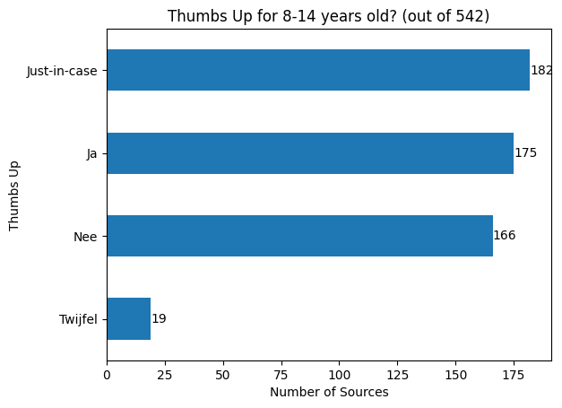
    


## Queries and Result Pages

### Ok/Good/Bad for Students


```python
column = "good_for_students"

grouped = results_sources.groupby("Query")
ax = grouped.apply(
    lambda group: group[column].sum() / len(group), include_groups=False
).plot(
    kind="hist",
    bins=10,
    title=f"'{column}' results per Query (out of {len(grouped)})",
    xlabel=f"Portion of '{column}' results",
    ylabel="Number of Queries",
    xticks=[0, 0.1, 0.2, 0.3, 0.4, 0.5, 0.6, 0.7, 0.8, 0.9, 1],
)
ax.bar_label(ax.containers[0])
```


    [Text(0, 0, '35'),
     Text(0, 0, '20'),
     Text(0, 0, '15'),
     Text(0, 0, '9'),
     Text(0, 0, '2'),
     Text(0, 0, '8'),
     Text(0, 0, '6'),
     Text(0, 0, '4'),
     Text(0, 0, '0'),
     Text(0, 0, '1')]


    

    


```python
column = "bad_for_students"

grouped = results_sources.groupby("Query")
ax = grouped.apply(
    lambda group: group[column].sum() / len(group), include_groups=False
).plot(
    kind="hist",
    bins=10,
    title=f"'{column}' results per Query (out of {len(grouped)})",
    xlabel=f"Portion of '{column}' results",
    ylabel="Number of Queries",
    xticks=[0, 0.1, 0.2, 0.3, 0.4, 0.5, 0.6, 0.7, 0.8, 0.9, 1],
)
ax.bar_label(ax.containers[0])
```


    [Text(0, 0, '65'),
     Text(0, 0, '26'),
     Text(0, 0, '5'),
     Text(0, 0, '3'),
     Text(0, 0, '0'),
     Text(0, 0, '0'),
     Text(0, 0, '0'),
     Text(0, 0, '0'),
     Text(0, 0, '0'),
     Text(0, 0, '1')]


    

    


```python
column = "ok_for_students"

grouped = results_sources.groupby("Query")
ax = grouped.apply(
    lambda group: group[column].sum() / len(group), include_groups=False
).plot(
    kind="hist",
    bins=10,
    title=f"'{column}' results per Query (out of {len(grouped)})",
    xlabel=f"Portion of '{column}' results",
    ylabel="Number of Queries",
    xticks=[0, 0.1, 0.2, 0.3, 0.4, 0.5, 0.6, 0.7, 0.8, 0.9, 1],
)
ax.bar_label(ax.containers[0])
```


    [Text(0, 0, '13'),
     Text(0, 0, '11'),
     Text(0, 0, '16'),
     Text(0, 0, '10'),
     Text(0, 0, '7'),
     Text(0, 0, '11'),
     Text(0, 0, '11'),
     Text(0, 0, '14'),
     Text(0, 0, '5'),
     Text(0, 0, '2')]


    

    


```python
columns = ["good_for_students", "bad_for_students", "ok_for_students"]
results_sources.loc[~results_sources[columns].any(axis=1)]
```


<div>
<style scoped>
    .dataframe tbody tr th:only-of-type {
        vertical-align: middle;
    }

    .dataframe tbody tr th {
        vertical-align: top;
    }

    .dataframe thead th {
        text-align: right;
    }
</style>
<table border="1" class="dataframe">
  <thead>
    <tr style="text-align: right;">
      <th></th>
      <th>Bron: Thumbs up?</th>
      <th>Titel resultaat</th>
      <th>Link/resultaat</th>
      <th>Query</th>
      <th>Relevant?</th>
      <th>vrije tags page</th>
      <th>Bronnen DB</th>
      <th>Bron: Inst/Bedrijf</th>
      <th>Toegankelijkheid doelgroep (indruk)</th>
      <th>Soort Resultaat</th>
      <th>...</th>
      <th>SlimZ Resultaten DB</th>
      <th>Resultaten: toegankelijkheid</th>
      <th>Cookie info page</th>
      <th>More examples</th>
      <th>Related to Resultaten DB 01 (1) (Bronnen DB)</th>
      <th>Res: Ranking</th>
      <th>Res: soort result</th>
      <th>ok_for_students</th>
      <th>good_for_students</th>
      <th>bad_for_students</th>
    </tr>
  </thead>
  <tbody>
    <tr>
      <th>1</th>
      <td>Nee</td>
      <td>Gratis woordenboek | Van Dale NEDERLAND</td>
      <td>https://www.vandale.nl/gratis-woordenboek/nede...</td>
      <td>wat betekent schotse</td>
      <td>relevant</td>
      <td>NaN</td>
      <td>vandale.nl</td>
      <td>Van Dale Uitgevers, Utrecht/Antwerpen</td>
      <td>complex</td>
      <td>informatief</td>
      <td>...</td>
      <td>NaN</td>
      <td>NaN</td>
      <td>NaN</td>
      <td>NaN</td>
      <td>NaN</td>
      <td>3,6,3,5,9,4</td>
      <td>informatief,informatief,informatief,informatie...</td>
      <td>False</td>
      <td>False</td>
      <td>False</td>
    </tr>
    <tr>
      <th>18</th>
      <td>Nee</td>
      <td>D-reizen - Cruise Middellandse Zee – Veel keuz...</td>
      <td>https://www.d-reizen.nl/cruise/middellandse-ze...</td>
      <td>middellandse zee</td>
      <td>niet_relevant</td>
      <td>NaN</td>
      <td>d-reizen.nl</td>
      <td>D-reizen</td>
      <td>nvt</td>
      <td>navigational</td>
      <td>...</td>
      <td>NaN</td>
      <td>NaN</td>
      <td>https://www.d-reizen.nl/informatie/cookies - C...</td>
      <td>NaN</td>
      <td>NaN</td>
      <td>10</td>
      <td>navigational</td>
      <td>False</td>
      <td>False</td>
      <td>False</td>
    </tr>
    <tr>
      <th>35</th>
      <td>Nee</td>
      <td>Max Havelaar Koffie - Alles Over Deze Fairtrad...</td>
      <td>https://www.koffiekwaliteit.nl/fairtrade-max-h...</td>
      <td>keurmerk max</td>
      <td>relevant</td>
      <td>NaN</td>
      <td>koffiekwaliteit.nl</td>
      <td>koffiekwaliteit.nl</td>
      <td>redelijk_begrijpelijk</td>
      <td>informatief</td>
      <td>...</td>
      <td>NaN</td>
      <td>NaN</td>
      <td>NaN</td>
      <td>NaN</td>
      <td>NaN</td>
      <td>7</td>
      <td>informatief</td>
      <td>False</td>
      <td>False</td>
      <td>False</td>
    </tr>
    <tr>
      <th>45</th>
      <td>Nee</td>
      <td>Gratis woordenboek | Van Dale NEDERLAND</td>
      <td>https://www.vandale.nl/gratis-woordenboek/nede...</td>
      <td>leven</td>
      <td>relevant</td>
      <td>NaN</td>
      <td>vandale.nl</td>
      <td>Van Dale Uitgevers, Utrecht/Antwerpen</td>
      <td>redelijk_begrijpelijk</td>
      <td>informatief</td>
      <td>...</td>
      <td>NaN</td>
      <td>NaN</td>
      <td>NaN</td>
      <td>NaN</td>
      <td>NaN</td>
      <td>3,6,3,5,9,4</td>
      <td>informatief,informatief,informatief,informatie...</td>
      <td>False</td>
      <td>False</td>
      <td>False</td>
    </tr>
    <tr>
      <th>85</th>
      <td>Nee</td>
      <td>Cristiano Ronaldo (@Cristiano) / X</td>
      <td>https://twitter.com/Cristiano</td>
      <td>ronaldo</td>
      <td>relevant</td>
      <td>NaN</td>
      <td>twitter.com X</td>
      <td>X voorheen Twitter</td>
      <td>eenvoudig</td>
      <td>navigational</td>
      <td>...</td>
      <td>NaN</td>
      <td>NaN</td>
      <td>NaN</td>
      <td>NaN</td>
      <td>NaN</td>
      <td>8,4,6,5,6</td>
      <td>navigational,navigational,navigational,informa...</td>
      <td>False</td>
      <td>False</td>
      <td>False</td>
    </tr>
    <tr>
      <th>...</th>
      <td>...</td>
      <td>...</td>
      <td>...</td>
      <td>...</td>
      <td>...</td>
      <td>...</td>
      <td>...</td>
      <td>...</td>
      <td>...</td>
      <td>...</td>
      <td>...</td>
      <td>...</td>
      <td>...</td>
      <td>...</td>
      <td>...</td>
      <td>...</td>
      <td>...</td>
      <td>...</td>
      <td>...</td>
      <td>...</td>
      <td>...</td>
    </tr>
    <tr>
      <th>936</th>
      <td>Nee</td>
      <td>Stoomschip - Wikikids</td>
      <td>https://wikikids.nl/Stoomschip</td>
      <td>stoomschip</td>
      <td>relevant</td>
      <td>NaN</td>
      <td>wikikids.nl</td>
      <td>Stichting Wikikids, ondersteund door Kennisnet...</td>
      <td>redelijk_begrijpelijk</td>
      <td>informatief</td>
      <td>...</td>
      <td>NaN</td>
      <td>NaN</td>
      <td>NaN</td>
      <td>NaN</td>
      <td>NaN</td>
      <td>4,2,7,3,7,3,4,2,7,6,5,5,6,11,3,6,7,6,8,9,7,8,7,4</td>
      <td>informatief,informatief,informatief,navigation...</td>
      <td>False</td>
      <td>False</td>
      <td>False</td>
    </tr>
    <tr>
      <th>943</th>
      <td>Nee</td>
      <td>Lijst van gouverneurs en commissarissen van de...</td>
      <td>https://wikikids.nl/Lijst_van_gouverneurs_en_c...</td>
      <td>De gouverneur van limburg</td>
      <td>relevant</td>
      <td>NaN</td>
      <td>wikikids.nl</td>
      <td>Stichting Wikikids, ondersteund door Kennisnet...</td>
      <td>complex</td>
      <td>informatief</td>
      <td>...</td>
      <td>NaN</td>
      <td>NaN</td>
      <td>NaN</td>
      <td>NaN</td>
      <td>NaN</td>
      <td>4,2,7,3,7,3,4,2,7,6,5,5,6,11,3,6,7,6,8,9,7,8,7,4</td>
      <td>informatief,informatief,informatief,navigation...</td>
      <td>False</td>
      <td>False</td>
      <td>False</td>
    </tr>
    <tr>
      <th>969</th>
      <td>Nee</td>
      <td>Knups - Wist je datjes</td>
      <td>https://www.knups.nl/wist-je-dat</td>
      <td>wist je dat?</td>
      <td>relevant</td>
      <td>outdated</td>
      <td>knups.nl</td>
      <td>Knups.nl</td>
      <td>redelijk_begrijpelijk</td>
      <td>informatief</td>
      <td>...</td>
      <td>NaN</td>
      <td>NaN</td>
      <td>NaN</td>
      <td>NaN</td>
      <td>NaN</td>
      <td>1</td>
      <td>informatief</td>
      <td>False</td>
      <td>False</td>
      <td>False</td>
    </tr>
    <tr>
      <th>970</th>
      <td>Nee</td>
      <td>33 Nutteloze feitjes om enorm indruk mee te ma...</td>
      <td>https://www.saarmagazine.nl/33-nutteloze-feitj...</td>
      <td>wist je dat?</td>
      <td>relevant</td>
      <td>NaN</td>
      <td>saarmagazine.nl</td>
      <td>Saar Magazine, Snippet Media</td>
      <td>redelijk_begrijpelijk</td>
      <td>informatief</td>
      <td>...</td>
      <td>NaN</td>
      <td>NaN</td>
      <td>NaN</td>
      <td>NaN</td>
      <td>NaN</td>
      <td>4,2</td>
      <td>informatief,informatief</td>
      <td>False</td>
      <td>False</td>
      <td>False</td>
    </tr>
    <tr>
      <th>972</th>
      <td>Nee</td>
      <td>23 Rare feitjes waar je niks aan hebt maar die...</td>
      <td>https://www.saarmagazine.nl/23-rare-feitjes-wa...</td>
      <td>wist je dat?</td>
      <td>relevant</td>
      <td>NaN</td>
      <td>saarmagazine.nl</td>
      <td>Saar Magazine, Snippet Media</td>
      <td>redelijk_begrijpelijk</td>
      <td>informatief</td>
      <td>...</td>
      <td>NaN</td>
      <td>NaN</td>
      <td>NaN</td>
      <td>NaN</td>
      <td>NaN</td>
      <td>4,2</td>
      <td>informatief,informatief</td>
      <td>False</td>
      <td>False</td>
      <td>False</td>
    </tr>
  </tbody>
</table>
<p>99 rows × 61 columns</p>
</div>


```python
columns = ["good_for_students", "bad_for_students"]
results_sources.loc[results_sources[columns].all(axis=1)]
```


<div>
<style scoped>
    .dataframe tbody tr th:only-of-type {
        vertical-align: middle;
    }

    .dataframe tbody tr th {
        vertical-align: top;
    }

    .dataframe thead th {
        text-align: right;
    }
</style>
<table border="1" class="dataframe">
  <thead>
    <tr style="text-align: right;">
      <th></th>
      <th>Bron: Thumbs up?</th>
      <th>Titel resultaat</th>
      <th>Link/resultaat</th>
      <th>Query</th>
      <th>Relevant?</th>
      <th>vrije tags page</th>
      <th>Bronnen DB</th>
      <th>Bron: Inst/Bedrijf</th>
      <th>Toegankelijkheid doelgroep (indruk)</th>
      <th>Soort Resultaat</th>
      <th>...</th>
      <th>SlimZ Resultaten DB</th>
      <th>Resultaten: toegankelijkheid</th>
      <th>Cookie info page</th>
      <th>More examples</th>
      <th>Related to Resultaten DB 01 (1) (Bronnen DB)</th>
      <th>Res: Ranking</th>
      <th>Res: soort result</th>
      <th>ok_for_students</th>
      <th>good_for_students</th>
      <th>bad_for_students</th>
    </tr>
  </thead>
  <tbody>
    <tr>
      <th>401</th>
      <td>Ja</td>
      <td>Correct gebruik van aanhalingstekens – Correct...</td>
      <td>https://www.correctnederlands.nl/correct-gebru...</td>
      <td>wat is een begin aanhaling</td>
      <td>relevant</td>
      <td>NaN</td>
      <td>correctnederlands.nl</td>
      <td>Correct Nederlands, Frank den Hond</td>
      <td>redelijk_begrijpelijk</td>
      <td>informatief</td>
      <td>...</td>
      <td>NaN</td>
      <td>NaN</td>
      <td>NaN</td>
      <td>NaN</td>
      <td>NaN</td>
      <td>10</td>
      <td>informatief</td>
      <td>True</td>
      <td>True</td>
      <td>True</td>
    </tr>
  </tbody>
</table>
<p>1 rows × 61 columns</p>
</div>


### Soort Resultaten Distribution per Query


```python
column = "Soort Resultaat"
value = "informatief"

ax = (
    results.groupby("Query")
    .apply(
        lambda x: x[column]
        .str.split(",")
        .explode()
        .str.strip()
        .value_counts(ascending=True)
    )
    .reset_index()
    .set_index(column)
    .loc[value]
    .plot(
        kind="hist",
        title=f"Distribution of Result Types per Query ({len(results.groupby('Query'))} queries)",
        xlabel=f"Number of '{value}' Results",
        ylabel="Number of Queries",
        legend=False,
    )
)
ax.bar_label(ax.containers[0])
```

    /var/folders/d8/j5_fyf8941j_492zvf8948y40000gn/T/ipykernel_52598/2519624949.py:6: DeprecationWarning: DataFrameGroupBy.apply operated on the grouping columns. This behavior is deprecated, and in a future version of pandas the grouping columns will be excluded from the operation. Either pass `include_groups=False` to exclude the groupings or explicitly select the grouping columns after groupby to silence this warning.
      .apply(


    [Text(0, 0, '3'),
     Text(0, 0, '5'),
     Text(0, 0, '5'),
     Text(0, 0, '5'),
     Text(0, 0, '4'),
     Text(0, 0, '3'),
     Text(0, 0, '10'),
     Text(0, 0, '11'),
     Text(0, 0, '25'),
     Text(0, 0, '21')]


    

    


```python
column = "Soort Resultaat"
value = "transactional"

ax = (
    results.groupby("Query")
    .apply(
        lambda x: x[column]
        .str.split(",")
        .explode()
        .str.strip()
        .value_counts(ascending=True)
    )
    .reset_index()
    .set_index(column)
    .loc[value]
    .plot(
        kind="hist",
        title=f"Distribution of Result Types per Query ({len(results.groupby('Query'))} queries)",
        xlabel=f"Number of '{value}' Results",
        ylabel="Number of Queries",
        legend=False,
    )
)
ax.bar_label(ax.containers[0])
```

    /var/folders/d8/j5_fyf8941j_492zvf8948y40000gn/T/ipykernel_52598/1416800553.py:6: DeprecationWarning: DataFrameGroupBy.apply operated on the grouping columns. This behavior is deprecated, and in a future version of pandas the grouping columns will be excluded from the operation. Either pass `include_groups=False` to exclude the groupings or explicitly select the grouping columns after groupby to silence this warning.
      .apply(


    [Text(0, 0, '10'),
     Text(0, 0, '7'),
     Text(0, 0, '3'),
     Text(0, 0, '3'),
     Text(0, 0, '0'),
     Text(0, 0, '1'),
     Text(0, 0, '2'),
     Text(0, 0, '1'),
     Text(0, 0, '3'),
     Text(0, 0, '5')]


    

    


```python
column = "Soort Resultaat"
value = "navigational"

ax = (
    results.groupby("Query")
    .apply(
        lambda x: x[column]
        .str.split(",")
        .explode()
        .str.strip()
        .value_counts(ascending=True)
    )
    .reset_index()
    .set_index(column)
    .loc[value]
    .plot(
        kind="hist",
        title=f"Distribution of Result Types per Query ({len(results.groupby('Query'))} queries)",
        xlabel=f"Number of '{value}' Results",
        ylabel="Number of Queries",
        legend=False,
    )
)
ax.bar_label(ax.containers[0])
```

    /var/folders/d8/j5_fyf8941j_492zvf8948y40000gn/T/ipykernel_52598/3201790118.py:6: DeprecationWarning: DataFrameGroupBy.apply operated on the grouping columns. This behavior is deprecated, and in a future version of pandas the grouping columns will be excluded from the operation. Either pass `include_groups=False` to exclude the groupings or explicitly select the grouping columns after groupby to silence this warning.
      .apply(


    [Text(0, 0, '28'),
     Text(0, 0, '18'),
     Text(0, 0, '8'),
     Text(0, 0, '5'),
     Text(0, 0, '5'),
     Text(0, 0, '2'),
     Text(0, 0, '0'),
     Text(0, 0, '2'),
     Text(0, 0, '0'),
     Text(0, 0, '2')]


    

    


### Accessibility Distribution per Query


```python
column = "Toegankelijkheid doelgroep (indruk)"
value = "redelijk_begrijpelijk"

ax = (
    results.groupby("Query")
    .apply(
        lambda x: x[column]
        .str.split(",")
        .explode()
        .str.strip()
        .value_counts(ascending=True)
    )
    .reset_index()
    .set_index(column)
    .loc[value]
    .plot(
        kind="hist",
        title=f"Distribution of Result Types per Query ({len(results.groupby('Query'))} queries)",
        xlabel=f"Number of '{value}' Results",
        ylabel="Number of Queries",
        legend=False,
    )
)
ax.bar_label(ax.containers[0])
```

    /var/folders/d8/j5_fyf8941j_492zvf8948y40000gn/T/ipykernel_52598/3774244460.py:6: DeprecationWarning: DataFrameGroupBy.apply operated on the grouping columns. This behavior is deprecated, and in a future version of pandas the grouping columns will be excluded from the operation. Either pass `include_groups=False` to exclude the groupings or explicitly select the grouping columns after groupby to silence this warning.
      .apply(


    [Text(0, 0, '16'),
     Text(0, 0, '9'),
     Text(0, 0, '16'),
     Text(0, 0, '7'),
     Text(0, 0, '11'),
     Text(0, 0, '10'),
     Text(0, 0, '9'),
     Text(0, 0, '3'),
     Text(0, 0, '1'),
     Text(0, 0, '1')]


    

    


```python
column = "Toegankelijkheid doelgroep (indruk)"
value = "complex"

ax = (
    results.groupby("Query")
    .apply(
        lambda x: x[column]
        .str.split(",")
        .explode()
        .str.strip()
        .value_counts(ascending=True)
    )
    .reset_index()
    .set_index(column)
    .loc[value]
    .plot(
        kind="hist",
        title=f"Distribution of Result Types per Query ({len(results.groupby('Query'))} queries)",
        xlabel=f"Number of '{value}' Results",
        ylabel="Number of Queries",
        legend=False,
    )
)
ax.bar_label(ax.containers[0])
```

    /var/folders/d8/j5_fyf8941j_492zvf8948y40000gn/T/ipykernel_52598/1130612084.py:6: DeprecationWarning: DataFrameGroupBy.apply operated on the grouping columns. This behavior is deprecated, and in a future version of pandas the grouping columns will be excluded from the operation. Either pass `include_groups=False` to exclude the groupings or explicitly select the grouping columns after groupby to silence this warning.
      .apply(


    [Text(0, 0, '13'),
     Text(0, 0, '15'),
     Text(0, 0, '12'),
     Text(0, 0, '11'),
     Text(0, 0, '12'),
     Text(0, 0, '5'),
     Text(0, 0, '4'),
     Text(0, 0, '5'),
     Text(0, 0, '1'),
     Text(0, 0, '1')]


    

    


### Age


```python
bins = range(all_queries["Leeftijd"].min(), all_queries["Leeftijd"].max() + 2)

hist = all_queries.hist(column="Leeftijd", bins=bins)
for ax in hist.flatten():
    ax.set_xlabel("Age")
    ax.set_ylabel("Number of Queries")
    ax.bar_label(ax.containers[0])
ax.title.set_text(f"Age Distribution of Queries (out of {len(all_queries)})")
ax.set_xlabel("Age")
ax.set_ylabel("Number of Queries")
```


    Text(0, 0.5, 'Number of Queries')


    

    


### Query Length


```python
lengths = all_queries["Query"].str.strip().str.split().str.len().value_counts()
values = range(1, lengths.index.max() + 1)

ax = lengths.reindex(values, fill_value=0).plot(
    kind="bar",
    title=f"Query Lengths (out of {len(all_queries)})",
    ylabel="Count",
    xlabel="Number of Words",
    figsize=(8, 10),
    yticks=range(0, 120, 5),
)
ax.bar_label(ax.containers[0])
```


    [Text(0, 0, '108'),
     Text(0, 0, '50'),
     Text(0, 0, '22'),
     Text(0, 0, '10'),
     Text(0, 0, '2'),
     Text(0, 0, '5'),
     Text(0, 0, '1'),
     Text(0, 0, '1'),
     Text(0, 0, '0'),
     Text(0, 0, '1')]


    

    


### Query Type


```python
ax = (
    all_queries["Soort Query (select)"]
    .value_counts(ascending=True)
    .plot(
        kind="barh",
        title=f"Query Types (out of {len(all_queries)})",
        ylabel="Query Type",
        xlabel="Count",
    )
)
ax.bar_label(ax.containers[0])
```


    [Text(0, 0, '16'),
     Text(0, 0, '19'),
     Text(0, 0, '36'),
     Text(0, 0, '55'),
     Text(0, 0, '74')]


    

    


```python
ax = (
    all_queries["Extra (multi)"]
    .str.split(",")
    .explode()
    .str.strip()
    .value_counts(ascending=True)
    .plot(
        kind="barh",
        title=f"Extra Information per Query (out of {len(all_queries)})",
        xlabel="Count",
        ylabel="Extra Information",
    )
)
ax.bar_label(ax.containers[0])
```


    [Text(0, 0, '6'),
     Text(0, 0, '8'),
     Text(0, 0, '16'),
     Text(0, 0, '24'),
     Text(0, 0, '36')]


    

    


### Result Page Extras


```python
ax = (
    all_queries["Extra (top-down)"]
    .str.split(", ")
    .explode()
    .value_counts(ascending=True)
    .plot(
        kind="barh",
        title=f"'Extra' fields per query (out of {len(all_queries)}; multiple possible)",
        figsize=(8, 8),
        xlabel="Count",
        ylabel="Extra Field",
    )
)
ax.bar_label(ax.containers[0])
```


    [Text(0, 0, '1'),
     Text(0, 0, '1'),
     Text(0, 0, '1'),
     Text(0, 0, '1'),
     Text(0, 0, '1'),
     Text(0, 0, '1'),
     Text(0, 0, '1'),
     Text(0, 0, '1'),
     Text(0, 0, '1'),
     Text(0, 0, '1'),
     Text(0, 0, '1'),
     Text(0, 0, '1'),
     Text(0, 0, '1'),
     Text(0, 0, '1'),
     Text(0, 0, '2'),
     Text(0, 0, '2'),
     Text(0, 0, '2'),
     Text(0, 0, '2'),
     Text(0, 0, '2'),
     Text(0, 0, '2'),
     Text(0, 0, '2'),
     Text(0, 0, '3'),
     Text(0, 0, '3'),
     Text(0, 0, '6'),
     Text(0, 0, '7'),
     Text(0, 0, '7'),
     Text(0, 0, '8'),
     Text(0, 0, '12'),
     Text(0, 0, '15'),
     Text(0, 0, '25'),
     Text(0, 0, '29'),
     Text(0, 0, '68'),
     Text(0, 0, '86')]


    

    


# Export


```python
%pip install nbconvert rpds-py==0.5.3
```

    Requirement already satisfied: nbconvert in /Users/carstenschnober/SlimZoeken/100queries/.venv/lib/python3.11/site-packages (7.16.3)
    Requirement already satisfied: rpds-py==0.5.3 in /Users/carstenschnober/SlimZoeken/100queries/.venv/lib/python3.11/site-packages (0.5.3)
    Requirement already satisfied: beautifulsoup4 in /Users/carstenschnober/SlimZoeken/100queries/.venv/lib/python3.11/site-packages (from nbconvert) (4.12.3)
    Requirement already satisfied: bleach!=5.0.0 in /Users/carstenschnober/SlimZoeken/100queries/.venv/lib/python3.11/site-packages (from nbconvert) (6.1.0)
    Requirement already satisfied: defusedxml in /Users/carstenschnober/SlimZoeken/100queries/.venv/lib/python3.11/site-packages (from nbconvert) (0.7.1)
    Requirement already satisfied: jinja2>=3.0 in /Users/carstenschnober/SlimZoeken/100queries/.venv/lib/python3.11/site-packages (from nbconvert) (3.1.3)
    Requirement already satisfied: jupyter-core>=4.7 in /Users/carstenschnober/SlimZoeken/100queries/.venv/lib/python3.11/site-packages (from nbconvert) (5.7.1)
    Requirement already satisfied: jupyterlab-pygments in /Users/carstenschnober/SlimZoeken/100queries/.venv/lib/python3.11/site-packages (from nbconvert) (0.3.0)
    Requirement already satisfied: markupsafe>=2.0 in /Users/carstenschnober/SlimZoeken/100queries/.venv/lib/python3.11/site-packages (from nbconvert) (2.1.5)
    Requirement already satisfied: mistune<4,>=2.0.3 in /Users/carstenschnober/SlimZoeken/100queries/.venv/lib/python3.11/site-packages (from nbconvert) (3.0.2)
    Requirement already satisfied: nbclient>=0.5.0 in /Users/carstenschnober/SlimZoeken/100queries/.venv/lib/python3.11/site-packages (from nbconvert) (0.10.0)
    Requirement already satisfied: nbformat>=5.7 in /Users/carstenschnober/SlimZoeken/100queries/.venv/lib/python3.11/site-packages (from nbconvert) (5.10.4)
    Requirement already satisfied: packaging in /Users/carstenschnober/SlimZoeken/100queries/.venv/lib/python3.11/site-packages (from nbconvert) (23.2)
    Requirement already satisfied: pandocfilters>=1.4.1 in /Users/carstenschnober/SlimZoeken/100queries/.venv/lib/python3.11/site-packages (from nbconvert) (1.5.1)
    Requirement already satisfied: pygments>=2.4.1 in /Users/carstenschnober/SlimZoeken/100queries/.venv/lib/python3.11/site-packages (from nbconvert) (2.17.2)
    Requirement already satisfied: tinycss2 in /Users/carstenschnober/SlimZoeken/100queries/.venv/lib/python3.11/site-packages (from nbconvert) (1.2.1)
    Requirement already satisfied: traitlets>=5.1 in /Users/carstenschnober/SlimZoeken/100queries/.venv/lib/python3.11/site-packages (from nbconvert) (5.14.1)
    Requirement already satisfied: six>=1.9.0 in /Users/carstenschnober/SlimZoeken/100queries/.venv/lib/python3.11/site-packages (from bleach!=5.0.0->nbconvert) (1.16.0)
    Requirement already satisfied: webencodings in /Users/carstenschnober/SlimZoeken/100queries/.venv/lib/python3.11/site-packages (from bleach!=5.0.0->nbconvert) (0.5.1)
    Requirement already satisfied: platformdirs>=2.5 in /Users/carstenschnober/SlimZoeken/100queries/.venv/lib/python3.11/site-packages (from jupyter-core>=4.7->nbconvert) (4.2.0)
    Requirement already satisfied: jupyter-client>=6.1.12 in /Users/carstenschnober/SlimZoeken/100queries/.venv/lib/python3.11/site-packages (from nbclient>=0.5.0->nbconvert) (8.6.0)
    Requirement already satisfied: fastjsonschema>=2.15 in /Users/carstenschnober/SlimZoeken/100queries/.venv/lib/python3.11/site-packages (from nbformat>=5.7->nbconvert) (2.19.1)
    Requirement already satisfied: jsonschema>=2.6 in /Users/carstenschnober/SlimZoeken/100queries/.venv/lib/python3.11/site-packages (from nbformat>=5.7->nbconvert) (4.17.3)
    Requirement already satisfied: soupsieve>1.2 in /Users/carstenschnober/SlimZoeken/100queries/.venv/lib/python3.11/site-packages (from beautifulsoup4->nbconvert) (2.5)
    Requirement already satisfied: attrs>=17.4.0 in /Users/carstenschnober/SlimZoeken/100queries/.venv/lib/python3.11/site-packages (from jsonschema>=2.6->nbformat>=5.7->nbconvert) (23.2.0)
    Requirement already satisfied: pyrsistent!=0.17.0,!=0.17.1,!=0.17.2,>=0.14.0 in /Users/carstenschnober/SlimZoeken/100queries/.venv/lib/python3.11/site-packages (from jsonschema>=2.6->nbformat>=5.7->nbconvert) (0.20.0)
    Requirement already satisfied: python-dateutil>=2.8.2 in /Users/carstenschnober/SlimZoeken/100queries/.venv/lib/python3.11/site-packages (from jupyter-client>=6.1.12->nbclient>=0.5.0->nbconvert) (2.8.2)
    Requirement already satisfied: pyzmq>=23.0 in /Users/carstenschnober/SlimZoeken/100queries/.venv/lib/python3.11/site-packages (from jupyter-client>=6.1.12->nbclient>=0.5.0->nbconvert) (25.1.2)
    Requirement already satisfied: tornado>=6.2 in /Users/carstenschnober/SlimZoeken/100queries/.venv/lib/python3.11/site-packages (from jupyter-client>=6.1.12->nbclient>=0.5.0->nbconvert) (6.4)
    
    [notice] A new release of pip is available: 23.3.2 -> 24.1.2
    [notice] To update, run: pip install --upgrade pip
    Note: you may need to restart the kernel to use updated packages.


```python
!jupyter nbconvert --to markdown analysis.ipynb
```

    zsh:1: /Users/carstenschnober/.local/bin/jupyter: bad interpreter: /Users/carstenschnober/opt/anaconda3/envs/SoS/bin/python: no such file or directory
    [NbConvertApp] Converting notebook analysis.ipynb to markdown
    [NbConvertApp] Support files will be in analysis_files/
    [NbConvertApp] Writing 232647 bytes to analysis.md

