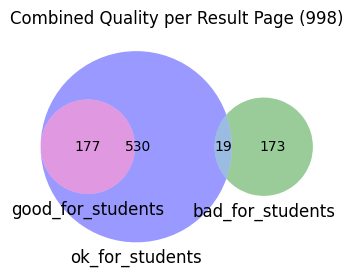
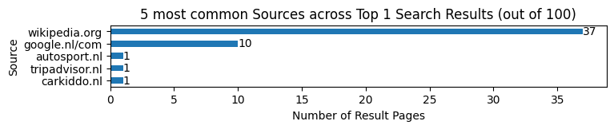
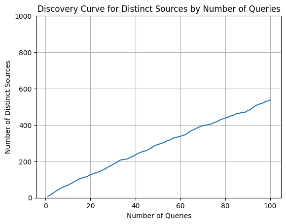
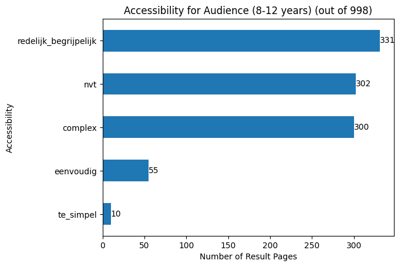
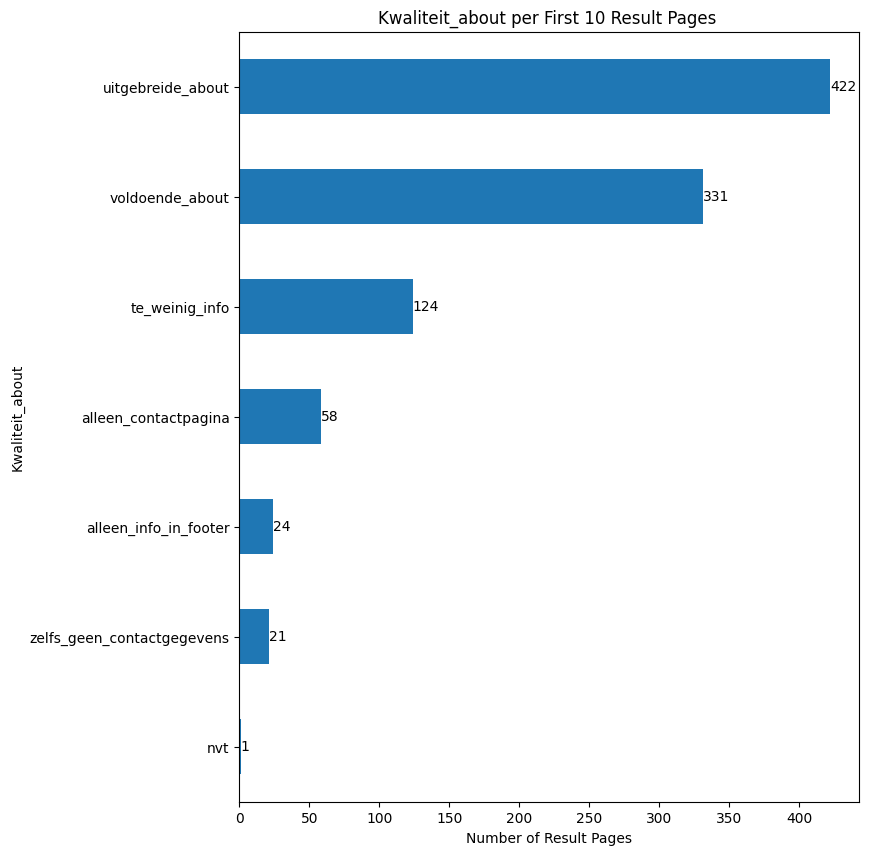
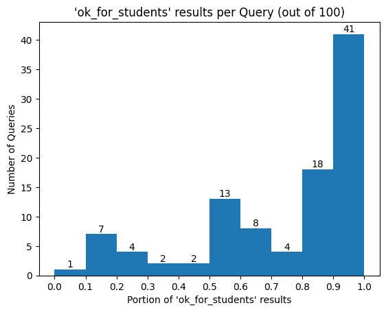

# Install Requirements


```python
%pip install pandas matplotlib matplotlib-venn
```

    Requirement already satisfied: pandas in /Users/carstenschnober/SlimZoeken/100queries/.venv/lib/python3.11/site-packages (2.2.0)
    Requirement already satisfied: matplotlib in /Users/carstenschnober/SlimZoeken/100queries/.venv/lib/python3.11/site-packages (3.8.3)
    Requirement already satisfied: matplotlib-venn in /Users/carstenschnober/SlimZoeken/100queries/.venv/lib/python3.11/site-packages (0.11.10)
    Requirement already satisfied: numpy<2,>=1.23.2 in /Users/carstenschnober/SlimZoeken/100queries/.venv/lib/python3.11/site-packages (from pandas) (1.26.4)
    Requirement already satisfied: python-dateutil>=2.8.2 in /Users/carstenschnober/SlimZoeken/100queries/.venv/lib/python3.11/site-packages (from pandas) (2.8.2)
    Requirement already satisfied: pytz>=2020.1 in /Users/carstenschnober/SlimZoeken/100queries/.venv/lib/python3.11/site-packages (from pandas) (2024.1)
    Requirement already satisfied: tzdata>=2022.7 in /Users/carstenschnober/SlimZoeken/100queries/.venv/lib/python3.11/site-packages (from pandas) (2023.4)
    Requirement already satisfied: contourpy>=1.0.1 in /Users/carstenschnober/SlimZoeken/100queries/.venv/lib/python3.11/site-packages (from matplotlib) (1.2.0)
    Requirement already satisfied: cycler>=0.10 in /Users/carstenschnober/SlimZoeken/100queries/.venv/lib/python3.11/site-packages (from matplotlib) (0.12.1)
    Requirement already satisfied: fonttools>=4.22.0 in /Users/carstenschnober/SlimZoeken/100queries/.venv/lib/python3.11/site-packages (from matplotlib) (4.49.0)
    Requirement already satisfied: kiwisolver>=1.3.1 in /Users/carstenschnober/SlimZoeken/100queries/.venv/lib/python3.11/site-packages (from matplotlib) (1.4.5)
    Requirement already satisfied: packaging>=20.0 in /Users/carstenschnober/SlimZoeken/100queries/.venv/lib/python3.11/site-packages (from matplotlib) (23.2)
    Requirement already satisfied: pillow>=8 in /Users/carstenschnober/SlimZoeken/100queries/.venv/lib/python3.11/site-packages (from matplotlib) (10.2.0)
    Requirement already satisfied: pyparsing>=2.3.1 in /Users/carstenschnober/SlimZoeken/100queries/.venv/lib/python3.11/site-packages (from matplotlib) (3.1.1)
    Requirement already satisfied: scipy in /Users/carstenschnober/SlimZoeken/100queries/.venv/lib/python3.11/site-packages (from matplotlib-venn) (1.13.0)
    Requirement already satisfied: six>=1.5 in /Users/carstenschnober/SlimZoeken/100queries/.venv/lib/python3.11/site-packages (from python-dateutil>=2.8.2->pandas) (1.16.0)
    
    [notice] A new release of pip is available: 23.3.2 -> 24.0
    [notice] To update, run: pip install --upgrade pip
    Note: you may need to restart the kernel to use updated packages.


```python
import pandas as pd
```

    /var/folders/d8/j5_fyf8941j_492zvf8948y40000gn/T/ipykernel_40744/4080736814.py:1: DeprecationWarning: 
    Pyarrow will become a required dependency of pandas in the next major release of pandas (pandas 3.0),
    (to allow more performant data types, such as the Arrow string type, and better interoperability with other libraries)
    but was not found to be installed on your system.
    If this would cause problems for you,
    please provide us feedback at https://github.com/pandas-dev/pandas/issues/54466
            
      import pandas as pd


# Load Data


```python
from pathlib import Path

REPOSITORY_PATH = Path().absolute().parent
DATA_DIR = REPOSITORY_PATH / Path("data")

assert DATA_DIR.is_dir()
```

## Load Sources DB


```python
prefixes = ["https://", "http://", "www.", '"']
suffixes = ["/", '"']


def strip_url(url: str) -> str:
    for prefix in sorted(prefixes):
        if url.startswith(prefix):
            url = url[len(prefix) :]
    for suffix in sorted(suffixes):
        if url.endswith(suffix):
            url = url[: -len(suffix)]
    return url.strip()


urls = [
    "http://muurmooi.nl/",
    "museumpassmusees.be",
    '"wikipedia.org "',
    "http://www.fonq.nl",
]
expecteds = ["muurmooi.nl", "museumpassmusees.be", "wikipedia.org", "fonq.nl"]

for url, expected in zip(urls, expecteds):
    stripped = strip_url(url)
    assert stripped == expected, f"Got: {stripped}\tExpected: {expected}"
```


```python
BRONNEN_DB_DIR = DATA_DIR / Path(
    "f97a61e7-0270-42e5-83b2-c5455a64cacf_Export-d7865d0b-a9d8-41e8-a97d-041c871b6774"
)
assert BRONNEN_DB_DIR.is_dir()

BRONNEN_FILE = BRONNEN_DB_DIR / Path(
    "Bronnen DB ebb1bca364c64cfebc8109b4fc3951eb_all.csv"
)
assert BRONNEN_FILE.is_file()
```


```python
sources = (
    pd.read_csv(
        BRONNEN_FILE,
        keep_default_na=True,
        dtype={"uBlocked trackers": "Int64"},
        converters={"Name": strip_url},
    )
    .dropna(subset=["Name", "NR"])
    .set_index("Name", verify_integrity=True)
)
sources.head()
```


<div>
<style scoped>
    .dataframe tbody tr th:only-of-type {
        vertical-align: middle;
    }

    .dataframe tbody tr th {
        vertical-align: top;
    }

    .dataframe thead th {
        text-align: right;
    }
</style>
<table border="1" class="dataframe">
  <thead>
    <tr style="text-align: right;">
      <th></th>
      <th>URL Domein</th>
      <th>Onderwerpen</th>
      <th>Sector</th>
      <th>Reclame</th>
      <th>uBlocked trackers</th>
      <th>Commercialiteit</th>
      <th>Div Labels NGO</th>
      <th>Conclusie over doel vd bron</th>
      <th>Vrije labels bron/onderwerp</th>
      <th>Thumbs up 8-14?</th>
      <th>...</th>
      <th>Created time</th>
      <th>Created by</th>
      <th>URL Moederbedrijf</th>
      <th>SlimZ Resultaten DB</th>
      <th>Resultaten: toegankelijkheid</th>
      <th>Cookie info page</th>
      <th>More examples</th>
      <th>Toegankelijkheidspagina</th>
      <th>Related to Resultaten DB 01 (1) (Bronnen DB)</th>
      <th>Res: Ranking</th>
    </tr>
    <tr>
      <th>Name</th>
      <th></th>
      <th></th>
      <th></th>
      <th></th>
      <th></th>
      <th></th>
      <th></th>
      <th></th>
      <th></th>
      <th></th>
      <th></th>
      <th></th>
      <th></th>
      <th></th>
      <th></th>
      <th></th>
      <th></th>
      <th></th>
      <th></th>
      <th></th>
      <th></th>
    </tr>
  </thead>
  <tbody>
    <tr>
      <th>24baby.nl</th>
      <td>https://www.24baby.nl/</td>
      <td>NaN</td>
      <td>Winkels en bedrijven div</td>
      <td>over_the_top_ads</td>
      <td>5</td>
      <td>commercieel</td>
      <td>NaN</td>
      <td>div. commercieel informatieproducten, reclamev...</td>
      <td>nieuws, promotioneel, reclamevehikel, webshop,...</td>
      <td>Just-in-case</td>
      <td>...</td>
      <td>November 6, 2023 11:09 AM</td>
      <td>Maarten Sprenger</td>
      <td>NaN</td>
      <td>NaN</td>
      <td>redelijk begrijpelijk,eenvoudig,redelijk begri...</td>
      <td>https://24baby.app/privacybeleid</td>
      <td>NaN</td>
      <td>-</td>
      <td>NaN</td>
      <td>10,7,1,4,2</td>
    </tr>
    <tr>
      <th>24kitchen.nl</th>
      <td>https://www.24kitchen.nl</td>
      <td>NaN</td>
      <td>Entertainment-industrie</td>
      <td>company_promotion, limited_ads, sluikreclame -...</td>
      <td>17</td>
      <td>commercieel</td>
      <td>NaN</td>
      <td>div. commercieel informatieproducten, entertai...</td>
      <td>entertainment, infotainment, promotioneel</td>
      <td>Just-in-case</td>
      <td>...</td>
      <td>December 14, 2023 6:43 PM</td>
      <td>Maarten Sprenger</td>
      <td>https://privacy.thewaltdisneycompany.com/nl/de...</td>
      <td>NaN</td>
      <td>redelijk begrijpelijk</td>
      <td>https://privacy.thewaltdisneycompany.com/nl/pr...</td>
      <td>NaN</td>
      <td>-</td>
      <td>NaN</td>
      <td>6</td>
    </tr>
    <tr>
      <th>333travel.nl</th>
      <td>https://www.333travel.nl/</td>
      <td>NaN</td>
      <td>Reisorganisaties</td>
      <td>company_promotion</td>
      <td>7</td>
      <td>commercieel</td>
      <td>NaN</td>
      <td>webshop/winkel+promotioneel deel</td>
      <td>(product)informatie ihkv verkoop/bezoek, bedri...</td>
      <td>Just-in-case</td>
      <td>...</td>
      <td>February 23, 2024 5:35 PM</td>
      <td>Maarten Sprenger</td>
      <td>NaN</td>
      <td>NaN</td>
      <td>nvt</td>
      <td>https://www.333travel.nl/cookies</td>
      <td>NaN</td>
      <td>NaN</td>
      <td>NaN</td>
      <td>8</td>
    </tr>
    <tr>
      <th>absolutefacts.nl</th>
      <td>https://www.absolutefacts.nl/</td>
      <td>geschiedenis</td>
      <td>Internetbedrijven</td>
      <td>company_promotion</td>
      <td>2</td>
      <td>commercieel</td>
      <td>NaN</td>
      <td>div. commercieel informatieproducten</td>
      <td>informatie_primair_doel, webshop</td>
      <td>Twijfel</td>
      <td>...</td>
      <td>December 14, 2023 7:29 PM</td>
      <td>Maarten Sprenger</td>
      <td>https://www.absolutefigures.nl/</td>
      <td>NaN</td>
      <td>redelijk begrijpelijk</td>
      <td>https://www.absolutefacts.nl/uw-privacy.htm</td>
      <td>NaN</td>
      <td>-</td>
      <td>NaN</td>
      <td>7</td>
    </tr>
    <tr>
      <th>accuautoshop.nl</th>
      <td>https://www.accuautoshop.nl/</td>
      <td>NaN</td>
      <td>Winkels en bedrijven div</td>
      <td>company_promotion</td>
      <td>6</td>
      <td>commercieel</td>
      <td>NaN</td>
      <td>webshop/winkel+promotioneel deel</td>
      <td>webshop</td>
      <td>Nee</td>
      <td>...</td>
      <td>February 22, 2024 3:23 PM</td>
      <td>Maarten Sprenger</td>
      <td>NaN</td>
      <td>NaN</td>
      <td>nvt,nvt</td>
      <td>NaN</td>
      <td>NaN</td>
      <td>NaN</td>
      <td>NaN</td>
      <td>10,9</td>
    </tr>
  </tbody>
</table>
<p>5 rows × 30 columns</p>
</div>


```python
sources.columns
```


    Index(['URL Domein', 'Onderwerpen', 'Sector', 'Reclame', 'uBlocked trackers',
           'Commercialiteit', 'Div Labels NGO', 'Conclusie over doel vd bron',
           'Vrije labels bron/onderwerp', 'Thumbs up 8-14?', 'Status',
           'About page', ' Notes', 'Kwaliteit_about', 'Instelling/Bedrijf/Persoon',
           'Resultaten: vrije labels', 'Moederbedrijf DB', 'NR', 'Resultaten DB',
           'Extra URL', 'Created time', 'Created by', 'URL Moederbedrijf',
           'SlimZ Resultaten DB', 'Resultaten: toegankelijkheid',
           'Cookie info page', 'More examples', 'Toegankelijkheidspagina',
           'Related to Resultaten DB 01 (1) (Bronnen DB)', 'Res: Ranking'],
          dtype='object')


```python
len(sources)
```


    542


## Load Query DB


```python
QUERY_DIR = DATA_DIR / Path(
    "79e1ae76-d451-4dc2-b673-21a1cb695008_Export-1a68a705-979c-4b52-b7e5-0fa1a2fbc8b1/Query DB 01 5a4aec0449af4acc87a45c19be574353"
)
assert QUERY_DIR.is_dir()

QUERY_FILE = QUERY_DIR / Path("Untitled cacf3a0313a84561bac9b6ea48ecc189_all.csv")
assert QUERY_FILE.is_file()
```


```python
all_queries = pd.read_csv(QUERY_FILE)

queries = (
    all_queries[all_queries["OK-100"] == "Yes"]
    .drop(["Created time"], axis=1)
    .astype({"Query": pd.StringDtype()})
)
queries.head()
```


<div>
<style scoped>
    .dataframe tbody tr th:only-of-type {
        vertical-align: middle;
    }

    .dataframe tbody tr th {
        vertical-align: top;
    }

    .dataframe thead th {
        text-align: right;
    }
</style>
<table border="1" class="dataframe">
  <thead>
    <tr style="text-align: right;">
      <th></th>
      <th>Query</th>
      <th>Add Results</th>
      <th>Google</th>
      <th>Video Facet</th>
      <th>Videos-Schooltv?</th>
      <th>Kennisvenster?</th>
      <th>'Samenvatting'?</th>
      <th>Extra (top-down)</th>
      <th>Opmerkingen</th>
      <th>Soort Query (select)</th>
      <th>Extra (multi)</th>
      <th>Onderwerp</th>
      <th>Leeftijd</th>
      <th>Resultaten DB</th>
      <th>OK-100</th>
      <th>Ranking Conclusie</th>
      <th>Date</th>
      <th>Bronnen DB</th>
    </tr>
  </thead>
  <tbody>
    <tr>
      <th>0</th>
      <td>leven</td>
      <td>Done</td>
      <td>https://www.google.com/search?q=leven&amp;rlz=1C5C...</td>
      <td>https://www.google.com/search?sca_esv=60037616...</td>
      <td>-</td>
      <td>Nee</td>
      <td>Nee</td>
      <td>Gerelateerde zoekopdrachten (na 10), Meer om t...</td>
      <td>NaN</td>
      <td>Named entity</td>
      <td>Media(ster)</td>
      <td>Natuur/Biologie</td>
      <td>8</td>
      <td>NaN</td>
      <td>Yes</td>
      <td>NaN</td>
      <td>NaN</td>
      <td>NaN</td>
    </tr>
    <tr>
      <th>1</th>
      <td>wat betekent schotse</td>
      <td>Done</td>
      <td>https://www.google.com/search?q=wat+betekent+s...</td>
      <td>https://www.google.com/search?sca_esv=60037616...</td>
      <td>-</td>
      <td>Nee</td>
      <td>Ja</td>
      <td>Vragen van anderen (top)</td>
      <td>NaN</td>
      <td>Vragen</td>
      <td>NaN</td>
      <td>Taal/Cultuur</td>
      <td>10</td>
      <td>Schotse - 2 definities - Encyclo (https://www....</td>
      <td>Yes</td>
      <td>NaN</td>
      <td>NaN</td>
      <td>NaN</td>
    </tr>
    <tr>
      <th>2</th>
      <td>middellandse zee</td>
      <td>Done</td>
      <td>https://www.google.com/search?q=middellandse+z...</td>
      <td>https://www.google.com/search?sca_esv=60037616...</td>
      <td>-</td>
      <td>Ja uitgebreid</td>
      <td>Nee</td>
      <td>Afbeeldingen carroussel (top), Gerelateerde zo...</td>
      <td>NaN</td>
      <td>Named entity</td>
      <td>NaN</td>
      <td>Aardrijkskunde</td>
      <td>11</td>
      <td>NaN</td>
      <td>Yes</td>
      <td>NaN</td>
      <td>NaN</td>
      <td>NaN</td>
    </tr>
    <tr>
      <th>3</th>
      <td>De smurfen</td>
      <td>Done</td>
      <td>https://www.google.nl/search?q=De+smurfen&amp;sca_...</td>
      <td>https://www.google.nl/search?sca_esv=578451392...</td>
      <td>-</td>
      <td>Ja</td>
      <td>Nee</td>
      <td>Gerelateerde zoekopdrachten (na 10), Meer om t...</td>
      <td>NaN</td>
      <td>Named entity</td>
      <td>Merk/Bedrijf</td>
      <td>Taal/Cultuur</td>
      <td>10</td>
      <td>NaN</td>
      <td>Yes</td>
      <td>NaN</td>
      <td>NaN</td>
      <td>google.nl/com (https://www.notion.so/google-nl...</td>
    </tr>
    <tr>
      <th>4</th>
      <td>keurmerk max</td>
      <td>Done</td>
      <td>https://www.google.com/search?q=keurmerk+max&amp;r...</td>
      <td>https://www.google.com/search?sca_esv=60037616...</td>
      <td>-</td>
      <td>Nee</td>
      <td>Nee</td>
      <td>Gerelateerde zoekopdrachten (na 10), Meer om t...</td>
      <td>NaN</td>
      <td>2 of meer woorden</td>
      <td>NaN</td>
      <td>Maatschappij</td>
      <td>7</td>
      <td>NaN</td>
      <td>Yes</td>
      <td>NaN</td>
      <td>NaN</td>
      <td>NaN</td>
    </tr>
  </tbody>
</table>
</div>


```python
len(queries)
```


    100


## Load Results DB


```python
RESULTS_DIR = DATA_DIR / Path(
    "ecb594f5-3c92-491c-8b82-057dd078856f_Export-23a0328e-d4e0-4705-b37a-0eb695f7bc7f"
)
assert RESULTS_DIR.is_dir()

RESULTS_FILE = RESULTS_DIR / Path(
    "Resultaten DB 01 a7ef3ccdfad447148261278e6ca29856_all.csv"
)
assert RESULTS_FILE.is_file()
```


```python
results = (
    pd.read_csv(
        RESULTS_FILE,
        converters={"Bronnen DB": str.strip},
    )
    .drop(["Created time"], axis=1)
    .rename(columns=lambda x: x.strip())
    .astype({"Query": pd.StringDtype(), "Ranking": "Int64"})
)
results.head()
```


<div>
<style scoped>
    .dataframe tbody tr th:only-of-type {
        vertical-align: middle;
    }

    .dataframe tbody tr th {
        vertical-align: top;
    }

    .dataframe thead th {
        text-align: right;
    }
</style>
<table border="1" class="dataframe">
  <thead>
    <tr style="text-align: right;">
      <th></th>
      <th>Bron: Thumbs up?</th>
      <th>Titel resultaat</th>
      <th>Link/resultaat</th>
      <th>Query</th>
      <th>Ranking</th>
      <th>Bronnen DB</th>
      <th>Bronnen: URL domein</th>
      <th>Bron: Inst/Bedrijf</th>
      <th>Toegankelijkheid doelgroep (indruk)</th>
      <th>Relevant?</th>
      <th>...</th>
      <th>Bron: Commerciality</th>
      <th>Created by</th>
      <th>Bron-Status</th>
      <th>Bron: Vrije labels</th>
      <th>Bron: Sector</th>
      <th>Ranking vrije labels</th>
      <th>Bron: doel</th>
      <th>Related to Bronnen DB test (Resultaten DB)</th>
      <th>Query: Video Schooltv</th>
      <th>Bron: reclame</th>
    </tr>
  </thead>
  <tbody>
    <tr>
      <th>0</th>
      <td>Ja</td>
      <td>Hoeveel contant geld mag ik thuis bewaren? | R...</td>
      <td>https://www.rijksoverheid.nl/onderwerpen/geldz...</td>
      <td>geld (https://www.notion.so/geld-03503decdc9c4...</td>
      <td>9</td>
      <td>rijksoverheid.nl (https://www.notion.so/rijkso...</td>
      <td>https://www.rijksoverheid.nl/</td>
      <td>Rijksoverheid</td>
      <td>redelijk begrijpelijk</td>
      <td>relevant</td>
      <td>...</td>
      <td>not_for_profit</td>
      <td>Maarten Sprenger</td>
      <td>Done</td>
      <td>informatie_primair_doel,meertalig,overheidsinf...</td>
      <td>Overheid (of i.o.v.)</td>
      <td>NaN</td>
      <td>overheidsinformatie (overige),overheidsinforma...</td>
      <td>NaN</td>
      <td>- (klokhuis 9)</td>
      <td>none</td>
    </tr>
    <tr>
      <th>1</th>
      <td>Ja</td>
      <td>Het Nibud (Nationaal Instituut voor Budgetvoor...</td>
      <td>https://www.nibud.nl/</td>
      <td>geld (https://www.notion.so/geld-03503decdc9c4...</td>
      <td>8</td>
      <td>nibud.nl (https://www.notion.so/nibud-nl-624f2...</td>
      <td>https://www.nibud.nl/</td>
      <td>Nibud (Nationaal Instituut voor Budgetvoorlich...</td>
      <td>redelijk begrijpelijk</td>
      <td>relevant</td>
      <td>...</td>
      <td>not_for_profit</td>
      <td>Maarten Sprenger</td>
      <td>Done</td>
      <td>kennisbank/centrum,voorlichting</td>
      <td>Onafhankelijk Kennis- en adviescentrum</td>
      <td>NaN</td>
      <td>kennisbank/centrum +</td>
      <td>NaN</td>
      <td>- (klokhuis 9)</td>
      <td>none</td>
    </tr>
    <tr>
      <th>2</th>
      <td>Just-in-case</td>
      <td>Geld | RTL Nieuws</td>
      <td>https://www.rtlnieuws.nl/tags/onderwerpen/econ...</td>
      <td>geld (https://www.notion.so/geld-03503decdc9c4...</td>
      <td>7</td>
      <td>rtlnieuws.nl (https://www.notion.so/rtlnieuws-...</td>
      <td>https://www.rtlnieuws.nl/</td>
      <td>RTL Nederland B.V.</td>
      <td>nvt</td>
      <td>relevant</td>
      <td>...</td>
      <td>commercieel</td>
      <td>Maarten Sprenger</td>
      <td>Done</td>
      <td>infinite_scroll,journalistiek,nieuws</td>
      <td>Div commerciële uitgevers</td>
      <td>NaN</td>
      <td>journalistiek informatieproduct,link-vehikel,r...</td>
      <td>NaN</td>
      <td>- (klokhuis 9)</td>
      <td>many_ads</td>
    </tr>
    <tr>
      <th>3</th>
      <td>Just-in-case</td>
      <td>Geld | AD.nl</td>
      <td>https://www.ad.nl/geld/?referrer=https%3A%2F%2...</td>
      <td>geld (https://www.notion.so/geld-03503decdc9c4...</td>
      <td>6</td>
      <td>ad.nl (https://www.notion.so/ad-nl-800ddede7f5...</td>
      <td>https://www.ad.nl/</td>
      <td>AD, DPG Media Group</td>
      <td>nvt</td>
      <td>relevant</td>
      <td>...</td>
      <td>commercieel</td>
      <td>Maarten Sprenger</td>
      <td>Done</td>
      <td>journalistiek,nieuws,paywall (geheel/gedeeltel...</td>
      <td>Uitgevers (journalistiek)</td>
      <td>NaN</td>
      <td>journalistiek informatieproduct  (betaald))</td>
      <td>NaN</td>
      <td>- (klokhuis 9)</td>
      <td>company_promotion,many_ads</td>
    </tr>
    <tr>
      <th>4</th>
      <td>Just-in-case</td>
      <td>Geld | Het laatste nieuws uit Nederland lees j...</td>
      <td>https://www.telegraaf.nl/financieel/geld</td>
      <td>geld (https://www.notion.so/geld-03503decdc9c4...</td>
      <td>5</td>
      <td>telegraaf.nl (https://www.notion.so/telegraaf-...</td>
      <td>https://www.telegraaf.nl/</td>
      <td>De Telegraaf, Mediahuis Nederland B.V.</td>
      <td>nvt</td>
      <td>relevant</td>
      <td>...</td>
      <td>commercieel</td>
      <td>Maarten Sprenger</td>
      <td>Done</td>
      <td>journalistiek,nieuws,paywall (geheel/gedeeltel...</td>
      <td>Div commerciële uitgevers</td>
      <td>NaN</td>
      <td>journalistiek informatieproduct  (betaald))</td>
      <td>NaN</td>
      <td>- (klokhuis 9)</td>
      <td>company_promotion,many_ads</td>
    </tr>
  </tbody>
</table>
<p>5 rows × 24 columns</p>
</div>


```python
len(results)
```


    1008


```python
COLUMNS_WITH_LINK = ["Query", "Bronnen DB"]
assert all(column in results.columns for column in COLUMNS_WITH_LINK)

results[["Query", "Bronnen DB"]]
```


<div>
<style scoped>
    .dataframe tbody tr th:only-of-type {
        vertical-align: middle;
    }

    .dataframe tbody tr th {
        vertical-align: top;
    }

    .dataframe thead th {
        text-align: right;
    }
</style>
<table border="1" class="dataframe">
  <thead>
    <tr style="text-align: right;">
      <th></th>
      <th>Query</th>
      <th>Bronnen DB</th>
    </tr>
  </thead>
  <tbody>
    <tr>
      <th>0</th>
      <td>geld (https://www.notion.so/geld-03503decdc9c4...</td>
      <td>rijksoverheid.nl (https://www.notion.so/rijkso...</td>
    </tr>
    <tr>
      <th>1</th>
      <td>geld (https://www.notion.so/geld-03503decdc9c4...</td>
      <td>nibud.nl (https://www.notion.so/nibud-nl-624f2...</td>
    </tr>
    <tr>
      <th>2</th>
      <td>geld (https://www.notion.so/geld-03503decdc9c4...</td>
      <td>rtlnieuws.nl (https://www.notion.so/rtlnieuws-...</td>
    </tr>
    <tr>
      <th>3</th>
      <td>geld (https://www.notion.so/geld-03503decdc9c4...</td>
      <td>ad.nl (https://www.notion.so/ad-nl-800ddede7f5...</td>
    </tr>
    <tr>
      <th>4</th>
      <td>geld (https://www.notion.so/geld-03503decdc9c4...</td>
      <td>telegraaf.nl (https://www.notion.so/telegraaf-...</td>
    </tr>
    <tr>
      <th>...</th>
      <td>...</td>
      <td>...</td>
    </tr>
    <tr>
      <th>1003</th>
      <td>wat betekent schotse (https://www.notion.so/wa...</td>
      <td>wikipedia.org  (https://www.notion.so/wikipedi...</td>
    </tr>
    <tr>
      <th>1004</th>
      <td>wat betekent schotse (https://www.notion.so/wa...</td>
      <td>Ensie.nl (https://www.notion.so/Ensie-nl-2aa00...</td>
    </tr>
    <tr>
      <th>1005</th>
      <td>wat betekent schotse (https://www.notion.so/wa...</td>
      <td>wiktionary.org (https://www.notion.so/wiktiona...</td>
    </tr>
    <tr>
      <th>1006</th>
      <td>wat betekent schotse (https://www.notion.so/wa...</td>
      <td>vandale.nl (https://www.notion.so/vandale-nl-8...</td>
    </tr>
    <tr>
      <th>1007</th>
      <td>wat betekent schotse (https://www.notion.so/wa...</td>
      <td>encyclo.nl (https://www.notion.so/encyclo-nl-9...</td>
    </tr>
  </tbody>
</table>
<p>1008 rows × 2 columns</p>
</div>


```python
for column in COLUMNS_WITH_LINK:
    results[column] = (
        (results[column].str.split(" \(").str[0])
        .astype(pd.StringDtype())
        .apply(strip_url)
    )
results[COLUMNS_WITH_LINK]
```


<div>
<style scoped>
    .dataframe tbody tr th:only-of-type {
        vertical-align: middle;
    }

    .dataframe tbody tr th {
        vertical-align: top;
    }

    .dataframe thead th {
        text-align: right;
    }
</style>
<table border="1" class="dataframe">
  <thead>
    <tr style="text-align: right;">
      <th></th>
      <th>Query</th>
      <th>Bronnen DB</th>
    </tr>
  </thead>
  <tbody>
    <tr>
      <th>0</th>
      <td>geld</td>
      <td>rijksoverheid.nl</td>
    </tr>
    <tr>
      <th>1</th>
      <td>geld</td>
      <td>nibud.nl</td>
    </tr>
    <tr>
      <th>2</th>
      <td>geld</td>
      <td>rtlnieuws.nl</td>
    </tr>
    <tr>
      <th>3</th>
      <td>geld</td>
      <td>ad.nl</td>
    </tr>
    <tr>
      <th>4</th>
      <td>geld</td>
      <td>telegraaf.nl</td>
    </tr>
    <tr>
      <th>...</th>
      <td>...</td>
      <td>...</td>
    </tr>
    <tr>
      <th>1003</th>
      <td>wat betekent schotse</td>
      <td>wikipedia.org</td>
    </tr>
    <tr>
      <th>1004</th>
      <td>wat betekent schotse</td>
      <td>Ensie.nl</td>
    </tr>
    <tr>
      <th>1005</th>
      <td>wat betekent schotse</td>
      <td>wiktionary.org</td>
    </tr>
    <tr>
      <th>1006</th>
      <td>wat betekent schotse</td>
      <td>vandale.nl</td>
    </tr>
    <tr>
      <th>1007</th>
      <td>wat betekent schotse</td>
      <td>encyclo.nl</td>
    </tr>
  </tbody>
</table>
<p>1008 rows × 2 columns</p>
</div>


```python
# Filter out results that are not in the 100 queries set
results = results.loc[results["Query"].isin(queries["Query"])]#.reindex()
len(results)
```


    998


```python
results.columns
```


    Index(['Bron: Thumbs up?', 'Titel resultaat', 'Link/resultaat', 'Query',
           'Ranking', 'Bronnen DB', 'Bronnen: URL domein', 'Bron: Inst/Bedrijf',
           'Toegankelijkheid doelgroep (indruk)', 'Relevant?', 'vrije tags page',
           'Soort Resultaat', 'Opmerking', 'OnderzoekNr', 'Bron: Commerciality',
           'Created by', 'Bron-Status', 'Bron: Vrije labels', 'Bron: Sector',
           'Ranking vrije labels', 'Bron: doel',
           'Related to Bronnen DB test (Resultaten DB)', 'Query: Video Schooltv',
           'Bron: reclame'],
          dtype='object')


## Join Results and Sources


```python
results_sources = results.join(
    sources, on="Bronnen DB", how="left", lsuffix="_source", rsuffix="_result"
)

results_sources
```


<div>
<style scoped>
    .dataframe tbody tr th:only-of-type {
        vertical-align: middle;
    }

    .dataframe tbody tr th {
        vertical-align: top;
    }

    .dataframe thead th {
        text-align: right;
    }
</style>
<table border="1" class="dataframe">
  <thead>
    <tr style="text-align: right;">
      <th></th>
      <th>Bron: Thumbs up?</th>
      <th>Titel resultaat</th>
      <th>Link/resultaat</th>
      <th>Query</th>
      <th>Ranking</th>
      <th>Bronnen DB</th>
      <th>Bronnen: URL domein</th>
      <th>Bron: Inst/Bedrijf</th>
      <th>Toegankelijkheid doelgroep (indruk)</th>
      <th>Relevant?</th>
      <th>...</th>
      <th>Created time</th>
      <th>Created by_result</th>
      <th>URL Moederbedrijf</th>
      <th>SlimZ Resultaten DB</th>
      <th>Resultaten: toegankelijkheid</th>
      <th>Cookie info page</th>
      <th>More examples</th>
      <th>Toegankelijkheidspagina</th>
      <th>Related to Resultaten DB 01 (1) (Bronnen DB)</th>
      <th>Res: Ranking</th>
    </tr>
  </thead>
  <tbody>
    <tr>
      <th>0</th>
      <td>Ja</td>
      <td>Hoeveel contant geld mag ik thuis bewaren? | R...</td>
      <td>https://www.rijksoverheid.nl/onderwerpen/geldz...</td>
      <td>geld</td>
      <td>9</td>
      <td>rijksoverheid.nl</td>
      <td>https://www.rijksoverheid.nl/</td>
      <td>Rijksoverheid</td>
      <td>redelijk begrijpelijk</td>
      <td>relevant</td>
      <td>...</td>
      <td>December 15, 2023 11:31 AM</td>
      <td>Maarten Sprenger</td>
      <td>NaN</td>
      <td>NaN</td>
      <td>eenvoudig,redelijk begrijpelijk</td>
      <td>https://www.rijksoverheid.nl/cookies</td>
      <td>NaN</td>
      <td>B; https://www.rijksoverheid.nl/toegankelijkheid</td>
      <td>NaN</td>
      <td>6,9</td>
    </tr>
    <tr>
      <th>1</th>
      <td>Ja</td>
      <td>Het Nibud (Nationaal Instituut voor Budgetvoor...</td>
      <td>https://www.nibud.nl/</td>
      <td>geld</td>
      <td>8</td>
      <td>nibud.nl</td>
      <td>https://www.nibud.nl/</td>
      <td>Nibud (Nationaal Instituut voor Budgetvoorlich...</td>
      <td>redelijk begrijpelijk</td>
      <td>relevant</td>
      <td>...</td>
      <td>January 15, 2024 3:46 PM</td>
      <td>Maarten Sprenger</td>
      <td>NaN</td>
      <td>NaN</td>
      <td>redelijk begrijpelijk</td>
      <td>NaN</td>
      <td>NaN</td>
      <td>NaN</td>
      <td>NaN</td>
      <td>8</td>
    </tr>
    <tr>
      <th>2</th>
      <td>Just-in-case</td>
      <td>Geld | RTL Nieuws</td>
      <td>https://www.rtlnieuws.nl/tags/onderwerpen/econ...</td>
      <td>geld</td>
      <td>7</td>
      <td>rtlnieuws.nl</td>
      <td>https://www.rtlnieuws.nl/</td>
      <td>RTL Nederland B.V.</td>
      <td>nvt</td>
      <td>relevant</td>
      <td>...</td>
      <td>December 14, 2023 3:15 PM</td>
      <td>Maarten Sprenger</td>
      <td>NaN</td>
      <td>NaN</td>
      <td>redelijk begrijpelijk,nvt,redelijk begrijpelij...</td>
      <td>https://privacy.rtl.nl/uitleg-over-cookies.html</td>
      <td>NaN</td>
      <td>NaN</td>
      <td>NaN</td>
      <td>7,8,4,6,11,7</td>
    </tr>
    <tr>
      <th>3</th>
      <td>Just-in-case</td>
      <td>Geld | AD.nl</td>
      <td>https://www.ad.nl/geld/?referrer=https%3A%2F%2...</td>
      <td>geld</td>
      <td>6</td>
      <td>ad.nl</td>
      <td>https://www.ad.nl/</td>
      <td>AD, DPG Media Group</td>
      <td>nvt</td>
      <td>relevant</td>
      <td>...</td>
      <td>October 26, 2023 2:46 PM</td>
      <td>Maarten Sprenger</td>
      <td>https://www.dpgmediagroup.com/</td>
      <td>NaN</td>
      <td>redelijk begrijpelijk,redelijk begrijpelijk,re...</td>
      <td>NaN</td>
      <td>NaN</td>
      <td>NaN</td>
      <td>NaN</td>
      <td>7,3,8,3,10,6</td>
    </tr>
    <tr>
      <th>4</th>
      <td>Just-in-case</td>
      <td>Geld | Het laatste nieuws uit Nederland lees j...</td>
      <td>https://www.telegraaf.nl/financieel/geld</td>
      <td>geld</td>
      <td>5</td>
      <td>telegraaf.nl</td>
      <td>https://www.telegraaf.nl/</td>
      <td>De Telegraaf, Mediahuis Nederland B.V.</td>
      <td>nvt</td>
      <td>relevant</td>
      <td>...</td>
      <td>December 15, 2023 12:38 PM</td>
      <td>Maarten Sprenger</td>
      <td>https://www.mediahuis.nl/</td>
      <td>NaN</td>
      <td>nvt,nvt,complex,nvt</td>
      <td>alleen pop-up van didomi (106 partners…)</td>
      <td>NaN</td>
      <td>NaN</td>
      <td>NaN</td>
      <td>3,6,8,5</td>
    </tr>
    <tr>
      <th>...</th>
      <td>...</td>
      <td>...</td>
      <td>...</td>
      <td>...</td>
      <td>...</td>
      <td>...</td>
      <td>...</td>
      <td>...</td>
      <td>...</td>
      <td>...</td>
      <td>...</td>
      <td>...</td>
      <td>...</td>
      <td>...</td>
      <td>...</td>
      <td>...</td>
      <td>...</td>
      <td>...</td>
      <td>...</td>
      <td>...</td>
      <td>...</td>
    </tr>
    <tr>
      <th>1003</th>
      <td>Ja</td>
      <td>Schotland - Wikipedia</td>
      <td>https://nl.wikipedia.org/wiki/Schotland</td>
      <td>wat betekent schotse</td>
      <td>8</td>
      <td>wikipedia.org</td>
      <td>https://nl.wikipedia.org/</td>
      <td>Wikimedia Foundation inc</td>
      <td>complex</td>
      <td>relevant</td>
      <td>...</td>
      <td>July 22, 2023 5:49 PM</td>
      <td>Maarten Sprenger</td>
      <td>https://wikimediafoundation.org/</td>
      <td>NaN</td>
      <td>complex,complex,complex,complex,complex,comple...</td>
      <td>NaN</td>
      <td>NaN</td>
      <td>NaN</td>
      <td>NaN</td>
      <td>9,8,1,1,4,2,1,4,1,11,8,2,2,4,1,2,1,6,1,1,2,3,1...</td>
    </tr>
    <tr>
      <th>1004</th>
      <td>Ja</td>
      <td>Wat is de betekenis van Schotse</td>
      <td>https://www.ensie.nl/betekenis/schotse</td>
      <td>wat betekent schotse</td>
      <td>7</td>
      <td>Ensie.nl</td>
      <td>https://www.ensie.nl/</td>
      <td>Stichting Ensie Encyclopedie</td>
      <td>redelijk begrijpelijk</td>
      <td>relevant</td>
      <td>...</td>
      <td>October 26, 2023 12:22 PM</td>
      <td>Maarten Sprenger</td>
      <td>NaN</td>
      <td>NaN</td>
      <td>redelijk begrijpelijk</td>
      <td>NaN</td>
      <td>NaN</td>
      <td>NaN</td>
      <td>NaN</td>
      <td>7</td>
    </tr>
    <tr>
      <th>1005</th>
      <td>Just-in-case</td>
      <td>Schots - WikiWoordenboek</td>
      <td>https://nl.wiktionary.org/wiki/Schots</td>
      <td>wat betekent schotse</td>
      <td>6</td>
      <td>wiktionary.org</td>
      <td>https://nl.wiktionary.org/</td>
      <td>Wiktionary, Wikimedia foundation</td>
      <td>complex</td>
      <td>niet_relevant</td>
      <td>...</td>
      <td>October 26, 2023 12:22 PM</td>
      <td>Maarten Sprenger</td>
      <td>https://wikimediafoundation.org/</td>
      <td>NaN</td>
      <td>complex,complex,redelijk begrijpelijk,complex,...</td>
      <td>https://foundation.wikimedia.org/wiki/Policy:C...</td>
      <td>NaN</td>
      <td>-</td>
      <td>NaN</td>
      <td>6,12,4,3,9,4,3,4,5,9</td>
    </tr>
    <tr>
      <th>1006</th>
      <td>Nee</td>
      <td>Gratis woordenboek | Van Dale NEDERLAND</td>
      <td>https://www.vandale.nl/gratis-woordenboek/nede...</td>
      <td>wat betekent schotse</td>
      <td>3</td>
      <td>vandale.nl</td>
      <td>https://www.vandale.nl/</td>
      <td>Van Dale Uitgevers, Utrecht/Antwerpen</td>
      <td>complex</td>
      <td>niet_relevant</td>
      <td>...</td>
      <td>October 26, 2023 12:23 PM</td>
      <td>Maarten Sprenger</td>
      <td>NaN</td>
      <td>NaN</td>
      <td>complex,redelijk begrijpelijk,redelijk begrijp...</td>
      <td>NaN</td>
      <td>NaN</td>
      <td>NaN</td>
      <td>NaN</td>
      <td>3,6,3,5,9,4</td>
    </tr>
    <tr>
      <th>1007</th>
      <td>Just-in-case</td>
      <td>Schotse - 2 definities - Encyclo</td>
      <td>https://www.encyclo.nl/begrip/schotse#:~:text=...</td>
      <td>wat betekent schotse</td>
      <td>1</td>
      <td>encyclo.nl</td>
      <td>www.encyclo.nl</td>
      <td>Slot Webcommerce bv.</td>
      <td>complex</td>
      <td>relevant</td>
      <td>...</td>
      <td>October 26, 2023 10:25 AM</td>
      <td>Maarten Sprenger</td>
      <td>NaN</td>
      <td>NaN</td>
      <td>complex,complex,redelijk begrijpelijk,complex,...</td>
      <td>https://www.encyclo.nl/privacy.php</td>
      <td>NaN</td>
      <td>-</td>
      <td>NaN</td>
      <td>1,2,7,2,9,8,2,4</td>
    </tr>
  </tbody>
</table>
<p>998 rows × 54 columns</p>
</div>


```python
results_sources.columns
```


    Index(['Bron: Thumbs up?', 'Titel resultaat', 'Link/resultaat', 'Query',
           'Ranking', 'Bronnen DB', 'Bronnen: URL domein', 'Bron: Inst/Bedrijf',
           'Toegankelijkheid doelgroep (indruk)', 'Relevant?', 'vrije tags page',
           'Soort Resultaat', 'Opmerking', 'OnderzoekNr', 'Bron: Commerciality',
           'Created by_source', 'Bron-Status', 'Bron: Vrije labels',
           'Bron: Sector', 'Ranking vrije labels', 'Bron: doel',
           'Related to Bronnen DB test (Resultaten DB)', 'Query: Video Schooltv',
           'Bron: reclame', 'URL Domein', 'Onderwerpen', 'Sector', 'Reclame',
           'uBlocked trackers', 'Commercialiteit', 'Div Labels NGO',
           'Conclusie over doel vd bron', 'Vrije labels bron/onderwerp',
           'Thumbs up 8-14?', 'Status', 'About page', ' Notes', 'Kwaliteit_about',
           'Instelling/Bedrijf/Persoon', 'Resultaten: vrije labels',
           'Moederbedrijf DB', 'NR', 'Resultaten DB', 'Extra URL', 'Created time',
           'Created by_result', 'URL Moederbedrijf', 'SlimZ Resultaten DB',
           'Resultaten: toegankelijkheid', 'Cookie info page', 'More examples',
           'Toegankelijkheidspagina',
           'Related to Resultaten DB 01 (1) (Bronnen DB)', 'Res: Ranking'],
          dtype='object')


### DEBUG: results vs sources


```python
sources.loc[sources.index.str.contains("fonq")]
```


<div>
<style scoped>
    .dataframe tbody tr th:only-of-type {
        vertical-align: middle;
    }

    .dataframe tbody tr th {
        vertical-align: top;
    }

    .dataframe thead th {
        text-align: right;
    }
</style>
<table border="1" class="dataframe">
  <thead>
    <tr style="text-align: right;">
      <th></th>
      <th>URL Domein</th>
      <th>Onderwerpen</th>
      <th>Sector</th>
      <th>Reclame</th>
      <th>uBlocked trackers</th>
      <th>Commercialiteit</th>
      <th>Div Labels NGO</th>
      <th>Conclusie over doel vd bron</th>
      <th>Vrije labels bron/onderwerp</th>
      <th>Thumbs up 8-14?</th>
      <th>...</th>
      <th>Created time</th>
      <th>Created by</th>
      <th>URL Moederbedrijf</th>
      <th>SlimZ Resultaten DB</th>
      <th>Resultaten: toegankelijkheid</th>
      <th>Cookie info page</th>
      <th>More examples</th>
      <th>Toegankelijkheidspagina</th>
      <th>Related to Resultaten DB 01 (1) (Bronnen DB)</th>
      <th>Res: Ranking</th>
    </tr>
    <tr>
      <th>Name</th>
      <th></th>
      <th></th>
      <th></th>
      <th></th>
      <th></th>
      <th></th>
      <th></th>
      <th></th>
      <th></th>
      <th></th>
      <th></th>
      <th></th>
      <th></th>
      <th></th>
      <th></th>
      <th></th>
      <th></th>
      <th></th>
      <th></th>
      <th></th>
      <th></th>
    </tr>
  </thead>
  <tbody>
    <tr>
      <th>fonq.nl</th>
      <td>https://www.fonq.nl/</td>
      <td>NaN</td>
      <td>Winkels en bedrijven div</td>
      <td>company_promotion</td>
      <td>8</td>
      <td>commercieel</td>
      <td>NaN</td>
      <td>alleen webshop+productomschrijving</td>
      <td>webshop</td>
      <td>Nee</td>
      <td>...</td>
      <td>February 22, 2024 1:54 PM</td>
      <td>Maarten Sprenger</td>
      <td>NaN</td>
      <td>NaN</td>
      <td>nvt,nvt</td>
      <td>NaN</td>
      <td>NaN</td>
      <td>NaN</td>
      <td>NaN</td>
      <td>9,5</td>
    </tr>
  </tbody>
</table>
<p>1 rows × 30 columns</p>
</div>


```python
results.loc[results["Bronnen DB"].str.contains("fonq")]
```


<div>
<style scoped>
    .dataframe tbody tr th:only-of-type {
        vertical-align: middle;
    }

    .dataframe tbody tr th {
        vertical-align: top;
    }

    .dataframe thead th {
        text-align: right;
    }
</style>
<table border="1" class="dataframe">
  <thead>
    <tr style="text-align: right;">
      <th></th>
      <th>Bron: Thumbs up?</th>
      <th>Titel resultaat</th>
      <th>Link/resultaat</th>
      <th>Query</th>
      <th>Ranking</th>
      <th>Bronnen DB</th>
      <th>Bronnen: URL domein</th>
      <th>Bron: Inst/Bedrijf</th>
      <th>Toegankelijkheid doelgroep (indruk)</th>
      <th>Relevant?</th>
      <th>...</th>
      <th>Bron: Commerciality</th>
      <th>Created by</th>
      <th>Bron-Status</th>
      <th>Bron: Vrije labels</th>
      <th>Bron: Sector</th>
      <th>Ranking vrije labels</th>
      <th>Bron: doel</th>
      <th>Related to Bronnen DB test (Resultaten DB)</th>
      <th>Query: Video Schooltv</th>
      <th>Bron: reclame</th>
    </tr>
  </thead>
  <tbody>
    <tr>
      <th>33</th>
      <td>Nee</td>
      <td>Stijlvolle klokken: vind jouw unieke klok bij ...</td>
      <td>https://www.fonq.nl/producten/categorie-klokken/</td>
      <td>klokken</td>
      <td>5</td>
      <td>fonq.nl</td>
      <td>https://www.fonq.nl/</td>
      <td>fonQ</td>
      <td>nvt</td>
      <td>relevant</td>
      <td>...</td>
      <td>commercieel</td>
      <td>Maarten Sprenger</td>
      <td>Done</td>
      <td>webshop</td>
      <td>Winkels en bedrijven div</td>
      <td>(Bijna) alleen shops op de query</td>
      <td>alleen webshop+productomschrijving</td>
      <td>NaN</td>
      <td>-</td>
      <td>company_promotion</td>
    </tr>
    <tr>
      <th>787</th>
      <td>Nee</td>
      <td>Vogelhuis kopen? Kies uit 50+ Vogelhuisjes bij...</td>
      <td>https://www.fonq.nl/producten/categorie-vogelh...</td>
      <td>vogels huisjes</td>
      <td>9</td>
      <td>fonq.nl</td>
      <td>https://www.fonq.nl/</td>
      <td>fonQ</td>
      <td>nvt</td>
      <td>misschien</td>
      <td>...</td>
      <td>commercieel</td>
      <td>Maarten Sprenger</td>
      <td>Done</td>
      <td>webshop</td>
      <td>Winkels en bedrijven div</td>
      <td>(Bijna) alleen shops op de query</td>
      <td>alleen webshop+productomschrijving</td>
      <td>NaN</td>
      <td>8, 10</td>
      <td>company_promotion</td>
    </tr>
  </tbody>
</table>
<p>2 rows × 24 columns</p>
</div>


```python
results.loc[~results["Bronnen DB"].str.strip().isin(sources.index.str.strip())][
    "Bronnen DB"
]
```


    Series([], Name: Bronnen DB, dtype: object)


```python
results_sources.loc[results_sources["Commercialiteit"].isna()]
```


<div>
<style scoped>
    .dataframe tbody tr th:only-of-type {
        vertical-align: middle;
    }

    .dataframe tbody tr th {
        vertical-align: top;
    }

    .dataframe thead th {
        text-align: right;
    }
</style>
<table border="1" class="dataframe">
  <thead>
    <tr style="text-align: right;">
      <th></th>
      <th>Bron: Thumbs up?</th>
      <th>Titel resultaat</th>
      <th>Link/resultaat</th>
      <th>Query</th>
      <th>Ranking</th>
      <th>Bronnen DB</th>
      <th>Bronnen: URL domein</th>
      <th>Bron: Inst/Bedrijf</th>
      <th>Toegankelijkheid doelgroep (indruk)</th>
      <th>Relevant?</th>
      <th>...</th>
      <th>Created time</th>
      <th>Created by_result</th>
      <th>URL Moederbedrijf</th>
      <th>SlimZ Resultaten DB</th>
      <th>Resultaten: toegankelijkheid</th>
      <th>Cookie info page</th>
      <th>More examples</th>
      <th>Toegankelijkheidspagina</th>
      <th>Related to Resultaten DB 01 (1) (Bronnen DB)</th>
      <th>Res: Ranking</th>
    </tr>
  </thead>
  <tbody>
  </tbody>
</table>
<p>0 rows × 54 columns</p>
</div>


## Match Sources and Queries


```python
query = queries["Query"].sample(n=1).iloc[0]
query
```


    'engeland'


```python
results.loc[results["Query"].str.startswith(query)].sort_values(by="Ranking")
```


<div>
<style scoped>
    .dataframe tbody tr th:only-of-type {
        vertical-align: middle;
    }

    .dataframe tbody tr th {
        vertical-align: top;
    }

    .dataframe thead th {
        text-align: right;
    }
</style>
<table border="1" class="dataframe">
  <thead>
    <tr style="text-align: right;">
      <th></th>
      <th>Bron: Thumbs up?</th>
      <th>Titel resultaat</th>
      <th>Link/resultaat</th>
      <th>Query</th>
      <th>Ranking</th>
      <th>Bronnen DB</th>
      <th>Bronnen: URL domein</th>
      <th>Bron: Inst/Bedrijf</th>
      <th>Toegankelijkheid doelgroep (indruk)</th>
      <th>Relevant?</th>
      <th>...</th>
      <th>Bron: Commerciality</th>
      <th>Created by</th>
      <th>Bron-Status</th>
      <th>Bron: Vrije labels</th>
      <th>Bron: Sector</th>
      <th>Ranking vrije labels</th>
      <th>Bron: doel</th>
      <th>Related to Bronnen DB test (Resultaten DB)</th>
      <th>Query: Video Schooltv</th>
      <th>Bron: reclame</th>
    </tr>
  </thead>
  <tbody>
    <tr>
      <th>565</th>
      <td>Ja</td>
      <td>Engeland - Wikipedia</td>
      <td>https://nl.wikipedia.org/wiki/Engeland</td>
      <td>engeland</td>
      <td>1</td>
      <td>wikipedia.org</td>
      <td>https://nl.wikipedia.org/</td>
      <td>Wikimedia Foundation inc</td>
      <td>complex</td>
      <td>relevant</td>
      <td>...</td>
      <td>not_for_profit</td>
      <td>Maarten Sprenger</td>
      <td>Done</td>
      <td>community,informatie_primair_doel,user_generat...</td>
      <td>NGO/Goede doelen site</td>
      <td>NaN</td>
      <td>gebruikersplatform met kwaliteitsinformatie</td>
      <td>NaN</td>
      <td>-</td>
      <td>none</td>
    </tr>
    <tr>
      <th>564</th>
      <td>Nee</td>
      <td>Engeland - Wikikids</td>
      <td>https://wikikids.nl/Engeland</td>
      <td>engeland</td>
      <td>2</td>
      <td>wikikids.nl</td>
      <td>https://wikikids.nl/</td>
      <td>Stichting Wikikids, ondersteund door Kennisnet...</td>
      <td>complex</td>
      <td>relevant</td>
      <td>...</td>
      <td>not_for_profit</td>
      <td>Maarten Sprenger</td>
      <td>Done</td>
      <td>community,doelgroep PO/8-12,informatie_primair...</td>
      <td>Amateur/vrijwilligersverenigingen</td>
      <td>NaN</td>
      <td>comm. gebruikersplatform zonder kwaliteitsgara...</td>
      <td>NaN</td>
      <td>-</td>
      <td>none</td>
    </tr>
    <tr>
      <th>563</th>
      <td>Ja</td>
      <td>Reisadvies Verenigd Koninkrijk | Ministerie va...</td>
      <td>https://www.nederlandwereldwijd.nl/reisadvies/...</td>
      <td>engeland</td>
      <td>3</td>
      <td>nederlandwereldwijd.nl</td>
      <td>https://www.nederlandwereldwijd.nl/</td>
      <td>Rijksoverheid</td>
      <td>complex</td>
      <td>relevant</td>
      <td>...</td>
      <td>not_for_profit</td>
      <td>Maarten Sprenger</td>
      <td>Done</td>
      <td>kennisbank/centrum</td>
      <td>Overheid (of i.o.v.)</td>
      <td>NaN</td>
      <td>overheidsinformatie (overige),overheidsinforma...</td>
      <td>NaN</td>
      <td>-</td>
      <td>none</td>
    </tr>
    <tr>
      <th>562</th>
      <td>Just-in-case</td>
      <td>Populaire plaatsen &amp; uitjes in Engeland | Visi...</td>
      <td>https://www.visitbritain.com/nl/bestemmingen/e...</td>
      <td>engeland</td>
      <td>4</td>
      <td>visitbritain.com</td>
      <td>https://www.visitbritain.com/</td>
      <td>VisitBritain/VisitEngland - the national touri...</td>
      <td>redelijk begrijpelijk</td>
      <td>relevant</td>
      <td>...</td>
      <td>not_for_profit</td>
      <td>Maarten Sprenger</td>
      <td>Done</td>
      <td>portal,promotioneel</td>
      <td>Overheid (of i.o.v.)</td>
      <td>NaN</td>
      <td>overheidsinformatie (overige),streekpromotione...</td>
      <td>NaN</td>
      <td>-</td>
      <td>company_promotion</td>
    </tr>
    <tr>
      <th>561</th>
      <td>Nee</td>
      <td>Informatie Engeland | De belangrijkste informa...</td>
      <td>https://www.engeland.nl/informatie-engeland/</td>
      <td>engeland</td>
      <td>5</td>
      <td>engeland.nl</td>
      <td>https://www.engeland.nl/</td>
      <td>UP Internet</td>
      <td>nvt</td>
      <td>relevant</td>
      <td>...</td>
      <td>commercieel</td>
      <td>Maarten Sprenger</td>
      <td>Almost completed</td>
      <td>webshop</td>
      <td>Reisorganisaties</td>
      <td>NaN</td>
      <td>product-/bedrijfsinfo + uithangbord</td>
      <td>NaN</td>
      <td>-</td>
      <td>many_ads</td>
    </tr>
    <tr>
      <th>560</th>
      <td>Ja</td>
      <td>Welke landen horen bij het Verenigd Koninkrijk...</td>
      <td>https://www.rijksoverheid.nl/onderwerpen/brexi...</td>
      <td>engeland</td>
      <td>6</td>
      <td>rijksoverheid.nl</td>
      <td>https://www.rijksoverheid.nl/</td>
      <td>Rijksoverheid</td>
      <td>eenvoudig</td>
      <td>relevant</td>
      <td>...</td>
      <td>not_for_profit</td>
      <td>Maarten Sprenger</td>
      <td>Done</td>
      <td>informatie_primair_doel,meertalig,overheidsinf...</td>
      <td>Overheid (of i.o.v.)</td>
      <td>NaN</td>
      <td>overheidsinformatie (overige),overheidsinforma...</td>
      <td>NaN</td>
      <td>-</td>
      <td>none</td>
    </tr>
    <tr>
      <th>559</th>
      <td>Nee</td>
      <td>Goedkope vakantie Engeland 2024 - dé VakantieD...</td>
      <td>https://www.vakantiediscounter.nl/verenigd_kon...</td>
      <td>engeland</td>
      <td>7</td>
      <td>vakantiediscounter.nl</td>
      <td>https://www.vakantiediscounter.nl/</td>
      <td>VakantieDiscounter, onderdeel van Holiday Disc...</td>
      <td>nvt</td>
      <td>relevant</td>
      <td>...</td>
      <td>commercieel</td>
      <td>Maarten Sprenger</td>
      <td>Done</td>
      <td>bedrijfsinfo/uithangbord,webshop</td>
      <td>Reisorganisaties</td>
      <td>NaN</td>
      <td>webshop/winkel+promotioneel deel</td>
      <td>NaN</td>
      <td>-</td>
      <td>company_promotion</td>
    </tr>
    <tr>
      <th>558</th>
      <td>Just-in-case</td>
      <td>engeland - Google Zoeken nieuws</td>
      <td>https://www.google.nl/search?sca_esv=591167423...</td>
      <td>engeland</td>
      <td>8</td>
      <td>google.nl/com</td>
      <td>https://www.google.com/</td>
      <td>Aphabet</td>
      <td>nvt</td>
      <td>relevant</td>
      <td>...</td>
      <td>commercieel</td>
      <td>Maarten Sprenger</td>
      <td>Almost completed</td>
      <td>BigTech,zoekmachines</td>
      <td>Internetbedrijven</td>
      <td>NaN</td>
      <td>div. commercieel informatieproducten</td>
      <td>NaN</td>
      <td>-</td>
      <td>many_ads</td>
    </tr>
    <tr>
      <th>557</th>
      <td>Just-in-case</td>
      <td>VisitBritain | Het Brits Toeristenbureau</td>
      <td>https://www.visitbritain.com/nl</td>
      <td>engeland</td>
      <td>9</td>
      <td>visitbritain.com</td>
      <td>https://www.visitbritain.com/</td>
      <td>VisitBritain/VisitEngland - the national touri...</td>
      <td>nvt</td>
      <td>relevant</td>
      <td>...</td>
      <td>not_for_profit</td>
      <td>Maarten Sprenger</td>
      <td>Done</td>
      <td>portal,promotioneel</td>
      <td>Overheid (of i.o.v.)</td>
      <td>NaN</td>
      <td>overheidsinformatie (overige),streekpromotione...</td>
      <td>NaN</td>
      <td>-</td>
      <td>company_promotion</td>
    </tr>
    <tr>
      <th>556</th>
      <td>Ja</td>
      <td>Koninkrijk Engeland - Wikipedia</td>
      <td>https://nl.wikipedia.org/wiki/Koninkrijk_Engeland</td>
      <td>engeland</td>
      <td>10</td>
      <td>wikipedia.org</td>
      <td>https://nl.wikipedia.org/</td>
      <td>Wikimedia Foundation inc</td>
      <td>complex</td>
      <td>relevant</td>
      <td>...</td>
      <td>not_for_profit</td>
      <td>Maarten Sprenger</td>
      <td>Done</td>
      <td>community,informatie_primair_doel,user_generat...</td>
      <td>NGO/Goede doelen site</td>
      <td>NaN</td>
      <td>gebruikersplatform met kwaliteitsinformatie</td>
      <td>NaN</td>
      <td>-</td>
      <td>none</td>
    </tr>
    <tr>
      <th>555</th>
      <td>Just-in-case</td>
      <td>Bezienswaardigheden in Engeland - ViaTioga</td>
      <td>https://viatioga.nl/voorpret/bezienswaardighed...</td>
      <td>engeland</td>
      <td>11</td>
      <td>viatioga.nl</td>
      <td>https://viatioga.nl</td>
      <td>NaN</td>
      <td>complex</td>
      <td>relevant</td>
      <td>...</td>
      <td>commercieel</td>
      <td>Maarten Sprenger</td>
      <td>Almost completed</td>
      <td>bedrijfsinfo/uithangbord,promotioneel,webshop</td>
      <td>Reisorganisaties</td>
      <td>NaN</td>
      <td>webshop/winkel+promotioneel deel</td>
      <td>NaN</td>
      <td>-</td>
      <td>company_promotion</td>
    </tr>
  </tbody>
</table>
<p>11 rows × 24 columns</p>
</div>


### DEBUG: Queries


```python
set(results_sources.groupby("Query").groups.keys()) - set(queries["Query"])
```


    set()


```python
all_queries.loc[all_queries["Query"] == "cristiano ronaldo"]
```


<div>
<style scoped>
    .dataframe tbody tr th:only-of-type {
        vertical-align: middle;
    }

    .dataframe tbody tr th {
        vertical-align: top;
    }

    .dataframe thead th {
        text-align: right;
    }
</style>
<table border="1" class="dataframe">
  <thead>
    <tr style="text-align: right;">
      <th></th>
      <th>Query</th>
      <th>Add Results</th>
      <th>Google</th>
      <th>Video Facet</th>
      <th>Videos-Schooltv?</th>
      <th>Kennisvenster?</th>
      <th>'Samenvatting'?</th>
      <th>Extra (top-down)</th>
      <th>Opmerkingen</th>
      <th>Soort Query (select)</th>
      <th>Extra (multi)</th>
      <th>Onderwerp</th>
      <th>Leeftijd</th>
      <th>Resultaten DB</th>
      <th>OK-100</th>
      <th>Ranking Conclusie</th>
      <th>Date</th>
      <th>Bronnen DB</th>
      <th>Created time</th>
    </tr>
  </thead>
  <tbody>
    <tr>
      <th>11</th>
      <td>cristiano ronaldo</td>
      <td>Done</td>
      <td>https://www.google.com/search?q=cristiano+rona...</td>
      <td>NaN</td>
      <td>NaN</td>
      <td>Ja</td>
      <td>Nee</td>
      <td>Gerelateerde zoekopdrachten (na 10), Meer om t...</td>
      <td>NaN</td>
      <td>Eén woord</td>
      <td>NaN</td>
      <td>Sport</td>
      <td>11</td>
      <td>NaN</td>
      <td>No</td>
      <td>NaN</td>
      <td>NaN</td>
      <td>NaN</td>
      <td>July 18, 2023 7:47 PM</td>
    </tr>
  </tbody>
</table>
</div>


```python
results_sources.loc[results_sources["Query"] == "cristiano ronaldo"]
```


<div>
<style scoped>
    .dataframe tbody tr th:only-of-type {
        vertical-align: middle;
    }

    .dataframe tbody tr th {
        vertical-align: top;
    }

    .dataframe thead th {
        text-align: right;
    }
</style>
<table border="1" class="dataframe">
  <thead>
    <tr style="text-align: right;">
      <th></th>
      <th>Bron: Thumbs up?</th>
      <th>Titel resultaat</th>
      <th>Link/resultaat</th>
      <th>Query</th>
      <th>Ranking</th>
      <th>Bronnen DB</th>
      <th>Bronnen: URL domein</th>
      <th>Bron: Inst/Bedrijf</th>
      <th>Toegankelijkheid doelgroep (indruk)</th>
      <th>Relevant?</th>
      <th>...</th>
      <th>Created time</th>
      <th>Created by_result</th>
      <th>URL Moederbedrijf</th>
      <th>SlimZ Resultaten DB</th>
      <th>Resultaten: toegankelijkheid</th>
      <th>Cookie info page</th>
      <th>More examples</th>
      <th>Toegankelijkheidspagina</th>
      <th>Related to Resultaten DB 01 (1) (Bronnen DB)</th>
      <th>Res: Ranking</th>
    </tr>
  </thead>
  <tbody>
  </tbody>
</table>
<p>0 rows × 54 columns</p>
</div>


# Analysis

## Results

### Combined Criteria


```python
column = "ok_for_students"
results_sources[column] = (results_sources["Soort Resultaat"] != "transactional") & (
    results_sources["Thumbs up 8-14?"] == "Ja"
)
results_sources[column].sum()
```


    377


```python
results_sources.loc[results_sources[column]].sort_values(by="Ranking")
```


<div>
<style scoped>
    .dataframe tbody tr th:only-of-type {
        vertical-align: middle;
    }

    .dataframe tbody tr th {
        vertical-align: top;
    }

    .dataframe thead th {
        text-align: right;
    }
</style>
<table border="1" class="dataframe">
  <thead>
    <tr style="text-align: right;">
      <th></th>
      <th>Bron: Thumbs up?</th>
      <th>Titel resultaat</th>
      <th>Link/resultaat</th>
      <th>Query</th>
      <th>Ranking</th>
      <th>Bronnen DB</th>
      <th>Bronnen: URL domein</th>
      <th>Bron: Inst/Bedrijf</th>
      <th>Toegankelijkheid doelgroep (indruk)</th>
      <th>Relevant?</th>
      <th>...</th>
      <th>Created by_result</th>
      <th>URL Moederbedrijf</th>
      <th>SlimZ Resultaten DB</th>
      <th>Resultaten: toegankelijkheid</th>
      <th>Cookie info page</th>
      <th>More examples</th>
      <th>Toegankelijkheidspagina</th>
      <th>Related to Resultaten DB 01 (1) (Bronnen DB)</th>
      <th>Res: Ranking</th>
      <th>ok_for_students</th>
    </tr>
  </thead>
  <tbody>
    <tr>
      <th>375</th>
      <td>Ja</td>
      <td>Koningscobra - Wikipedia</td>
      <td>https://nl.wikipedia.org/wiki/Koningscobra</td>
      <td>cobra slang</td>
      <td>1</td>
      <td>wikipedia.org</td>
      <td>https://nl.wikipedia.org/</td>
      <td>Wikimedia Foundation inc</td>
      <td>complex</td>
      <td>relevant</td>
      <td>...</td>
      <td>Maarten Sprenger</td>
      <td>https://wikimediafoundation.org/</td>
      <td>NaN</td>
      <td>complex,complex,complex,complex,complex,comple...</td>
      <td>NaN</td>
      <td>NaN</td>
      <td>NaN</td>
      <td>NaN</td>
      <td>9,8,1,1,4,2,1,4,1,11,8,2,2,4,1,2,1,6,1,1,2,3,1...</td>
      <td>True</td>
    </tr>
    <tr>
      <th>394</th>
      <td>Ja</td>
      <td>Camille Dhont - Wikipedia</td>
      <td>https://nl.wikipedia.org/wiki/Camille_Dhont</td>
      <td>camille dhont</td>
      <td>1</td>
      <td>wikipedia.org</td>
      <td>https://nl.wikipedia.org/</td>
      <td>Wikimedia Foundation inc</td>
      <td>redelijk begrijpelijk</td>
      <td>relevant</td>
      <td>...</td>
      <td>Maarten Sprenger</td>
      <td>https://wikimediafoundation.org/</td>
      <td>NaN</td>
      <td>complex,complex,complex,complex,complex,comple...</td>
      <td>NaN</td>
      <td>NaN</td>
      <td>NaN</td>
      <td>NaN</td>
      <td>9,8,1,1,4,2,1,4,1,11,8,2,2,4,1,2,1,6,1,1,2,3,1...</td>
      <td>True</td>
    </tr>
    <tr>
      <th>385</th>
      <td>Ja</td>
      <td>Braziliaanse voetballegende Pelé overleden op ...</td>
      <td>https://nos.nl/collectie/13920/artikel/2458125...</td>
      <td>braziliaanse voetballegende pele overleden</td>
      <td>1</td>
      <td>nos.nl</td>
      <td>https://nos.nl/</td>
      <td>Nederlandse Omroep Stichting (NOS)</td>
      <td>redelijk begrijpelijk</td>
      <td>relevant</td>
      <td>...</td>
      <td>Maarten Sprenger</td>
      <td>nvt</td>
      <td>NaN</td>
      <td>eenvoudig,redelijk begrijpelijk,nvt,redelijk b...</td>
      <td>NaN</td>
      <td>NaN</td>
      <td>NaN</td>
      <td>NaN</td>
      <td>10,5,10,1,2,5,9</td>
      <td>True</td>
    </tr>
    <tr>
      <th>106</th>
      <td>Ja</td>
      <td>Spijkerbroek - Wikipedia</td>
      <td>https://nl.wikipedia.org/wiki/Spijkerbroek#:~:...</td>
      <td>onstaan spijkerbroek</td>
      <td>1</td>
      <td>wikipedia.org</td>
      <td>https://nl.wikipedia.org/</td>
      <td>Wikimedia Foundation inc</td>
      <td>complex</td>
      <td>relevant</td>
      <td>...</td>
      <td>Maarten Sprenger</td>
      <td>https://wikimediafoundation.org/</td>
      <td>NaN</td>
      <td>complex,complex,complex,complex,complex,comple...</td>
      <td>NaN</td>
      <td>NaN</td>
      <td>NaN</td>
      <td>NaN</td>
      <td>9,8,1,1,4,2,1,4,1,11,8,2,2,4,1,2,1,6,1,1,2,3,1...</td>
      <td>True</td>
    </tr>
    <tr>
      <th>575</th>
      <td>Ja</td>
      <td>Marrons - Wikipedia</td>
      <td>https://nl.wikipedia.org/wiki/Marrons</td>
      <td>marrons</td>
      <td>1</td>
      <td>wikipedia.org</td>
      <td>https://nl.wikipedia.org/</td>
      <td>Wikimedia Foundation inc</td>
      <td>redelijk begrijpelijk</td>
      <td>relevant</td>
      <td>...</td>
      <td>Maarten Sprenger</td>
      <td>https://wikimediafoundation.org/</td>
      <td>NaN</td>
      <td>complex,complex,complex,complex,complex,comple...</td>
      <td>NaN</td>
      <td>NaN</td>
      <td>NaN</td>
      <td>NaN</td>
      <td>9,8,1,1,4,2,1,4,1,11,8,2,2,4,1,2,1,6,1,1,2,3,1...</td>
      <td>True</td>
    </tr>
    <tr>
      <th>...</th>
      <td>...</td>
      <td>...</td>
      <td>...</td>
      <td>...</td>
      <td>...</td>
      <td>...</td>
      <td>...</td>
      <td>...</td>
      <td>...</td>
      <td>...</td>
      <td>...</td>
      <td>...</td>
      <td>...</td>
      <td>...</td>
      <td>...</td>
      <td>...</td>
      <td>...</td>
      <td>...</td>
      <td>...</td>
      <td>...</td>
      <td>...</td>
    </tr>
    <tr>
      <th>577</th>
      <td>Ja</td>
      <td>Vertrekhal Schiphol alleen toegankelijk voor r...</td>
      <td>https://www.parool.nl/nederland/vertrekhal-sch...</td>
      <td>vertrekhal met inchekbalie</td>
      <td>10</td>
      <td>parool.nl</td>
      <td>https://www.parool.nl/</td>
      <td>Het Parool, DPG Media B.V</td>
      <td>redelijk begrijpelijk</td>
      <td>relevant</td>
      <td>...</td>
      <td>Maarten Sprenger</td>
      <td>https://www.dpgmediagroup.com/nl-NL</td>
      <td>NaN</td>
      <td>redelijk begrijpelijk,complex,redelijk begrijp...</td>
      <td>https://privacy.dpgmedia.nl/nl/document/cookie...</td>
      <td>NaN</td>
      <td>-</td>
      <td>NaN</td>
      <td>10,5,8,10</td>
      <td>True</td>
    </tr>
    <tr>
      <th>855</th>
      <td>Ja</td>
      <td>De wereldberoemde uitvindingen van een kikkerl...</td>
      <td>https://journalistiekennieuwemedia.nl/jnm/2020...</td>
      <td>Uitvindingen       naam</td>
      <td>10</td>
      <td>journalistiekennieuwemedia.nl</td>
      <td>https://journalistiekennieuwemedia.nl/jnm/</td>
      <td>opleiding Journalistiek en Nieuwe Media van de...</td>
      <td>complex</td>
      <td>relevant</td>
      <td>...</td>
      <td>Maarten Sprenger</td>
      <td>NaN</td>
      <td>NaN</td>
      <td>complex</td>
      <td>NaN</td>
      <td>NaN</td>
      <td>NaN</td>
      <td>NaN</td>
      <td>10</td>
      <td>True</td>
    </tr>
    <tr>
      <th>765</th>
      <td>Ja</td>
      <td>hoofdstuk_1_het_menselijk_lichaam.pdf</td>
      <td>https://www.health.belgium.be/sites/default/fi...</td>
      <td>Wat zijn organen</td>
      <td>10</td>
      <td>health.belgium.be</td>
      <td>https://www.health.belgium.be/</td>
      <td>FOD Volksgezondheid, Veiligheid van de Voedsel...</td>
      <td>complex</td>
      <td>relevant</td>
      <td>...</td>
      <td>Maarten Sprenger</td>
      <td>NaN</td>
      <td>NaN</td>
      <td>complex</td>
      <td>NaN</td>
      <td>NaN</td>
      <td>NaN</td>
      <td>NaN</td>
      <td>10</td>
      <td>True</td>
    </tr>
    <tr>
      <th>937</th>
      <td>Ja</td>
      <td>Brussels Hoofdstedelijk Gewest - Wikipedia</td>
      <td>https://nl.wikipedia.org/wiki/Brussels_Hoofdst...</td>
      <td>brussel</td>
      <td>11</td>
      <td>wikipedia.org</td>
      <td>https://nl.wikipedia.org/</td>
      <td>Wikimedia Foundation inc</td>
      <td>complex</td>
      <td>relevant</td>
      <td>...</td>
      <td>Maarten Sprenger</td>
      <td>https://wikimediafoundation.org/</td>
      <td>NaN</td>
      <td>complex,complex,complex,complex,complex,comple...</td>
      <td>NaN</td>
      <td>NaN</td>
      <td>NaN</td>
      <td>NaN</td>
      <td>9,8,1,1,4,2,1,4,1,11,8,2,2,4,1,2,1,6,1,1,2,3,1...</td>
      <td>True</td>
    </tr>
    <tr>
      <th>334</th>
      <td>Ja</td>
      <td>Koraalrif herstelt zich in enkele delen van Gr...</td>
      <td>https://www.vrt.be/vrtnws/nl/2022/08/04/koraal...</td>
      <td>het groot Barrierif</td>
      <td>11</td>
      <td>vrt.be</td>
      <td>https://www.vrt.be/</td>
      <td>VRT</td>
      <td>complex</td>
      <td>relevant</td>
      <td>...</td>
      <td>Maarten Sprenger</td>
      <td>NaN</td>
      <td>NaN</td>
      <td>complex</td>
      <td>NaN</td>
      <td>NaN</td>
      <td>NaN</td>
      <td>NaN</td>
      <td>11</td>
      <td>True</td>
    </tr>
  </tbody>
</table>
<p>377 rows × 55 columns</p>
</div>


```python
column = "good_for_students"
results_sources[column] = (
    (results_sources["Soort Resultaat"] == "informatief")
    & (results_sources["Thumbs up 8-14?"] == "Ja")
    & (
        results["Toegankelijkheid doelgroep (indruk)"].str.contains(
            "redelijk begrijpelijk"
        )
        | results["Toegankelijkheid doelgroep (indruk)"].str.contains("eenvoudig")
    )
)
results_sources[column].sum()
```


    181


```python
results_sources.loc[results_sources[column]].sort_values(by="Ranking")
```


<div>
<style scoped>
    .dataframe tbody tr th:only-of-type {
        vertical-align: middle;
    }

    .dataframe tbody tr th {
        vertical-align: top;
    }

    .dataframe thead th {
        text-align: right;
    }
</style>
<table border="1" class="dataframe">
  <thead>
    <tr style="text-align: right;">
      <th></th>
      <th>Bron: Thumbs up?</th>
      <th>Titel resultaat</th>
      <th>Link/resultaat</th>
      <th>Query</th>
      <th>Ranking</th>
      <th>Bronnen DB</th>
      <th>Bronnen: URL domein</th>
      <th>Bron: Inst/Bedrijf</th>
      <th>Toegankelijkheid doelgroep (indruk)</th>
      <th>Relevant?</th>
      <th>...</th>
      <th>URL Moederbedrijf</th>
      <th>SlimZ Resultaten DB</th>
      <th>Resultaten: toegankelijkheid</th>
      <th>Cookie info page</th>
      <th>More examples</th>
      <th>Toegankelijkheidspagina</th>
      <th>Related to Resultaten DB 01 (1) (Bronnen DB)</th>
      <th>Res: Ranking</th>
      <th>ok_for_students</th>
      <th>good_for_students</th>
    </tr>
  </thead>
  <tbody>
    <tr>
      <th>554</th>
      <td>Ja</td>
      <td>Ik heb diarree | Thuisarts.nl</td>
      <td>https://www.thuisarts.nl/diarree/ik-heb-diarree</td>
      <td>diaree</td>
      <td>1</td>
      <td>thuisarts.nl</td>
      <td>https://www.thuisarts.nl/</td>
      <td>Thuisarts.nl, Het Nederlands Huisartsen Genoot...</td>
      <td>redelijk begrijpelijk</td>
      <td>relevant</td>
      <td>...</td>
      <td>https://www.nhg.org/</td>
      <td>NaN</td>
      <td>eenvoudig,redelijk begrijpelijk,redelijk begri...</td>
      <td>https://www.thuisarts.nl/privacy-en-cookies</td>
      <td>https://gpinfo.nl/</td>
      <td>AA https://www.thuisarts.nl/thuisartsnl-ook-br...</td>
      <td>NaN</td>
      <td>7,2,1,2,10,9,9,10</td>
      <td>True</td>
      <td>True</td>
    </tr>
    <tr>
      <th>454</th>
      <td>Ja</td>
      <td>David de Gea - Wikipedia</td>
      <td>https://nl.wikipedia.org/wiki/David_de_Gea</td>
      <td>de gea</td>
      <td>1</td>
      <td>wikipedia.org</td>
      <td>https://nl.wikipedia.org/</td>
      <td>Wikimedia Foundation inc</td>
      <td>redelijk begrijpelijk</td>
      <td>relevant</td>
      <td>...</td>
      <td>https://wikimediafoundation.org/</td>
      <td>NaN</td>
      <td>complex,complex,complex,complex,complex,comple...</td>
      <td>NaN</td>
      <td>NaN</td>
      <td>NaN</td>
      <td>NaN</td>
      <td>9,8,1,1,4,2,1,4,1,11,8,2,2,4,1,2,1,6,1,1,2,3,1...</td>
      <td>True</td>
      <td>True</td>
    </tr>
    <tr>
      <th>744</th>
      <td>Ja</td>
      <td>Voortplanting (biologie) - Wikipedia</td>
      <td>https://nl.wikipedia.org/wiki/Voortplanting_(b...</td>
      <td>voortplanting</td>
      <td>1</td>
      <td>wikipedia.org</td>
      <td>https://nl.wikipedia.org/</td>
      <td>Wikimedia Foundation inc</td>
      <td>redelijk begrijpelijk</td>
      <td>relevant</td>
      <td>...</td>
      <td>https://wikimediafoundation.org/</td>
      <td>NaN</td>
      <td>complex,complex,complex,complex,complex,comple...</td>
      <td>NaN</td>
      <td>NaN</td>
      <td>NaN</td>
      <td>NaN</td>
      <td>9,8,1,1,4,2,1,4,1,11,8,2,2,4,1,2,1,6,1,1,2,3,1...</td>
      <td>True</td>
      <td>True</td>
    </tr>
    <tr>
      <th>233</th>
      <td>Ja</td>
      <td>Puber | De puberteit: volwassen worden | Neder...</td>
      <td>https://www.nji.nl/ontwikkeling/de-puberteit</td>
      <td>puberteit</td>
      <td>1</td>
      <td>nji.nl</td>
      <td>https://www.nji.nl</td>
      <td>NaN</td>
      <td>redelijk begrijpelijk</td>
      <td>relevant</td>
      <td>...</td>
      <td>NaN</td>
      <td>NaN</td>
      <td>redelijk begrijpelijk,redelijk begrijpelijk</td>
      <td>https://www.nji.nl/cookiepolicy</td>
      <td>NaN</td>
      <td>NaN</td>
      <td>NaN</td>
      <td>7,1</td>
      <td>True</td>
      <td>True</td>
    </tr>
    <tr>
      <th>735</th>
      <td>Ja</td>
      <td>24 dierentuinen door heel Nederland| ANWB</td>
      <td>https://www.anwb.nl/eropuit/dagje-uit/tips/die...</td>
      <td>Dierentuin</td>
      <td>1</td>
      <td>anwb.nl</td>
      <td>anwb.nl</td>
      <td>Koninklijke Nederlandse Toeristenbond ANWB &gt; A...</td>
      <td>redelijk begrijpelijk</td>
      <td>relevant</td>
      <td>...</td>
      <td>NaN</td>
      <td>NaN</td>
      <td>redelijk begrijpelijk</td>
      <td>NaN</td>
      <td>NaN</td>
      <td>NaN</td>
      <td>NaN</td>
      <td>1</td>
      <td>True</td>
      <td>True</td>
    </tr>
    <tr>
      <th>...</th>
      <td>...</td>
      <td>...</td>
      <td>...</td>
      <td>...</td>
      <td>...</td>
      <td>...</td>
      <td>...</td>
      <td>...</td>
      <td>...</td>
      <td>...</td>
      <td>...</td>
      <td>...</td>
      <td>...</td>
      <td>...</td>
      <td>...</td>
      <td>...</td>
      <td>...</td>
      <td>...</td>
      <td>...</td>
      <td>...</td>
      <td>...</td>
    </tr>
    <tr>
      <th>736</th>
      <td>Ja</td>
      <td>Vroegrijp: deze dieren beginnen op jonge leeft...</td>
      <td>https://www.onzenatuur.be/artikel/vroegrijp-de...</td>
      <td>voortplanting</td>
      <td>10</td>
      <td>onzenatuur.be</td>
      <td>https://www.onzenatuur.be/</td>
      <td>Onze Natuur</td>
      <td>redelijk begrijpelijk</td>
      <td>relevant</td>
      <td>...</td>
      <td>https://www.hotelhungaria.be/nl</td>
      <td>NaN</td>
      <td>redelijk begrijpelijk,complex,redelijk begrijp...</td>
      <td>NaN</td>
      <td>https://www.onzenatuur.be/soortenbank</td>
      <td>NaN</td>
      <td>NaN</td>
      <td>10,4</td>
      <td>True</td>
      <td>True</td>
    </tr>
    <tr>
      <th>577</th>
      <td>Ja</td>
      <td>Vertrekhal Schiphol alleen toegankelijk voor r...</td>
      <td>https://www.parool.nl/nederland/vertrekhal-sch...</td>
      <td>vertrekhal met inchekbalie</td>
      <td>10</td>
      <td>parool.nl</td>
      <td>https://www.parool.nl/</td>
      <td>Het Parool, DPG Media B.V</td>
      <td>redelijk begrijpelijk</td>
      <td>relevant</td>
      <td>...</td>
      <td>https://www.dpgmediagroup.com/nl-NL</td>
      <td>NaN</td>
      <td>redelijk begrijpelijk,complex,redelijk begrijp...</td>
      <td>https://privacy.dpgmedia.nl/nl/document/cookie...</td>
      <td>NaN</td>
      <td>-</td>
      <td>NaN</td>
      <td>10,5,8,10</td>
      <td>True</td>
      <td>True</td>
    </tr>
    <tr>
      <th>596</th>
      <td>Ja</td>
      <td>Correct gebruik van aanhalingstekens – Correct...</td>
      <td>https://www.correctnederlands.nl/correct-gebru...</td>
      <td>wat is een begin aanhaling</td>
      <td>10</td>
      <td>correctnederlands.nl</td>
      <td>https://www.correctnederlands.nl/</td>
      <td>Correct Nederlands, Frank den Hond</td>
      <td>redelijk begrijpelijk</td>
      <td>relevant</td>
      <td>...</td>
      <td>NaN</td>
      <td>NaN</td>
      <td>redelijk begrijpelijk</td>
      <td>NaN</td>
      <td>NaN</td>
      <td>-</td>
      <td>NaN</td>
      <td>10</td>
      <td>True</td>
      <td>True</td>
    </tr>
    <tr>
      <th>157</th>
      <td>Ja</td>
      <td>Ik word al een paar maanden niet ongesteld | T...</td>
      <td>https://www.thuisarts.nl/bloed-uit-vagina/ik-w...</td>
      <td>maanstonden</td>
      <td>10</td>
      <td>thuisarts.nl</td>
      <td>https://www.thuisarts.nl/</td>
      <td>Thuisarts.nl, Het Nederlands Huisartsen Genoot...</td>
      <td>redelijk begrijpelijk</td>
      <td>relevant</td>
      <td>...</td>
      <td>https://www.nhg.org/</td>
      <td>NaN</td>
      <td>eenvoudig,redelijk begrijpelijk,redelijk begri...</td>
      <td>https://www.thuisarts.nl/privacy-en-cookies</td>
      <td>https://gpinfo.nl/</td>
      <td>AA https://www.thuisarts.nl/thuisartsnl-ook-br...</td>
      <td>NaN</td>
      <td>7,2,1,2,10,9,9,10</td>
      <td>True</td>
      <td>True</td>
    </tr>
    <tr>
      <th>275</th>
      <td>Ja</td>
      <td>Hoe wordt drinkwater gemaakt? - Kassa - BNNVARA</td>
      <td>https://www.bnnvara.nl/kassa/artikelen/artikel...</td>
      <td>hoe wordt oppervlaktewater gezuiverd?</td>
      <td>10</td>
      <td>bnnvara.nl</td>
      <td>https://www.bnnvara.nl</td>
      <td>BNN/VARA</td>
      <td>redelijk begrijpelijk</td>
      <td>relevant</td>
      <td>...</td>
      <td>https://bnnvara.nl/missie-en-identiteit</td>
      <td>NaN</td>
      <td>redelijk begrijpelijk,redelijk begrijpelijk</td>
      <td>NaN</td>
      <td>NaN</td>
      <td>NaN</td>
      <td>NaN</td>
      <td>4,10</td>
      <td>True</td>
      <td>True</td>
    </tr>
  </tbody>
</table>
<p>181 rows × 56 columns</p>
</div>


```python
column = "bad_for_students"
results_sources[column] = (
    (results_sources["Soort Resultaat"] == "transactional")
    & (
        results_sources["Conclusie over doel vd bron"]
        .fillna("")
        .str.contains("reclamevehikel")
    )
    | (
        results_sources["Conclusie over doel vd bron"]
        .fillna("")
        .str.contains("aggregator")
    )
    | (
        results_sources["Vrije labels bron/onderwerp"]
        .fillna("")
        .str.contains("clickbait")
    )
    | (results_sources["Vrije labels bron/onderwerp"].fillna("").str.contains("porno"))
)
results_sources[column].sum()
```


    31


```python
results_sources.loc[results_sources[column]].sort_values(by="Ranking")
```


<div>
<style scoped>
    .dataframe tbody tr th:only-of-type {
        vertical-align: middle;
    }

    .dataframe tbody tr th {
        vertical-align: top;
    }

    .dataframe thead th {
        text-align: right;
    }
</style>
<table border="1" class="dataframe">
  <thead>
    <tr style="text-align: right;">
      <th></th>
      <th>Bron: Thumbs up?</th>
      <th>Titel resultaat</th>
      <th>Link/resultaat</th>
      <th>Query</th>
      <th>Ranking</th>
      <th>Bronnen DB</th>
      <th>Bronnen: URL domein</th>
      <th>Bron: Inst/Bedrijf</th>
      <th>Toegankelijkheid doelgroep (indruk)</th>
      <th>Relevant?</th>
      <th>...</th>
      <th>SlimZ Resultaten DB</th>
      <th>Resultaten: toegankelijkheid</th>
      <th>Cookie info page</th>
      <th>More examples</th>
      <th>Toegankelijkheidspagina</th>
      <th>Related to Resultaten DB 01 (1) (Bronnen DB)</th>
      <th>Res: Ranking</th>
      <th>ok_for_students</th>
      <th>good_for_students</th>
      <th>bad_for_students</th>
    </tr>
  </thead>
  <tbody>
    <tr>
      <th>825</th>
      <td>Nee</td>
      <td>Blote vrouwen | Naaktkrant</td>
      <td>https://www.naaktkrant.nl/category/blote-vrouwen/</td>
      <td>echte naakte vrouw</td>
      <td>1</td>
      <td>naaktkrant.nl</td>
      <td>https://www.naaktkrant.nl/</td>
      <td>naaktkrant</td>
      <td>nvt</td>
      <td>NaN</td>
      <td>...</td>
      <td>NaN</td>
      <td>nvt</td>
      <td>NaN</td>
      <td>NaN</td>
      <td>NaN</td>
      <td>NaN</td>
      <td>1</td>
      <td>False</td>
      <td>False</td>
      <td>True</td>
    </tr>
    <tr>
      <th>824</th>
      <td>Nee</td>
      <td>Naakte Vrouwen Verzameld - Seks Met</td>
      <td>https://seksmet.nl/naaktfotos/naakte-vrouwen-v...</td>
      <td>echte naakte vrouw</td>
      <td>2</td>
      <td>seksmet.nl</td>
      <td>https://seksmet.nl/</td>
      <td>Seks Met</td>
      <td>nvt</td>
      <td>NaN</td>
      <td>...</td>
      <td>NaN</td>
      <td>nvt,nvt</td>
      <td>NaN</td>
      <td>NaN</td>
      <td>NaN</td>
      <td>NaN</td>
      <td>2,3</td>
      <td>False</td>
      <td>False</td>
      <td>True</td>
    </tr>
    <tr>
      <th>823</th>
      <td>Nee</td>
      <td>Meest bekeken mooie naakte vrouwen, de top 100...</td>
      <td>https://seksmet.nl/meest-bekeken-mooie-naakte-...</td>
      <td>echte naakte vrouw</td>
      <td>3</td>
      <td>seksmet.nl</td>
      <td>https://seksmet.nl/</td>
      <td>Seks Met</td>
      <td>nvt</td>
      <td>NaN</td>
      <td>...</td>
      <td>NaN</td>
      <td>nvt,nvt</td>
      <td>NaN</td>
      <td>NaN</td>
      <td>NaN</td>
      <td>NaN</td>
      <td>2,3</td>
      <td>False</td>
      <td>False</td>
      <td>True</td>
    </tr>
    <tr>
      <th>471</th>
      <td>Nee</td>
      <td>Verschrikkelijk: mama vergeet peuter op autoda...</td>
      <td>https://www.nieuwsblad.be/cnt/dmf20190107_0408...</td>
      <td>mens red peuter van dak racist</td>
      <td>3</td>
      <td>nieuwsblad.be</td>
      <td>https://www.nieuwsblad.be</td>
      <td>Het Nieuwsblad, MEDIAHUIS N.V.</td>
      <td>complex</td>
      <td>relevant</td>
      <td>...</td>
      <td>NaN</td>
      <td>complex</td>
      <td>NaN</td>
      <td>NaN</td>
      <td>NaN</td>
      <td>NaN</td>
      <td>3</td>
      <td>False</td>
      <td>False</td>
      <td>True</td>
    </tr>
    <tr>
      <th>833</th>
      <td>Nee</td>
      <td>Zebrahaai | DierenWiki | Zebrahaai</td>
      <td>https://dierenwiki.nl/wiki/zebrahaai</td>
      <td>zebrahaai</td>
      <td>4</td>
      <td>dierenwiki.nl</td>
      <td>https://dierenwiki.nl/</td>
      <td>KD Internet Services B.V.  - Dirk Braam - BTW:...</td>
      <td>redelijk begrijpelijk</td>
      <td>relevant</td>
      <td>...</td>
      <td>NaN</td>
      <td>redelijk begrijpelijk,complex,redelijk begrijp...</td>
      <td>Footer. Beheerd door Google. Voldoet aan IAB T...</td>
      <td>NaN</td>
      <td>-</td>
      <td>NaN</td>
      <td>4,5,10,5,6</td>
      <td>False</td>
      <td>False</td>
      <td>True</td>
    </tr>
    <tr>
      <th>490</th>
      <td>Nee</td>
      <td>Straatkinderen. slapen op stenen, eten uit vui...</td>
      <td>https://docplayer.nl/2555433-Straatkinderen-sl...</td>
      <td>Hoe komen straatkinderen aan eten</td>
      <td>4</td>
      <td>docplayer.nl</td>
      <td>https://docplayer.nl/</td>
      <td>Vladimir Nesterenko</td>
      <td>nvt</td>
      <td>relevant</td>
      <td>...</td>
      <td>NaN</td>
      <td>complex,complex,nvt</td>
      <td>https://docplayer.nl/support/privacy-policy/</td>
      <td>NaN</td>
      <td>-</td>
      <td>NaN</td>
      <td>6,8,4</td>
      <td>False</td>
      <td>False</td>
      <td>True</td>
    </tr>
    <tr>
      <th>822</th>
      <td>Nee</td>
      <td>Gratis Naakte Vrouwen pornovideo's | xHamster</td>
      <td>https://nl.xhamster.com/tags/naked-women</td>
      <td>echte naakte vrouw</td>
      <td>4</td>
      <td>xhamster.com</td>
      <td>https://nl.xhamster.com/</td>
      <td>xHamster.com</td>
      <td>nvt</td>
      <td>NaN</td>
      <td>...</td>
      <td>NaN</td>
      <td>nvt</td>
      <td>NaN</td>
      <td>NaN</td>
      <td>NaN</td>
      <td>NaN</td>
      <td>4</td>
      <td>False</td>
      <td>False</td>
      <td>True</td>
    </tr>
    <tr>
      <th>832</th>
      <td>Nee</td>
      <td>De zebrahaai (Stegostoma fasciatum) is een ong...</td>
      <td>https://dierpedia.nl/haaien/zebrahaai/</td>
      <td>zebrahaai</td>
      <td>5</td>
      <td>dierpedia.nl</td>
      <td>https://dierpedia.nl/</td>
      <td>SEO-test door online marketingbureau Heers</td>
      <td>redelijk begrijpelijk</td>
      <td>relevant</td>
      <td>...</td>
      <td>NaN</td>
      <td>redelijk begrijpelijk</td>
      <td>NaN</td>
      <td>NaN</td>
      <td>NaN</td>
      <td>NaN</td>
      <td>5</td>
      <td>False</td>
      <td>False</td>
      <td>True</td>
    </tr>
    <tr>
      <th>133</th>
      <td>Nee</td>
      <td>Otter | DierenWiki | Otter</td>
      <td>https://dierenwiki.nl/wiki/otter</td>
      <td>otter kenmerken</td>
      <td>5</td>
      <td>dierenwiki.nl</td>
      <td>https://dierenwiki.nl/</td>
      <td>KD Internet Services B.V.  - Dirk Braam - BTW:...</td>
      <td>redelijk begrijpelijk</td>
      <td>relevant</td>
      <td>...</td>
      <td>NaN</td>
      <td>redelijk begrijpelijk,complex,redelijk begrijp...</td>
      <td>Footer. Beheerd door Google. Voldoet aan IAB T...</td>
      <td>NaN</td>
      <td>-</td>
      <td>NaN</td>
      <td>4,5,10,5,6</td>
      <td>False</td>
      <td>False</td>
      <td>True</td>
    </tr>
    <tr>
      <th>640</th>
      <td>Nee</td>
      <td>Giraffen | DierenWiki - Evenhoevige dieren - G...</td>
      <td>https://dierenwiki.nl/wiki/giraffen</td>
      <td>waar leven giraffen</td>
      <td>5</td>
      <td>dierenwiki.nl</td>
      <td>https://dierenwiki.nl/</td>
      <td>KD Internet Services B.V.  - Dirk Braam - BTW:...</td>
      <td>complex, redelijk begrijpelijk</td>
      <td>relevant</td>
      <td>...</td>
      <td>NaN</td>
      <td>redelijk begrijpelijk,complex,redelijk begrijp...</td>
      <td>Footer. Beheerd door Google. Voldoet aan IAB T...</td>
      <td>NaN</td>
      <td>-</td>
      <td>NaN</td>
      <td>4,5,10,5,6</td>
      <td>False</td>
      <td>False</td>
      <td>True</td>
    </tr>
    <tr>
      <th>821</th>
      <td>Nee</td>
      <td>Blote vrouwen gratis kijken! Geile foto's van ...</td>
      <td>https://blotevrouwen.net/</td>
      <td>echte naakte vrouw</td>
      <td>5</td>
      <td>blotevrouwen.net</td>
      <td>https://blotevrouwen.net/</td>
      <td>Blote vrouwen</td>
      <td>nvt</td>
      <td>NaN</td>
      <td>...</td>
      <td>NaN</td>
      <td>nvt</td>
      <td>-</td>
      <td>NaN</td>
      <td>-</td>
      <td>NaN</td>
      <td>5</td>
      <td>False</td>
      <td>False</td>
      <td>True</td>
    </tr>
    <tr>
      <th>820</th>
      <td>Nee</td>
      <td>Dikke Geile Tieten Borsten Blote Vrouwen Meide...</td>
      <td>https://iedereennaakt.nl/geile/blote-borsten/</td>
      <td>echte naakte vrouw</td>
      <td>6</td>
      <td>iedereennaakt.nl</td>
      <td>https://iedereennaakt.nl/</td>
      <td>NaN</td>
      <td>nvt</td>
      <td>NaN</td>
      <td>...</td>
      <td>NaN</td>
      <td>nvt,nvt</td>
      <td>NaN</td>
      <td>NaN</td>
      <td>NaN</td>
      <td>NaN</td>
      <td>6,8</td>
      <td>False</td>
      <td>False</td>
      <td>True</td>
    </tr>
    <tr>
      <th>839</th>
      <td>Nee</td>
      <td>krant De schoolkrant is terug! Vrijdag 21 dece...</td>
      <td>https://docplayer.nl/129339563-Krant-de-school...</td>
      <td>juf hanne de leerboom</td>
      <td>6</td>
      <td>docplayer.nl</td>
      <td>https://docplayer.nl/</td>
      <td>Vladimir Nesterenko</td>
      <td>complex</td>
      <td>relevant</td>
      <td>...</td>
      <td>NaN</td>
      <td>complex,complex,nvt</td>
      <td>https://docplayer.nl/support/privacy-policy/</td>
      <td>NaN</td>
      <td>-</td>
      <td>NaN</td>
      <td>6,8,4</td>
      <td>False</td>
      <td>False</td>
      <td>True</td>
    </tr>
    <tr>
      <th>82</th>
      <td>Nee</td>
      <td>Ongewervelden | DierenWiki | Ongewervelden</td>
      <td>https://dierenwiki.nl/wiki/ongewervelden</td>
      <td>Ongewervelde dieren</td>
      <td>6</td>
      <td>dierenwiki.nl</td>
      <td>https://dierenwiki.nl/</td>
      <td>KD Internet Services B.V.  - Dirk Braam - BTW:...</td>
      <td>complex</td>
      <td>relevant</td>
      <td>...</td>
      <td>NaN</td>
      <td>redelijk begrijpelijk,complex,redelijk begrijp...</td>
      <td>Footer. Beheerd door Google. Voldoet aan IAB T...</td>
      <td>NaN</td>
      <td>-</td>
      <td>NaN</td>
      <td>4,5,10,5,6</td>
      <td>False</td>
      <td>False</td>
      <td>True</td>
    </tr>
    <tr>
      <th>23</th>
      <td>Nee</td>
      <td>Leuke weetjes die jij zeker nog niet kende!</td>
      <td>https://superspreekbeurt.nl/leuke-weetjes</td>
      <td>wist je dat?</td>
      <td>6</td>
      <td>superspreekbeurt.nl</td>
      <td>https://superspreekbeurt.nl</td>
      <td>? M. Bok volgens SIDN</td>
      <td>redelijk begrijpelijk</td>
      <td>relevant</td>
      <td>...</td>
      <td>NaN</td>
      <td>redelijk begrijpelijk</td>
      <td>NaN</td>
      <td>NaN</td>
      <td>NaN</td>
      <td>NaN</td>
      <td>6</td>
      <td>False</td>
      <td>False</td>
      <td>True</td>
    </tr>
    <tr>
      <th>517</th>
      <td>Nee</td>
      <td>#DURFTEVRAGEN: Wat is het hoogste gebouw van W...</td>
      <td>https://kw.be/nieuws/samenleving/durftevragen-...</td>
      <td>welken gebouwen zijn er in West-Vlaanderen</td>
      <td>7</td>
      <td>kw.be</td>
      <td>https://kw.be</td>
      <td>De Krant van West-Vlaanderen is onderdeel van ...</td>
      <td>complex</td>
      <td>relevant</td>
      <td>...</td>
      <td>NaN</td>
      <td>complex,redelijk begrijpelijk</td>
      <td>via footer pop-up</td>
      <td>NaN</td>
      <td>-</td>
      <td>NaN</td>
      <td>7,8</td>
      <td>False</td>
      <td>False</td>
      <td>True</td>
    </tr>
    <tr>
      <th>317</th>
      <td>Nee</td>
      <td>Ervaren mannen en vrouwen seks hetzelfde?</td>
      <td>https://www.womenshealthmag.com/nl/relaties-se...</td>
      <td>seks</td>
      <td>7</td>
      <td>womenshealthmag.com</td>
      <td>https://www.womenshealthmag.com/</td>
      <td>Women's Health, Onderdeel van Hearst Netherlands</td>
      <td>complex</td>
      <td>relevant</td>
      <td>...</td>
      <td>NaN</td>
      <td>complex</td>
      <td>NaN</td>
      <td>NaN</td>
      <td>NaN</td>
      <td>NaN</td>
      <td>7</td>
      <td>False</td>
      <td>False</td>
      <td>True</td>
    </tr>
    <tr>
      <th>818</th>
      <td>Nee</td>
      <td>Amateur Sex Naakt Foto's Delen Met Amateurs Ie...</td>
      <td>https://iedereennaakt.nl/</td>
      <td>echte naakte vrouw</td>
      <td>8</td>
      <td>iedereennaakt.nl</td>
      <td>https://iedereennaakt.nl/</td>
      <td>NaN</td>
      <td>nvt</td>
      <td>NaN</td>
      <td>...</td>
      <td>NaN</td>
      <td>nvt,nvt</td>
      <td>NaN</td>
      <td>NaN</td>
      <td>NaN</td>
      <td>NaN</td>
      <td>6,8</td>
      <td>False</td>
      <td>False</td>
      <td>True</td>
    </tr>
    <tr>
      <th>579</th>
      <td>Nee</td>
      <td>Vertrektijden - Info Schiphol</td>
      <td>http://www.infoschiphol.nl/tijden/vertrektijde...</td>
      <td>vertrekhal met inchekbalie</td>
      <td>8</td>
      <td>infoschiphol.nl</td>
      <td>http://www.infoschiphol.nl</td>
      <td>E-smart is een slim netwerk op internet bedach...</td>
      <td>nvt</td>
      <td>relevant</td>
      <td>...</td>
      <td>NaN</td>
      <td>nvt</td>
      <td>NaN</td>
      <td>NaN</td>
      <td>NaN</td>
      <td>NaN</td>
      <td>8</td>
      <td>False</td>
      <td>False</td>
      <td>True</td>
    </tr>
    <tr>
      <th>837</th>
      <td>Nee</td>
      <td>DE VEERBOOT PRAKTISCH - PDF Free Download</td>
      <td>https://docplayer.nl/160008580-De-veerboot-pra...</td>
      <td>juf hanne de leerboom</td>
      <td>8</td>
      <td>docplayer.nl</td>
      <td>https://docplayer.nl/</td>
      <td>Vladimir Nesterenko</td>
      <td>complex</td>
      <td>relevant</td>
      <td>...</td>
      <td>NaN</td>
      <td>complex,complex,nvt</td>
      <td>https://docplayer.nl/support/privacy-policy/</td>
      <td>NaN</td>
      <td>-</td>
      <td>NaN</td>
      <td>6,8,4</td>
      <td>False</td>
      <td>False</td>
      <td>True</td>
    </tr>
    <tr>
      <th>388</th>
      <td>Nee</td>
      <td>Camille Dhont - KW.be</td>
      <td>https://kw.be/p/camille-dhont/</td>
      <td>camille dhont</td>
      <td>8</td>
      <td>kw.be</td>
      <td>https://kw.be</td>
      <td>De Krant van West-Vlaanderen is onderdeel van ...</td>
      <td>redelijk begrijpelijk</td>
      <td>relevant</td>
      <td>...</td>
      <td>NaN</td>
      <td>complex,redelijk begrijpelijk</td>
      <td>via footer pop-up</td>
      <td>NaN</td>
      <td>-</td>
      <td>NaN</td>
      <td>7,8</td>
      <td>False</td>
      <td>False</td>
      <td>True</td>
    </tr>
    <tr>
      <th>337</th>
      <td>Just-in-case</td>
      <td>Groot Barrièrerif — Google Arts &amp; Culture</td>
      <td>https://artsandculture.google.com/entity/m0jbx...</td>
      <td>het groot Barrierif</td>
      <td>8</td>
      <td>artsandculture.google.com</td>
      <td>https://artsandculture.google.com</td>
      <td>Alphabet</td>
      <td>redelijk begrijpelijk</td>
      <td>relevant</td>
      <td>...</td>
      <td>NaN</td>
      <td>redelijk begrijpelijk</td>
      <td>NaN</td>
      <td>NaN</td>
      <td>NaN</td>
      <td>NaN</td>
      <td>8</td>
      <td>False</td>
      <td>False</td>
      <td>True</td>
    </tr>
    <tr>
      <th>21</th>
      <td>Nee</td>
      <td>21 nutteloze feiten waarmee je interessant kun...</td>
      <td>https://www.menshealth.com/nl/lifestyle/a26514...</td>
      <td>wist je dat?</td>
      <td>8</td>
      <td>menshealth.com</td>
      <td>https://www.menshealth.com/</td>
      <td>Men's Health, Hearst Magazines Netherlands BV</td>
      <td>redelijk begrijpelijk</td>
      <td>relevant</td>
      <td>...</td>
      <td>NaN</td>
      <td>redelijk begrijpelijk</td>
      <td>NaN</td>
      <td>NaN</td>
      <td>NaN</td>
      <td>NaN</td>
      <td>8</td>
      <td>False</td>
      <td>False</td>
      <td>True</td>
    </tr>
    <tr>
      <th>315</th>
      <td>Nee</td>
      <td>Dit zijn simpele tips om nog betere seks te he...</td>
      <td>https://www.cosmopolitan.com/nl/liefde-en-sex/...</td>
      <td>seks</td>
      <td>9</td>
      <td>cosmopolitan.com</td>
      <td>https://www.cosmopolitan.com</td>
      <td>Hearst Media Nederland</td>
      <td>redelijk begrijpelijk</td>
      <td>relevant</td>
      <td>...</td>
      <td>NaN</td>
      <td>redelijk begrijpelijk</td>
      <td>NaN</td>
      <td>NaN</td>
      <td>NaN</td>
      <td>NaN</td>
      <td>9</td>
      <td>False</td>
      <td>False</td>
      <td>True</td>
    </tr>
    <tr>
      <th>296</th>
      <td>Nee</td>
      <td>Hoe word je als nachtbraker net zo gelukkig al...</td>
      <td>https://www.indespiegel.nl/psychologie/hoe-wor...</td>
      <td>nachtbraker vogel</td>
      <td>9</td>
      <td>indespiegel.nl</td>
      <td>https://www.indespiegel.nl</td>
      <td>In de Spiegel - Terug naar Moeder Natuur /Valk...</td>
      <td>complex</td>
      <td>niet_relevant</td>
      <td>...</td>
      <td>NaN</td>
      <td>complex</td>
      <td>NaN</td>
      <td>NaN</td>
      <td>NaN</td>
      <td>NaN</td>
      <td>9</td>
      <td>False</td>
      <td>False</td>
      <td>True</td>
    </tr>
    <tr>
      <th>119</th>
      <td>Nee</td>
      <td>Kerstmis</td>
      <td>https://www.wettelijke-feestdagen.nl/Feestdage...</td>
      <td>kerstmis</td>
      <td>9</td>
      <td>wettelijke-feestdagen.nl</td>
      <td>https://www.wettelijke-feestdagen.nl</td>
      <td>Netpulse nv/Netpulse BVBA, geregistreerd in Be...</td>
      <td>redelijk begrijpelijk</td>
      <td>relevant</td>
      <td>...</td>
      <td>NaN</td>
      <td>redelijk begrijpelijk</td>
      <td>NaN</td>
      <td>NaN</td>
      <td>NaN</td>
      <td>NaN</td>
      <td>9</td>
      <td>False</td>
      <td>False</td>
      <td>True</td>
    </tr>
    <tr>
      <th>817</th>
      <td>Nee</td>
      <td>Naakte Vrouwen Porno Video's | Pornhub.com</td>
      <td>https://nl.pornhub.com/video/search?search=naa...</td>
      <td>echte naakte vrouw</td>
      <td>9</td>
      <td>pornhub.com</td>
      <td>https://nl.pornhub.com/</td>
      <td>Pornhub.com</td>
      <td>nvt</td>
      <td>NaN</td>
      <td>...</td>
      <td>NaN</td>
      <td>nvt</td>
      <td>NaN</td>
      <td>NaN</td>
      <td>NaN</td>
      <td>NaN</td>
      <td>9</td>
      <td>False</td>
      <td>False</td>
      <td>True</td>
    </tr>
    <tr>
      <th>816</th>
      <td>Nee</td>
      <td>nl.biguz.net</td>
      <td>https://nl.biguz.net/3104783/echte+naakte+vrou...</td>
      <td>echte naakte vrouw</td>
      <td>10</td>
      <td>biguz.net</td>
      <td>https://nl.biguz.net/</td>
      <td>Biguz ?</td>
      <td>nvt</td>
      <td>404</td>
      <td>...</td>
      <td>NaN</td>
      <td>nvt</td>
      <td>NaN</td>
      <td>NaN</td>
      <td>NaN</td>
      <td>NaN</td>
      <td>10</td>
      <td>False</td>
      <td>False</td>
      <td>True</td>
    </tr>
    <tr>
      <th>254</th>
      <td>Nee</td>
      <td>Nijlpaarden | DierenWiki | Zoogdieren &gt; Nijlpa...</td>
      <td>https://dierenwiki.nl/wiki/nijlpaarden</td>
      <td>nijlpaard</td>
      <td>10</td>
      <td>dierenwiki.nl</td>
      <td>https://dierenwiki.nl/</td>
      <td>KD Internet Services B.V.  - Dirk Braam - BTW:...</td>
      <td>redelijk begrijpelijk</td>
      <td>relevant</td>
      <td>...</td>
      <td>NaN</td>
      <td>redelijk begrijpelijk,complex,redelijk begrijp...</td>
      <td>Footer. Beheerd door Google. Voldoet aan IAB T...</td>
      <td>NaN</td>
      <td>-</td>
      <td>NaN</td>
      <td>4,5,10,5,6</td>
      <td>False</td>
      <td>False</td>
      <td>True</td>
    </tr>
    <tr>
      <th>827</th>
      <td>Nee</td>
      <td>Geboorte zebrahaai</td>
      <td>http://voormijnhuisdier.nl/CMS/Geboorte_zebrah...</td>
      <td>zebrahaai</td>
      <td>10</td>
      <td>voormijnhuisdier.nl</td>
      <td>http://voormijnhuisdier.nl/CMS/Huisvesting_en_...</td>
      <td>-</td>
      <td>nvt</td>
      <td>relevant</td>
      <td>...</td>
      <td>NaN</td>
      <td>nvt</td>
      <td>cookie popup bij start bezoek en vanuit footer</td>
      <td>NaN</td>
      <td>-</td>
      <td>NaN</td>
      <td>10</td>
      <td>False</td>
      <td>False</td>
      <td>True</td>
    </tr>
    <tr>
      <th>19</th>
      <td>Nee</td>
      <td>17 gekke weetjes over je lichaam die je écht n...</td>
      <td>https://rumag.nl/17-dingen-lichaam/</td>
      <td>wist je dat?</td>
      <td>10</td>
      <td>rumag.nl</td>
      <td>https://rumag.nl/</td>
      <td>Rumag. &gt; Just Another Network</td>
      <td>eenvoudig</td>
      <td>relevant</td>
      <td>...</td>
      <td>NaN</td>
      <td>eenvoudig</td>
      <td>NaN</td>
      <td>NaN</td>
      <td>NaN</td>
      <td>NaN</td>
      <td>10</td>
      <td>False</td>
      <td>False</td>
      <td>True</td>
    </tr>
  </tbody>
</table>
<p>31 rows × 57 columns</p>
</div>


```python
from matplotlib_venn import venn3
from matplotlib import pyplot as plt

columns = ["good_for_students", "bad_for_students", "ok_for_students"]

plt.figure(figsize=(4, 4))
venn3(
    [set(results_sources[results_sources[column]].index) for column in columns],
    set_labels=columns,
)
plt.title(f"Combined Quality per Result Page ({len(results_sources)})")
plt.show()
```


    

    


### Vrije Labels


```python
column = "Vrije labels bron/onderwerp"

ax = (
    results_sources[column]
    .str.split(",")
    .explode()
    .str.strip()
    .value_counts(ascending=True)
    .plot(
        kind="barh",
        title=f"Label Frequencies in Sources (out of {len(results_sources)})",
        xlabel="Number of Result Pages",
        ylabel="Label for Page Source",
        figsize=(8, 10),
    )
)

ax.bar_label(ax.containers[0])
```


    [Text(0, 0, '1'),
     Text(0, 0, '1'),
     Text(0, 0, '1'),
     Text(0, 0, '2'),
     Text(0, 0, '2'),
     Text(0, 0, '2'),
     Text(0, 0, '3'),
     Text(0, 0, '3'),
     Text(0, 0, '4'),
     Text(0, 0, '4'),
     Text(0, 0, '5'),
     Text(0, 0, '5'),
     Text(0, 0, '5'),
     Text(0, 0, '6'),
     Text(0, 0, '7'),
     Text(0, 0, '8'),
     Text(0, 0, '8'),
     Text(0, 0, '9'),
     Text(0, 0, '10'),
     Text(0, 0, '12'),
     Text(0, 0, '13'),
     Text(0, 0, '13'),
     Text(0, 0, '15'),
     Text(0, 0, '15'),
     Text(0, 0, '17'),
     Text(0, 0, '22'),
     Text(0, 0, '23'),
     Text(0, 0, '24'),
     Text(0, 0, '24'),
     Text(0, 0, '24'),
     Text(0, 0, '26'),
     Text(0, 0, '29'),
     Text(0, 0, '33'),
     Text(0, 0, '34'),
     Text(0, 0, '35'),
     Text(0, 0, '35'),
     Text(0, 0, '35'),
     Text(0, 0, '38'),
     Text(0, 0, '38'),
     Text(0, 0, '41'),
     Text(0, 0, '47'),
     Text(0, 0, '50'),
     Text(0, 0, '56'),
     Text(0, 0, '59'),
     Text(0, 0, '62'),
     Text(0, 0, '74'),
     Text(0, 0, '77'),
     Text(0, 0, '81'),
     Text(0, 0, '84'),
     Text(0, 0, '98'),
     Text(0, 0, '132'),
     Text(0, 0, '134'),
     Text(0, 0, '134'),
     Text(0, 0, '140'),
     Text(0, 0, '151'),
     Text(0, 0, '180'),
     Text(0, 0, '197'),
     Text(0, 0, '230'),
     Text(0, 0, '261')]


    

    


```python
k = 50

ax = (
    results_sources[column]
    .str.split(",")
    .explode()
    .str.strip()
    .value_counts(ascending=True)[-k:]
    .plot(
        kind="barh",
        title=f"Label Frequencies in Sources (out of {len(results_sources)}; {k} most common)",
        xlabel="Number of Result Pages",
        ylabel="Label for Page Source",
        figsize=(8, 10),
    )
)

ax.bar_label(ax.containers[0])
```


    [Text(0, 0, '4'),
     Text(0, 0, '5'),
     Text(0, 0, '5'),
     Text(0, 0, '5'),
     Text(0, 0, '6'),
     Text(0, 0, '7'),
     Text(0, 0, '8'),
     Text(0, 0, '8'),
     Text(0, 0, '9'),
     Text(0, 0, '10'),
     Text(0, 0, '12'),
     Text(0, 0, '13'),
     Text(0, 0, '13'),
     Text(0, 0, '15'),
     Text(0, 0, '15'),
     Text(0, 0, '17'),
     Text(0, 0, '22'),
     Text(0, 0, '23'),
     Text(0, 0, '24'),
     Text(0, 0, '24'),
     Text(0, 0, '24'),
     Text(0, 0, '26'),
     Text(0, 0, '29'),
     Text(0, 0, '33'),
     Text(0, 0, '34'),
     Text(0, 0, '35'),
     Text(0, 0, '35'),
     Text(0, 0, '35'),
     Text(0, 0, '38'),
     Text(0, 0, '38'),
     Text(0, 0, '41'),
     Text(0, 0, '47'),
     Text(0, 0, '50'),
     Text(0, 0, '56'),
     Text(0, 0, '59'),
     Text(0, 0, '62'),
     Text(0, 0, '74'),
     Text(0, 0, '77'),
     Text(0, 0, '81'),
     Text(0, 0, '84'),
     Text(0, 0, '98'),
     Text(0, 0, '132'),
     Text(0, 0, '134'),
     Text(0, 0, '134'),
     Text(0, 0, '140'),
     Text(0, 0, '151'),
     Text(0, 0, '180'),
     Text(0, 0, '197'),
     Text(0, 0, '230'),
     Text(0, 0, '261')]


    

    


```python
k = 10

ax = (
    results_sources[column]
    .str.split(",")
    .explode()
    .str.strip()
    .value_counts(ascending=True)[-k:]
    .plot(
        kind="barh",
        title=f"Label Frequencies in Sources (out of {len(results_sources)}; {k} most common)",
        xlabel="Number of Result Pages",
        ylabel="Label for Page Source",
    )
)

ax.bar_label(ax.containers[0])
```


    [Text(0, 0, '98'),
     Text(0, 0, '132'),
     Text(0, 0, '134'),
     Text(0, 0, '134'),
     Text(0, 0, '140'),
     Text(0, 0, '151'),
     Text(0, 0, '180'),
     Text(0, 0, '197'),
     Text(0, 0, '230'),
     Text(0, 0, '261')]


    

    


```python
counts: dict[int, float] = {}
category = "informatie_primair_doel"

for n in range(1, 11):
    _results = results_sources.loc[results_sources["Ranking"] <= n]
    counts[n] = (
        _results[column]
        .str.split(",")
        .explode()
        .str.strip()
        .value_counts(normalize=True)[category]
        * 100
    )

pd.DataFrame(counts.items(), columns=["Ranking", category]).set_index("Ranking").plot(
    title=f"'{category}': Percentage by Top N Results",
    xlabel="Minimum Result Rank (N)",
    ylabel=f"% of '{category}'",
    xticks=range(1, 11),
    yticks=range(0, 25, 5),
    legend=False,
).grid(axis="y")
```


    

    


### Result Sources


```python
k = 100

ax = (
    results["Bronnen DB"]
    .value_counts(ascending=True)
    .filter(regex="^[^*]")[-k:]  # Filter out groups (marked with *)
    .plot(
        kind="barh",
        figsize=(8, k // 5),
        title=f"{k} most common Sources across all Search Results ({len(results)})",
        xlabel="Number of Result Pages",
        ylabel="Source",
    )
)

ax.bar_label(ax.containers[0])
```


    [Text(0, 0, '2'),
     Text(0, 0, '2'),
     Text(0, 0, '2'),
     Text(0, 0, '2'),
     Text(0, 0, '2'),
     Text(0, 0, '2'),
     Text(0, 0, '2'),
     Text(0, 0, '2'),
     Text(0, 0, '2'),
     Text(0, 0, '2'),
     Text(0, 0, '2'),
     Text(0, 0, '2'),
     Text(0, 0, '2'),
     Text(0, 0, '2'),
     Text(0, 0, '2'),
     Text(0, 0, '2'),
     Text(0, 0, '2'),
     Text(0, 0, '2'),
     Text(0, 0, '2'),
     Text(0, 0, '2'),
     Text(0, 0, '2'),
     Text(0, 0, '2'),
     Text(0, 0, '2'),
     Text(0, 0, '2'),
     Text(0, 0, '2'),
     Text(0, 0, '2'),
     Text(0, 0, '2'),
     Text(0, 0, '2'),
     Text(0, 0, '2'),
     Text(0, 0, '2'),
     Text(0, 0, '2'),
     Text(0, 0, '2'),
     Text(0, 0, '2'),
     Text(0, 0, '2'),
     Text(0, 0, '2'),
     Text(0, 0, '2'),
     Text(0, 0, '2'),
     Text(0, 0, '2'),
     Text(0, 0, '2'),
     Text(0, 0, '2'),
     Text(0, 0, '2'),
     Text(0, 0, '2'),
     Text(0, 0, '2'),
     Text(0, 0, '2'),
     Text(0, 0, '2'),
     Text(0, 0, '2'),
     Text(0, 0, '2'),
     Text(0, 0, '2'),
     Text(0, 0, '3'),
     Text(0, 0, '3'),
     Text(0, 0, '3'),
     Text(0, 0, '3'),
     Text(0, 0, '3'),
     Text(0, 0, '3'),
     Text(0, 0, '3'),
     Text(0, 0, '3'),
     Text(0, 0, '3'),
     Text(0, 0, '3'),
     Text(0, 0, '3'),
     Text(0, 0, '3'),
     Text(0, 0, '3'),
     Text(0, 0, '3'),
     Text(0, 0, '3'),
     Text(0, 0, '3'),
     Text(0, 0, '3'),
     Text(0, 0, '3'),
     Text(0, 0, '3'),
     Text(0, 0, '3'),
     Text(0, 0, '3'),
     Text(0, 0, '4'),
     Text(0, 0, '4'),
     Text(0, 0, '4'),
     Text(0, 0, '4'),
     Text(0, 0, '4'),
     Text(0, 0, '4'),
     Text(0, 0, '4'),
     Text(0, 0, '4'),
     Text(0, 0, '4'),
     Text(0, 0, '4'),
     Text(0, 0, '5'),
     Text(0, 0, '5'),
     Text(0, 0, '5'),
     Text(0, 0, '5'),
     Text(0, 0, '5'),
     Text(0, 0, '5'),
     Text(0, 0, '6'),
     Text(0, 0, '6'),
     Text(0, 0, '6'),
     Text(0, 0, '6'),
     Text(0, 0, '6'),
     Text(0, 0, '7'),
     Text(0, 0, '7'),
     Text(0, 0, '8'),
     Text(0, 0, '8'),
     Text(0, 0, '8'),
     Text(0, 0, '10'),
     Text(0, 0, '14'),
     Text(0, 0, '24'),
     Text(0, 0, '77'),
     Text(0, 0, '99')]


    

    


```python
k = 20

ax = (
    results["Bronnen DB"]
    .value_counts(ascending=True)
    .filter(regex="^[^*]")[-k:]  # Filter out groups (marked with *)
    .plot(
        kind="barh",
        figsize=(8, k // 5),
        title=f"{k} most common Sources across all Search Results ({len(results)})",
        xlabel="Number of Result Pages",
        ylabel="Source",
    )
)

ax.bar_label(ax.containers[0])
```


    [Text(0, 0, '5'),
     Text(0, 0, '5'),
     Text(0, 0, '5'),
     Text(0, 0, '5'),
     Text(0, 0, '5'),
     Text(0, 0, '6'),
     Text(0, 0, '6'),
     Text(0, 0, '6'),
     Text(0, 0, '6'),
     Text(0, 0, '6'),
     Text(0, 0, '7'),
     Text(0, 0, '7'),
     Text(0, 0, '8'),
     Text(0, 0, '8'),
     Text(0, 0, '8'),
     Text(0, 0, '10'),
     Text(0, 0, '14'),
     Text(0, 0, '24'),
     Text(0, 0, '77'),
     Text(0, 0, '99')]


    

    


```python
k = 5

ax = (
    results["Bronnen DB"]
    .value_counts(ascending=True)
    .filter(regex="^[^*]")[-k:]  # Filter out groups (marked with *)
    .plot(
        kind="barh",
        figsize=(8, k // 5),
        title=f"{k} most common Sources across all Search Results ({len(results)})",
        xlabel="Number of Result Pages",
        ylabel="Source",
    )
)

ax.bar_label(ax.containers[0])
```


    [Text(0, 0, '10'),
     Text(0, 0, '14'),
     Text(0, 0, '24'),
     Text(0, 0, '77'),
     Text(0, 0, '99')]


    

    


```python
n = 5
_results = results.loc[results["Ranking"] <= n]
k = 20

ax = (
    _results["Bronnen DB"]
    .value_counts(ascending=True)
    .filter(regex="^[^*]")[-k:]  # Filter out groups (marked with *)
    .plot(
        kind="barh",
        # figsize=(8, k // 5),
        title=f"{k} most common Sources across Top {n} Search Results (out of {len(_results)})",
        xlabel="Number of Result Pages",
        ylabel="Source",
    )
)

ax.bar_label(ax.containers[0])
```


    [Text(0, 0, '3'),
     Text(0, 0, '3'),
     Text(0, 0, '3'),
     Text(0, 0, '3'),
     Text(0, 0, '3'),
     Text(0, 0, '3'),
     Text(0, 0, '3'),
     Text(0, 0, '3'),
     Text(0, 0, '3'),
     Text(0, 0, '3'),
     Text(0, 0, '3'),
     Text(0, 0, '4'),
     Text(0, 0, '4'),
     Text(0, 0, '4'),
     Text(0, 0, '5'),
     Text(0, 0, '5'),
     Text(0, 0, '6'),
     Text(0, 0, '10'),
     Text(0, 0, '53'),
     Text(0, 0, '83')]


    

    


```python
n = 1
_results = results.loc[results["Ranking"] <= n]
k = 20

ax = (
    _results["Bronnen DB"]
    .value_counts()
    .filter(regex="^[^*]")[:k]  # Filter out groups (marked with *)
    .sort_values(ascending=True)
    .plot(
        kind="barh",
        figsize=(8, k // 5),
        title=f"{k} most common Sources across Top {n} Search Results (out of {len(_results)})",
        xlabel="Number of Result Pages",
        ylabel="Source",
    )
)

ax.bar_label(ax.containers[0])
```


    [Text(0, 0, '1'),
     Text(0, 0, '1'),
     Text(0, 0, '1'),
     Text(0, 0, '1'),
     Text(0, 0, '1'),
     Text(0, 0, '1'),
     Text(0, 0, '1'),
     Text(0, 0, '1'),
     Text(0, 0, '1'),
     Text(0, 0, '1'),
     Text(0, 0, '1'),
     Text(0, 0, '1'),
     Text(0, 0, '1'),
     Text(0, 0, '1'),
     Text(0, 0, '1'),
     Text(0, 0, '1'),
     Text(0, 0, '1'),
     Text(0, 0, '1'),
     Text(0, 0, '10'),
     Text(0, 0, '37')]


    

    


```python
n = 1
_results = results.loc[results["Ranking"] <= n]
k = 5

ax = (
    _results["Bronnen DB"]
    .value_counts()
    .filter(regex="^[^*]")[:k]  # Filter out groups (marked with *)
    .sort_values(ascending=True)
    .plot(
        kind="barh",
        figsize=(8, k // 5),
        title=f"{k} most common Sources across Top {n} Search Results (out of {len(_results)})",
        xlabel="Number of Result Pages",
        ylabel="Source",
    )
)

ax.bar_label(ax.containers[0])
```


    [Text(0, 0, '1'),
     Text(0, 0, '1'),
     Text(0, 0, '1'),
     Text(0, 0, '10'),
     Text(0, 0, '37')]


    

    


```python
# wikikids.nl results never appears on first rank:

results.loc[(results["Bronnen DB"] == ("wikikids.nl")) & (results["Ranking"] <= 1)]
```


<div>
<style scoped>
    .dataframe tbody tr th:only-of-type {
        vertical-align: middle;
    }

    .dataframe tbody tr th {
        vertical-align: top;
    }

    .dataframe thead th {
        text-align: right;
    }
</style>
<table border="1" class="dataframe">
  <thead>
    <tr style="text-align: right;">
      <th></th>
      <th>Bron: Thumbs up?</th>
      <th>Titel resultaat</th>
      <th>Link/resultaat</th>
      <th>Query</th>
      <th>Ranking</th>
      <th>Bronnen DB</th>
      <th>Bronnen: URL domein</th>
      <th>Bron: Inst/Bedrijf</th>
      <th>Toegankelijkheid doelgroep (indruk)</th>
      <th>Relevant?</th>
      <th>...</th>
      <th>Bron: Commerciality</th>
      <th>Created by</th>
      <th>Bron-Status</th>
      <th>Bron: Vrije labels</th>
      <th>Bron: Sector</th>
      <th>Ranking vrije labels</th>
      <th>Bron: doel</th>
      <th>Related to Bronnen DB test (Resultaten DB)</th>
      <th>Query: Video Schooltv</th>
      <th>Bron: reclame</th>
    </tr>
  </thead>
  <tbody>
  </tbody>
</table>
<p>0 rows × 24 columns</p>
</div>


```python
niet_wikipedia_rank_1 = results_sources.loc[
    (results["Bronnen DB"] != ("wikipedia.org")) & (results["Ranking"] <= 1)
]
ax = (
    niet_wikipedia_rank_1["Thumbs up 8-14?"]
    .value_counts(ascending=True)
    .plot(
        kind="barh",
        title=f"Thumbs up 8-14? for non-Wikipedia Results in Top 1 (out of {len(niet_wikipedia_rank_1)})",
        xlabel="Number of Result Pages",
    )
)
ax.bar_label(ax.containers[0])
```


    [Text(0, 0, '1'), Text(0, 0, '12'), Text(0, 0, '23'), Text(0, 0, '26')]


    

    


### Result Types (Informativeness)


```python
column = "Soort Resultaat"

ax = (
    results[column]
    .value_counts(ascending=True)
    .plot(
        kind="barh",
        title=f"Result Types per Result Page (out of {len(results)})",
        xlabel="Number of Result Pages",
        ylabel="Result Type",
    )
)
ax.bar_label(ax.containers[0])
```


    [Text(0, 0, '141'), Text(0, 0, '165'), Text(0, 0, '692')]


    

    


```python
value_counts: dict = {}


for n in range(1, 11):
    _results = results_sources.loc[results_sources["Ranking"] <= n]
    value_counts[n] = (
        _results[column]
        .str.split(",")
        .explode()
        .str.strip()
        .value_counts(normalize=True)
        * 100
    )


pd.DataFrame.from_dict(value_counts, orient="index").sort_index().plot(
    title=f"'{column}': Percentage by Top N Results",
    xlabel="Minimum Result Ranking (N)",
    ylabel=f"Percentage in '{column}'",
    xticks=range(1, 11),
    yticks=range(0, 105, 5),
    legend=True,
).grid(axis="y")
```


    

    


### Result Relevance


```python
ax = (
    results["Relevant?"]
    .value_counts(ascending=True)
    .plot(
        kind="barh",
        title=f"Relevance per Result Page (out of {len(results)})",
        xlabel="Number of Result Pages",
        ylabel="Relevancy Category",
    )
)
ax.bar_label(ax.containers[0])
```


    [Text(0, 0, '1'),
     Text(0, 0, '2'),
     Text(0, 0, '12'),
     Text(0, 0, '120'),
     Text(0, 0, '833')]


    

    


```python
counts: dict[int, float] = {}

for n in range(1, 11):
    _results = results.loc[results["Ranking"] <= n]
    counts[n] = _results["Relevant?"].value_counts(normalize=True)["relevant"] * 100

pd.DataFrame(counts.items(), columns=["Ranking", "Relevance"]).set_index(
    "Ranking"
).plot(
    title="Relevance Percentage by Top N Results across all Queries",
    xlabel="Minimum Result Ranking (N)",
    ylabel="Percentage of Relevant Result Pages",
    xticks=range(1, 11),
    yticks=range(80, 105, 5),
    legend=False,
).grid(axis="y")
```


    

    


```python
value_counts: dict = {}

column = "Relevant?"

for n in range(1, 11):
    _results = results_sources.loc[results_sources["Ranking"] <= n]
    value_counts[n] = (
        _results[column]
        .str.split(",")
        .explode()
        .str.strip()
        .value_counts(normalize=True)[:k]
        * 100
    )


pd.DataFrame.from_dict(value_counts, orient="index").fillna(
    method="bfill"
).sort_index().plot(
    title=f"'{column}': Percentage by Top N Results",
    xlabel="Minimum Result Ranking (N)",
    ylabel=f"Percentage in '{column}'",
    xticks=range(1, 11),
    yticks=range(0, 101, 10),
    legend=True,
).grid(axis="y")
```

    /var/folders/d8/j5_fyf8941j_492zvf8948y40000gn/T/ipykernel_40744/1192633478.py:17: FutureWarning: DataFrame.fillna with 'method' is deprecated and will raise in a future version. Use obj.ffill() or obj.bfill() instead.
      pd.DataFrame.from_dict(value_counts, orient="index").fillna(


    

    


### Result Accessibility


```python
ax = (
    results["Toegankelijkheid doelgroep (indruk)"]
    .value_counts(ascending=True)
    .plot(
        kind="barh",
        title=f"Accessibility for Audience (8-12 years) (out of {len(results)})",
        xlabel="Number of Result Pages",
        ylabel="Accessibility",
    )
)
ax.bar_label(ax.containers[0])
```


    [Text(0, 0, '1'),
     Text(0, 0, '8'),
     Text(0, 0, '10'),
     Text(0, 0, '57'),
     Text(0, 0, '293'),
     Text(0, 0, '296'),
     Text(0, 0, '333')]


    

    


### Results Commerciality


```python
ax = (
    results_sources["Commercialiteit"]
    .str.split(",")
    .explode()
    .str.strip()
    .value_counts(ascending=True)
    .plot(
        kind="barh",
        title=f"Commerciality Labels per Result Page (out of {len(results_sources)}; multiple possible)",
        xlabel="Number of Result pages",
        ylabel="Commerciality Label",
    )
)
ax.bar_label(ax.containers[0])
```


    [Text(0, 0, '48'), Text(0, 0, '408'), Text(0, 0, '542')]


    

    


```python
n = 5
_results = results_sources.loc[results["Ranking"] <= n]

ax = (
    _results["Commercialiteit"]
    .str.split(",")
    .explode()
    .str.strip()
    .value_counts(ascending=True)
    .plot(
        kind="barh",
        title=f"Commerciality Labels for Top {n} Result Pages (out of {len(_results)}; multiple possible)",
        xlabel="Number of Result pages",
        ylabel="Commerciality Label",
    )
)
ax.bar_label(ax.containers[0])
```


    [Text(0, 0, '17'), Text(0, 0, '226'), Text(0, 0, '256')]


    

    


```python
n = 1
_results = results_sources.loc[results["Ranking"] <= n]

ax = (
    _results["Commercialiteit"]
    .str.split(",")
    .explode()
    .str.strip()
    .value_counts(ascending=True)
    .plot(
        kind="barh",
        title=f"Commerciality Labels for Top {n} Result Pages (out of {len(_results)}; multiple possible)",
        xlabel="Number of Result pages",
        ylabel="Commerciality Label",
    )
)
ax.bar_label(ax.containers[0])
```


    [Text(0, 0, '1'), Text(0, 0, '36'), Text(0, 0, '62')]


    

    


```python
value_counts: dict = {}
column = "Commercialiteit"


for n in range(1, 11):
    _results = results_sources.loc[results_sources["Ranking"] <= n]
    value_counts[n] = (
        _results[column]
        .str.split(",")
        .explode()
        .str.strip()
        .value_counts(normalize=True)
        * 100
    )


pd.DataFrame.from_dict(value_counts, orient="index").fillna(0).sort_index().plot(
    title=f"'{column}': Percentage by Top N Results",
    xlabel="Minimum Result Ranking (N)",
    ylabel=f"Percentage in '{column}'",
    xticks=range(1, 11),
    yticks=range(0, 75, 10),
    legend=True,
).grid(axis="y")
```


    

    


### Result Sectors


```python
k = 20

ax = (
    results_sources["Sector"]
    .str.split(",")
    .explode()
    .str.strip()
    .value_counts(ascending=True)[-k:]
    .plot(
        kind="barh",
        title=f"{k} Most Common Sectors per Result Page (out of {len(results_sources)})",
        xlabel="Number of Result Pages",
        ylabel="Sector",
    )
)
ax.bar_label(ax.containers[0])
```


    [Text(0, 0, '7'),
     Text(0, 0, '8'),
     Text(0, 0, '11'),
     Text(0, 0, '13'),
     Text(0, 0, '13'),
     Text(0, 0, '15'),
     Text(0, 0, '18'),
     Text(0, 0, '18'),
     Text(0, 0, '21'),
     Text(0, 0, '25'),
     Text(0, 0, '25'),
     Text(0, 0, '33'),
     Text(0, 0, '35'),
     Text(0, 0, '37'),
     Text(0, 0, '38'),
     Text(0, 0, '74'),
     Text(0, 0, '75'),
     Text(0, 0, '140'),
     Text(0, 0, '166'),
     Text(0, 0, '200')]


    

    


```python
n = 5
k = 20
ax = (
    results_sources.loc[results_sources["Ranking"] <= n]["Sector"]
    .str.split(",")
    .explode()
    .str.strip()
    .value_counts(ascending=True)[-k:]
    .plot(
        kind="barh",
        title=f"{k} Most Common Sectors per Result Page in first {n} results",
        xlabel="Number of Result Pages",
        ylabel="Sector",
    )
)
ax.bar_label(ax.containers[0])
```


    [Text(0, 0, '4'),
     Text(0, 0, '4'),
     Text(0, 0, '4'),
     Text(0, 0, '5'),
     Text(0, 0, '5'),
     Text(0, 0, '7'),
     Text(0, 0, '7'),
     Text(0, 0, '9'),
     Text(0, 0, '9'),
     Text(0, 0, '10'),
     Text(0, 0, '12'),
     Text(0, 0, '16'),
     Text(0, 0, '16'),
     Text(0, 0, '17'),
     Text(0, 0, '19'),
     Text(0, 0, '31'),
     Text(0, 0, '31'),
     Text(0, 0, '72'),
     Text(0, 0, '103'),
     Text(0, 0, '106')]


    

    


```python
n = 1
ax = (
    results_sources.loc[results_sources["Ranking"] <= n]["Sector"]
    .str.split(",")
    .explode()
    .str.strip()
    .value_counts(ascending=True)
    .plot(
        kind="barh",
        title=f"Sector per Result Page in first {n} results",
        xlabel="Number of Result Pages",
        ylabel="Sector",
    )
)
ax.bar_label(ax.containers[0])
```


    [Text(0, 0, '1'),
     Text(0, 0, '1'),
     Text(0, 0, '1'),
     Text(0, 0, '1'),
     Text(0, 0, '1'),
     Text(0, 0, '1'),
     Text(0, 0, '1'),
     Text(0, 0, '1'),
     Text(0, 0, '1'),
     Text(0, 0, '2'),
     Text(0, 0, '2'),
     Text(0, 0, '2'),
     Text(0, 0, '2'),
     Text(0, 0, '3'),
     Text(0, 0, '4'),
     Text(0, 0, '7'),
     Text(0, 0, '12'),
     Text(0, 0, '15'),
     Text(0, 0, '41')]


    

    


```python
value_counts: dict = {}
k = 5
column = "Sector"

top_sectors = results_sources[column].value_counts()[:k].index

for n in range(1, 11):
    _results = results_sources.loc[results_sources["Ranking"] <= n]
    value_counts[n] = (
        _results[column]
        .str.split(",")
        .explode()
        .str.strip()
        .value_counts(normalize=True)[top_sectors]
        * 100
    )


pd.DataFrame.from_dict(value_counts, orient="index").fillna(
    method="ffill"
).sort_index().plot(
    title=f"'{column}': Percentage by Top N Results",
    xlabel="Minimum Result Ranking (N)",
    ylabel=f"Percentage in '{column}'",
    xticks=range(1, 11),
    yticks=range(0, 50, 5),
    legend=True,
).grid(axis="y")
```

    /var/folders/d8/j5_fyf8941j_492zvf8948y40000gn/T/ipykernel_40744/978984602.py:19: FutureWarning: DataFrame.fillna with 'method' is deprecated and will raise in a future version. Use obj.ffill() or obj.bfill() instead.
      pd.DataFrame.from_dict(value_counts, orient="index").fillna(


    

    


### Thumbs-Up


```python
column = "Thumbs up 8-14?"

ax = (
    results_sources[column]
    .str.split(",")
    .explode()
    .str.strip()
    .value_counts(ascending=True)
    .plot(
        kind="barh",
        title=f"{column} per Result Page (out of {len(results_sources)})",
        xlabel="Number of Result Pages",
        ylabel=column,
    )
)
ax.bar_label(ax.containers[0])
```


    [Text(0, 0, '29'), Text(0, 0, '236'), Text(0, 0, '352'), Text(0, 0, '381')]


    

    


```python
column = "Thumbs up 8-14?"
n = 5

ax = (
    results_sources.loc[results_sources["Ranking"] <= n][column]
    .str.split(",")
    .explode()
    .str.strip()
    .value_counts(ascending=True)
    .plot(
        kind="barh",
        title=f"{column} per Result Page in first {n} results",
        xlabel="Number of Result Pages",
        ylabel=column,
    )
)
ax.bar_label(ax.containers[0])
```


    [Text(0, 0, '8'), Text(0, 0, '101'), Text(0, 0, '176'), Text(0, 0, '214')]


    

    


```python
column = "Thumbs up 8-14?"
n = 1

ax = (
    results_sources.loc[results_sources["Ranking"] <= n][column]
    .str.split(",")
    .explode()
    .str.strip()
    .value_counts(ascending=True)
    .plot(
        kind="barh",
        title=f"{column} per Result Page in first {n} results",
        xlabel="Number of Result Pages",
        ylabel=column,
    )
)
ax.bar_label(ax.containers[0])
```


    [Text(0, 0, '1'), Text(0, 0, '12'), Text(0, 0, '26'), Text(0, 0, '60')]


    

    


```python
value_counts: dict = {}

categories = ["Ja", "Just-in-case"]
column = "Thumbs up 8-14?"

for n in range(1, 11):
    _results = results_sources.loc[results_sources["Ranking"] <= n]
    value_counts[n] = (
        _results[column]
        .str.split(",")
        .explode()
        .str.strip()
        .value_counts(normalize=True)
        * 100
    )


pd.DataFrame.from_dict(value_counts, orient="index").sort_index().plot(
    title=f"'{column}': Percentage by Top N Results",
    xlabel="Minimum Result Ranking (N)",
    ylabel=f"Percentage in '{column}'",
    xticks=range(1, 11),
    yticks=range(0, 80, 5),
    legend=True,
).grid(axis="y")
```


    

    


### Goal


```python
column = "Conclusie over doel vd bron"
k = 20

ax = (
    results_sources[column]
    .str.split(",")
    .explode()
    .str.strip()
    .value_counts(ascending=True)[-k:]
    .plot(
        kind="barh",
        title=f"{k} most common '{column}' per Result Page (out of {len(results_sources)})",
        xlabel="Number of Result Pages",
        ylabel=column,
    )
)
ax.bar_label(ax.containers[0])
```


    [Text(0, 0, '15'),
     Text(0, 0, '18'),
     Text(0, 0, '20'),
     Text(0, 0, '20'),
     Text(0, 0, '20'),
     Text(0, 0, '21'),
     Text(0, 0, '25'),
     Text(0, 0, '25'),
     Text(0, 0, '29'),
     Text(0, 0, '29'),
     Text(0, 0, '32'),
     Text(0, 0, '33'),
     Text(0, 0, '41'),
     Text(0, 0, '61'),
     Text(0, 0, '63'),
     Text(0, 0, '64'),
     Text(0, 0, '93'),
     Text(0, 0, '100'),
     Text(0, 0, '111'),
     Text(0, 0, '241')]


    

    


```python
column = "Conclusie over doel vd bron"
n = 5

ax = (
    results_sources.loc[results_sources["Ranking"] <= n][column]
    .str.split(",")
    .explode()
    .str.strip()
    .value_counts(ascending=True)[-k:]
    .plot(
        kind="barh",
        title=f"{k} most frequent '{column}' per First {n} Result Pages",
        xlabel="Number of Result Pages",
        ylabel=column,
    )
)
ax.bar_label(ax.containers[0])
```


    [Text(0, 0, '7'),
     Text(0, 0, '7'),
     Text(0, 0, '8'),
     Text(0, 0, '8'),
     Text(0, 0, '9'),
     Text(0, 0, '10'),
     Text(0, 0, '10'),
     Text(0, 0, '14'),
     Text(0, 0, '14'),
     Text(0, 0, '15'),
     Text(0, 0, '15'),
     Text(0, 0, '15'),
     Text(0, 0, '17'),
     Text(0, 0, '25'),
     Text(0, 0, '26'),
     Text(0, 0, '28'),
     Text(0, 0, '38'),
     Text(0, 0, '45'),
     Text(0, 0, '89'),
     Text(0, 0, '124')]


    

    


```python
column = "Conclusie over doel vd bron"
n = 1
k = 20

ax = (
    results_sources.loc[results_sources["Ranking"] <= n][column]
    .str.split(",")
    .explode()
    .str.strip()
    .value_counts(ascending=True)[-k:]
    .plot(
        kind="barh",
        title=f"{k} most frequent '{column}' per First {n} Result Pages",
        xlabel="Number of Result Pages",
        ylabel=column,
        # figsize=(8, 10),
    )
)
ax.bar_label(ax.containers[0])
```


    [Text(0, 0, '1'),
     Text(0, 0, '1'),
     Text(0, 0, '1'),
     Text(0, 0, '1'),
     Text(0, 0, '1'),
     Text(0, 0, '1'),
     Text(0, 0, '2'),
     Text(0, 0, '2'),
     Text(0, 0, '2'),
     Text(0, 0, '2'),
     Text(0, 0, '2'),
     Text(0, 0, '2'),
     Text(0, 0, '3'),
     Text(0, 0, '4'),
     Text(0, 0, '4'),
     Text(0, 0, '6'),
     Text(0, 0, '6'),
     Text(0, 0, '9'),
     Text(0, 0, '17'),
     Text(0, 0, '37')]


    

    


```python
counts: dict[int, float] = {}
category = "gebruikersplatform met kwaliteitsinformatie"

for n in range(1, 11):
    _results = results_sources.loc[results_sources["Ranking"] <= n]
    counts[n] = (
        _results[column]
        .str.split(",")
        .explode()
        .str.strip()
        .value_counts(normalize=True)[category]
        * 100
    )

pd.DataFrame(counts.items(), columns=["Ranking", "Thumbs Up"]).set_index(
    "Ranking"
).plot(
    title=f"'{category}': Percentage by Top N Results",
    xlabel="Minimum Result Ranking (N)",
    ylabel=f"% of '{category}'",
    xticks=range(1, 11),
    yticks=range(0, 50, 5),
    legend=False,
).grid(axis="y")
```


    

    


```python

```

### About Page


```python
column = "Kwaliteit_about"
n = 10

ax = (
    results_sources.loc[results_sources["Ranking"] <= n][column]
    .str.split(",")
    .explode()
    .str.strip()
    .value_counts(ascending=True)
    .plot(
        kind="barh",
        title=f"{column} per First {n} Result Pages ",
        xlabel="Number of Result Pages",
        ylabel=column,
        figsize=(8, 10),
    )
)
ax.bar_label(ax.containers[0])
```


    [Text(0, 0, '1'),
     Text(0, 0, '21'),
     Text(0, 0, '27'),
     Text(0, 0, '53'),
     Text(0, 0, '125'),
     Text(0, 0, '332'),
     Text(0, 0, '423')]


    

    


### Ads


```python
column = "Reclame"
n = 5

categories = (
    results_sources[column]
    .str.split(",")
    .explode()
    .str.strip()
    .value_counts(ascending=True)[-n:]
).index
categories
```


    Index(['over_the_top_ads', 'limited_ads', 'many_ads', 'none',
           'company_promotion'],
          dtype='object', name='Reclame')


```python
ax = (
    results_sources[column]
    .str.split(",")
    .explode()
    .str.strip()
    .value_counts(ascending=True)[categories]
    .plot(
        kind="barh",
        title=f"Top {n} {column} Types per Result Pages (out of {len(results_sources)})",
        xlabel="Number of Result Pages",
        ylabel=column,
    )
)
ax.bar_label(ax.containers[0])
```


    [Text(0, 0, '39'),
     Text(0, 0, '76'),
     Text(0, 0, '200'),
     Text(0, 0, '357'),
     Text(0, 0, '389')]


    

    


```python
column = "Reclame"
n = 5

value_counts: dict = {}


for rank in range(1, 11):
    _results = results_sources.loc[results_sources["Ranking"] <= rank]
    value_counts[rank] = (
        _results[column]
        .str.split(",")
        .explode()
        .str.strip()
        .value_counts(normalize=True)[categories]
        * 100
    )

pd.DataFrame.from_dict(value_counts, orient="index").fillna(
    method="bfill"
).sort_index().plot(
    title=f"'{column}': Percentage by Top N Results",
    xlabel="Minimum Result Ranking (N)",
    ylabel=f"Percentage in '{column}'",
    xticks=range(1, 11),
    yticks=range(0, 61, 10),
    legend=True,
).grid(axis="y")
```

    /var/folders/d8/j5_fyf8941j_492zvf8948y40000gn/T/ipykernel_40744/331480954.py:18: FutureWarning: DataFrame.fillna with 'method' is deprecated and will raise in a future version. Use obj.ffill() or obj.bfill() instead.
      pd.DataFrame.from_dict(value_counts, orient="index").fillna(


    

    


```python
column = "Reclame"
n = 5

ax = (
    results_sources.loc[results_sources["Ranking"] <= n][column]
    .str.split(",")
    .explode()
    .str.strip()
    .value_counts(ascending=True)
    .plot(
        kind="barh",
        title=f"{column} per First {n} Result Pages",
        xlabel="Number of Result Pages",
        ylabel=column,
        figsize=(8, 10),
    )
)
ax.bar_label(ax.containers[0])
```


    [Text(0, 0, '1'),
     Text(0, 0, '10'),
     Text(0, 0, '13'),
     Text(0, 0, '13'),
     Text(0, 0, '32'),
     Text(0, 0, '114'),
     Text(0, 0, '169'),
     Text(0, 0, '196')]


    

    


```python
column = "Reclame"
n = 1

ax = (
    results_sources.loc[results_sources["Ranking"] <= n][column]
    .str.split(",")
    .explode()
    .str.strip()
    .value_counts(ascending=True)
    .plot(
        kind="barh",
        title=f"{column} per First {n} Result Pages",
        xlabel="Number of Result Pages",
        ylabel=column,
        figsize=(8, 10),
    )
)
ax.bar_label(ax.containers[0])
```


    [Text(0, 0, '1'),
     Text(0, 0, '1'),
     Text(0, 0, '1'),
     Text(0, 0, '1'),
     Text(0, 0, '5'),
     Text(0, 0, '15'),
     Text(0, 0, '22'),
     Text(0, 0, '58')]


    

    


```python
counts: dict[int, float] = {}
category = "none"

for n in range(1, 11):
    _results = results_sources.loc[results_sources["Ranking"] <= n]
    counts[n] = (
        _results[column]
        .str.split(",")
        .explode()
        .str.strip()
        .value_counts(normalize=True)[category]
        * 100
    )

pd.DataFrame(counts.items(), columns=["Ranking", category]).set_index("Ranking").plot(
    title=f"'{column}' = '{category}': Percentage by Top N Results",
    xlabel="Minimum Result Rank (N)",
    ylabel=f"Percentage of '{column}' = '{category}'",
    xticks=range(1, 11),
    yticks=range(0, 70, 5),
    legend=False,
).grid(axis="y")
```


    

    


## Sources

### Commerciality


```python
ax = (
    sources["Commercialiteit"]
    .str.split(",")
    .explode()
    .str.strip()
    .value_counts(ascending=True)
    .plot(
        kind="barh",
        title=f"Commerciality per Source (out of {len(sources)})",
        xlabel="Number of Sources",
        ylabel="Commerciality",
    )
)
ax.bar_label(ax.containers[0])
```


    [Text(0, 0, '15'), Text(0, 0, '191'), Text(0, 0, '336')]


    

    


### Sectors


```python
ax = (
    sources["Sector"]
    .value_counts(ascending=True)
    .plot(
        kind="barh",
        title=f"Sector per Source (out of {len(sources)})",
        xlabel="Number of Sources",
        ylabel="Sector",
        figsize=(8, 10),
    )
)
ax.bar_label(ax.containers[0])
```


    [Text(0, 0, '1'),
     Text(0, 0, '1'),
     Text(0, 0, '1'),
     Text(0, 0, '1'),
     Text(0, 0, '2'),
     Text(0, 0, '2'),
     Text(0, 0, '3'),
     Text(0, 0, '4'),
     Text(0, 0, '4'),
     Text(0, 0, '4'),
     Text(0, 0, '5'),
     Text(0, 0, '5'),
     Text(0, 0, '6'),
     Text(0, 0, '6'),
     Text(0, 0, '8'),
     Text(0, 0, '8'),
     Text(0, 0, '8'),
     Text(0, 0, '10'),
     Text(0, 0, '13'),
     Text(0, 0, '15'),
     Text(0, 0, '15'),
     Text(0, 0, '16'),
     Text(0, 0, '20'),
     Text(0, 0, '21'),
     Text(0, 0, '23'),
     Text(0, 0, '32'),
     Text(0, 0, '35'),
     Text(0, 0, '55'),
     Text(0, 0, '73'),
     Text(0, 0, '145')]


    

    


### Free Labels


```python
ax = (
    sources["Vrije labels bron/onderwerp"]
    .str.split(",")
    .explode()
    .str.strip()
    .value_counts(ascending=True)
    .plot(
        kind="barh",
        title=f"Label Frequencies in Sources (out of {len(sources)}; multiple labels allowed)",
        xlabel="Number of Sources",
        ylabel="Label",
        figsize=(8, 10),
    )
)
ax.bar_label(ax.containers[0])
```


    [Text(0, 0, '1'),
     Text(0, 0, '1'),
     Text(0, 0, '1'),
     Text(0, 0, '1'),
     Text(0, 0, '1'),
     Text(0, 0, '2'),
     Text(0, 0, '2'),
     Text(0, 0, '2'),
     Text(0, 0, '2'),
     Text(0, 0, '2'),
     Text(0, 0, '3'),
     Text(0, 0, '3'),
     Text(0, 0, '3'),
     Text(0, 0, '3'),
     Text(0, 0, '3'),
     Text(0, 0, '3'),
     Text(0, 0, '4'),
     Text(0, 0, '4'),
     Text(0, 0, '4'),
     Text(0, 0, '5'),
     Text(0, 0, '7'),
     Text(0, 0, '7'),
     Text(0, 0, '7'),
     Text(0, 0, '8'),
     Text(0, 0, '9'),
     Text(0, 0, '10'),
     Text(0, 0, '10'),
     Text(0, 0, '10'),
     Text(0, 0, '11'),
     Text(0, 0, '11'),
     Text(0, 0, '12'),
     Text(0, 0, '13'),
     Text(0, 0, '13'),
     Text(0, 0, '13'),
     Text(0, 0, '13'),
     Text(0, 0, '15'),
     Text(0, 0, '15'),
     Text(0, 0, '15'),
     Text(0, 0, '16'),
     Text(0, 0, '17'),
     Text(0, 0, '17'),
     Text(0, 0, '17'),
     Text(0, 0, '17'),
     Text(0, 0, '19'),
     Text(0, 0, '20'),
     Text(0, 0, '24'),
     Text(0, 0, '26'),
     Text(0, 0, '26'),
     Text(0, 0, '29'),
     Text(0, 0, '30'),
     Text(0, 0, '40'),
     Text(0, 0, '41'),
     Text(0, 0, '45'),
     Text(0, 0, '53'),
     Text(0, 0, '87'),
     Text(0, 0, '99'),
     Text(0, 0, '116'),
     Text(0, 0, '137'),
     Text(0, 0, '179')]


    

    


### Trackers


```python
sources["uBlocked trackers"].plot(
    kind="hist",
    histtype="step",
    bins=range(0, 90),
    title=f"Number of Blocked Trackers per Source (out of {len(sources)})",
    ylabel="Number of Blocked Trackers",
    xlabel="Number of Sources",
)
```


    <Axes: title={'center': 'Number of Blocked Trackers per Source (out of 542)'}, xlabel='Number of Sources', ylabel='Number of Blocked Trackers'>


    

    


### Ads


```python
ax = (
    sources["Reclame"]
    .str.split(",")
    .explode()
    .str.strip()
    .value_counts()
    .sort_index()
    .plot(
        kind="barh",
        title=f"Ad Categories per Source (out of {len(sources)})",
        xlabel="Count",
        ylabel="Ad Type",
    )
)
ax.bar_label(ax.containers[0])
```


    [Text(0, 0, '18'),
     Text(0, 0, '287'),
     Text(0, 0, '43'),
     Text(0, 0, '57'),
     Text(0, 0, '162'),
     Text(0, 0, '7'),
     Text(0, 0, '20'),
     Text(0, 0, '6')]


    

    


### Goal of Source


```python
ax = (
    sources["Conclusie over doel vd bron"]
    .str.split(",")
    .explode()
    .str.strip()
    .value_counts(ascending=True)
    .plot(
        kind="barh",
        title=f"Conclusions about the Purpose of the Source (out of {len(sources)})",
        xlabel="Count",
        ylabel="Conclusion",
        figsize=(8, 10),
    )
)
ax.bar_label(ax.containers[0])
```


    [Text(0, 0, '1'),
     Text(0, 0, '1'),
     Text(0, 0, '2'),
     Text(0, 0, '3'),
     Text(0, 0, '3'),
     Text(0, 0, '3'),
     Text(0, 0, '3'),
     Text(0, 0, '4'),
     Text(0, 0, '4'),
     Text(0, 0, '4'),
     Text(0, 0, '5'),
     Text(0, 0, '5'),
     Text(0, 0, '5'),
     Text(0, 0, '7'),
     Text(0, 0, '8'),
     Text(0, 0, '8'),
     Text(0, 0, '8'),
     Text(0, 0, '8'),
     Text(0, 0, '9'),
     Text(0, 0, '9'),
     Text(0, 0, '12'),
     Text(0, 0, '12'),
     Text(0, 0, '12'),
     Text(0, 0, '13'),
     Text(0, 0, '13'),
     Text(0, 0, '13'),
     Text(0, 0, '14'),
     Text(0, 0, '15'),
     Text(0, 0, '15'),
     Text(0, 0, '15'),
     Text(0, 0, '17'),
     Text(0, 0, '25'),
     Text(0, 0, '33'),
     Text(0, 0, '54'),
     Text(0, 0, '56'),
     Text(0, 0, '63'),
     Text(0, 0, '83'),
     Text(0, 0, '85')]


    

    


### Source: Thumbs-Up


```python
ax = (
    sources["Thumbs up 8-14?"]
    .value_counts(ascending=True)
    .plot(
        kind="barh",
        title=f"Thumbs Up for 8-14 years old? (out of {len(sources)})",
        xlabel="Number of Sources",
        ylabel="Thumbs Up",
    )
)
ax.bar_label(ax.containers[0])
```


    [Text(0, 0, '20'), Text(0, 0, '166'), Text(0, 0, '176'), Text(0, 0, '180')]


    

    


### About Page


```python
ax = (
    sources["Kwaliteit_about"]
    .value_counts(ascending=True)
    .plot(
        kind="barh",
        title=f"Quality of About Page per Source (out of {len(sources)})",
        xlabel="Number of Sources",
        ylabel="Quality of About Page",
    )
)
ax.bar_label(ax.containers[0])
```


    [Text(0, 0, '1'),
     Text(0, 0, '11'),
     Text(0, 0, '14'),
     Text(0, 0, '35'),
     Text(0, 0, '63'),
     Text(0, 0, '204'),
     Text(0, 0, '214')]


    

    


### Doelgroep vs. Thumbs-Up


```python
doelgroep_po = sources.loc[
    (sources["Vrije labels bron/onderwerp"].notna())
    & (sources["Vrije labels bron/onderwerp"].str.contains("doelgroep PO/8-12"))
]
doelgroep_po
```


<div>
<style scoped>
    .dataframe tbody tr th:only-of-type {
        vertical-align: middle;
    }

    .dataframe tbody tr th {
        vertical-align: top;
    }

    .dataframe thead th {
        text-align: right;
    }
</style>
<table border="1" class="dataframe">
  <thead>
    <tr style="text-align: right;">
      <th></th>
      <th>URL Domein</th>
      <th>Onderwerpen</th>
      <th>Sector</th>
      <th>Reclame</th>
      <th>uBlocked trackers</th>
      <th>Commercialiteit</th>
      <th>Div Labels NGO</th>
      <th>Conclusie over doel vd bron</th>
      <th>Vrije labels bron/onderwerp</th>
      <th>Thumbs up 8-14?</th>
      <th>...</th>
      <th>Created time</th>
      <th>Created by</th>
      <th>URL Moederbedrijf</th>
      <th>SlimZ Resultaten DB</th>
      <th>Resultaten: toegankelijkheid</th>
      <th>Cookie info page</th>
      <th>More examples</th>
      <th>Toegankelijkheidspagina</th>
      <th>Related to Resultaten DB 01 (1) (Bronnen DB)</th>
      <th>Res: Ranking</th>
    </tr>
    <tr>
      <th>Name</th>
      <th></th>
      <th></th>
      <th></th>
      <th></th>
      <th></th>
      <th></th>
      <th></th>
      <th></th>
      <th></th>
      <th></th>
      <th></th>
      <th></th>
      <th></th>
      <th></th>
      <th></th>
      <th></th>
      <th></th>
      <th></th>
      <th></th>
      <th></th>
      <th></th>
    </tr>
  </thead>
  <tbody>
    <tr>
      <th>canonvannederland.nl</th>
      <td>https://www.canonvannederland.nl/</td>
      <td>geschiedenis</td>
      <td>Musea en archieven</td>
      <td>none</td>
      <td>4</td>
      <td>not_for_profit</td>
      <td>NaN</td>
      <td>kwaliteitsonderwijscontent</td>
      <td>doelgroep PO/8-12, doelgroep VO/12+, informati...</td>
      <td>Ja</td>
      <td>...</td>
      <td>November 3, 2023 10:10 PM</td>
      <td>Maarten Sprenger</td>
      <td>https://www.openluchtmuseum.nl/</td>
      <td>NaN</td>
      <td>redelijk begrijpelijk,redelijk begrijpelijk,re...</td>
      <td>https://www.canonvannederland.nl/nl/privacy#co...</td>
      <td>NaN</td>
      <td>-</td>
      <td>NaN</td>
      <td>10,1,3</td>
    </tr>
    <tr>
      <th>dierenwiki.nl</th>
      <td>https://dierenwiki.nl/</td>
      <td>dieren</td>
      <td>Internetbedrijven</td>
      <td>many_ads</td>
      <td>3</td>
      <td>commercieel</td>
      <td>NaN</td>
      <td>aggregator/contenfarm</td>
      <td>about-voorbeeld, aggregator/contentfarm, doelg...</td>
      <td>Nee</td>
      <td>...</td>
      <td>November 4, 2023 5:08 PM</td>
      <td>Maarten Sprenger</td>
      <td>NaN</td>
      <td>NaN</td>
      <td>redelijk begrijpelijk,complex,redelijk begrijp...</td>
      <td>Footer. Beheerd door Google. Voldoet aan IAB T...</td>
      <td>NaN</td>
      <td>-</td>
      <td>NaN</td>
      <td>4,5,10,5,6</td>
    </tr>
    <tr>
      <th>dierpedia.nl</th>
      <td>https://dierpedia.nl/</td>
      <td>dieren</td>
      <td>Internetbedrijven</td>
      <td>limited_ads</td>
      <td>7</td>
      <td>commercieel</td>
      <td>NaN</td>
      <td>aggregator/contenfarm, div. commercieel inform...</td>
      <td>about-voorbeeld, aggregator/contentfarm, doelg...</td>
      <td>Nee</td>
      <td>...</td>
      <td>November 4, 2023 5:05 PM</td>
      <td>Maarten Sprenger</td>
      <td>https://www.heers.nl/</td>
      <td>NaN</td>
      <td>redelijk begrijpelijk</td>
      <td>NaN</td>
      <td>NaN</td>
      <td>NaN</td>
      <td>NaN</td>
      <td>5</td>
    </tr>
    <tr>
      <th>docukit.nl</th>
      <td>https://www.docukit.nl/</td>
      <td>NaN</td>
      <td>Uitgevers (educatief/literair)</td>
      <td>company_promotion</td>
      <td>1</td>
      <td>commercieel</td>
      <td>NaN</td>
      <td>kwaliteitsonderwijscontent</td>
      <td>bedrijfsinfo/uithangbord, doelgroep PO/8-12, i...</td>
      <td>Ja</td>
      <td>...</td>
      <td>August 25, 2023 9:31 AM</td>
      <td>Maarten Sprenger</td>
      <td>Schoolsupport</td>
      <td>NaN</td>
      <td>eenvoudig,eenvoudig,redelijk begrijpelijk,eenv...</td>
      <td>heel onduidelijk; geen toestemming…</td>
      <td>NaN</td>
      <td>-</td>
      <td>NaN</td>
      <td>9,8,5,6</td>
    </tr>
    <tr>
      <th>natgeojunior.nl</th>
      <td>https://www.natgeojunior.nl</td>
      <td>NaN</td>
      <td>Uitgevers (educatief/literair)</td>
      <td>company_promotion</td>
      <td>2</td>
      <td>commercieel</td>
      <td>NaN</td>
      <td>kwaliteitscontent voor kinderen/jongeren</td>
      <td>doelgroep PO/8-12, promotioneel, webshop</td>
      <td>Ja</td>
      <td>...</td>
      <td>January 12, 2024 6:38 PM</td>
      <td>Maarten Sprenger</td>
      <td>https://www.blinkshop.nl/national-geographic-j...</td>
      <td>NaN</td>
      <td>redelijk begrijpelijk</td>
      <td>https://blink.nl/privacy/privacyverklaring-per...</td>
      <td>https://www.blinkshop.nl/national-geographic-j...</td>
      <td>-</td>
      <td>NaN</td>
      <td>2</td>
    </tr>
    <tr>
      <th>rangerclub.be</th>
      <td>https://rangerclub.be</td>
      <td>dieren, natuur</td>
      <td>Uitgevers (educatief/literair)</td>
      <td>company_promotion</td>
      <td>5</td>
      <td>not_for_profit</td>
      <td>NaN</td>
      <td>kwaliteitscontent voor kinderen/jongeren</td>
      <td>doelgroep PO/8-12, promotioneel</td>
      <td>Ja</td>
      <td>...</td>
      <td>January 13, 2024 11:56 AM</td>
      <td>Maarten Sprenger</td>
      <td>https://wwf.be/nl</td>
      <td>NaN</td>
      <td>eenvoudig,redelijk begrijpelijk</td>
      <td>NaN</td>
      <td>NaN</td>
      <td>NaN</td>
      <td>NaN</td>
      <td>7</td>
    </tr>
    <tr>
      <th>rangers.wwf.nl</th>
      <td>https://rangers.wwf.nl/</td>
      <td>dieren, natuur</td>
      <td>NGO/Goede doelen site</td>
      <td>company_promotion</td>
      <td>3</td>
      <td>not_for_profit</td>
      <td>ANBI, CBF</td>
      <td>informatie in het kader van goed doel, kwalite...</td>
      <td>(product)informatie ihkv verkoop/bezoek, doelg...</td>
      <td>Ja</td>
      <td>...</td>
      <td>January 13, 2024 3:40 PM</td>
      <td>Maarten Sprenger</td>
      <td>WWF</td>
      <td>NaN</td>
      <td>complex,redelijk begrijpelijk</td>
      <td>cookie consent alleen vanuit start/footer by C...</td>
      <td>NaN</td>
      <td>-</td>
      <td>NaN</td>
      <td>2</td>
    </tr>
    <tr>
      <th>schoolsupport.nl</th>
      <td>https://schoolsupport.nl</td>
      <td>NaN</td>
      <td>Uitgevers (educatief/literair)</td>
      <td>company_promotion</td>
      <td>3</td>
      <td>commercieel</td>
      <td>NaN</td>
      <td>kwaliteitscontent voor kinderen/jongeren</td>
      <td>bedrijfsinfo/uithangbord, doelgroep PO/8-12, k...</td>
      <td>Ja</td>
      <td>...</td>
      <td>January 2, 2024 4:34 PM</td>
      <td>Maarten Sprenger</td>
      <td>NaN</td>
      <td>NaN</td>
      <td>nvt</td>
      <td>NaN</td>
      <td>NaN</td>
      <td>NaN</td>
      <td>NaN</td>
      <td>9</td>
    </tr>
    <tr>
      <th>schooltv.nl</th>
      <td>https://schooltv.nl/</td>
      <td>NaN</td>
      <td>Publieke_omroep</td>
      <td>none</td>
      <td>12</td>
      <td>not_for_profit</td>
      <td>NaN</td>
      <td>kwaliteitscontent voor kinderen/jongeren, publ...</td>
      <td>doelgroep PO/8-12, doelgroep VO/12+, edutainme...</td>
      <td>Ja</td>
      <td>...</td>
      <td>November 6, 2023 10:21 AM</td>
      <td>Maarten Sprenger</td>
      <td>https://ntr.nl/site/tekst/over-ntr/8</td>
      <td>NaN</td>
      <td>redelijk begrijpelijk,eenvoudig,redelijk begri...</td>
      <td>NaN</td>
      <td>NaN</td>
      <td>NaN</td>
      <td>NaN</td>
      <td>5,2,4</td>
    </tr>
    <tr>
      <th>superspreekbeurt.nl</th>
      <td>https://superspreekbeurt.nl</td>
      <td>NaN</td>
      <td>Internetbedrijven</td>
      <td>over_the_top_ads</td>
      <td>8</td>
      <td>commercieel</td>
      <td>NaN</td>
      <td>aggregator/contenfarm, reclamevehikel</td>
      <td>doelgroep PO/8-12, oud/verouderd, reclamevehik...</td>
      <td>Nee</td>
      <td>...</td>
      <td>January 15, 2024 11:52 AM</td>
      <td>Maarten Sprenger</td>
      <td>NaN</td>
      <td>NaN</td>
      <td>redelijk begrijpelijk</td>
      <td>NaN</td>
      <td>NaN</td>
      <td>NaN</td>
      <td>NaN</td>
      <td>6</td>
    </tr>
    <tr>
      <th>taal-oefenen.nl</th>
      <td>https://www.taal-oefenen.nl</td>
      <td>NaN</td>
      <td>Uitgevers (educatief/literair)</td>
      <td>company_promotion</td>
      <td>3</td>
      <td>commercieel</td>
      <td>NaN</td>
      <td>div. commercieel informatieproducten, kwalitei...</td>
      <td>doelgroep PO/8-12, log_in (geheel/gedeeltelijk...</td>
      <td>Ja</td>
      <td>...</td>
      <td>December 14, 2023 7:13 PM</td>
      <td>Maarten Sprenger</td>
      <td>https://www.junioreinstein.nl/</td>
      <td>NaN</td>
      <td>redelijk begrijpelijk</td>
      <td>https://www.taal-oefenen.nl/webshop/about/cookies</td>
      <td>NaN</td>
      <td>NaN</td>
      <td>NaN</td>
      <td>2</td>
    </tr>
    <tr>
      <th>weetwatjeviert.nl</th>
      <td>https://weetwatjeviert.nl/</td>
      <td>NaN</td>
      <td>Musea en archieven</td>
      <td>none</td>
      <td>1</td>
      <td>not_for_profit</td>
      <td>NaN</td>
      <td>kennisbank/centrum +, kwaliteitscontent voor k...</td>
      <td>doelgroep PO/8-12, informatie_primair_doel, sa...</td>
      <td>Ja</td>
      <td>...</td>
      <td>January 13, 2024 12:42 PM</td>
      <td>Maarten Sprenger</td>
      <td>NaN</td>
      <td>NaN</td>
      <td>redelijk begrijpelijk</td>
      <td>NaN</td>
      <td>NaN</td>
      <td>NaN</td>
      <td>NaN</td>
      <td>5</td>
    </tr>
    <tr>
      <th>wikikids.nl</th>
      <td>https://wikikids.nl/</td>
      <td>NaN</td>
      <td>Amateur/vrijwilligersverenigingen</td>
      <td>none</td>
      <td>4</td>
      <td>not_for_profit</td>
      <td>NaN</td>
      <td>comm. gebruikersplatform zonder kwaliteitsgara...</td>
      <td>community, doelgroep PO/8-12, informatie_prima...</td>
      <td>Nee</td>
      <td>...</td>
      <td>August 24, 2023 2:05 PM</td>
      <td>Maarten Sprenger</td>
      <td>NaN</td>
      <td>NaN</td>
      <td>redelijk begrijpelijk,redelijk begrijpelijk,co...</td>
      <td>NaN</td>
      <td>NaN</td>
      <td>NaN</td>
      <td>NaN</td>
      <td>4,2,7,3,7,3,4,2,7,6,5,5,6,11,3,6,7,6,8,9,7,8,7,4</td>
    </tr>
    <tr>
      <th>wildvanfreek.nl</th>
      <td>https://www.wildvanfreek.nl</td>
      <td>dieren</td>
      <td>Uitgevers (educatief/literair)</td>
      <td>company_promotion</td>
      <td>5</td>
      <td>commercieel</td>
      <td>NaN</td>
      <td>kwaliteitscontent voor kinderen/jongeren</td>
      <td>doelgroep PO/8-12, webshop</td>
      <td>Ja</td>
      <td>...</td>
      <td>January 2, 2024 3:00 PM</td>
      <td>Maarten Sprenger</td>
      <td>https://blink.nl/</td>
      <td>NaN</td>
      <td>redelijk begrijpelijk,eenvoudig</td>
      <td>https://www.wildvanfreek.nl/privacy-en-cookieb...</td>
      <td>NaN</td>
      <td>-</td>
      <td>NaN</td>
      <td>4,9</td>
    </tr>
    <tr>
      <th>willemwever.kro-ncrv.nl</th>
      <td>https://willemwever.kro-ncrv.nl/</td>
      <td>NaN</td>
      <td>Publieke_omroep</td>
      <td>none</td>
      <td>4</td>
      <td>not_for_profit</td>
      <td>NaN</td>
      <td>kwaliteitscontent voor kinderen/jongeren, publ...</td>
      <td>doelgroep PO/8-12, edutainment, infinite_scrol...</td>
      <td>Ja</td>
      <td>...</td>
      <td>November 6, 2023 10:21 AM</td>
      <td>Maarten Sprenger</td>
      <td>https://kro-ncrv.nl/</td>
      <td>NaN</td>
      <td>redelijk begrijpelijk,redelijk begrijpelijk</td>
      <td>NaN</td>
      <td>NaN</td>
      <td>NaN</td>
      <td>NaN</td>
      <td>4,6</td>
    </tr>
    <tr>
      <th>youtube.com/@VarkentjeRundje</th>
      <td>https://www.youtube.com/@VarkentjeRundje/</td>
      <td>NaN</td>
      <td>Publieke_omroep</td>
      <td>limited_ads</td>
      <td>25</td>
      <td>commercieel</td>
      <td>NaN</td>
      <td>entertainment</td>
      <td>BigTech, doelgroep PO/8-12, entertainment, inf...</td>
      <td>Nee</td>
      <td>...</td>
      <td>February 26, 2024 2:58 PM</td>
      <td>Maarten Sprenger</td>
      <td>https://www.rundshop.nl/</td>
      <td>NaN</td>
      <td>nvt,nvt,nvt,nvt,nvt,nvt,nvt,nvt</td>
      <td>https://policies.google.com/technologies/cooki...</td>
      <td>NaN</td>
      <td>NaN</td>
      <td>NaN</td>
      <td>1,2,3,6,7,8,9,10</td>
    </tr>
  </tbody>
</table>
<p>16 rows × 30 columns</p>
</div>


```python
doelgroep_vo = sources.loc[
    (sources["Vrije labels bron/onderwerp"].notna())
    & (sources["Vrije labels bron/onderwerp"].str.contains("doelgroep VO/12+"))
]
doelgroep_vo
```


<div>
<style scoped>
    .dataframe tbody tr th:only-of-type {
        vertical-align: middle;
    }

    .dataframe tbody tr th {
        vertical-align: top;
    }

    .dataframe thead th {
        text-align: right;
    }
</style>
<table border="1" class="dataframe">
  <thead>
    <tr style="text-align: right;">
      <th></th>
      <th>URL Domein</th>
      <th>Onderwerpen</th>
      <th>Sector</th>
      <th>Reclame</th>
      <th>uBlocked trackers</th>
      <th>Commercialiteit</th>
      <th>Div Labels NGO</th>
      <th>Conclusie over doel vd bron</th>
      <th>Vrije labels bron/onderwerp</th>
      <th>Thumbs up 8-14?</th>
      <th>...</th>
      <th>Created time</th>
      <th>Created by</th>
      <th>URL Moederbedrijf</th>
      <th>SlimZ Resultaten DB</th>
      <th>Resultaten: toegankelijkheid</th>
      <th>Cookie info page</th>
      <th>More examples</th>
      <th>Toegankelijkheidspagina</th>
      <th>Related to Resultaten DB 01 (1) (Bronnen DB)</th>
      <th>Res: Ranking</th>
    </tr>
    <tr>
      <th>Name</th>
      <th></th>
      <th></th>
      <th></th>
      <th></th>
      <th></th>
      <th></th>
      <th></th>
      <th></th>
      <th></th>
      <th></th>
      <th></th>
      <th></th>
      <th></th>
      <th></th>
      <th></th>
      <th></th>
      <th></th>
      <th></th>
      <th></th>
      <th></th>
      <th></th>
    </tr>
  </thead>
  <tbody>
    <tr>
      <th>aljevragen.nl</th>
      <td>https://www.aljevragen.nl</td>
      <td>NaN</td>
      <td>Leraren/Docenten</td>
      <td>limited_ads</td>
      <td>7</td>
      <td>commercieel</td>
      <td>NaN</td>
      <td>persoonlijke onderwijscontent</td>
      <td>doelgroep VO/12+, onderwijscontent</td>
      <td>Just-in-case</td>
      <td>...</td>
      <td>November 4, 2023 3:28 PM</td>
      <td>Maarten Sprenger</td>
      <td>NaN</td>
      <td>NaN</td>
      <td>redelijk begrijpelijk</td>
      <td>NaN</td>
      <td>NaN</td>
      <td>NaN</td>
      <td>NaN</td>
      <td>10</td>
    </tr>
    <tr>
      <th>allesoverseks.be</th>
      <td>https://www.allesoverseks.be/</td>
      <td>lichaam</td>
      <td>Overheid (of i.o.v.)</td>
      <td>none</td>
      <td>3</td>
      <td>not_for_profit</td>
      <td>NaN</td>
      <td>kwaliteitscontent voor kinderen/jongeren</td>
      <td>doelgroep VO/12+, informatie_primair_doel, ove...</td>
      <td>Ja</td>
      <td>...</td>
      <td>January 7, 2024 4:48 PM</td>
      <td>Maarten Sprenger</td>
      <td>https://www.sensoa.be/</td>
      <td>NaN</td>
      <td>redelijk begrijpelijk,redelijk begrijpelijk,re...</td>
      <td>https://www.allesoverseks.be/cookie-en-privacy...</td>
      <td>NaN</td>
      <td>NaN</td>
      <td>NaN</td>
      <td>5,6,3,4</td>
    </tr>
    <tr>
      <th>biologielessen.nl</th>
      <td>https://biologielessen.nl/</td>
      <td>lichaam</td>
      <td>Leraren/Docenten</td>
      <td>none</td>
      <td>1</td>
      <td>not_for_profit</td>
      <td>NaN</td>
      <td>kwaliteitsonderwijscontent</td>
      <td>doelgroep VO/12+, informatie_primair_doel, ken...</td>
      <td>Ja</td>
      <td>...</td>
      <td>November 6, 2023 10:22 AM</td>
      <td>Maarten Sprenger</td>
      <td>ism Noordhoff Uitgevers</td>
      <td>NaN</td>
      <td>redelijk begrijpelijk,redelijk begrijpelijk,re...</td>
      <td>NaN</td>
      <td>NaN</td>
      <td>NaN</td>
      <td>NaN</td>
      <td>6,8,9,4,5</td>
    </tr>
    <tr>
      <th>canonvannederland.nl</th>
      <td>https://www.canonvannederland.nl/</td>
      <td>geschiedenis</td>
      <td>Musea en archieven</td>
      <td>none</td>
      <td>4</td>
      <td>not_for_profit</td>
      <td>NaN</td>
      <td>kwaliteitsonderwijscontent</td>
      <td>doelgroep PO/8-12, doelgroep VO/12+, informati...</td>
      <td>Ja</td>
      <td>...</td>
      <td>November 3, 2023 10:10 PM</td>
      <td>Maarten Sprenger</td>
      <td>https://www.openluchtmuseum.nl/</td>
      <td>NaN</td>
      <td>redelijk begrijpelijk,redelijk begrijpelijk,re...</td>
      <td>https://www.canonvannederland.nl/nl/privacy#co...</td>
      <td>NaN</td>
      <td>-</td>
      <td>NaN</td>
      <td>10,1,3</td>
    </tr>
    <tr>
      <th>cyberpoli.nl</th>
      <td>https://www.cyberpoli.nl/</td>
      <td>gezondheid, lichaam</td>
      <td>Onafhankelijk Kennis- en adviescentrum</td>
      <td>none</td>
      <td>4</td>
      <td>not_for_profit</td>
      <td>ANBI, CBF</td>
      <td>kwaliteitscontent voor kinderen/jongeren</td>
      <td>about-voorbeeld, doelgroep VO/12+, kennisbank/...</td>
      <td>Ja</td>
      <td>...</td>
      <td>November 6, 2023 10:03 AM</td>
      <td>Maarten Sprenger</td>
      <td>NaN</td>
      <td>NaN</td>
      <td>redelijk begrijpelijk</td>
      <td>https://www.cyberpoli.nl/info/cookies</td>
      <td>https://www.cyberpoli.nl/info/spelregels</td>
      <td>NaN</td>
      <td>NaN</td>
      <td>2</td>
    </tr>
    <tr>
      <th>dierenwiki.nl</th>
      <td>https://dierenwiki.nl/</td>
      <td>dieren</td>
      <td>Internetbedrijven</td>
      <td>many_ads</td>
      <td>3</td>
      <td>commercieel</td>
      <td>NaN</td>
      <td>aggregator/contenfarm</td>
      <td>about-voorbeeld, aggregator/contentfarm, doelg...</td>
      <td>Nee</td>
      <td>...</td>
      <td>November 4, 2023 5:08 PM</td>
      <td>Maarten Sprenger</td>
      <td>NaN</td>
      <td>NaN</td>
      <td>redelijk begrijpelijk,complex,redelijk begrijp...</td>
      <td>Footer. Beheerd door Google. Voldoet aan IAB T...</td>
      <td>NaN</td>
      <td>-</td>
      <td>NaN</td>
      <td>4,5,10,5,6</td>
    </tr>
    <tr>
      <th>dierpedia.nl</th>
      <td>https://dierpedia.nl/</td>
      <td>dieren</td>
      <td>Internetbedrijven</td>
      <td>limited_ads</td>
      <td>7</td>
      <td>commercieel</td>
      <td>NaN</td>
      <td>aggregator/contenfarm, div. commercieel inform...</td>
      <td>about-voorbeeld, aggregator/contentfarm, doelg...</td>
      <td>Nee</td>
      <td>...</td>
      <td>November 4, 2023 5:05 PM</td>
      <td>Maarten Sprenger</td>
      <td>https://www.heers.nl/</td>
      <td>NaN</td>
      <td>redelijk begrijpelijk</td>
      <td>NaN</td>
      <td>NaN</td>
      <td>NaN</td>
      <td>NaN</td>
      <td>5</td>
    </tr>
    <tr>
      <th>examenoverzicht.nl</th>
      <td>https://www.examenoverzicht.nl/</td>
      <td>NaN</td>
      <td>Internetbedrijven</td>
      <td>company_promotion</td>
      <td>3</td>
      <td>commercieel</td>
      <td>NaN</td>
      <td>onderwijscontent (betaald)</td>
      <td>bedrijfsinfo/uithangbord, doelgroep VO/12+, pr...</td>
      <td>Just-in-case</td>
      <td>...</td>
      <td>December 14, 2023 2:25 PM</td>
      <td>Maarten Sprenger</td>
      <td>NaN</td>
      <td>NaN</td>
      <td>complex</td>
      <td>NaN</td>
      <td>NaN</td>
      <td>NaN</td>
      <td>NaN</td>
      <td>5</td>
    </tr>
    <tr>
      <th>jouwggd.nl</th>
      <td>https://www.jouwggd.nl/</td>
      <td>gezondheid, lichaam</td>
      <td>Federatieve instelling/unie</td>
      <td>none</td>
      <td>1</td>
      <td>not_for_profit</td>
      <td>NaN</td>
      <td>kwaliteitscontent-gezondheidsorganisaties</td>
      <td>doelgroep VO/12+, informatie_primair_doel, ken...</td>
      <td>Ja</td>
      <td>...</td>
      <td>January 7, 2024 4:49 PM</td>
      <td>Maarten Sprenger</td>
      <td>NaN</td>
      <td>NaN</td>
      <td>redelijk begrijpelijk,redelijk begrijpelijk</td>
      <td>NaN</td>
      <td>NaN</td>
      <td>NaN</td>
      <td>NaN</td>
      <td>4,4</td>
    </tr>
    <tr>
      <th>mlochemie.nl</th>
      <td>https://www.mlochemie.nl</td>
      <td>NaN</td>
      <td>Uitgevers (educatief/literair)</td>
      <td>none</td>
      <td>1</td>
      <td>commercieel</td>
      <td>NaN</td>
      <td>kwaliteitsonderwijscontent</td>
      <td>doelgroep VO/12+, informatie_primair_doel, ond...</td>
      <td>Ja</td>
      <td>...</td>
      <td>November 4, 2023 3:18 PM</td>
      <td>Maarten Sprenger</td>
      <td>https://syntaxmedia.nl/</td>
      <td>NaN</td>
      <td>complex</td>
      <td>-</td>
      <td>NaN</td>
      <td>-</td>
      <td>NaN</td>
      <td>3</td>
    </tr>
    <tr>
      <th>mrchadd.nl</th>
      <td>https://www.mrchadd.nl/</td>
      <td>NaN</td>
      <td>Internetbedrijven (educatief)</td>
      <td>company_promotion</td>
      <td>10</td>
      <td>commercieel</td>
      <td>NaN</td>
      <td>div. commercieel informatieproducten, kwalitei...</td>
      <td>doelgroep VO/12+, informatie_primair_doel, ond...</td>
      <td>Ja</td>
      <td>...</td>
      <td>November 4, 2023 3:23 PM</td>
      <td>Maarten Sprenger</td>
      <td>NaN</td>
      <td>NaN</td>
      <td>redelijk begrijpelijk,redelijk begrijpelijk</td>
      <td>NaN</td>
      <td>NaN</td>
      <td>NaN</td>
      <td>NaN</td>
      <td>7,5</td>
    </tr>
    <tr>
      <th>schooltv.nl</th>
      <td>https://schooltv.nl/</td>
      <td>NaN</td>
      <td>Publieke_omroep</td>
      <td>none</td>
      <td>12</td>
      <td>not_for_profit</td>
      <td>NaN</td>
      <td>kwaliteitscontent voor kinderen/jongeren, publ...</td>
      <td>doelgroep PO/8-12, doelgroep VO/12+, edutainme...</td>
      <td>Ja</td>
      <td>...</td>
      <td>November 6, 2023 10:21 AM</td>
      <td>Maarten Sprenger</td>
      <td>https://ntr.nl/site/tekst/over-ntr/8</td>
      <td>NaN</td>
      <td>redelijk begrijpelijk,eenvoudig,redelijk begri...</td>
      <td>NaN</td>
      <td>NaN</td>
      <td>NaN</td>
      <td>NaN</td>
      <td>5,2,4</td>
    </tr>
    <tr>
      <th>seksualiteit.nl</th>
      <td>https://seksualiteit.nl</td>
      <td>lichaam</td>
      <td>Onafhankelijk Kennis- en adviescentrum</td>
      <td>none</td>
      <td>1</td>
      <td>not_for_profit</td>
      <td>NaN</td>
      <td>informatie in het kader van goed doel, kennisb...</td>
      <td>doelgroep VO/12+, kennisbank/centrum, vakinfor...</td>
      <td>Ja</td>
      <td>...</td>
      <td>January 7, 2024 4:44 PM</td>
      <td>Maarten Sprenger</td>
      <td>https://rutgers.nl/</td>
      <td>NaN</td>
      <td>complex,complex</td>
      <td>https://seksualiteit.nl/disclaimer-privacyverk...</td>
      <td>NaN</td>
      <td>-; Wel Toegankelijkheidsopties voor beeld</td>
      <td>NaN</td>
      <td>10,6</td>
    </tr>
    <tr>
      <th>sense.info</th>
      <td>https://sense.info</td>
      <td>lichaam</td>
      <td>Overheid (of i.o.v.)</td>
      <td>none</td>
      <td>5</td>
      <td>not_for_profit</td>
      <td>NaN</td>
      <td>kwaliteitscontent voor kinderen/jongeren</td>
      <td>doelgroep VO/12+, samenwerkingsproject, voorli...</td>
      <td>Ja</td>
      <td>...</td>
      <td>January 7, 2024 4:49 PM</td>
      <td>Maarten Sprenger</td>
      <td>NaN</td>
      <td>NaN</td>
      <td>redelijk begrijpelijk,redelijk begrijpelijk,ee...</td>
      <td>NaN</td>
      <td>NaN</td>
      <td>NaN</td>
      <td>NaN</td>
      <td>1,2,8</td>
    </tr>
    <tr>
      <th>surinamewebquest.nl</th>
      <td>http://www.surinamewebquest.nl/</td>
      <td>NaN</td>
      <td>Leraren/Docenten</td>
      <td>none</td>
      <td>0</td>
      <td>not_for_profit</td>
      <td>NaN</td>
      <td>persoonlijke onderwijscontent</td>
      <td>doelgroep VO/12+, informatie_primair_doel</td>
      <td>Ja</td>
      <td>...</td>
      <td>December 15, 2023 10:38 AM</td>
      <td>Maarten Sprenger</td>
      <td>NaN</td>
      <td>NaN</td>
      <td>redelijk begrijpelijk</td>
      <td>-</td>
      <td>NaN</td>
      <td>NaN</td>
      <td>NaN</td>
      <td>8</td>
    </tr>
    <tr>
      <th>wetenschapsschool.nl</th>
      <td>https://www.wetenschapsschool.nl/</td>
      <td>NaN</td>
      <td>Leraren/Docenten</td>
      <td>none</td>
      <td>11</td>
      <td>commercieel</td>
      <td>NaN</td>
      <td>kwaliteitsonderwijscontent</td>
      <td>about-voorbeeld, doelgroep VO/12+, onderwijsco...</td>
      <td>Ja</td>
      <td>...</td>
      <td>November 4, 2023 3:22 PM</td>
      <td>Maarten Sprenger</td>
      <td>NaN</td>
      <td>NaN</td>
      <td>complex,complex</td>
      <td>NaN</td>
      <td>https://www.wetenschapsschool.nl/new_chapters/...</td>
      <td>NaN</td>
      <td>NaN</td>
      <td>6,9</td>
    </tr>
    <tr>
      <th>youtube.com/@WouterRenkema</th>
      <td>https://www.youtube.com/@WouterRenkema</td>
      <td>NaN</td>
      <td>Leraren/Docenten</td>
      <td>many_ads</td>
      <td>23</td>
      <td>commercieel</td>
      <td>NaN</td>
      <td>kwaliteitsonderwijscontent</td>
      <td>BigTech, doelgroep VO/12+, infinite_scroll, in...</td>
      <td>Ja</td>
      <td>...</td>
      <td>February 26, 2024 2:52 PM</td>
      <td>Maarten Sprenger</td>
      <td>https://scheikundehavovwo.nl</td>
      <td>NaN</td>
      <td>redelijk begrijpelijk</td>
      <td>https://policies.google.com/technologies/cooki...</td>
      <td>NaN</td>
      <td>-</td>
      <td>NaN</td>
      <td>5</td>
    </tr>
  </tbody>
</table>
<p>17 rows × 30 columns</p>
</div>


```python
from matplotlib_venn import venn2

venn2(
    [set(doelgroep_po.index), set(doelgroep_vo.index)],
    set_labels=["Doelgroep PO", "Doelgroep VO"],
)
```


    <matplotlib_venn._common.VennDiagram at 0x31e2958d0>


    

    


```python
ax = (
    doelgroep_po["Thumbs up 8-14?"]
    .value_counts()
    .plot(
        kind="barh",
        title="'Doelgroep PO': Thumbs-up per Bron?",
        xlabel="Number of Sources",
    )
)
ax.bar_label(ax.containers[0])
```


    [Text(0, 0, '11'), Text(0, 0, '5')]


    

    


```python
ax = (
    doelgroep_vo["Thumbs up 8-14?"]
    .value_counts()
    .plot(
        kind="barh",
        title="'Doelgroep VO': Thumbs-up per Bron?",
        xlabel="Number of Sources",
    )
)
ax.bar_label(ax.containers[0])
```


    [Text(0, 0, '13'), Text(0, 0, '2'), Text(0, 0, '2')]


    

    


### Top-level domains


```python
sources["tld"] = sources["URL Domein"].str.split(".").str[-1].str.split("/").str[0]
sources["tld"].value_counts()
```


    tld
    nl                                 390
    com                                 76
    be                                  40
    org                                 13
    net                                  7
    nu                                   3
    brussels                             2
    fr                                   2
    n                                    1
    gov                                  1
    122                                  1
    info                                 1
    shop                                 1
    gent                                 1
    redirect                             1
    do?ctx=46163,46173&anav=4154073      1
    html                                 1
    Name: count, dtype: int64


```python
n = 5
tlds = pd.Series(sources["tld"].value_counts()[:n])

ja_counts = pd.Series(
    [
        len(sources.loc[(sources["tld"] == tld) & (sources["Thumbs up 8-14?"] == "Ja")])
        for tld in tlds.index
    ],
    index=tlds.index,
)
ja_counts
ax = (ja_counts / tlds).plot(
    kind="barh",
    title=f"Good Sources (Thumbs-Up) per top-level domain (top {n})",
    xlabel="Proportion of positive 'Thumbs-Up'",
    legend=False,
)

bar_labels = [
    f"({int(ja_counts[tld])} / { sources['tld'].value_counts()[tld]})"
    for tld in tlds.index
]
ax.bar_label(ax.containers[0], labels=bar_labels)
```


    [Text(0, 0, '(128 / 390)'),
     Text(0, 0, '(6 / 76)'),
     Text(0, 0, '(27 / 40)'),
     Text(0, 0, '(7 / 13)'),
     Text(0, 0, '(3 / 7)')]


    

    


## Queries and Result Pages

### Ok/Good/Bad for Students


```python
column = "good_for_students"

grouped = results_sources.groupby("Query")
ax = grouped.apply(
    lambda group: group[column].sum() / len(group), include_groups=False
).plot(
    kind="hist",
    bins=10,
    title=f"'{column}' results per Query (out of {len(grouped)})",
    xlabel=f"Portion of '{column}' results",
    ylabel="Number of Queries",
    xticks=[0, 0.1, 0.2, 0.3, 0.4, 0.5, 0.6, 0.7, 0.8, 0.9, 1],
)
ax.bar_label(ax.containers[0])
```


    [Text(0, 0, '35'),
     Text(0, 0, '20'),
     Text(0, 0, '13'),
     Text(0, 0, '11'),
     Text(0, 0, '2'),
     Text(0, 0, '7'),
     Text(0, 0, '7'),
     Text(0, 0, '4'),
     Text(0, 0, '0'),
     Text(0, 0, '1')]


    

    


```python
column = "bad_for_students"

grouped = results_sources.groupby("Query")
ax = grouped.apply(
    lambda group: group[column].sum() / len(group), include_groups=False
).plot(
    kind="hist",
    bins=10,
    title=f"'{column}' results per Query (out of {len(grouped)})",
    xlabel=f"Portion of '{column}' results",
    ylabel="Number of Queries",
    xticks=[0, 0.1, 0.2, 0.3, 0.4, 0.5, 0.6, 0.7, 0.8, 0.9, 1],
)
ax.bar_label(ax.containers[0])
```


    [Text(0, 0, '83'),
     Text(0, 0, '12'),
     Text(0, 0, '2'),
     Text(0, 0, '2'),
     Text(0, 0, '0'),
     Text(0, 0, '0'),
     Text(0, 0, '0'),
     Text(0, 0, '0'),
     Text(0, 0, '0'),
     Text(0, 0, '1')]


    

    


```python
column = "ok_for_students"

grouped = results_sources.groupby("Query")
ax = grouped.apply(
    lambda group: group[column].sum() / len(group), include_groups=False
).plot(
    kind="hist",
    bins=10,
    title=f"'{column}' results per Query (out of {len(grouped)})",
    xlabel=f"Portion of '{column}' results",
    ylabel="Number of Queries",
    xticks=[0, 0.1, 0.2, 0.3, 0.4, 0.5, 0.6, 0.7, 0.8, 0.9, 1],
)
ax.bar_label(ax.containers[0])
```


    [Text(0, 0, '13'),
     Text(0, 0, '11'),
     Text(0, 0, '16'),
     Text(0, 0, '10'),
     Text(0, 0, '7'),
     Text(0, 0, '11'),
     Text(0, 0, '11'),
     Text(0, 0, '14'),
     Text(0, 0, '5'),
     Text(0, 0, '2')]


    

    


### Soort Resultaten Distribution per Query


```python
column = "Soort Resultaat"
value = "informatief"

ax = (
    results.groupby("Query")
    .apply(
        lambda x: x[column]
        .str.split(",")
        .explode()
        .str.strip()
        .value_counts(ascending=True)
    )
    .reset_index()
    .set_index(column)
    .loc[value]
    .plot(
        kind="hist",
        title=f"Distribution of Result Types per Query ({len(results.groupby('Query'))} queries)",
        xlabel=f"Number of '{value}' Results",
        ylabel="Number of Queries",
        legend=False,
    )
)
ax.bar_label(ax.containers[0])
```

    /var/folders/d8/j5_fyf8941j_492zvf8948y40000gn/T/ipykernel_40744/2519624949.py:6: DeprecationWarning: DataFrameGroupBy.apply operated on the grouping columns. This behavior is deprecated, and in a future version of pandas the grouping columns will be excluded from the operation. Either pass `include_groups=False` to exclude the groupings or explicitly select the grouping columns after groupby to silence this warning.
      .apply(


    [Text(0, 0, '3'),
     Text(0, 0, '3'),
     Text(0, 0, '6'),
     Text(0, 0, '4'),
     Text(0, 0, '6'),
     Text(0, 0, '2'),
     Text(0, 0, '9'),
     Text(0, 0, '12'),
     Text(0, 0, '22'),
     Text(0, 0, '25')]


    

    


```python
column = "Soort Resultaat"
value = "transactional"

ax = (
    results.groupby("Query")
    .apply(
        lambda x: x[column]
        .str.split(",")
        .explode()
        .str.strip()
        .value_counts(ascending=True)
    )
    .reset_index()
    .set_index(column)
    .loc[value]
    .plot(
        kind="hist",
        title=f"Distribution of Result Types per Query ({len(results.groupby('Query'))} queries)",
        xlabel=f"Number of '{value}' Results",
        ylabel="Number of Queries",
        legend=False,
    )
)
ax.bar_label(ax.containers[0])
```

    /var/folders/d8/j5_fyf8941j_492zvf8948y40000gn/T/ipykernel_40744/1416800553.py:6: DeprecationWarning: DataFrameGroupBy.apply operated on the grouping columns. This behavior is deprecated, and in a future version of pandas the grouping columns will be excluded from the operation. Either pass `include_groups=False` to exclude the groupings or explicitly select the grouping columns after groupby to silence this warning.
      .apply(


    [Text(0, 0, '10'),
     Text(0, 0, '7'),
     Text(0, 0, '3'),
     Text(0, 0, '3'),
     Text(0, 0, '1'),
     Text(0, 0, '1'),
     Text(0, 0, '1'),
     Text(0, 0, '4'),
     Text(0, 0, '4'),
     Text(0, 0, '1')]


    

    


```python
column = "Soort Resultaat"
value = "navigational"

ax = (
    results.groupby("Query")
    .apply(
        lambda x: x[column]
        .str.split(",")
        .explode()
        .str.strip()
        .value_counts(ascending=True)
    )
    .reset_index()
    .set_index(column)
    .loc[value]
    .plot(
        kind="hist",
        title=f"Distribution of Result Types per Query ({len(results.groupby('Query'))} queries)",
        xlabel=f"Number of '{value}' Results",
        ylabel="Number of Queries",
        legend=False,
    )
)
ax.bar_label(ax.containers[0])
```

    /var/folders/d8/j5_fyf8941j_492zvf8948y40000gn/T/ipykernel_40744/3201790118.py:6: DeprecationWarning: DataFrameGroupBy.apply operated on the grouping columns. This behavior is deprecated, and in a future version of pandas the grouping columns will be excluded from the operation. Either pass `include_groups=False` to exclude the groupings or explicitly select the grouping columns after groupby to silence this warning.
      .apply(


    [Text(0, 0, '29'),
     Text(0, 0, '15'),
     Text(0, 0, '6'),
     Text(0, 0, '4'),
     Text(0, 0, '6'),
     Text(0, 0, '1'),
     Text(0, 0, '0'),
     Text(0, 0, '2'),
     Text(0, 0, '0'),
     Text(0, 0, '2')]


    

    


### Accessibility Distribution per Query


```python
column = "Toegankelijkheid doelgroep (indruk)"
value = "redelijk begrijpelijk"

ax = (
    results.groupby("Query")
    .apply(
        lambda x: x[column]
        .str.split(",")
        .explode()
        .str.strip()
        .value_counts(ascending=True)
    )
    .reset_index()
    .set_index(column)
    .loc[value]
    .plot(
        kind="hist",
        title=f"Distribution of Result Types per Query ({len(results.groupby('Query'))} queries)",
        xlabel=f"Number of '{value}' Results",
        ylabel="Number of Queries",
        legend=False,
    )
)
ax.bar_label(ax.containers[0])
```

    /var/folders/d8/j5_fyf8941j_492zvf8948y40000gn/T/ipykernel_40744/3233662226.py:6: DeprecationWarning: DataFrameGroupBy.apply operated on the grouping columns. This behavior is deprecated, and in a future version of pandas the grouping columns will be excluded from the operation. Either pass `include_groups=False` to exclude the groupings or explicitly select the grouping columns after groupby to silence this warning.
      .apply(


    [Text(0, 0, '16'),
     Text(0, 0, '9'),
     Text(0, 0, '13'),
     Text(0, 0, '9'),
     Text(0, 0, '12'),
     Text(0, 0, '10'),
     Text(0, 0, '10'),
     Text(0, 0, '3'),
     Text(0, 0, '1'),
     Text(0, 0, '1')]


    

    


```python
column = "Toegankelijkheid doelgroep (indruk)"
value = "complex"

ax = (
    results.groupby("Query")
    .apply(
        lambda x: x[column]
        .str.split(",")
        .explode()
        .str.strip()
        .value_counts(ascending=True)
    )
    .reset_index()
    .set_index(column)
    .loc[value]
    .plot(
        kind="hist",
        title=f"Distribution of Result Types per Query ({len(results.groupby('Query'))} queries)",
        xlabel=f"Number of '{value}' Results",
        ylabel="Number of Queries",
        legend=False,
    )
)
ax.bar_label(ax.containers[0])
```

    /var/folders/d8/j5_fyf8941j_492zvf8948y40000gn/T/ipykernel_40744/1130612084.py:6: DeprecationWarning: DataFrameGroupBy.apply operated on the grouping columns. This behavior is deprecated, and in a future version of pandas the grouping columns will be excluded from the operation. Either pass `include_groups=False` to exclude the groupings or explicitly select the grouping columns after groupby to silence this warning.
      .apply(


    [Text(0, 0, '14'),
     Text(0, 0, '15'),
     Text(0, 0, '11'),
     Text(0, 0, '11'),
     Text(0, 0, '13'),
     Text(0, 0, '5'),
     Text(0, 0, '4'),
     Text(0, 0, '4'),
     Text(0, 0, '2'),
     Text(0, 0, '1')]


    

    


### Age


```python
bins = range(all_queries["Leeftijd"].min(), all_queries["Leeftijd"].max() + 2)

hist = all_queries.hist(column="Leeftijd", bins=bins)
for ax in hist.flatten():
    ax.set_xlabel("Age")
    ax.set_ylabel("Number of Queries")
    ax.bar_label(ax.containers[0])
ax.title.set_text(f"Age Distribution of Queries (out of {len(all_queries)})")
ax.set_xlabel("Age")
ax.set_ylabel("Number of Queries")
```


    Text(0, 0.5, 'Number of Queries')


    

    


### Query Length


```python
lengths = all_queries["Query"].str.strip().str.split().str.len().value_counts()
values = range(1, lengths.index.max() + 1)

ax = lengths.reindex(values, fill_value=0).plot(
    kind="bar",
    title=f"Query Lengths (out of {len(all_queries)})",
    ylabel="Count",
    xlabel="Number of Words",
    figsize=(8, 10),
    yticks=range(0, 120, 5),
)
ax.bar_label(ax.containers[0])
```


    [Text(0, 0, '108'),
     Text(0, 0, '50'),
     Text(0, 0, '22'),
     Text(0, 0, '10'),
     Text(0, 0, '2'),
     Text(0, 0, '5'),
     Text(0, 0, '1'),
     Text(0, 0, '1'),
     Text(0, 0, '0'),
     Text(0, 0, '1')]


    

    


### Query Type


```python
ax = (
    all_queries["Soort Query (select)"]
    .value_counts(ascending=True)
    .plot(
        kind="barh",
        title=f"Query Types (out of {len(all_queries)})",
        ylabel="Query Type",
        xlabel="Count",
    )
)
ax.bar_label(ax.containers[0])
```


    [Text(0, 0, '1'),
     Text(0, 0, '16'),
     Text(0, 0, '35'),
     Text(0, 0, '55'),
     Text(0, 0, '71')]


    

    


```python
ax = (
    all_queries["Extra (multi)"]
    .str.split(",")
    .explode()
    .str.strip()
    .value_counts(ascending=True)
    .plot(
        kind="barh",
        title=f"Extra Information per Query (out of {len(all_queries)})",
        xlabel="Count",
        ylabel="Extra Information",
    )
)
ax.bar_label(ax.containers[0])
```


    [Text(0, 0, '6'),
     Text(0, 0, '8'),
     Text(0, 0, '16'),
     Text(0, 0, '18'),
     Text(0, 0, '24'),
     Text(0, 0, '36')]


    

    


### Result Page Extras


```python
ax = (
    all_queries["Extra (top-down)"]
    .str.split(", ")
    .explode()
    .value_counts(ascending=True)
    .plot(
        kind="barh",
        title=f"'Extra' fields per query (out of {len(all_queries)}; multiple possible)",
        figsize=(8, 8),
        xlabel="Count",
        ylabel="Extra Field",
    )
)
ax.bar_label(ax.containers[0])
```


    [Text(0, 0, '1'),
     Text(0, 0, '1'),
     Text(0, 0, '1'),
     Text(0, 0, '1'),
     Text(0, 0, '1'),
     Text(0, 0, '1'),
     Text(0, 0, '1'),
     Text(0, 0, '1'),
     Text(0, 0, '1'),
     Text(0, 0, '1'),
     Text(0, 0, '1'),
     Text(0, 0, '1'),
     Text(0, 0, '1'),
     Text(0, 0, '1'),
     Text(0, 0, '2'),
     Text(0, 0, '2'),
     Text(0, 0, '2'),
     Text(0, 0, '2'),
     Text(0, 0, '2'),
     Text(0, 0, '2'),
     Text(0, 0, '2'),
     Text(0, 0, '3'),
     Text(0, 0, '3'),
     Text(0, 0, '6'),
     Text(0, 0, '7'),
     Text(0, 0, '7'),
     Text(0, 0, '8'),
     Text(0, 0, '12'),
     Text(0, 0, '15'),
     Text(0, 0, '25'),
     Text(0, 0, '29'),
     Text(0, 0, '68'),
     Text(0, 0, '86')]


    

    


# Export


```python
%pip install nbconvert rpds-py==0.5.3
```

    Requirement already satisfied: nbconvert in /Users/carstenschnober/SlimZoeken/100queries/.venv/lib/python3.11/site-packages (7.16.3)
    Requirement already satisfied: rpds-py==0.5.3 in /Users/carstenschnober/SlimZoeken/100queries/.venv/lib/python3.11/site-packages (0.5.3)
    Requirement already satisfied: beautifulsoup4 in /Users/carstenschnober/SlimZoeken/100queries/.venv/lib/python3.11/site-packages (from nbconvert) (4.12.3)
    Requirement already satisfied: bleach!=5.0.0 in /Users/carstenschnober/SlimZoeken/100queries/.venv/lib/python3.11/site-packages (from nbconvert) (6.1.0)
    Requirement already satisfied: defusedxml in /Users/carstenschnober/SlimZoeken/100queries/.venv/lib/python3.11/site-packages (from nbconvert) (0.7.1)
    Requirement already satisfied: jinja2>=3.0 in /Users/carstenschnober/SlimZoeken/100queries/.venv/lib/python3.11/site-packages (from nbconvert) (3.1.3)
    Requirement already satisfied: jupyter-core>=4.7 in /Users/carstenschnober/SlimZoeken/100queries/.venv/lib/python3.11/site-packages (from nbconvert) (5.7.1)
    Requirement already satisfied: jupyterlab-pygments in /Users/carstenschnober/SlimZoeken/100queries/.venv/lib/python3.11/site-packages (from nbconvert) (0.3.0)
    Requirement already satisfied: markupsafe>=2.0 in /Users/carstenschnober/SlimZoeken/100queries/.venv/lib/python3.11/site-packages (from nbconvert) (2.1.5)
    Requirement already satisfied: mistune<4,>=2.0.3 in /Users/carstenschnober/SlimZoeken/100queries/.venv/lib/python3.11/site-packages (from nbconvert) (3.0.2)
    Requirement already satisfied: nbclient>=0.5.0 in /Users/carstenschnober/SlimZoeken/100queries/.venv/lib/python3.11/site-packages (from nbconvert) (0.10.0)
    Requirement already satisfied: nbformat>=5.7 in /Users/carstenschnober/SlimZoeken/100queries/.venv/lib/python3.11/site-packages (from nbconvert) (5.10.4)
    Requirement already satisfied: packaging in /Users/carstenschnober/SlimZoeken/100queries/.venv/lib/python3.11/site-packages (from nbconvert) (23.2)
    Requirement already satisfied: pandocfilters>=1.4.1 in /Users/carstenschnober/SlimZoeken/100queries/.venv/lib/python3.11/site-packages (from nbconvert) (1.5.1)
    Requirement already satisfied: pygments>=2.4.1 in /Users/carstenschnober/SlimZoeken/100queries/.venv/lib/python3.11/site-packages (from nbconvert) (2.17.2)
    Requirement already satisfied: tinycss2 in /Users/carstenschnober/SlimZoeken/100queries/.venv/lib/python3.11/site-packages (from nbconvert) (1.2.1)
    Requirement already satisfied: traitlets>=5.1 in /Users/carstenschnober/SlimZoeken/100queries/.venv/lib/python3.11/site-packages (from nbconvert) (5.14.1)
    Requirement already satisfied: six>=1.9.0 in /Users/carstenschnober/SlimZoeken/100queries/.venv/lib/python3.11/site-packages (from bleach!=5.0.0->nbconvert) (1.16.0)
    Requirement already satisfied: webencodings in /Users/carstenschnober/SlimZoeken/100queries/.venv/lib/python3.11/site-packages (from bleach!=5.0.0->nbconvert) (0.5.1)
    Requirement already satisfied: platformdirs>=2.5 in /Users/carstenschnober/SlimZoeken/100queries/.venv/lib/python3.11/site-packages (from jupyter-core>=4.7->nbconvert) (4.2.0)
    Requirement already satisfied: jupyter-client>=6.1.12 in /Users/carstenschnober/SlimZoeken/100queries/.venv/lib/python3.11/site-packages (from nbclient>=0.5.0->nbconvert) (8.6.0)
    Requirement already satisfied: fastjsonschema>=2.15 in /Users/carstenschnober/SlimZoeken/100queries/.venv/lib/python3.11/site-packages (from nbformat>=5.7->nbconvert) (2.19.1)
    Requirement already satisfied: jsonschema>=2.6 in /Users/carstenschnober/SlimZoeken/100queries/.venv/lib/python3.11/site-packages (from nbformat>=5.7->nbconvert) (4.17.3)
    Requirement already satisfied: soupsieve>1.2 in /Users/carstenschnober/SlimZoeken/100queries/.venv/lib/python3.11/site-packages (from beautifulsoup4->nbconvert) (2.5)
    Requirement already satisfied: attrs>=17.4.0 in /Users/carstenschnober/SlimZoeken/100queries/.venv/lib/python3.11/site-packages (from jsonschema>=2.6->nbformat>=5.7->nbconvert) (23.2.0)
    Requirement already satisfied: pyrsistent!=0.17.0,!=0.17.1,!=0.17.2,>=0.14.0 in /Users/carstenschnober/SlimZoeken/100queries/.venv/lib/python3.11/site-packages (from jsonschema>=2.6->nbformat>=5.7->nbconvert) (0.20.0)
    Requirement already satisfied: python-dateutil>=2.8.2 in /Users/carstenschnober/SlimZoeken/100queries/.venv/lib/python3.11/site-packages (from jupyter-client>=6.1.12->nbclient>=0.5.0->nbconvert) (2.8.2)
    Requirement already satisfied: pyzmq>=23.0 in /Users/carstenschnober/SlimZoeken/100queries/.venv/lib/python3.11/site-packages (from jupyter-client>=6.1.12->nbclient>=0.5.0->nbconvert) (25.1.2)
    Requirement already satisfied: tornado>=6.2 in /Users/carstenschnober/SlimZoeken/100queries/.venv/lib/python3.11/site-packages (from jupyter-client>=6.1.12->nbclient>=0.5.0->nbconvert) (6.4)
    
    [notice] A new release of pip is available: 23.3.2 -> 24.0
    [notice] To update, run: pip install --upgrade pip
    Note: you may need to restart the kernel to use updated packages.


```python
!jupyter nbconvert --to markdown analysis.ipynb
```

    [NbConvertApp] Converting notebook analysis.ipynb to markdown
    [NbConvertApp] Support files will be in analysis_files/
    [NbConvertApp] Writing 142453 bytes to analysis.md

